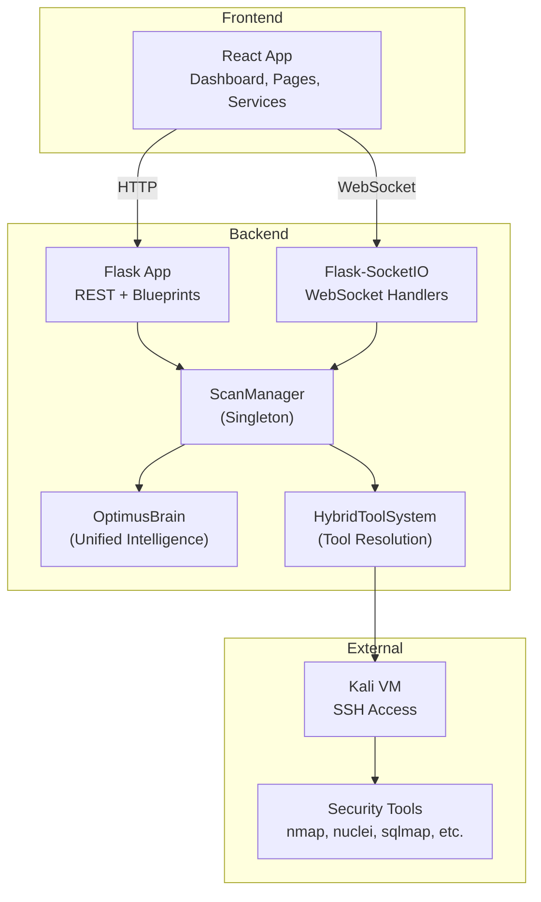
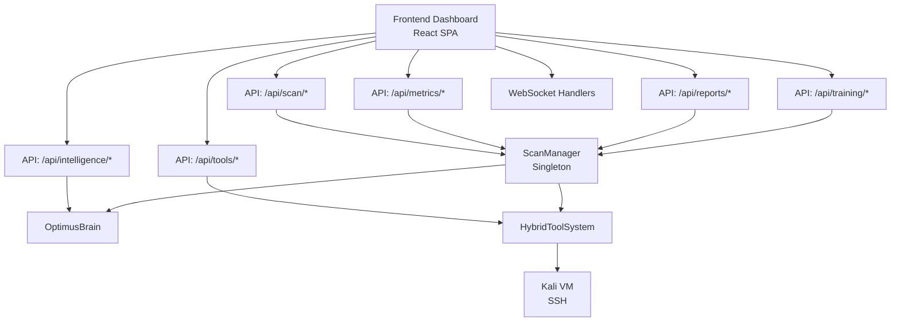
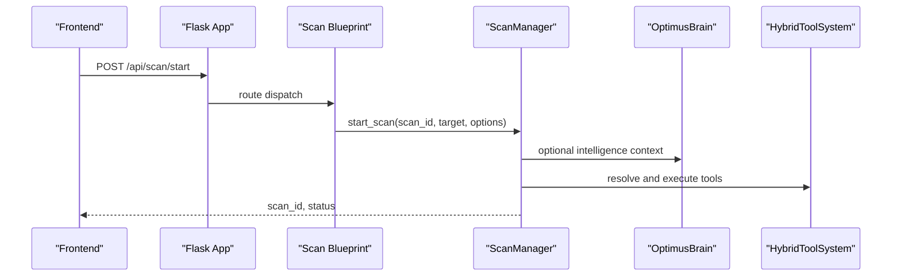
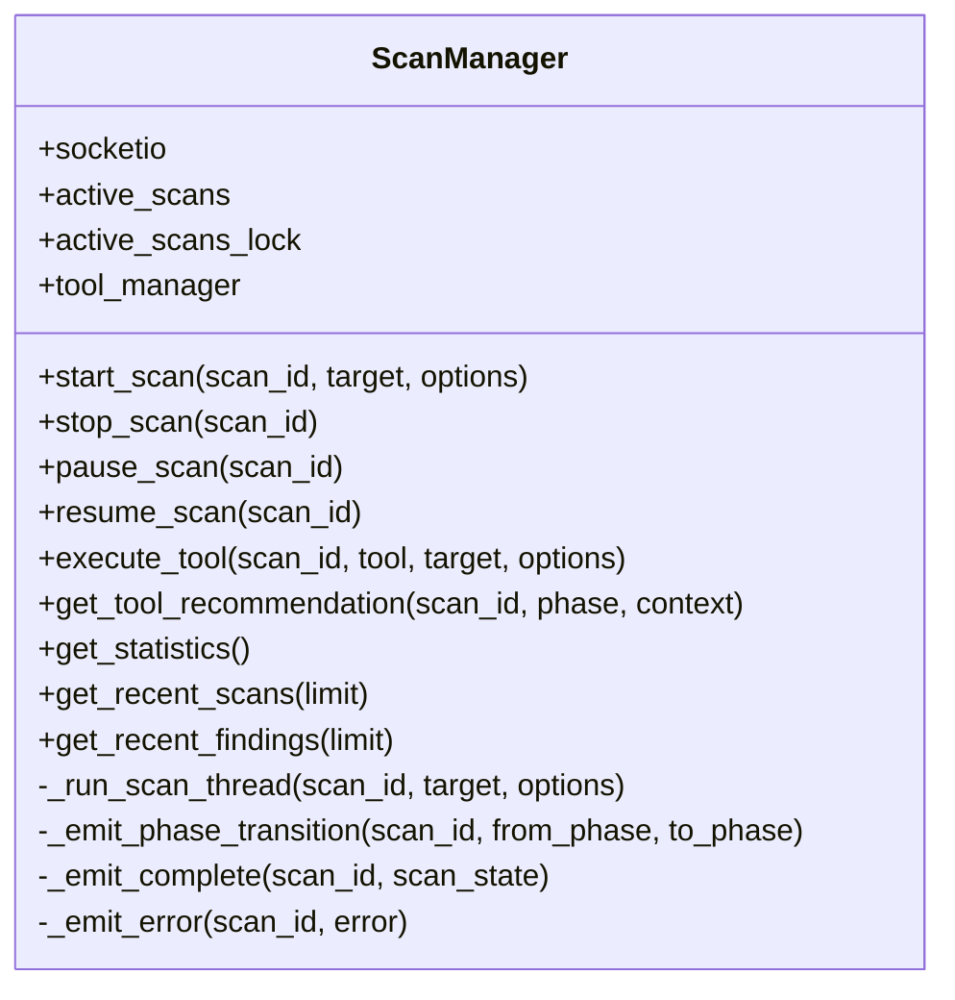
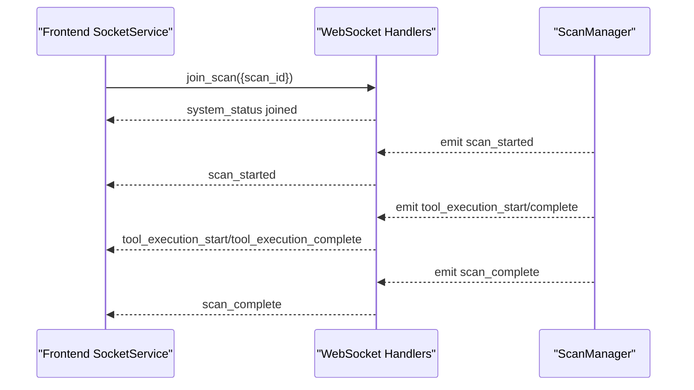
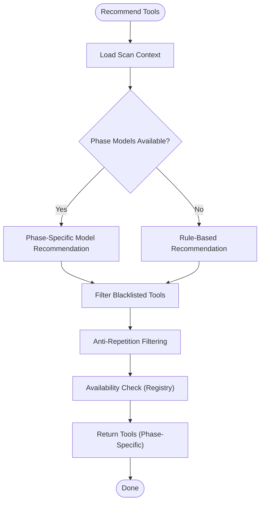
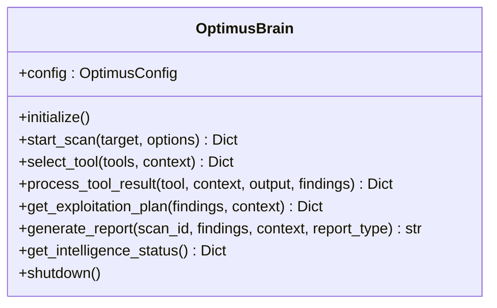
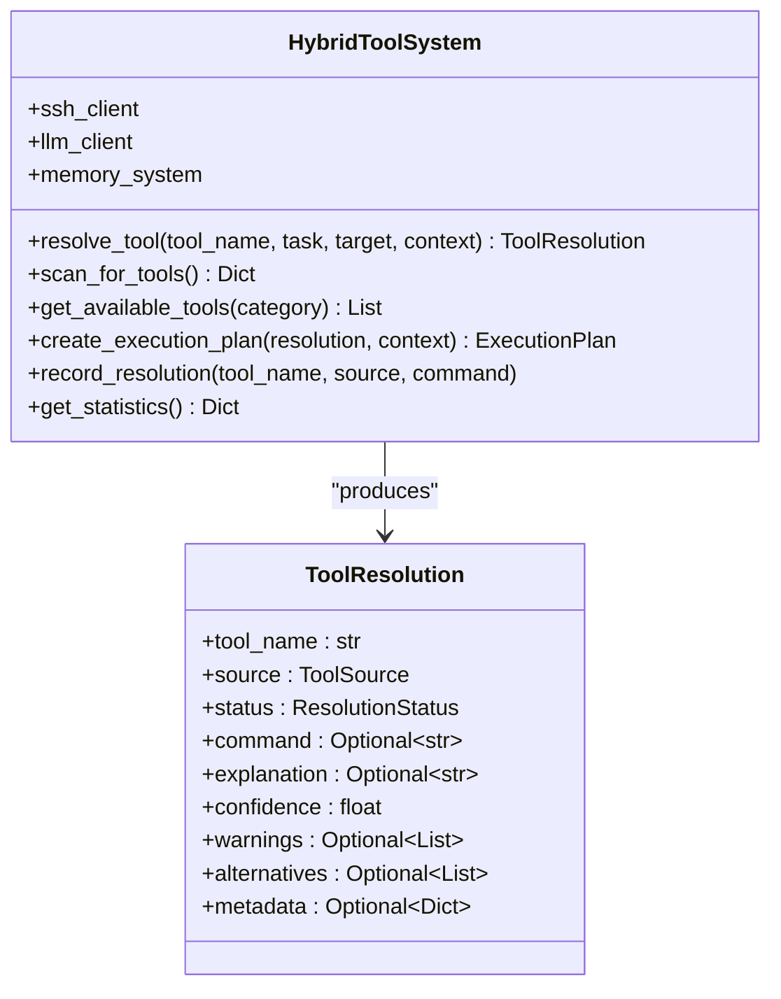
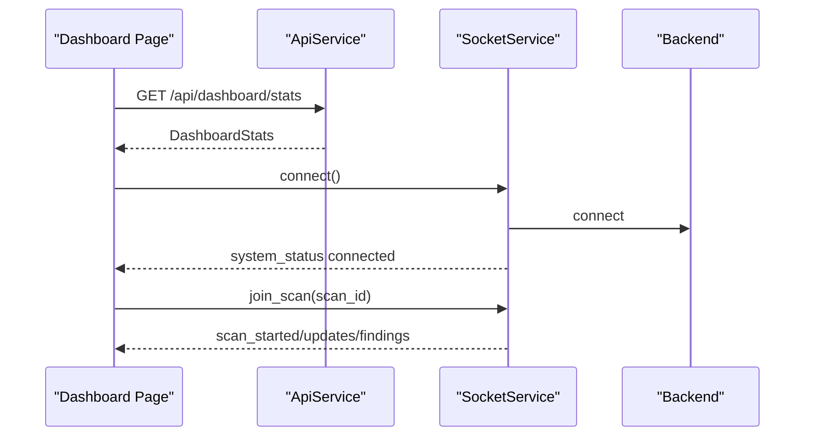
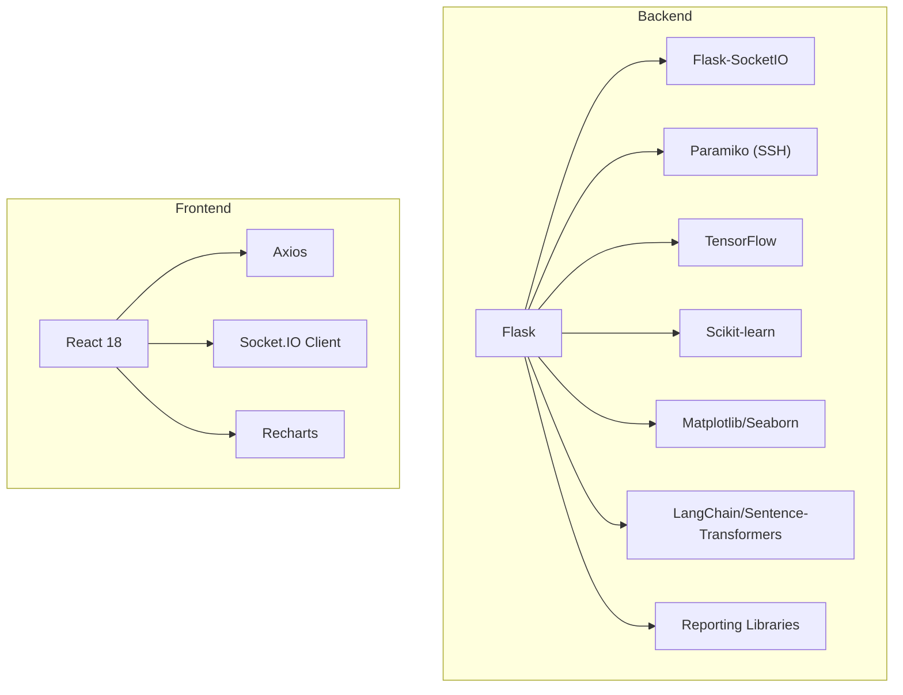

# System Architecture

<cite>
**Referenced Files in This Document**
- [backend/app.py](file://backend/app.py)
- [backend/core/scan_engine.py](file://backend/core/scan_engine.py)
- [backend/websocket/handlers.py](file://backend/websocket/handlers.py)
- [backend/api/routes.py](file://backend/api/routes.py)
- [backend/api/scan_routes.py](file://backend/api/scan_routes.py)
- [backend/api/tool_routes.py](file://backend/api/tool_routes.py)
- [backend/api/report_routes.py](file://backend/api/report_routes.py)
- [backend/api/metrics_routes.py](file://backend/api/metrics_routes.py)
- [backend/api/intelligence_routes.py](file://backend/api/intelligence_routes.py)
- [backend/api/training_routes.py](file://backend/api/training_routes.py)
- [backend/intelligence/optimus_brain.py](file://backend/intelligence/optimus_brain.py)
- [backend/tools/hybrid_tool_system.py](file://backend/tools/hybrid_tool_system.py)
- [backend/inference/tool_selector.py](file://backend/inference/tool_selector.py)
- [backend/config.py](file://backend/config.py)
- [backend/requirements.txt](file://backend/requirements.txt)
- [frontend/src/main.tsx](file://frontend/src/main.tsx)
- [frontend/src/App.tsx](file://frontend/src/App.tsx)
- [frontend/src/pages/Dashboard.tsx](file://frontend/src/pages/Dashboard.tsx)
- [frontend/src/services/api.ts](file://frontend/src/services/api.ts)
- [frontend/src/services/socket.ts](file://frontend/src/services/socket.ts)
- [frontend/package.json](file://frontend/package.json)
</cite>

## Table of Contents
1. [Introduction](#introduction)
2. [Project Structure](#project-structure)
3. [Core Components](#core-components)
4. [Architecture Overview](#architecture-overview)
5. [Detailed Component Analysis](#detailed-component-analysis)
6. [Dependency Analysis](#dependency-analysis)
7. [Performance Considerations](#performance-considerations)
8. [Troubleshooting Guide](#troubleshooting-guide)
9. [Conclusion](#conclusion)
10. [Appendices](#appendices)

## Introduction
This document describes the Optimus system architecture, focusing on the microservices design combining a Flask backend with a React 18 frontend, event-driven real-time communication via WebSocket, and AI/ML-powered intelligence layers. It explains the core architectural patterns (Singleton for ScanManager, Observer-like real-time updates, Strategy-like tool selection), technology stack (Python 3.10+, Flask ecosystem, React 18, TensorFlow), system boundaries, infrastructure requirements, deployment topology, and scaling considerations. It also provides system context diagrams and addresses cross-cutting concerns such as security, monitoring, and fault tolerance.

## Project Structure
Optimus follows a layered microservices architecture:
- Backend (Flask + Flask-SocketIO): exposes REST APIs and WebSocket endpoints, orchestrates scans, integrates intelligence, and manages tools.
- Frontend (React 18 + TypeScript): provides the dashboard, real-time scan monitoring, and interactive controls.
- Intelligence Layer: unified AI/ML engine for adaptive exploitation, learning, and explainability.
- External Security Tools: integrated via SSH and local tool availability checks.

**Diagram sources**
- [backend/app.py](file://backend/app.py#L120-L343)
- [backend/websocket/handlers.py](file://backend/websocket/handlers.py#L26-L119)
- [backend/core/scan_engine.py](file://backend/core/scan_engine.py#L26-L537)
- [backend/intelligence/optimus_brain.py](file://backend/intelligence/optimus_brain.py#L46-L661)
- [backend/tools/hybrid_tool_system.py](file://backend/tools/hybrid_tool_system.py#L65-L426)

**Section sources**
- [backend/app.py](file://backend/app.py#L120-L343)
- [frontend/src/main.tsx](file://frontend/src/main.tsx#L1-L11)
- [frontend/src/App.tsx](file://frontend/src/App.tsx#L81-L161)

## Core Components
- Flask Application and Blueprints: Central HTTP API gateway exposing endpoints for scans, tools, intelligence, metrics, reports, and training.
- ScanManager (Singleton): Orchestrates scan lifecycle, tool execution, and emits real-time events.
- WebSocket Handlers: Manage client connections, rooms, and event broadcasting for live updates.
- OptimusBrain (Intelligence Layer): Unified engine integrating memory, web intelligence, adaptive exploitation, chaining, explainability, learning, and campaign intelligence.
- HybridToolSystem: Resolves and executes tools using knowledge base, discovery, LLM, and web research.
- Frontend Services: API client for REST calls and SocketService for real-time updates.

Key architectural patterns:
- Singleton: ScanManager ensures centralized coordination and shared state.
- Observer-like: WebSocket events notify clients of scan progress, findings, and tool execution.
- Strategy-like: Tool selection integrates rule-based, phase-specific ML, and hybrid approaches.

**Section sources**
- [backend/core/scan_engine.py](file://backend/core/scan_engine.py#L26-L537)
- [backend/websocket/handlers.py](file://backend/websocket/handlers.py#L26-L314)
- [backend/intelligence/optimus_brain.py](file://backend/intelligence/optimus_brain.py#L46-L661)
- [backend/tools/hybrid_tool_system.py](file://backend/tools/hybrid_tool_system.py#L65-L426)
- [backend/inference/tool_selector.py](file://backend/inference/tool_selector.py#L26-L527)

## Architecture Overview
The system is split into four primary boundaries:
- Frontend Dashboard: React SPA for navigation, scan control, and live monitoring.
- Backend API: REST endpoints for orchestration, reporting, metrics, and training.
- Intelligence Layer: AI/ML engines for adaptive decisions and explainability.
- External Security Tools: SSH-accessible Kali VM and locally installed tools.

**Diagram sources**
- [backend/app.py](file://backend/app.py#L179-L274)
- [backend/websocket/handlers.py](file://backend/websocket/handlers.py#L26-L119)
- [backend/core/scan_engine.py](file://backend/core/scan_engine.py#L26-L537)
- [backend/intelligence/optimus_brain.py](file://backend/intelligence/optimus_brain.py#L46-L661)
- [backend/tools/hybrid_tool_system.py](file://backend/tools/hybrid_tool_system.py#L65-L426)

## Detailed Component Analysis

### Flask Backend and API Gateways
- Application bootstrap initializes logging, CORS, SocketIO, registers blueprints for scans, tools, intelligence, metrics, reports, and training, and sets up health checks.
- Blueprints modularize API endpoints by domain (scans, tools, intelligence, metrics, reports, training).
- Centralized ScanManager is wired during blueprint registration to coordinate scan lifecycle.

**Diagram sources**
- [backend/app.py](file://backend/app.py#L179-L274)
- [backend/api/scan_routes.py](file://backend/api/scan_routes.py)
- [backend/core/scan_engine.py](file://backend/core/scan_engine.py#L82-L148)
- [backend/intelligence/optimus_brain.py](file://backend/intelligence/optimus_brain.py#L173-L226)
- [backend/tools/hybrid_tool_system.py](file://backend/tools/hybrid_tool_system.py#L166-L220)

**Section sources**
- [backend/app.py](file://backend/app.py#L120-L343)
- [backend/api/scan_routes.py](file://backend/api/scan_routes.py)
- [backend/api/routes.py](file://backend/api/routes.py#L10-L54)

### ScanManager (Singleton Pattern)
- Ensures single orchestration point for all scans with thread-safe background execution.
- Emits real-time events for scan lifecycle transitions and tool execution.
- Integrates ToolManager and optional RobustScanOrchestrator for enhanced control.

**Diagram sources**
- [backend/core/scan_engine.py](file://backend/core/scan_engine.py#L26-L537)

**Section sources**
- [backend/core/scan_engine.py](file://backend/core/scan_engine.py#L26-L537)

### WebSocket Communication (Observer Pattern)
- Clients connect via SocketIO, join scan rooms, and receive real-time updates.
- Backend emits events for scan lifecycle, tool execution, findings, and errors.
- Frontend SocketService acts as a singleton observer, managing subscriptions and reconnections.

**Diagram sources**
- [backend/websocket/handlers.py](file://backend/websocket/handlers.py#L50-L119)
- [backend/websocket/handlers.py](file://backend/websocket/handlers.py#L123-L314)
- [frontend/src/services/socket.ts](file://frontend/src/services/socket.ts#L64-L236)

**Section sources**
- [backend/websocket/handlers.py](file://backend/websocket/handlers.py#L26-L314)
- [frontend/src/services/socket.ts](file://frontend/src/services/socket.ts#L64-L236)

### Tool Selection Strategy
- PhaseAwareToolSelector combines rule-based recommendations, phase-specific ML models, and availability checks.
- Supports fallback mechanisms and anti-repetition strategies to ensure diverse and effective tool usage.

**Diagram sources**
- [backend/inference/tool_selector.py](file://backend/inference/tool_selector.py#L68-L186)

**Section sources**
- [backend/inference/tool_selector.py](file://backend/inference/tool_selector.py#L26-L527)

### Intelligence Layer (OptimusBrain)
- Unified engine integrating memory, web intelligence, adaptive exploitation, vulnerability chaining, explainability, continuous learning, and campaign intelligence.
- Provides tool selection, result processing, exploitation planning, and report generation.

**Diagram sources**
- [backend/intelligence/optimus_brain.py](file://backend/intelligence/optimus_brain.py#L46-L661)

**Section sources**
- [backend/intelligence/optimus_brain.py](file://backend/intelligence/optimus_brain.py#L46-L661)

### Hybrid Tool System
- Resolves tools through multiple sources (knowledge base, memory, discovery, LLM, web research) with confidence and safety metadata.
- Provides execution plans and records resolution history for learning.

**Diagram sources**
- [backend/tools/hybrid_tool_system.py](file://backend/tools/hybrid_tool_system.py#L65-L426)

**Section sources**
- [backend/tools/hybrid_tool_system.py](file://backend/tools/hybrid_tool_system.py#L65-L426)

### Frontend Integration
- React SPA bootstrapped with main.tsx, routing managed by App.tsx.
- Dashboard page consumes API and WebSocket services to render live scan state and findings.
- API service encapsulates REST endpoints; SocketService manages WebSocket connections and subscriptions.

**Diagram sources**
- [frontend/src/pages/Dashboard.tsx](file://frontend/src/pages/Dashboard.tsx#L33-L227)
- [frontend/src/services/api.ts](file://frontend/src/services/api.ts#L19-L390)
- [frontend/src/services/socket.ts](file://frontend/src/services/socket.ts#L64-L236)

**Section sources**
- [frontend/src/main.tsx](file://frontend/src/main.tsx#L1-L11)
- [frontend/src/App.tsx](file://frontend/src/App.tsx#L81-L161)
- [frontend/src/pages/Dashboard.tsx](file://frontend/src/pages/Dashboard.tsx#L33-L227)
- [frontend/src/services/api.ts](file://frontend/src/services/api.ts#L19-L390)
- [frontend/src/services/socket.ts](file://frontend/src/services/socket.ts#L64-L236)

## Dependency Analysis
- Backend dependencies include Flask, Flask-SocketIO, paramiko (SSH), scikit-learn, TensorFlow, NumPy, pandas, matplotlib/seaborn, langchain/sentence-transformers, and reporting libraries.
- Frontend dependencies include React 18, React Router, Axios, Socket.IO client, Tailwind, and charting libraries.

**Diagram sources**
- [backend/requirements.txt](file://backend/requirements.txt#L1-L49)
- [frontend/package.json](file://frontend/package.json#L12-L48)

**Section sources**
- [backend/requirements.txt](file://backend/requirements.txt#L1-L49)
- [frontend/package.json](file://frontend/package.json#L12-L48)

## Performance Considerations
- Concurrency: Background threads per scan with locks for shared state; consider thread pool limits and graceful stop/pause signaling.
- WebSocket scalability: Use of rooms and background tasks; consider horizontal scaling with Redis or message broker for multi-instance deployments.
- AI/ML inference: TensorFlow models and LLM integrations may require GPU acceleration and batching strategies.
- Network I/O: SSH timeouts and retries tuned for Windows environments; optimize command timeouts and keepalive intervals.
- Caching: Intelligence cache TTL and tool availability caching to reduce repeated lookups.

[No sources needed since this section provides general guidance]

## Troubleshooting Guide
- Health checks: Use the /health endpoint to verify API, WebSocket, intelligence, and tools status.
- Logging: UTF-8 safe logging with correlation IDs for traceability; logs written to file and console.
- Error handling: Centralized 404/500 handlers; WebSocket emit failures logged with correlation IDs.
- SSH connectivity: Tunable connection parameters and reduced timeouts for faster feedback loops.
- Frontend connectivity: SocketService supports reconnection attempts and re-subscription on reconnect.

**Section sources**
- [backend/app.py](file://backend/app.py#L276-L318)
- [backend/websocket/handlers.py](file://backend/websocket/handlers.py#L26-L119)
- [backend/config.py](file://backend/config.py#L19-L23)

## Conclusion
Optimus employs a robust microservices architecture with a Flask backend and React frontend, enabling real-time collaboration through WebSocket. The system leverages AI/ML for adaptive decisions, integrates a unified intelligence layer, and provides a scalable foundation for autonomous penetration testing. The documented patterns and boundaries facilitate maintainability, extensibility, and operational reliability.

[No sources needed since this section summarizes without analyzing specific files]

## Appendices

### Technology Stack
- Backend: Python 3.10+, Flask, Flask-SocketIO, paramiko, scikit-learn, TensorFlow, NumPy, pandas, matplotlib/seaborn, langchain/sentence-transformers, reporting libraries.
- Frontend: React 18, TypeScript, Axios, Socket.IO client, Tailwind, Recharts.

**Section sources**
- [backend/requirements.txt](file://backend/requirements.txt#L1-L49)
- [frontend/package.json](file://frontend/package.json#L12-L48)

### Infrastructure Requirements and Deployment Topology
- Backend: Single Flask process with SocketIO; optional multi-process deployment behind a reverse proxy; persistent logs and data directories.
- Frontend: Static assets served via reverse proxy or CDN; WebSocket endpoint proxied to backend.
- External: Kali VM reachable via SSH; security tools installed and discoverable; optional LLM service (Ollama) for tool command generation.

**Section sources**
- [backend/app.py](file://backend/app.py#L42-L47)
- [backend/config.py](file://backend/config.py#L12-L35)

### Scaling Considerations
- Horizontal scaling: WebSocket rooms and broadcast require distributed state or message broker; consider Redis pub/sub or broker-backed SocketIO.
- Database: Shared state (active_scans, scan_history) should be backed by a concurrent-safe store; current implementation uses in-memory structures.
- AI/ML: Offload heavy inference to dedicated GPU nodes or containerized microservices; implement model versioning and A/B testing.
- Observability: Centralized logging, metrics, and tracing; health endpoints and structured error responses.

[No sources needed since this section provides general guidance]