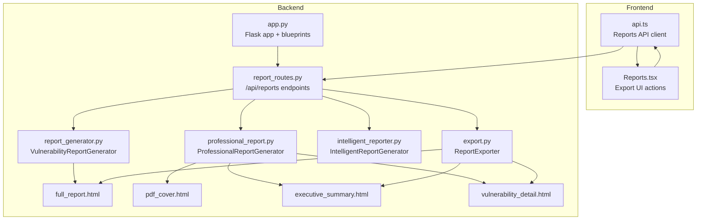
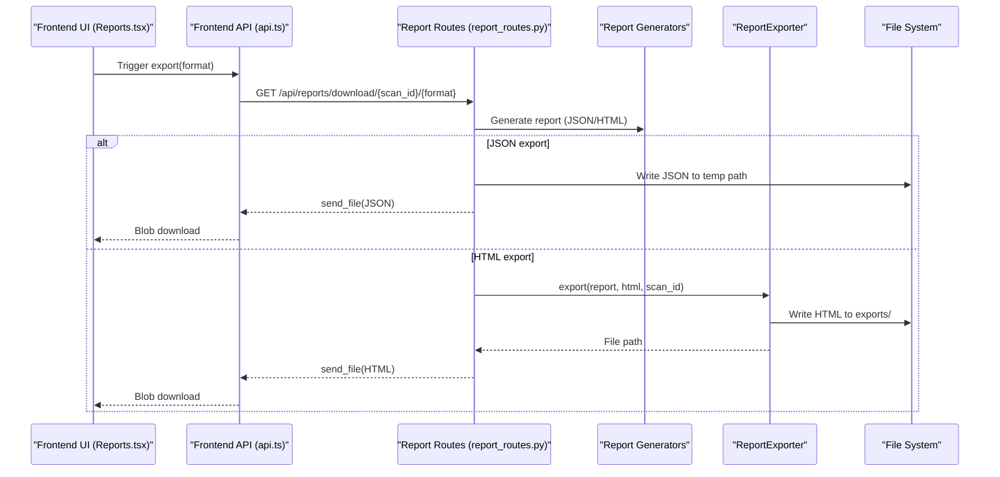
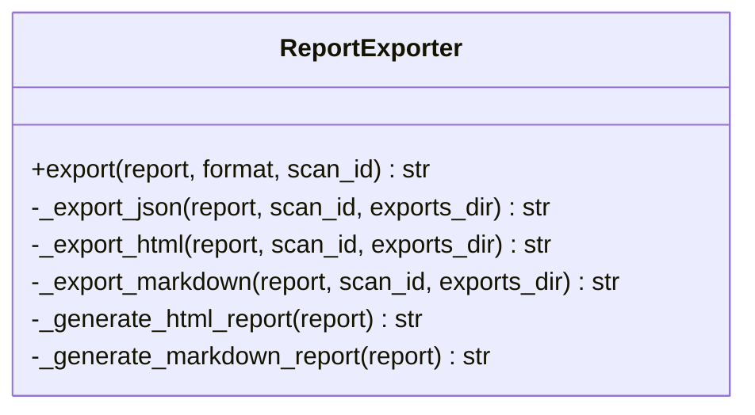
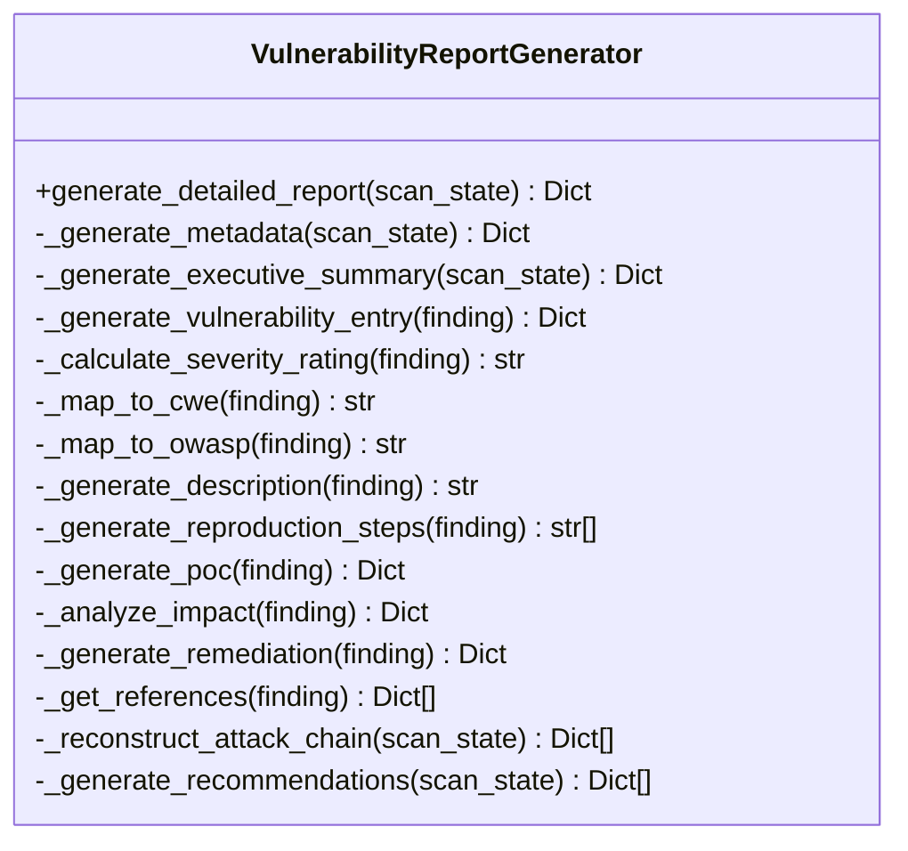
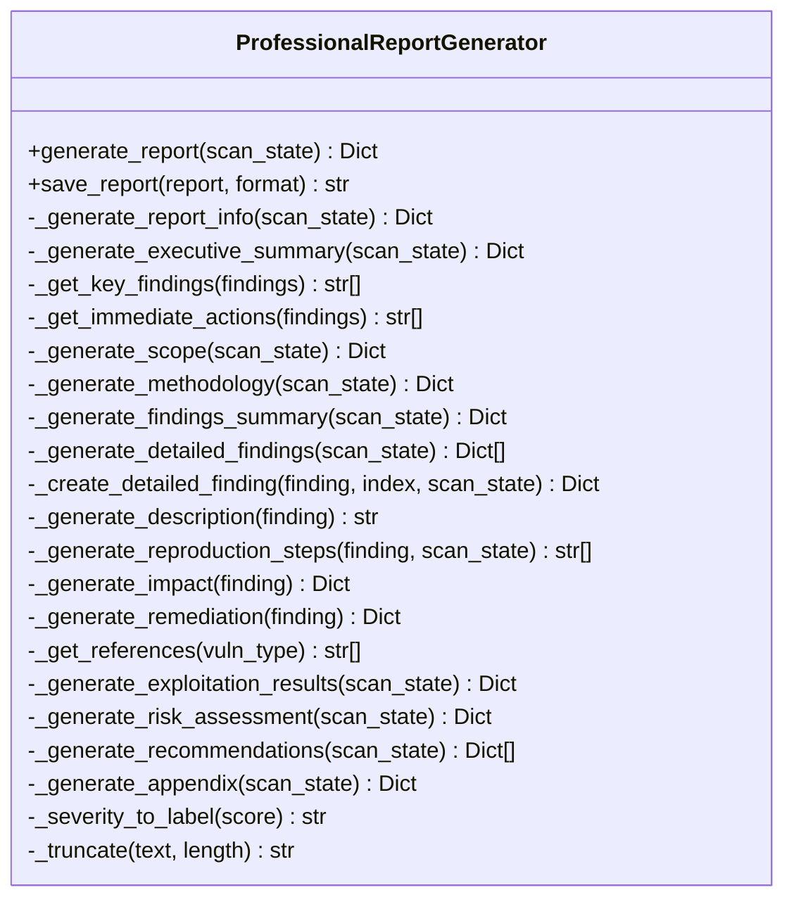
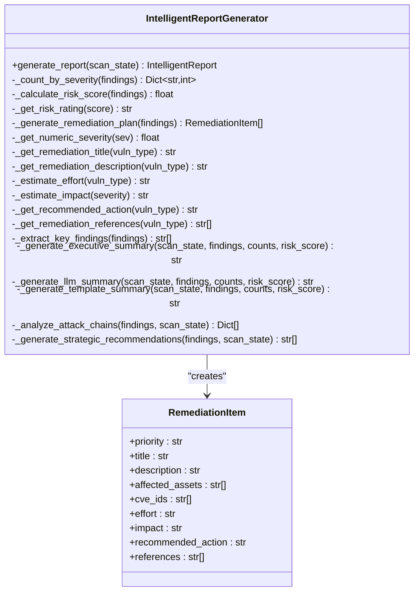
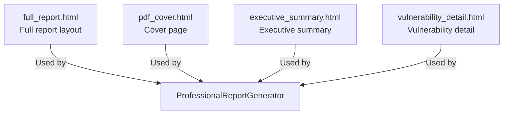
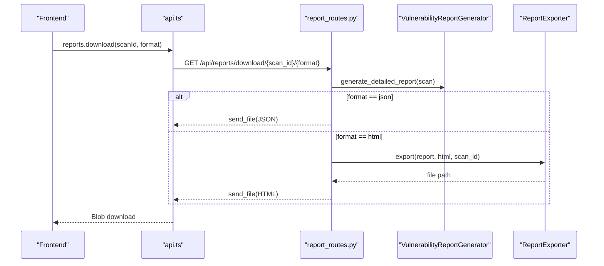
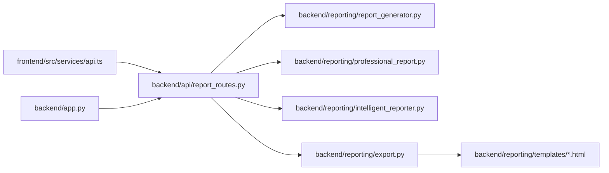

# Multi-format Export Capabilities

<cite>
**Referenced Files in This Document**
- [export.py](file://backend/reporting/export.py)
- [professional_report.py](file://backend/reporting/professional_report.py)
- [report_generator.py](file://backend/reporting/report_generator.py)
- [intelligent_reporter.py](file://backend/reporting/intelligent_reporter.py)
- [report_routes.py](file://backend/api/report_routes.py)
- [app.py](file://backend/app.py)
- [full_report.html](file://backend/reporting/templates/full_report.html)
- [pdf_cover.html](file://backend/reporting/templates/pdf_cover.html)
- [executive_summary.html](file://backend/reporting/templates/executive_summary.html)
- [vulnerability_detail.html](file://backend/reporting/templates/vulnerability_detail.html)
- [api.ts](file://frontend/src/services/api.ts)
- [Reports.tsx](file://frontend/src/pages/Reports.tsx)
</cite>

## Table of Contents
1. [Introduction](#introduction)
2. [Project Structure](#project-structure)
3. [Core Components](#core-components)
4. [Architecture Overview](#architecture-overview)
5. [Detailed Component Analysis](#detailed-component-analysis)
6. [Dependency Analysis](#dependency-analysis)
7. [Performance Considerations](#performance-considerations)
8. [Troubleshooting Guide](#troubleshooting-guide)
9. [Conclusion](#conclusion)

## Introduction
This document explains the multi-format export capabilities of the Optimus platform, focusing on how reports are generated, transformed, and delivered in multiple formats. It covers the export module implementation for JSON and HTML, the professional report generation system for polished stakeholder-ready documentation, and the integration points with the frontend and backend. It also documents configuration options, format-specific processing, quality assurance measures, and practical examples for customization, batch generation, and automated delivery workflows.

## Project Structure
The export system spans backend reporting modules, API routes, HTML templates, and frontend services. The backend orchestrates report generation and export, while the frontend provides user-driven export actions and downloads.

**Diagram sources**
- [app.py](file://backend/app.py#L200-L220)
- [report_routes.py](file://backend/api/report_routes.py#L33-L81)
- [report_generator.py](file://backend/reporting/report_generator.py#L14-L42)
- [professional_report.py](file://backend/reporting/professional_report.py#L73-L99)
- [intelligent_reporter.py](file://backend/reporting/intelligent_reporter.py#L72-L160)
- [export.py](file://backend/reporting/export.py#L11-L41)
- [full_report.html](file://backend/reporting/templates/full_report.html#L1-L230)
- [pdf_cover.html](file://backend/reporting/templates/pdf_cover.html#L1-L64)
- [executive_summary.html](file://backend/reporting/templates/executive_summary.html#L1-L170)
- [vulnerability_detail.html](file://backend/reporting/templates/vulnerability_detail.html#L1-L247)

**Section sources**
- [app.py](file://backend/app.py#L200-L220)
- [report_routes.py](file://backend/api/report_routes.py#L33-L81)

## Core Components
- ReportExporter: Provides export functionality for JSON, HTML, and Markdown formats. It writes files to a standardized exports directory and returns the file path.
- VulnerabilityReportGenerator: Creates detailed vulnerability reports with metadata, executive summary, vulnerability entries, attack chains, and recommendations.
- ProfessionalReportGenerator: Produces structured, stakeholder-ready penetration test reports with executive summaries, risk assessments, remediation guidance, and appendices.
- IntelligentReportGenerator: Uses LLMs to generate AI-enhanced executive summaries, prioritize remediation items, and produce strategic recommendations.
- Template System: HTML templates define the structure and styling for professional report formatting across different sections (cover, executive summary, full report, vulnerability detail).
- API Routes: Expose endpoints to generate and download reports, integrating with the generators and exporters.
- Frontend Services: Provide user-triggered export actions and handle file downloads.

**Section sources**
- [export.py](file://backend/reporting/export.py#L11-L81)
- [report_generator.py](file://backend/reporting/report_generator.py#L14-L42)
- [professional_report.py](file://backend/reporting/professional_report.py#L73-L99)
- [intelligent_reporter.py](file://backend/reporting/intelligent_reporter.py#L72-L160)
- [report_routes.py](file://backend/api/report_routes.py#L35-L81)
- [api.ts](file://frontend/src/services/api.ts#L237-L272)
- [Reports.tsx](file://frontend/src/pages/Reports.tsx#L267-L283)

## Architecture Overview
The export pipeline integrates frontend user actions, backend API routes, report generators, and template rendering to produce multi-format outputs.

**Diagram sources**
- [Reports.tsx](file://frontend/src/pages/Reports.tsx#L267-L283)
- [api.ts](file://frontend/src/services/api.ts#L257-L263)
- [report_routes.py](file://backend/api/report_routes.py#L50-L81)
- [export.py](file://backend/reporting/export.py#L16-L41)

## Detailed Component Analysis

### ReportExporter: Multi-format Export Engine
The exporter supports JSON, HTML, and Markdown exports. It validates the requested format and falls back to JSON for unsupported formats. It writes files to a dedicated exports directory and returns the file path.

**Diagram sources**
- [export.py](file://backend/reporting/export.py#L11-L81)

**Section sources**
- [export.py](file://backend/reporting/export.py#L16-L81)

### VulnerabilityReportGenerator: Detailed Report Builder
Generates comprehensive reports with metadata, executive summary, vulnerability entries, attack chains, and recommendations. It maps findings to CWE/OWASP categories and produces structured data for downstream export.

**Diagram sources**
- [report_generator.py](file://backend/reporting/report_generator.py#L14-L438)

**Section sources**
- [report_generator.py](file://backend/reporting/report_generator.py#L19-L42)

### ProfessionalReportGenerator: Stakeholder-ready Reports
Produces polished, structured penetration test reports with executive summaries, risk assessments, remediation guidance, and appendices. It saves reports to a configurable output directory and includes professional formatting via HTML templates.

**Diagram sources**
- [professional_report.py](file://backend/reporting/professional_report.py#L73-L715)

**Section sources**
- [professional_report.py](file://backend/reporting/professional_report.py#L82-L99)

### IntelligentReportGenerator: AI-enhanced Reports
Enhances reports with LLM-generated executive summaries, prioritized remediation plans, risk scoring, and strategic recommendations. It includes fallback logic when LLM is unavailable.

**Diagram sources**
- [intelligent_reporter.py](file://backend/reporting/intelligent_reporter.py#L72-L555)

**Section sources**
- [intelligent_reporter.py](file://backend/reporting/intelligent_reporter.py#L102-L160)

### Template System: Professional Formatting
HTML templates define the structure and styling for professional report formatting. They include sections for covers, executive summaries, full reports, and vulnerability details, enabling consistent presentation across formats.

**Diagram sources**
- [full_report.html](file://backend/reporting/templates/full_report.html#L1-L230)
- [pdf_cover.html](file://backend/reporting/templates/pdf_cover.html#L1-L64)
- [executive_summary.html](file://backend/reporting/templates/executive_summary.html#L1-L170)
- [vulnerability_detail.html](file://backend/reporting/templates/vulnerability_detail.html#L1-L247)

**Section sources**
- [full_report.html](file://backend/reporting/templates/full_report.html#L1-L230)
- [pdf_cover.html](file://backend/reporting/templates/pdf_cover.html#L1-L64)
- [executive_summary.html](file://backend/reporting/templates/executive_summary.html#L1-L170)
- [vulnerability_detail.html](file://backend/reporting/templates/vulnerability_detail.html#L1-L247)

### API Integration: Generation and Download
The report routes integrate with the generators and exporters to serve JSON and HTML reports. The frontend invokes these endpoints to download files.

**Diagram sources**
- [api.ts](file://frontend/src/services/api.ts#L257-L263)
- [report_routes.py](file://backend/api/report_routes.py#L50-L81)
- [export.py](file://backend/reporting/export.py#L16-L41)

**Section sources**
- [report_routes.py](file://backend/api/report_routes.py#L35-L81)
- [api.ts](file://frontend/src/services/api.ts#L257-L263)

## Dependency Analysis
The export system relies on a layered architecture: frontend services call backend routes, which orchestrate report generation and optional export processing, then deliver files to clients.

**Diagram sources**
- [api.ts](file://frontend/src/services/api.ts#L237-L272)
- [report_routes.py](file://backend/api/report_routes.py#L33-L81)
- [report_generator.py](file://backend/reporting/report_generator.py#L14-L42)
- [professional_report.py](file://backend/reporting/professional_report.py#L73-L99)
- [intelligent_reporter.py](file://backend/reporting/intelligent_reporter.py#L72-L160)
- [export.py](file://backend/reporting/export.py#L11-L41)
- [app.py](file://backend/app.py#L200-L220)

**Section sources**
- [app.py](file://backend/app.py#L200-L220)
- [report_routes.py](file://backend/api/report_routes.py#L33-L81)

## Performance Considerations
- Large report handling: For very large scans, consider streaming JSON or chunked HTML generation to reduce memory usage during export.
- Template rendering: HTML generation uses string concatenation and Jinja-style templating; keep templates modular and avoid excessive DOM nesting for large vulnerability lists.
- Disk I/O: Writing to disk introduces latency; cache frequently accessed reports or use in-memory buffers for small exports.
- Concurrency: The Flask app runs single-threaded by default; for high-throughput scenarios, enable asynchronous workers or offload heavy processing to background tasks.
- Network transfer: For large binary downloads, consider compression or segmented transfers.

[No sources needed since this section provides general guidance]

## Troubleshooting Guide
Common issues and resolutions:
- Unsupported format: The exporter defaults to JSON for unsupported formats. Ensure the requested format matches supported values.
- Missing scan data: API routes return 404 if scan_id is not found in active scans or history.
- LLM unavailability: IntelligentReportGenerator falls back to template-based summaries when LLM is not available.
- File permissions: Ensure the exports directory exists and is writable; the exporter creates it automatically.
- Encoding issues: The backend enforces UTF-8 logging and safe formatting on Windows; verify environment variables and file encodings.

**Section sources**
- [export.py](file://backend/reporting/export.py#L38-L40)
- [report_routes.py](file://backend/api/report_routes.py#L41-L43)
- [intelligent_reporter.py](file://backend/reporting/intelligent_reporter.py#L398-L405)

## Conclusion
The Optimus export system provides a flexible, extensible foundation for generating multi-format reports. It integrates detailed vulnerability data with professional formatting and AI-enhanced insights, supporting both developer-focused JSON exports and stakeholder-ready HTML outputs. By leveraging the provided generators, templates, and API routes, teams can customize report content, automate delivery workflows, and maintain high-quality outputs across diverse use cases.