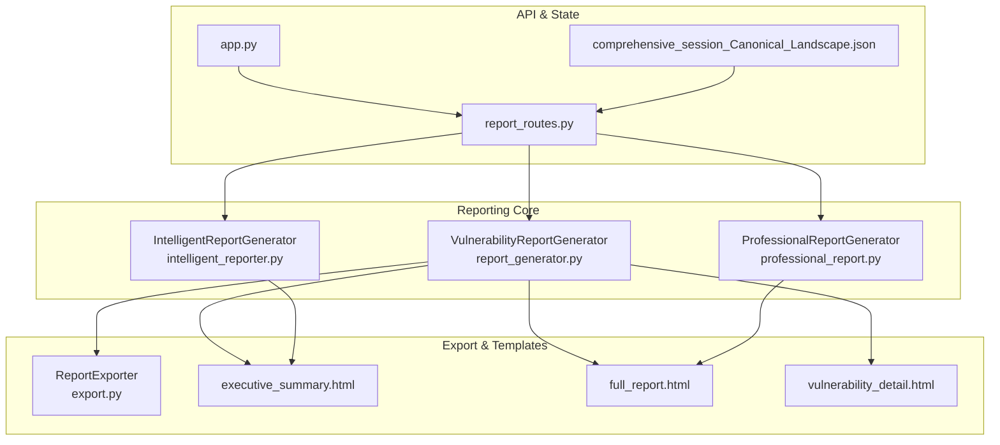
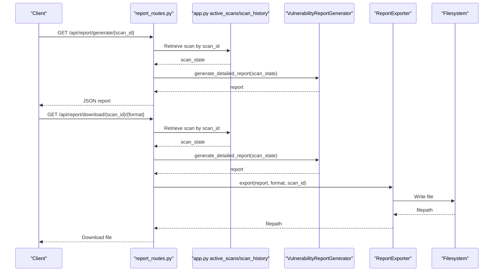
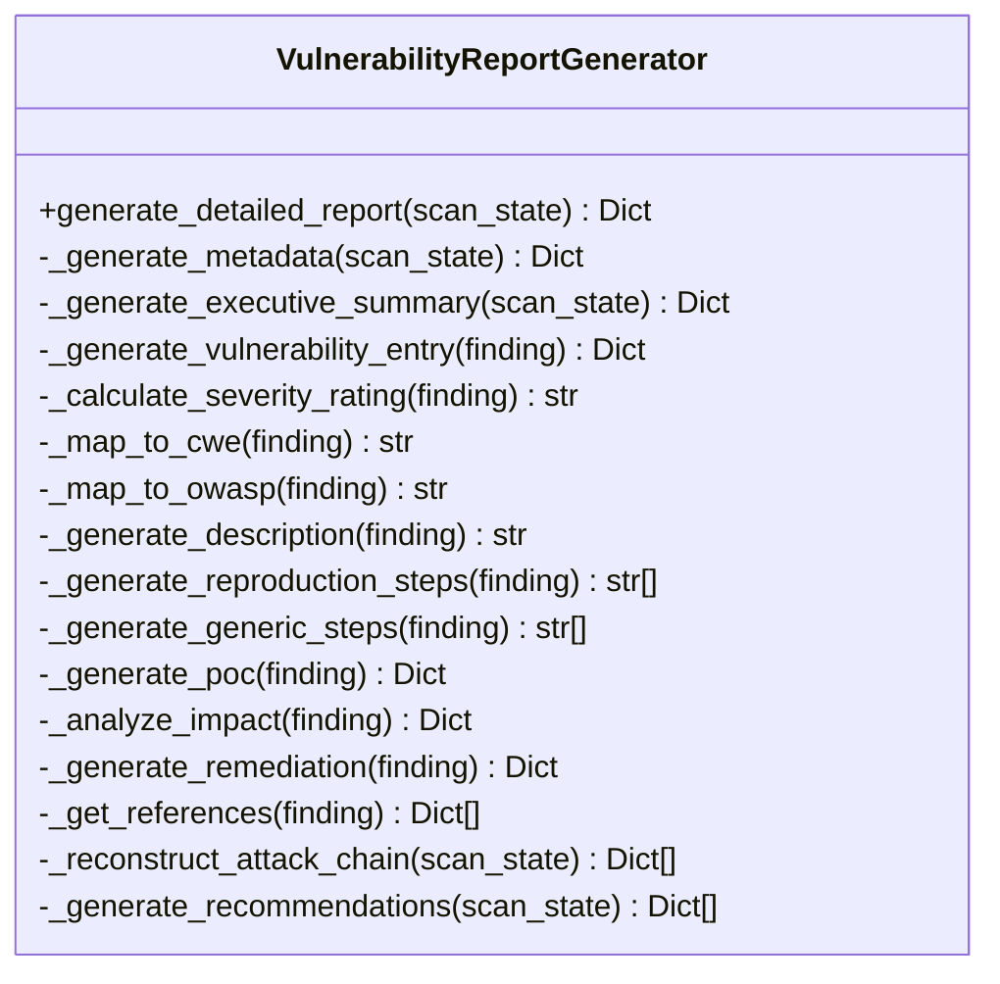
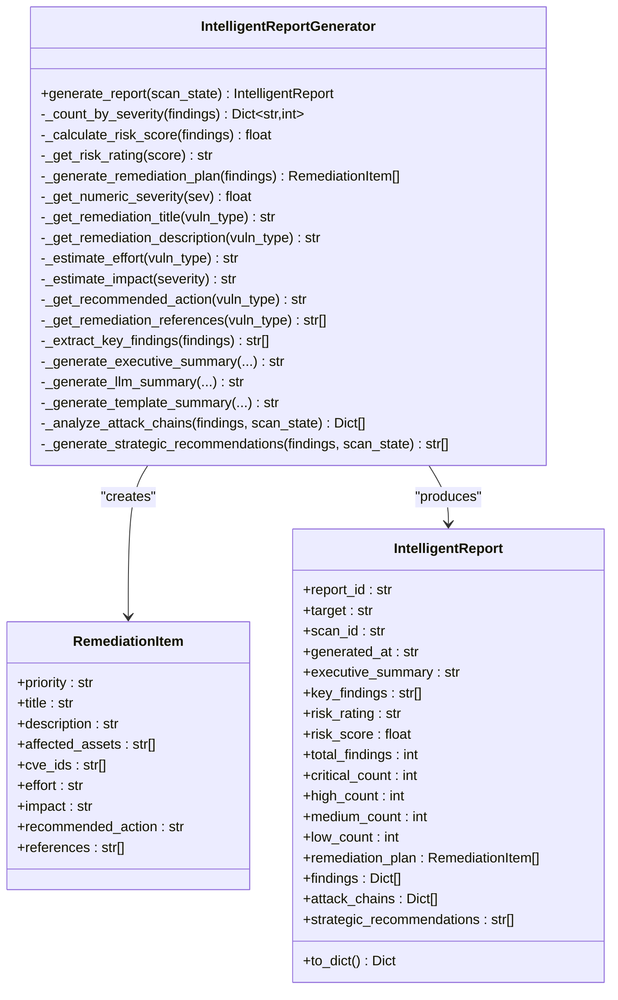
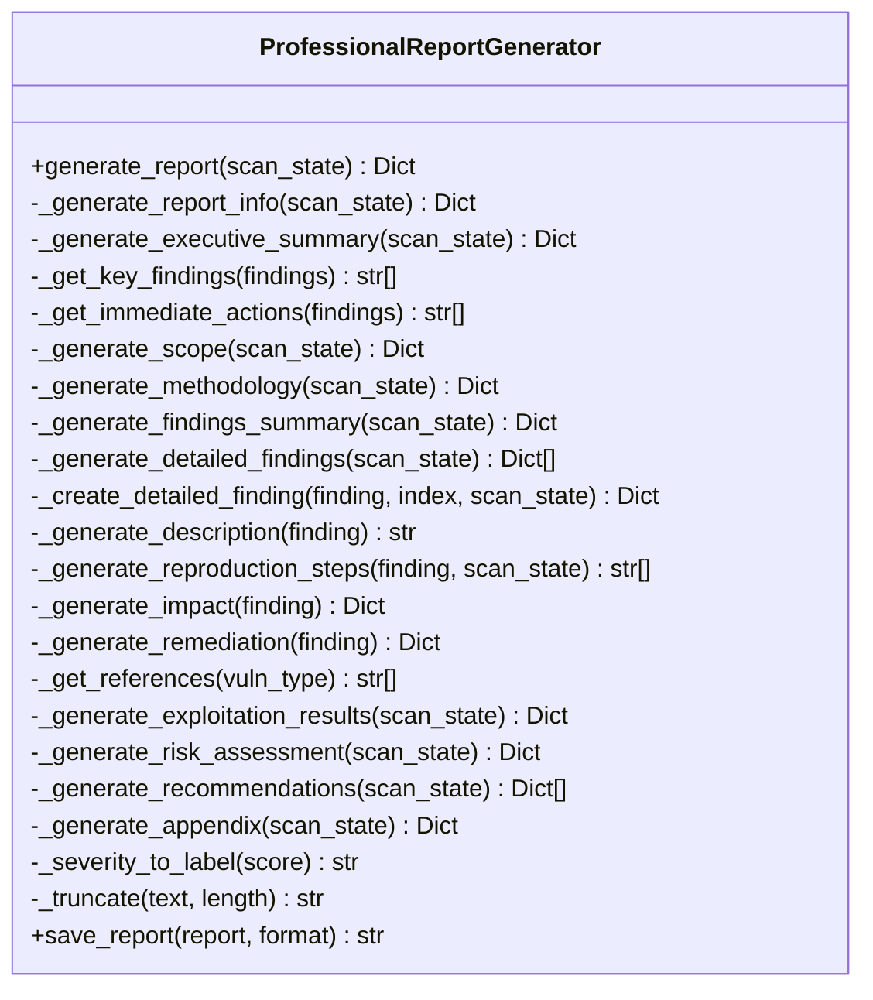
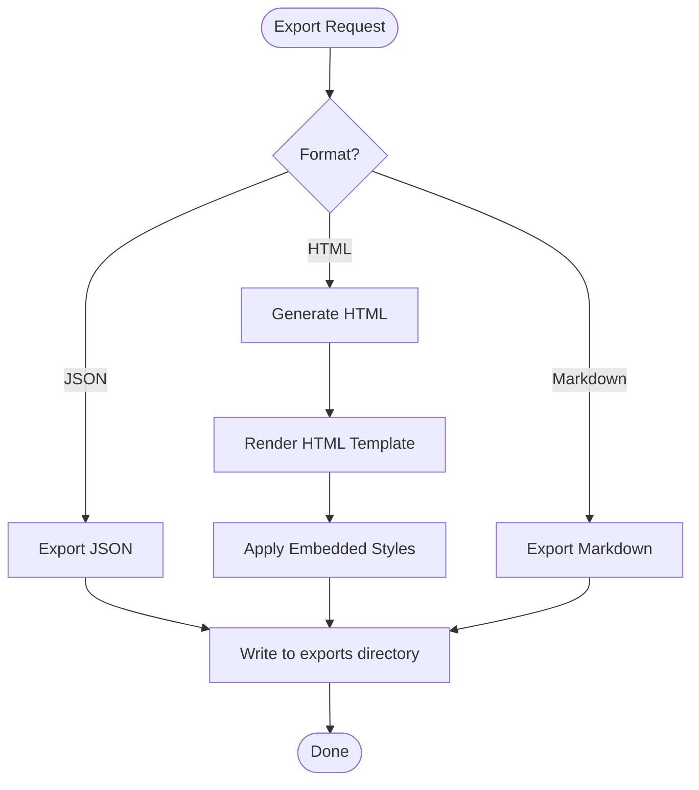
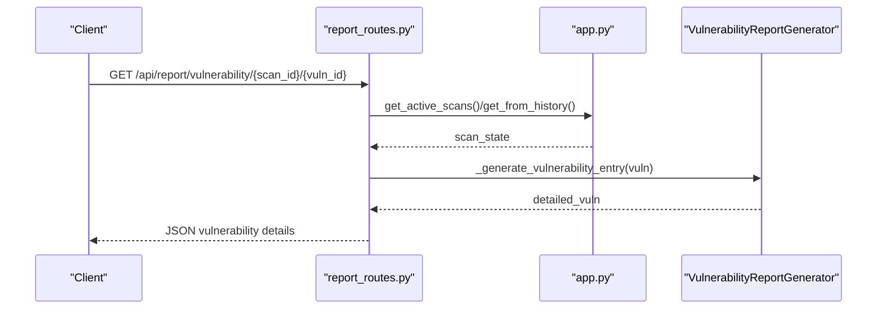
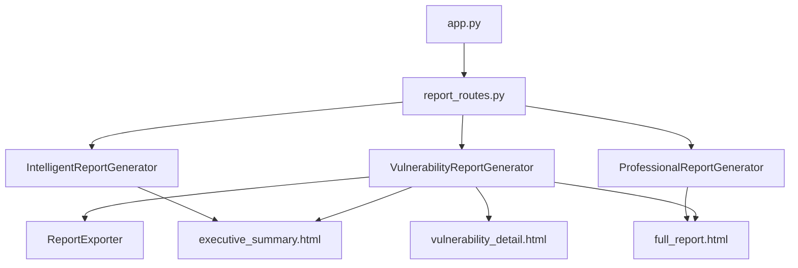

# Report Generation and Formatting

<cite>
**Referenced Files in This Document**
- [report_generator.py](file://backend/reporting/report_generator.py)
- [intelligent_reporter.py](file://backend/reporting/intelligent_reporter.py)
- [professional_report.py](file://backend/reporting/professional_report.py)
- [export.py](file://backend/reporting/export.py)
- [executive_summary.html](file://backend/reporting/templates/executive_summary.html)
- [full_report.html](file://backend/reporting/templates/full_report.html)
- [vulnerability_detail.html](file://backend/reporting/templates/vulnerability_detail.html)
- [report_routes.py](file://backend/api/report_routes.py)
- [app.py](file://backend/app.py)
- [comprehensive_session_Canonical_Landscape.json](file://backend/testing/data/comprehensive_session_Canonical_Landscape.json)
</cite>

## Table of Contents
1. [Introduction](#introduction)
2. [Project Structure](#project-structure)
3. [Core Components](#core-components)
4. [Architecture Overview](#architecture-overview)
5. [Detailed Component Analysis](#detailed-component-analysis)
6. [Dependency Analysis](#dependency-analysis)
7. [Performance Considerations](#performance-considerations)
8. [Troubleshooting Guide](#troubleshooting-guide)
9. [Conclusion](#conclusion)

## Introduction
This document explains the comprehensive vulnerability report creation system within Optimus. It focuses on the VulnerabilityReportGenerator class and related components that produce structured, actionable reports containing executive summaries, detailed vulnerability analysis, step-by-step reproduction instructions, remediation guidance, and professional formatting. The system integrates metadata generation (scan identification, target information, timestamps, tool usage tracking), vulnerability entry creation (CVSS scores, CWE IDs, OWASP categories), severity rating calculation, attack chain reconstruction, and recommendation generation. It also documents integration with professional report formatting and HTML template rendering for comprehensive documentation output.

## Project Structure
The reporting system is organized around modular Python classes and Jinja2 HTML templates. Key areas:
- Reporting core: VulnerabilityReportGenerator, IntelligentReportGenerator, ProfessionalReportGenerator
- Export utilities: ReportExporter for JSON, HTML, and Markdown formats
- Templates: HTML templates for executive summary, full report, and vulnerability detail views
- API integration: Flask routes exposing report generation and retrieval endpoints
- Global state: Shared scan state managed in the main application

**Diagram sources**
- [report_generator.py](file://backend/reporting/report_generator.py#L14-L438)
- [intelligent_reporter.py](file://backend/reporting/intelligent_reporter.py#L72-L555)
- [professional_report.py](file://backend/reporting/professional_report.py#L73-L715)
- [export.py](file://backend/reporting/export.py#L11-L191)
- [executive_summary.html](file://backend/reporting/templates/executive_summary.html#L1-L170)
- [full_report.html](file://backend/reporting/templates/full_report.html#L1-L230)
- [vulnerability_detail.html](file://backend/reporting/templates/vulnerability_detail.html#L1-L247)
- [report_routes.py](file://backend/api/report_routes.py#L33-L124)
- [app.py](file://backend/app.py#L168-L200)
- [comprehensive_session_Canonical_Landscape.json](file://backend/testing/data/comprehensive_session_Canonical_Landscape.json#L1-L173)

**Section sources**
- [report_generator.py](file://backend/reporting/report_generator.py#L14-L438)
- [intelligent_reporter.py](file://backend/reporting/intelligent_reporter.py#L72-L555)
- [professional_report.py](file://backend/reporting/professional_report.py#L73-L715)
- [export.py](file://backend/reporting/export.py#L11-L191)
- [report_routes.py](file://backend/api/report_routes.py#L33-L124)
- [app.py](file://backend/app.py#L168-L200)

## Core Components
- VulnerabilityReportGenerator: Creates structured reports with metadata, executive summary, vulnerability entries, attack chain, and recommendations. It maps findings to CVSS scores, CWE IDs, and OWASP categories, calculates severity ratings, generates reproduction steps, impact analysis, remediation guidance, and references.
- IntelligentReportGenerator: Uses LLM capabilities (via Ollama) to generate executive summaries, prioritize remediation items (P1–P4), calculate risk scores, and analyze attack chains. Provides strategic recommendations based on findings patterns.
- ProfessionalReportGenerator: Produces professional penetration test reports with structured sections (executive summary, scope, methodology, findings summary, detailed findings, exploitation results, risk assessment, recommendations, appendix). Includes comprehensive CWE/OWASP mapping and risk scoring.
- ReportExporter: Exports reports in JSON, HTML, and Markdown formats, with HTML generation using embedded styles and Jinja-style placeholders.
- HTML Templates: Provide professional presentation for executive summaries, full reports, and vulnerability details with tabbed UI and responsive design.

**Section sources**
- [report_generator.py](file://backend/reporting/report_generator.py#L14-L438)
- [intelligent_reporter.py](file://backend/reporting/intelligent_reporter.py#L72-L555)
- [professional_report.py](file://backend/reporting/professional_report.py#L73-L715)
- [export.py](file://backend/reporting/export.py#L11-L191)
- [executive_summary.html](file://backend/reporting/templates/executive_summary.html#L1-L170)
- [full_report.html](file://backend/reporting/templates/full_report.html#L1-L230)
- [vulnerability_detail.html](file://backend/reporting/templates/vulnerability_detail.html#L1-L247)

## Architecture Overview
The report generation pipeline integrates scan state with multiple generators and exporters. The API layer retrieves scan data from shared state, delegates to the appropriate generator, and returns structured reports or downloadable artifacts.

**Diagram sources**
- [report_routes.py](file://backend/api/report_routes.py#L35-L80)
- [app.py](file://backend/app.py#L168-L175)
- [report_generator.py](file://backend/reporting/report_generator.py#L19-L41)
- [export.py](file://backend/reporting/export.py#L16-L40)

## Detailed Component Analysis

### VulnerabilityReportGenerator
The core report generator produces a comprehensive vulnerability report with:
- Metadata: report_id, scan_id, target, generated_at, tools_used, duration_seconds, coverage_percentage
- Executive summary: risk level, counts by severity, and summary text derived from findings
- Vulnerability entries: severity rating, CVSS score, CWE ID, OWASP category, description, reproduction steps, technical details, PoC, impact, remediation, references, and evidence
- Attack chain: reconstructed from findings with step numbers, finding_id, vulnerability name, type, and severity
- Recommendations: prioritized based on vulnerability types and counts

Key implementation patterns:
- Severity rating calculation from CVSS score thresholds
- CWE and OWASP mapping based on vulnerability type
- Reproduction steps tailored to vulnerability types (SQL injection, XSS, command injection)
- Impact analysis categorized by confidentiality, integrity, availability
- Remediation guidance with immediate and long-term actions and code examples
- References linking to CWE and OWASP resources

**Diagram sources**
- [report_generator.py](file://backend/reporting/report_generator.py#L14-L438)

**Section sources**
- [report_generator.py](file://backend/reporting/report_generator.py#L19-L438)

### IntelligentReportGenerator
This LLM-powered generator enhances reports with:
- Executive summary generation using Ollama when available, with fallback to template-based summaries
- Risk scoring normalized to a 0–10 scale, mapped to risk ratings
- Prioritized remediation plan with P1–P4 priorities, effort, and impact estimates
- Key findings extraction and strategic recommendations based on patterns in findings
- Attack chain analysis for common chaining patterns (e.g., SQL Injection to RCE, SSRF to LFI)

**Diagram sources**
- [intelligent_reporter.py](file://backend/reporting/intelligent_reporter.py#L15-L555)

**Section sources**
- [intelligent_reporter.py](file://backend/reporting/intelligent_reporter.py#L72-L555)

### ProfessionalReportGenerator
Produces professional penetration test reports with:
- Report metadata including title, report_id, classification, version, date, target, scan_id, duration, tools used, and generator
- Executive summary with risk level, risk score, narrative, key findings, and immediate actions
- Scope, methodology, findings summary table, detailed findings with reproduction steps, exploitation results, risk assessment, recommendations, and appendix
- Comprehensive CWE/OWASP mapping and risk scoring logic
- Template-driven HTML generation for detailed findings and risk assessment

**Diagram sources**
- [professional_report.py](file://backend/reporting/professional_report.py#L73-L715)

**Section sources**
- [professional_report.py](file://backend/reporting/professional_report.py#L82-L715)

### ReportExporter and Templates
The exporter supports JSON, HTML, and Markdown exports. HTML generation embeds styles and placeholders for report content. The HTML templates provide:
- Executive summary template with risk level badges, statistics, and recommendations
- Full report template with table of contents, scan details, vulnerability listings, and recommendations
- Vulnerability detail template with tabbed sections for description, reproduction, impact, remediation, and references

**Diagram sources**
- [export.py](file://backend/reporting/export.py#L16-L80)
- [executive_summary.html](file://backend/reporting/templates/executive_summary.html#L1-L170)
- [full_report.html](file://backend/reporting/templates/full_report.html#L1-L230)
- [vulnerability_detail.html](file://backend/reporting/templates/vulnerability_detail.html#L1-L247)

**Section sources**
- [export.py](file://backend/reporting/export.py#L16-L191)
- [executive_summary.html](file://backend/reporting/templates/executive_summary.html#L1-L170)
- [full_report.html](file://backend/reporting/templates/full_report.html#L1-L230)
- [vulnerability_detail.html](file://backend/reporting/templates/vulnerability_detail.html#L1-L247)

### API Integration
The report API exposes endpoints for:
- Generating a full report for a scan
- Downloading a report in JSON format
- Retrieving vulnerability details by scan and vulnerability IDs
- Getting executive summary and remediation plan for a scan

Endpoints delegate to the appropriate generator and return structured data or downloadable files.

**Diagram sources**
- [report_routes.py](file://backend/api/report_routes.py#L82-L98)
- [app.py](file://backend/app.py#L168-L175)
- [report_generator.py](file://backend/reporting/report_generator.py#L90-L132)

**Section sources**
- [report_routes.py](file://backend/api/report_routes.py#L35-L124)
- [app.py](file://backend/app.py#L168-L175)

## Dependency Analysis
The reporting system exhibits clear separation of concerns:
- Generators depend on scan state structure and produce structured reports
- Exporter depends on generator outputs and templates
- API routes depend on global state and generators
- Templates are decoupled from logic and driven by generator outputs

**Diagram sources**
- [report_generator.py](file://backend/reporting/report_generator.py#L14-L438)
- [intelligent_reporter.py](file://backend/reporting/intelligent_reporter.py#L72-L555)
- [professional_report.py](file://backend/reporting/professional_report.py#L73-L715)
- [export.py](file://backend/reporting/export.py#L11-L191)
- [executive_summary.html](file://backend/reporting/templates/executive_summary.html#L1-L170)
- [full_report.html](file://backend/reporting/templates/full_report.html#L1-L230)
- [vulnerability_detail.html](file://backend/reporting/templates/vulnerability_detail.html#L1-L247)
- [report_routes.py](file://backend/api/report_routes.py#L33-L124)
- [app.py](file://backend/app.py#L168-L200)

**Section sources**
- [report_generator.py](file://backend/reporting/report_generator.py#L14-L438)
- [intelligent_reporter.py](file://backend/reporting/intelligent_reporter.py#L72-L555)
- [professional_report.py](file://backend/reporting/professional_report.py#L73-L715)
- [export.py](file://backend/reporting/export.py#L11-L191)
- [report_routes.py](file://backend/api/report_routes.py#L33-L124)
- [app.py](file://backend/app.py#L168-L200)

## Performance Considerations
- Report generation scales linearly with the number of findings; complexity is O(n) for vulnerability entries and O(m) for recommendations, where n and m are the number of findings and unique vulnerability types respectively.
- Template rendering is lightweight and primarily string interpolation; performance is dominated by data preparation rather than rendering.
- Export operations write to disk; ensure adequate disk I/O bandwidth and permissions.
- For large scans, consider pagination or streaming outputs if extending to PDF or DOCX formats.

## Troubleshooting Guide
Common issues and resolutions:
- Scan not found: Ensure the scan_id exists in active_scans or scan_history. Verify scan completion and persistence.
- LLM unavailable: The IntelligentReportGenerator falls back to template-based summaries when Ollama is not available.
- Unsupported export format: The exporter defaults to JSON for unsupported formats; specify supported formats (json, html, markdown).
- Missing fields in findings: Vulnerability entries require minimal fields (id, type, severity, name, location); missing fields are handled gracefully with defaults.

**Section sources**
- [report_routes.py](file://backend/api/report_routes.py#L41-L43)
- [intelligent_reporter.py](file://backend/reporting/intelligent_reporter.py#L92-L100)
- [export.py](file://backend/reporting/export.py#L38-L40)

## Conclusion
Optimus provides a robust, extensible report generation system that transforms raw scan findings into comprehensive, professional reports. The VulnerabilityReportGenerator offers structured reporting with metadata, severity calculations, and remediation guidance. The IntelligentReportGenerator augments reports with LLM-based executive summaries and prioritized remediation plans. The ProfessionalReportGenerator delivers formal penetration testing documentation with detailed sections and risk assessments. Together with HTML templates and export utilities, the system supports multiple output formats and integrates seamlessly with the API and global scan state.