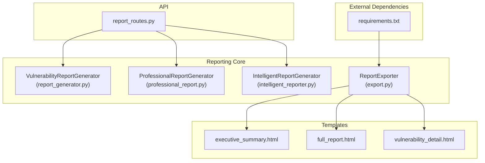
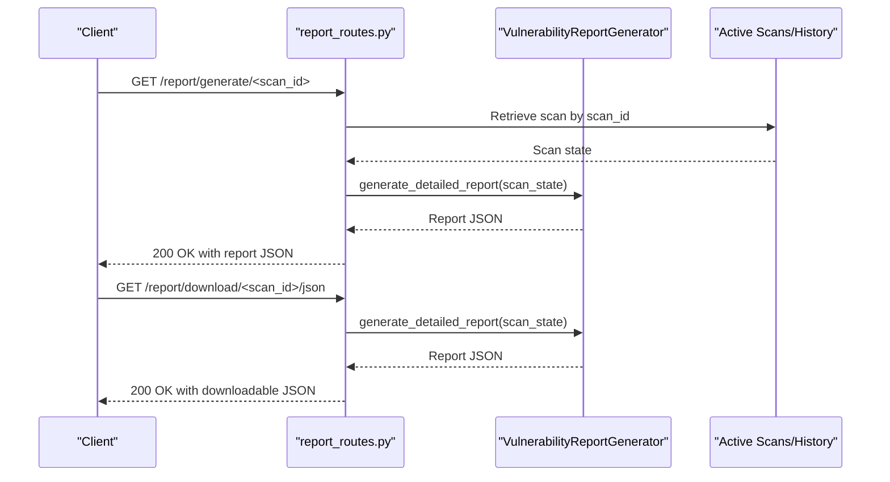
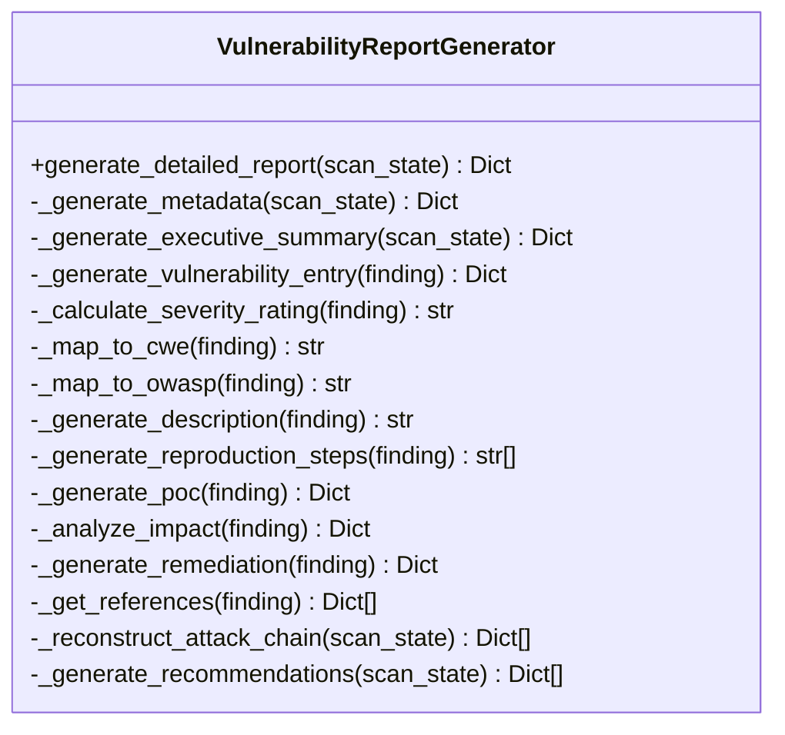
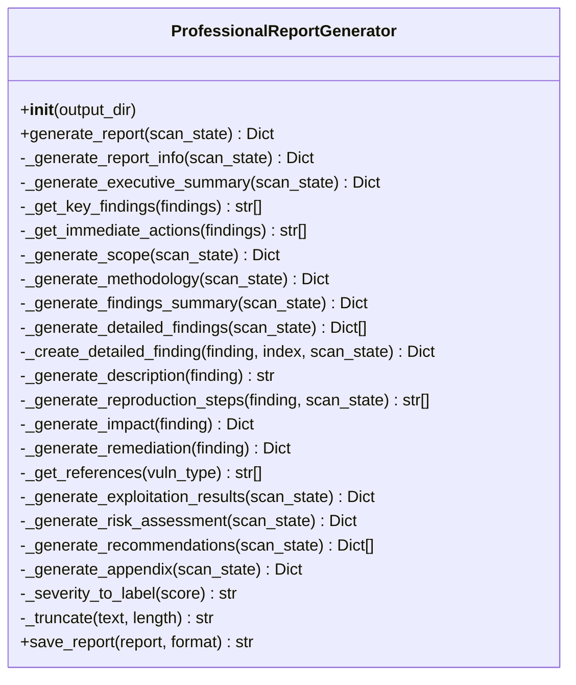
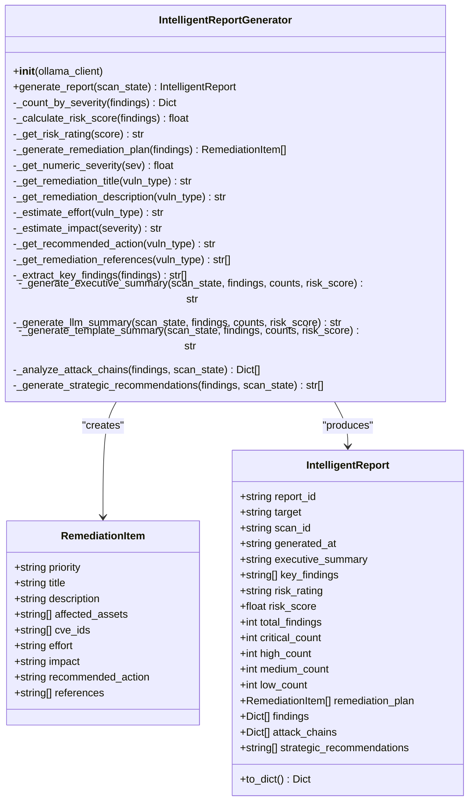
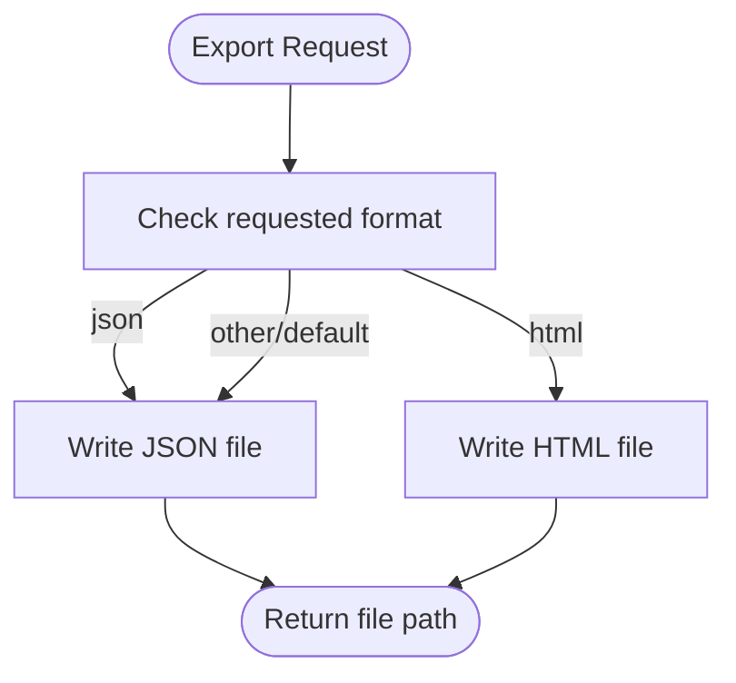
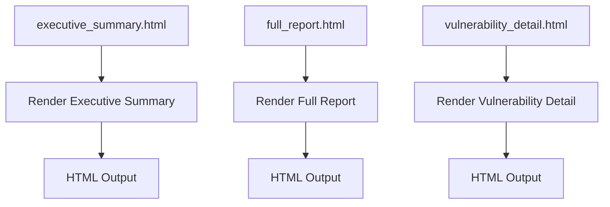
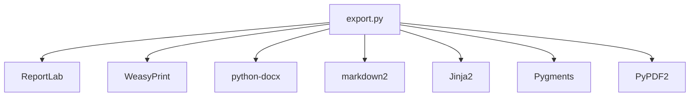

# Reporting and Export

<cite>
**Referenced Files in This Document**
- [report_generator.py](file://backend/reporting/report_generator.py)
- [professional_report.py](file://backend/reporting/professional_report.py)
- [intelligent_reporter.py](file://backend/reporting/intelligent_reporter.py)
- [export.py](file://backend/reporting/export.py)
- [executive_summary.html](file://backend/reporting/templates/executive_summary.html)
- [full_report.html](file://backend/reporting/templates/full_report.html)
- [vulnerability_detail.html](file://backend/reporting/templates/vulnerability_detail.html)
- [report_routes.py](file://backend/api/report_routes.py)
- [USER_GUIDE_REPORTS.md](file://docs/USER_GUIDE_REPORTS.md)
- [requirements.txt](file://backend/requirements.txt)
</cite>

## Table of Contents
1. [Introduction](#introduction)
2. [Project Structure](#project-structure)
3. [Core Components](#core-components)
4. [Architecture Overview](#architecture-overview)
5. [Detailed Component Analysis](#detailed-component-analysis)
6. [Dependency Analysis](#dependency-analysis)
7. [Performance Considerations](#performance-considerations)
8. [Troubleshooting Guide](#troubleshooting-guide)
9. [Conclusion](#conclusion)
10. [Appendices](#appendices)

## Introduction
This document explains Optimus reporting and export systems with a focus on vulnerability reporting capabilities. It covers how structured findings are generated with severity ratings and remediation guidance, how executive summaries are produced for stakeholder communication, and how attack chains are reconstructed for detailed analysis. It also documents the multi-format export capabilities, including JSON and HTML, and outlines how customizable report templates enable tailored outputs. The content is designed for both security analysts who use the system and developers implementing or extending reporting features.

## Project Structure
The reporting subsystem resides under backend/reporting and integrates with the Flask API under backend/api. Templates for HTML rendering live in backend/reporting/templates. The export system supports JSON and HTML, with the API exposing endpoints to generate and download reports.

**Diagram sources**
- [report_generator.py](file://backend/reporting/report_generator.py#L14-L438)
- [professional_report.py](file://backend/reporting/professional_report.py#L73-L715)
- [intelligent_reporter.py](file://backend/reporting/intelligent_reporter.py#L72-L555)
- [export.py](file://backend/reporting/export.py#L11-L191)
- [executive_summary.html](file://backend/reporting/templates/executive_summary.html#L1-L170)
- [full_report.html](file://backend/reporting/templates/full_report.html#L1-L230)
- [vulnerability_detail.html](file://backend/reporting/templates/vulnerability_detail.html#L1-L247)
- [report_routes.py](file://backend/api/report_routes.py#L33-L124)
- [requirements.txt](file://backend/requirements.txt#L23-L29)

**Section sources**
- [report_generator.py](file://backend/reporting/report_generator.py#L1-L438)
- [professional_report.py](file://backend/reporting/professional_report.py#L1-L715)
- [intelligent_reporter.py](file://backend/reporting/intelligent_reporter.py#L1-L555)
- [export.py](file://backend/reporting/export.py#L1-L191)
- [executive_summary.html](file://backend/reporting/templates/executive_summary.html#L1-L170)
- [full_report.html](file://backend/reporting/templates/full_report.html#L1-L230)
- [vulnerability_detail.html](file://backend/reporting/templates/vulnerability_detail.html#L1-L247)
- [report_routes.py](file://backend/api/report_routes.py#L1-L124)
- [USER_GUIDE_REPORTS.md](file://docs/USER_GUIDE_REPORTS.md#L1-L266)
- [requirements.txt](file://backend/requirements.txt#L1-L49)

## Core Components
- VulnerabilityReportGenerator: Creates detailed vulnerability reports with severity mapping, descriptions, reproduction steps, impact analysis, remediation guidance, and attack chain reconstruction.
- ProfessionalReportGenerator: Produces structured, professional penetration test reports with executive summaries, scope/methodology, findings, exploitation results, risk assessment, and recommendations.
- IntelligentReportGenerator: Uses LLMs to produce AI-generated executive summaries and prioritized remediation plans, with risk scoring and attack chain analysis.
- ReportExporter: Exports reports in JSON and HTML formats; the API route supports JSON downloads and vulnerability detail retrieval.
- Templates: HTML templates for executive summary, full report, and vulnerability detail views.

**Section sources**
- [report_generator.py](file://backend/reporting/report_generator.py#L14-L438)
- [professional_report.py](file://backend/reporting/professional_report.py#L73-L715)
- [intelligent_reporter.py](file://backend/reporting/intelligent_reporter.py#L72-L555)
- [export.py](file://backend/reporting/export.py#L11-L191)
- [executive_summary.html](file://backend/reporting/templates/executive_summary.html#L1-L170)
- [full_report.html](file://backend/reporting/templates/full_report.html#L1-L230)
- [vulnerability_detail.html](file://backend/reporting/templates/vulnerability_detail.html#L1-L247)

## Architecture Overview
The reporting pipeline begins with a scan state containing findings. The report generator(s) transform this state into structured reports. The API exposes endpoints to generate reports and download them in supported formats. Templates render HTML views for dashboards and detailed vulnerability pages.

**Diagram sources**
- [report_routes.py](file://backend/api/report_routes.py#L35-L80)
- [report_generator.py](file://backend/reporting/report_generator.py#L19-L41)

## Detailed Component Analysis

### VulnerabilityReportGenerator
This component produces a comprehensive vulnerability report with:
- Metadata: report_id, scan_id, target, timestamps, tools used, duration, coverage.
- Executive summary: counts by severity, risk level, and narrative summary.
- Vulnerability entries: severity labels, CVSS scores, CWE/OWASP mapping, descriptions, reproduction steps, technical details, PoC, impact, remediation, references, and evidence.
- Attack chain: ordered list of findings with severity.
- Recommendations: prioritized security recommendations derived from findings.

**Diagram sources**
- [report_generator.py](file://backend/reporting/report_generator.py#L14-L438)

**Section sources**
- [report_generator.py](file://backend/reporting/report_generator.py#L19-L438)

### ProfessionalReportGenerator
This component builds a professional penetration test report with:
- Report info: title, report_id, classification, version, date, target, scan_id, duration, tools used, generator.
- Executive summary: risk score calculation, overall risk level, narrative, key findings, immediate actions.
- Scope and methodology: phases, tools used.
- Findings summary and detailed findings: severity labels, locations, descriptions, reproduction steps, impact, remediation, references.
- Exploitation results: attempted exploits, sessions, credentials.
- Risk assessment: categorized by vulnerability type, attack surface, data exposure risk.
- Recommendations: prioritized remediation items.
- Appendix: tools used, duration, raw outputs placeholder.

**Diagram sources**
- [professional_report.py](file://backend/reporting/professional_report.py#L73-L715)

**Section sources**
- [professional_report.py](file://backend/reporting/professional_report.py#L82-L715)

### IntelligentReportGenerator
This component enhances reporting with AI:
- Data classes: RemediationItem, IntelligentReport.
- Report generation: severity counts, risk score/rating, executive summary (LLM or template), key findings extraction, remediation plan, attack chain analysis, strategic recommendations.
- LLM integration: optional Ollama client for executive summaries; falls back to template-based summaries.

**Diagram sources**
- [intelligent_reporter.py](file://backend/reporting/intelligent_reporter.py#L15-L555)

**Section sources**
- [intelligent_reporter.py](file://backend/reporting/intelligent_reporter.py#L72-L555)

### Export System
The export system currently supports JSON and HTML:
- JSON export: writes a JSON file to a standardized path.
- HTML export: generates HTML content from templates and writes to a file.
- API integration: exposes endpoints to generate and download reports; JSON is supported for downloads.

**Diagram sources**
- [export.py](file://backend/reporting/export.py#L16-L80)

**Section sources**
- [export.py](file://backend/reporting/export.py#L11-L191)
- [report_routes.py](file://backend/api/report_routes.py#L50-L80)

### Template System
HTML templates provide structured views:
- Executive summary template: risk level display, statistics, key findings, recommendations.
- Full report template: table of contents, scan details, vulnerability sections, recommendations.
- Vulnerability detail template: tabs for description, reproduction, impact, remediation, references.

**Diagram sources**
- [executive_summary.html](file://backend/reporting/templates/executive_summary.html#L1-L170)
- [full_report.html](file://backend/reporting/templates/full_report.html#L1-L230)
- [vulnerability_detail.html](file://backend/reporting/templates/vulnerability_detail.html#L1-L247)

**Section sources**
- [executive_summary.html](file://backend/reporting/templates/executive_summary.html#L1-L170)
- [full_report.html](file://backend/reporting/templates/full_report.html#L1-L230)
- [vulnerability_detail.html](file://backend/reporting/templates/vulnerability_detail.html#L1-L247)

## Dependency Analysis
- External libraries for export and rendering include ReportLab, WeasyPrint, python-docx, markdown2, Jinja2, Pygments, and PyPDF2.
- The export system relies on these libraries for advanced formats (PDF, DOCX) beyond the current JSON/HTML support in the provided export module.

**Diagram sources**
- [requirements.txt](file://backend/requirements.txt#L23-L41)
- [export.py](file://backend/reporting/export.py#L11-L191)

**Section sources**
- [requirements.txt](file://backend/requirements.txt#L23-L41)

## Performance Considerations
- Report generation scales with the number of findings; sorting and mapping operations are linear in the number of findings.
- Template rendering is efficient for typical report sizes; very large reports may benefit from pagination or streaming outputs.
- JSON and HTML exports are I/O bound; ensure adequate disk space and file permissions.

## Troubleshooting Guide
Common issues and resolutions:
- Report generation fails: verify scan completion and presence of findings; ensure disk space for file exports.
- Download links not working: confirm the report was generated and accessible; refresh the page and retry.
- Missing vulnerability details: ensure the scan had sufficient time and tools; verify target accessibility.

**Section sources**
- [USER_GUIDE_REPORTS.md](file://docs/USER_GUIDE_REPORTS.md#L238-L257)

## Conclusion
Optimus provides a robust reporting foundation with structured vulnerability reports, executive summaries, and attack chain analysis. The system supports JSON and HTML exports and offers customizable templates for tailored outputs. Developers can extend the export system to include PDF and DOCX generation using the available dependencies, while analysts benefit from clear severity ratings, remediation guidance, and actionable recommendations.

## Appendices

### Practical Examples
- Report template customization: modify HTML templates to adjust styling, add logos, or include additional sections.
- Vulnerability detail formatting: leverage the vulnerability detail template’s tabs to organize description, reproduction, impact, remediation, and references.
- Automated report delivery: use the API endpoints to programmatically generate and download reports for scheduled delivery.

**Section sources**
- [executive_summary.html](file://backend/reporting/templates/executive_summary.html#L1-L170)
- [full_report.html](file://backend/reporting/templates/full_report.html#L1-L230)
- [vulnerability_detail.html](file://backend/reporting/templates/vulnerability_detail.html#L1-L247)
- [report_routes.py](file://backend/api/report_routes.py#L35-L124)