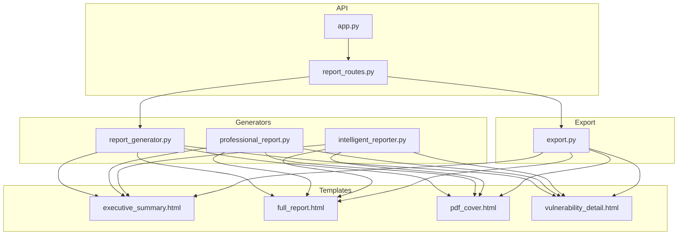
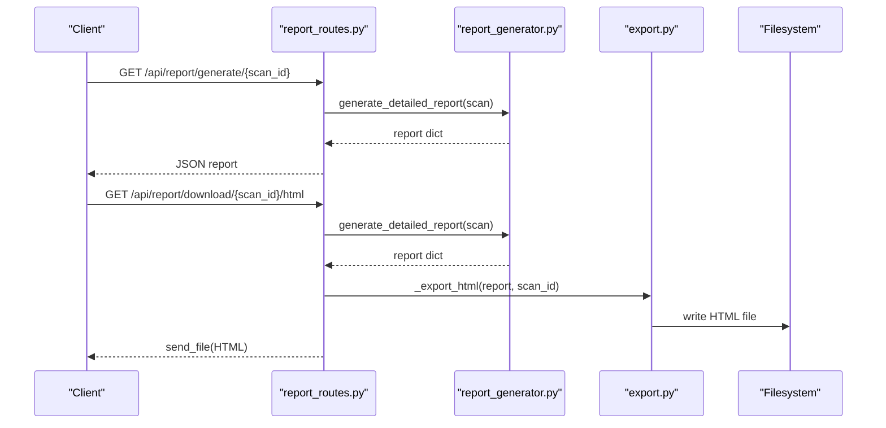
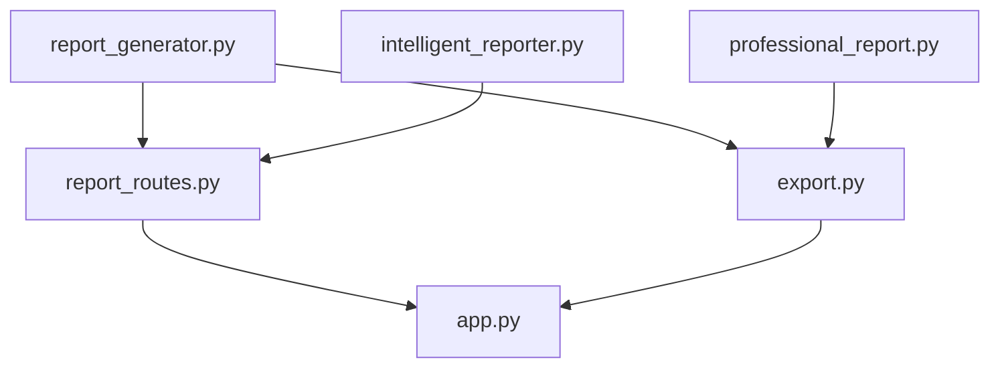

# Template Customization and Styling

<cite>
**Referenced Files in This Document**
- [executive_summary.html](file://backend/reporting/templates/executive_summary.html)
- [full_report.html](file://backend/reporting/templates/full_report.html)
- [pdf_cover.html](file://backend/reporting/templates/pdf_cover.html)
- [vulnerability_detail.html](file://backend/reporting/templates/vulnerability_detail.html)
- [report_generator.py](file://backend/reporting/report_generator.py)
- [professional_report.py](file://backend/reporting/professional_report.py)
- [intelligent_reporter.py](file://backend/reporting/intelligent_reporter.py)
- [export.py](file://backend/reporting/export.py)
- [report_routes.py](file://backend/api/report_routes.py)
- [app.py](file://backend/app.py)
- [test_agent_and_reporting.py](file://backend/testing/test_agent_and_reporting.py)
</cite>

## Table of Contents
1. [Introduction](#introduction)
2. [Project Structure](#project-structure)
3. [Core Components](#core-components)
4. [Architecture Overview](#architecture-overview)
5. [Detailed Component Analysis](#detailed-component-analysis)
6. [Dependency Analysis](#dependency-analysis)
7. [Performance Considerations](#performance-considerations)
8. [Troubleshooting Guide](#troubleshooting-guide)
9. [Conclusion](#conclusion)
10. [Appendices](#appendices)

## Introduction
This document explains the template customization and styling system used to produce branded, professional, and customizable reporting output. It covers the HTML template architecture supporting executive summaries, full reports, PDF covers, and vulnerability details, along with the Jinja2-style templating patterns used to render dynamic content. It also documents customization options for branding, color schemes, logos, and layouts; the template inheritance and reuse patterns; responsive design considerations; and validation, error handling, and testing procedures to ensure report quality across customizations.

## Project Structure
The reporting subsystem centers around:
- HTML templates under backend/reporting/templates for executive summaries, full reports, PDF covers, and vulnerability details
- Python generators that assemble report data structures and drive template rendering
- An export module that generates static HTML/markdown and JSON outputs
- Flask routes that serve report data and downloads

**Diagram sources**
- [executive_summary.html](file://backend/reporting/templates/executive_summary.html#L1-L170)
- [full_report.html](file://backend/reporting/templates/full_report.html#L1-L230)
- [pdf_cover.html](file://backend/reporting/templates/pdf_cover.html#L1-L64)
- [vulnerability_detail.html](file://backend/reporting/templates/vulnerability_detail.html#L1-L247)
- [report_generator.py](file://backend/reporting/report_generator.py#L1-L438)
- [professional_report.py](file://backend/reporting/professional_report.py#L1-L715)
- [intelligent_reporter.py](file://backend/reporting/intelligent_reporter.py#L1-L555)
- [export.py](file://backend/reporting/export.py#L1-L191)
- [report_routes.py](file://backend/api/report_routes.py#L1-L124)
- [app.py](file://backend/app.py#L1-L343)

**Section sources**
- [executive_summary.html](file://backend/reporting/templates/executive_summary.html#L1-L170)
- [full_report.html](file://backend/reporting/templates/full_report.html#L1-L230)
- [pdf_cover.html](file://backend/reporting/templates/pdf_cover.html#L1-L64)
- [vulnerability_detail.html](file://backend/reporting/templates/vulnerability_detail.html#L1-L247)
- [report_generator.py](file://backend/reporting/report_generator.py#L1-L438)
- [professional_report.py](file://backend/reporting/professional_report.py#L1-L715)
- [intelligent_reporter.py](file://backend/reporting/intelligent_reporter.py#L1-L555)
- [export.py](file://backend/reporting/export.py#L1-L191)
- [report_routes.py](file://backend/api/report_routes.py#L1-L124)
- [app.py](file://backend/app.py#L1-L343)

## Core Components
- HTML Templates: Provide the visual structure and styling for reports. They embed dynamic placeholders and loops to render findings, summaries, and metadata.
- Report Generators: Build structured report data (metadata, executive summaries, vulnerability details, recommendations) and coordinate template rendering.
- Export Module: Produces downloadable artifacts (HTML, Markdown, JSON) from report data.
- API Layer: Exposes endpoints to fetch reports, vulnerability details, and download formatted outputs.

Key template files:
- Executive Summary: [executive_summary.html](file://backend/reporting/templates/executive_summary.html#L1-L170)
- Full Report: [full_report.html](file://backend/reporting/templates/full_report.html#L1-L230)
- PDF Cover: [pdf_cover.html](file://backend/reporting/templates/pdf_cover.html#L1-L64)
- Vulnerability Detail: [vulnerability_detail.html](file://backend/reporting/templates/vulnerability_detail.html#L1-L247)

Generator modules:
- Vulnerability Report Generator: [report_generator.py](file://backend/reporting/report_generator.py#L1-L438)
- Professional Report Generator: [professional_report.py](file://backend/reporting/professional_report.py#L1-L715)
- Intelligent Report Generator: [intelligent_reporter.py](file://backend/reporting/intelligent_reporter.py#L1-L555)

Export and API:
- Export: [export.py](file://backend/reporting/export.py#L1-L191)
- Report Routes: [report_routes.py](file://backend/api/report_routes.py#L1-L124)
- App bootstrap: [app.py](file://backend/app.py#L1-L343)

**Section sources**
- [executive_summary.html](file://backend/reporting/templates/executive_summary.html#L1-L170)
- [full_report.html](file://backend/reporting/templates/full_report.html#L1-L230)
- [pdf_cover.html](file://backend/reporting/templates/pdf_cover.html#L1-L64)
- [vulnerability_detail.html](file://backend/reporting/templates/vulnerability_detail.html#L1-L247)
- [report_generator.py](file://backend/reporting/report_generator.py#L1-L438)
- [professional_report.py](file://backend/reporting/professional_report.py#L1-L715)
- [intelligent_reporter.py](file://backend/reporting/intelligent_reporter.py#L1-L555)
- [export.py](file://backend/reporting/export.py#L1-L191)
- [report_routes.py](file://backend/api/report_routes.py#L1-L124)
- [app.py](file://backend/app.py#L1-L343)

## Architecture Overview
The system follows a data-first rendering pipeline:
- Data is produced by report generators from scan state
- Templates define the presentation layer with placeholders and loops
- Export and API layers materialize outputs (HTML/Markdown/JSON) and serve them via endpoints

**Diagram sources**
- [report_routes.py](file://backend/api/report_routes.py#L35-L80)
- [report_generator.py](file://backend/reporting/report_generator.py#L19-L41)
- [export.py](file://backend/reporting/export.py#L54-L80)

**Section sources**
- [report_routes.py](file://backend/api/report_routes.py#L1-L124)
- [report_generator.py](file://backend/reporting/report_generator.py#L1-L438)
- [export.py](file://backend/reporting/export.py#L1-L191)

## Detailed Component Analysis

### HTML Template Architecture and Styling
The templates define:
- Branding: Header blocks with gradient backgrounds and typography
- Color schemes: Severity-based color classes (critical, high, medium, low)
- Layouts: Sections, stat boxes, recommendation panels, and tables
- Dynamic rendering: Loops over findings, conditionally styled badges and risk indicators
- Responsive considerations: Flexbox and media queries for print and screen

Representative template files:
- Executive Summary: [executive_summary.html](file://backend/reporting/templates/executive_summary.html#L1-L170)
- Full Report: [full_report.html](file://backend/reporting/templates/full_report.html#L1-L230)
- PDF Cover: [pdf_cover.html](file://backend/reporting/templates/pdf_cover.html#L1-L64)
- Vulnerability Detail: [vulnerability_detail.html](file://backend/reporting/templates/vulnerability_detail.html#L1-L247)

Customization touchpoints:
- Global styles: Font families, spacing, shadows, and gradients
- Severity classes: Tailored for critical, high, medium, low
- Section containers: Consistent padding, borders, and shadows
- Print media: Page breaks and print-only directives

**Section sources**
- [executive_summary.html](file://backend/reporting/templates/executive_summary.html#L1-L170)
- [full_report.html](file://backend/reporting/templates/full_report.html#L1-L230)
- [pdf_cover.html](file://backend/reporting/templates/pdf_cover.html#L1-L64)
- [vulnerability_detail.html](file://backend/reporting/templates/vulnerability_detail.html#L1-L247)

### Jinja2-Style Templating and Dynamic Content
While the backend does not use Flask/Jinja2 in the templates themselves, the templates employ a Jinja2-like syntax for loops and conditionals:
- Iteration over findings and top vulnerabilities
- Conditional severity classes applied to badges and rows
- Dynamic risk level rendering and severity-based styling

Examples of dynamic constructs:
- Loop over findings: [full_report.html](file://backend/reporting/templates/full_report.html#L182-L204)
- Severity badge and color class: [vulnerability_detail.html](file://backend/reporting/templates/vulnerability_detail.html#L109-L111)
- Risk level display: [executive_summary.html](file://backend/reporting/templates/executive_summary.html#L96-L98)

These patterns enable easy customization by replacing or extending style classes and adding new sections.

**Section sources**
- [full_report.html](file://backend/reporting/templates/full_report.html#L182-L204)
- [vulnerability_detail.html](file://backend/reporting/templates/vulnerability_detail.html#L109-L111)
- [executive_summary.html](file://backend/reporting/templates/executive_summary.html#L96-L98)

### Template Customization Options
Branding and styling customization can be achieved by editing the CSS and structure within the templates:
- Branding elements: Update header gradients, typography, and color schemes
- Color schemes: Modify severity classes and risk level badges
- Logo integration: Insert SVG or emoji placeholders in headers and covers
- Layout modifications: Adjust section containers, margins, and grid/flex layouts
- Responsive design: Extend media queries for print and screen breakpoints

Practical customization workflows:
- Executive summary branding: Modify header background and typography in [executive_summary.html](file://backend/reporting/templates/executive_summary.html#L11-L18)
- Full report layout: Adjust content width and section spacing in [full_report.html](file://backend/reporting/templates/full_report.html#L25-L36)
- PDF cover branding: Customize gradient, font sizes, and detail items in [pdf_cover.html](file://backend/reporting/templates/pdf_cover.html#L5-L48)
- Vulnerability detail tabs: Extend tabbed interface and add new panes in [vulnerability_detail.html](file://backend/reporting/templates/vulnerability_detail.html#L115-L121)

**Section sources**
- [executive_summary.html](file://backend/reporting/templates/executive_summary.html#L11-L18)
- [full_report.html](file://backend/reporting/templates/full_report.html#L25-L36)
- [pdf_cover.html](file://backend/reporting/templates/pdf_cover.html#L5-L48)
- [vulnerability_detail.html](file://backend/reporting/templates/vulnerability_detail.html#L115-L121)

### Template Inheritance and Partial Reuse
Although explicit template inheritance is not implemented, the system encourages reuse through:
- Shared CSS classes for severity and layout
- Modular sections (headers, stats, recommendations)
- Consistent data structures across templates

To implement inheritance:
- Define base template blocks for common sections (header, footer, navigation)
- Create child templates that override blocks and extend shared assets
- Centralize branding and color tokens in a single stylesheet

[No sources needed since this section provides conceptual guidance]

### Data-Driven Rendering and Conditional Formatting
The generators prepare structured data for templates:
- Executive summaries with risk ratings and counts
- Vulnerability entries with severity, descriptions, reproduction steps, and remediation
- Recommendations grouped by priority and type

Key generator responsibilities:
- Executive summary aggregation and risk scoring: [report_generator.py](file://backend/reporting/report_generator.py#L57-L88)
- Vulnerability entry construction: [report_generator.py](file://backend/reporting/report_generator.py#L90-L132)
- Severity mapping and categorization: [report_generator.py](file://backend/reporting/report_generator.py#L134-L184)

**Section sources**
- [report_generator.py](file://backend/reporting/report_generator.py#L57-L132)
- [report_generator.py](file://backend/reporting/report_generator.py#L134-L184)

### PDF Cover Generation
The PDF cover template provides a branded landing page for reports:
- Centered hero layout with gradient background
- Target, scan ID, and timestamp display
- Confidential notice and detail blocks

Customization tips:
- Adjust gradient colors and font sizes
- Add company logo or favicon
- Localize detail labels and notices

**Section sources**
- [pdf_cover.html](file://backend/reporting/templates/pdf_cover.html#L1-L64)

### Vulnerability Detail Display
The vulnerability detail template organizes findings into a tabbed interface:
- Description and technical details
- Reproduction steps and proof of concept
- Impact analysis per CIA triad
- Remediation guidance and best practices
- References to external resources

Extensibility:
- Add new tabs for exploit code, screenshots, or audit trails
- Introduce custom severity icons or status badges

**Section sources**
- [vulnerability_detail.html](file://backend/reporting/templates/vulnerability_detail.html#L1-L247)

### Export and Download Workflows
The export module produces downloadable artifacts:
- HTML export with embedded styles
- Markdown export for lightweight consumption
- JSON export for programmatic integration

Integration points:
- API route for HTML download: [report_routes.py](file://backend/api/report_routes.py#L50-L80)
- Export functions: [export.py](file://backend/reporting/export.py#L54-L80)

**Section sources**
- [report_routes.py](file://backend/api/report_routes.py#L50-L80)
- [export.py](file://backend/reporting/export.py#L54-L80)

## Dependency Analysis
The following diagram maps the primary dependencies among report components:

**Diagram sources**
- [report_generator.py](file://backend/reporting/report_generator.py#L1-L438)
- [professional_report.py](file://backend/reporting/professional_report.py#L1-L715)
- [intelligent_reporter.py](file://backend/reporting/intelligent_reporter.py#L1-L555)
- [export.py](file://backend/reporting/export.py#L1-L191)
- [report_routes.py](file://backend/api/report_routes.py#L1-L124)
- [app.py](file://backend/app.py#L1-L343)

**Section sources**
- [report_generator.py](file://backend/reporting/report_generator.py#L1-L438)
- [professional_report.py](file://backend/reporting/professional_report.py#L1-L715)
- [intelligent_reporter.py](file://backend/reporting/intelligent_reporter.py#L1-L555)
- [export.py](file://backend/reporting/export.py#L1-L191)
- [report_routes.py](file://backend/api/report_routes.py#L1-L124)
- [app.py](file://backend/app.py#L1-L343)

## Performance Considerations
- Template rendering cost: Keep styles minimal and avoid heavy client-side interactivity in templates
- Data size: Limit the number of included screenshots and large payloads in exports
- Pagination and truncation: Use truncation helpers and page breaks for long reports
- Caching: Cache repeated computations for severity mapping and risk scoring

[No sources needed since this section provides general guidance]

## Troubleshooting Guide
Common issues and resolutions:
- Missing or empty data in templates: Validate generator outputs before rendering
- Styling inconsistencies: Ensure severity classes match template expectations
- Export failures: Confirm file paths and permissions for downloads
- API errors: Check scan existence and route parameters

Validation and testing:
- Unit tests for report generation: [test_agent_and_reporting.py](file://backend/testing/test_agent_and_reporting.py#L56-L126)
- Endpoint verification: Use API routes to fetch reports and validate structure

**Section sources**
- [test_agent_and_reporting.py](file://backend/testing/test_agent_and_reporting.py#L56-L126)
- [report_routes.py](file://backend/api/report_routes.py#L35-L124)

## Conclusion
The template customization and styling system provides a flexible, branded foundation for generating professional reports. By leveraging modular CSS, consistent data structures, and reusable sections, organizations can tailor visual identity, color schemes, and layouts while maintaining readability and accessibility across formats. Robust validation and testing ensure quality and reliability across customizations.

[No sources needed since this section summarizes without analyzing specific files]

## Appendices

### Practical Examples Index
- Executive summary customization: [executive_summary.html](file://backend/reporting/templates/executive_summary.html#L11-L18)
- Full report layout adjustments: [full_report.html](file://backend/reporting/templates/full_report.html#L25-L36)
- PDF cover branding: [pdf_cover.html](file://backend/reporting/templates/pdf_cover.html#L5-L48)
- Vulnerability detail tabs: [vulnerability_detail.html](file://backend/reporting/templates/vulnerability_detail.html#L115-L121)
- Data-driven rendering: [report_generator.py](file://backend/reporting/report_generator.py#L90-L132)

**Section sources**
- [executive_summary.html](file://backend/reporting/templates/executive_summary.html#L11-L18)
- [full_report.html](file://backend/reporting/templates/full_report.html#L25-L36)
- [pdf_cover.html](file://backend/reporting/templates/pdf_cover.html#L5-L48)
- [vulnerability_detail.html](file://backend/reporting/templates/vulnerability_detail.html#L115-L121)
- [report_generator.py](file://backend/reporting/report_generator.py#L90-L132)