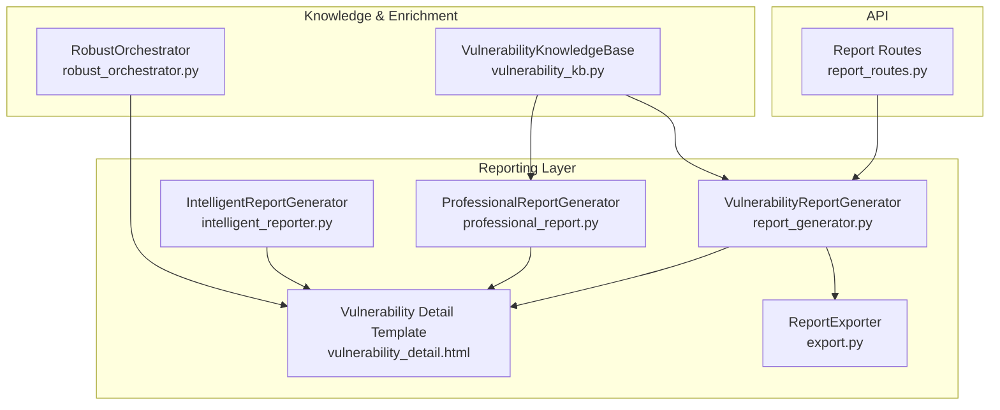
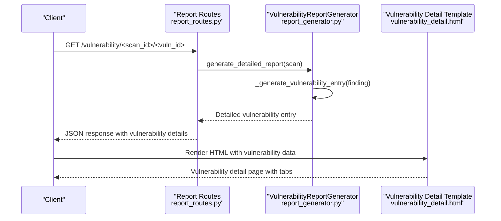
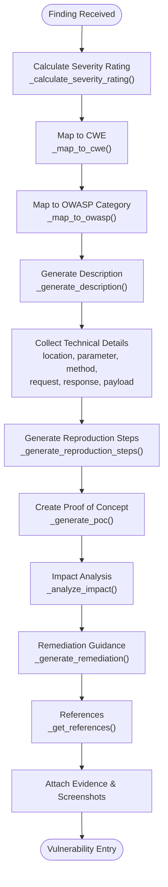
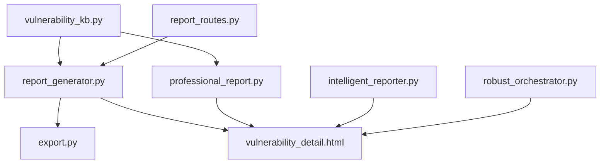

# Vulnerability Detail Documentation

<cite>
**Referenced Files in This Document**
- [vulnerability_detail.html](file://backend/reporting/templates/vulnerability_detail.html)
- [report_generator.py](file://backend/reporting/report_generator.py)
- [professional_report.py](file://backend/reporting/professional_report.py)
- [intelligent_reporter.py](file://backend/reporting/intelligent_reporter.py)
- [vulnerability_kb.py](file://backend/knowledge/vulnerability_kb.py)
- [report_routes.py](file://backend/api/report_routes.py)
- [export.py](file://backend/reporting/export.py)
- [robust_orchestrator.py](file://backend/inference/robust_orchestrator.py)
</cite>

## Table of Contents
1. [Introduction](#introduction)
2. [Project Structure](#project-structure)
3. [Core Components](#core-components)
4. [Architecture Overview](#architecture-overview)
5. [Detailed Component Analysis](#detailed-component-analysis)
6. [Dependency Analysis](#dependency-analysis)
7. [Performance Considerations](#performance-considerations)
8. [Troubleshooting Guide](#troubleshooting-guide)
9. [Conclusion](#conclusion)

## Introduction
This document explains the comprehensive vulnerability detail system within Optimus reports. It covers how vulnerability entries are created and enriched with technical details, reproduction steps, impact analysis, remediation guidance, and references. It also documents the severity calculation system, categorization to CWE and OWASP standards, impact analysis framework, remediation guidance system, and the reference linking mechanism. Practical examples demonstrate formatting, evidence inclusion, and technical specification documentation for security analysts and developers.

## Project Structure
The vulnerability detail system spans several modules:
- Report generation and enrichment: report_generator.py, professional_report.py, intelligent_reporter.py
- Vulnerability detail template: vulnerability_detail.html
- Knowledge base for remediation and categorization: vulnerability_kb.py
- API endpoints for retrieving vulnerability details: report_routes.py
- Export capabilities: export.py
- Additional enrichment pipeline: robust_orchestrator.py

**Diagram sources**
- [report_generator.py](file://backend/reporting/report_generator.py#L14-L42)
- [professional_report.py](file://backend/reporting/professional_report.py#L73-L99)
- [intelligent_reporter.py](file://backend/reporting/intelligent_reporter.py#L72-L161)
- [vulnerability_detail.html](file://backend/reporting/templates/vulnerability_detail.html#L1-L247)
- [export.py](file://backend/reporting/export.py#L11-L41)
- [vulnerability_kb.py](file://backend/knowledge/vulnerability_kb.py#L6-L52)
- [robust_orchestrator.py](file://backend/inference/robust_orchestrator.py#L1400-L1432)
- [report_routes.py](file://backend/api/report_routes.py#L33-L98)

**Section sources**
- [report_generator.py](file://backend/reporting/report_generator.py#L14-L42)
- [professional_report.py](file://backend/reporting/professional_report.py#L73-L99)
- [intelligent_reporter.py](file://backend/reporting/intelligent_reporter.py#L72-L161)
- [vulnerability_detail.html](file://backend/reporting/templates/vulnerability_detail.html#L1-L247)
- [export.py](file://backend/reporting/export.py#L11-L41)
- [vulnerability_kb.py](file://backend/knowledge/vulnerability_kb.py#L6-L52)
- [robust_orchestrator.py](file://backend/inference/robust_orchestrator.py#L1400-L1432)
- [report_routes.py](file://backend/api/report_routes.py#L33-L98)

## Core Components
- VulnerabilityReportGenerator: Creates detailed vulnerability entries with severity, technical details, reproduction steps, impact, remediation, and references.
- ProfessionalReportGenerator: Produces structured, professional reports with CWE/OWASP mapping, risk assessment, and recommendations.
- IntelligentReportGenerator: Provides AI-enhanced executive summaries, prioritized remediation plans, and risk scoring.
- VulnerabilityDetailTemplate: Renders vulnerability details in HTML with tabs for Description, Reproduction, Impact, Remediation, and References.
- VulnerabilityKnowledgeBase: Supplies remediation knowledge, exploitation techniques, and reproduction templates.
- ReportExporter: Exports reports to JSON, HTML, and Markdown formats.
- RobustOrchestrator: Enriches findings with severity labels, CWE/OWASP mapping, and remediation guidance.

**Section sources**
- [report_generator.py](file://backend/reporting/report_generator.py#L14-L132)
- [professional_report.py](file://backend/reporting/professional_report.py#L73-L371)
- [intelligent_reporter.py](file://backend/reporting/intelligent_reporter.py#L72-L555)
- [vulnerability_detail.html](file://backend/reporting/templates/vulnerability_detail.html#L105-L223)
- [vulnerability_kb.py](file://backend/knowledge/vulnerability_kb.py#L6-L348)
- [export.py](file://backend/reporting/export.py#L11-L80)
- [robust_orchestrator.py](file://backend/inference/robust_orchestrator.py#L1400-L1573)

## Architecture Overview
The vulnerability detail system follows a layered approach:
- Data ingestion: scan_state with findings
- Enrichment: severity mapping, CWE/OWASP categorization, impact analysis, remediation guidance
- Rendering: HTML template for vulnerability detail pages
- Export: multiple formats for distribution

**Diagram sources**
- [report_routes.py](file://backend/api/report_routes.py#L82-L98)
- [report_generator.py](file://backend/reporting/report_generator.py#L19-L132)
- [vulnerability_detail.html](file://backend/reporting/templates/vulnerability_detail.html#L115-L223)

**Section sources**
- [report_routes.py](file://backend/api/report_routes.py#L33-L98)
- [report_generator.py](file://backend/reporting/report_generator.py#L19-L132)
- [vulnerability_detail.html](file://backend/reporting/templates/vulnerability_detail.html#L115-L223)

## Detailed Component Analysis

### Vulnerability Entry Creation and Enrichment
The system transforms raw findings into comprehensive vulnerability entries by:
- Calculating severity rating from CVSS score
- Mapping to CWE and OWASP categories
- Generating detailed descriptions and technical details
- Creating step-by-step reproduction instructions
- Performing impact analysis across confidentiality, integrity, and availability
- Providing remediation guidance with immediate and long-term solutions
- Attaching references to external resources

**Diagram sources**
- [report_generator.py](file://backend/reporting/report_generator.py#L90-L132)
- [report_generator.py](file://backend/reporting/report_generator.py#L134-L184)
- [report_generator.py](file://backend/reporting/report_generator.py#L185-L371)

**Section sources**
- [report_generator.py](file://backend/reporting/report_generator.py#L90-L132)
- [report_generator.py](file://backend/reporting/report_generator.py#L134-L184)
- [report_generator.py](file://backend/reporting/report_generator.py#L185-L371)

### Severity Calculation System
Severity is calculated directly from the CVSS score embedded in each finding:
- Critical: CVSS score ≥ 9.0
- High: 7.0 ≤ CVSS score < 9.0
- Medium: 4.0 ≤ CVSS score < 7.0
- Low: 0.0 ≤ CVSS score < 4.0

This mapping ensures consistent risk ratings across reports and aligns with industry standards.

**Section sources**
- [report_generator.py](file://backend/reporting/report_generator.py#L134-L146)

### Vulnerability Categorization System
Each finding is categorized using:
- CWE mapping: Links vulnerability types to MITRE CWE identifiers
- OWASP mapping: Aligns findings with OWASP Top 10 categories

Mappings are applied during entry creation and enrichment.

**Section sources**
- [report_generator.py](file://backend/reporting/report_generator.py#L148-L183)
- [professional_report.py](file://backend/reporting/professional_report.py#L23-L70)
- [robust_orchestrator.py](file://backend/inference/robust_orchestrator.py#L1375-L1396)

### Impact Analysis Framework
Impact is assessed across three pillars:
- Confidentiality: Risk to secret information disclosure or theft
- Integrity: Risk to data corruption or unauthorized modification
- Availability: Risk to system or service unavailability

The framework assigns qualitative impact levels based on vulnerability type and severity thresholds.

**Section sources**
- [report_generator.py](file://backend/reporting/report_generator.py#L273-L301)
- [professional_report.py](file://backend/reporting/professional_report.py#L459-L494)
- [robust_orchestrator.py](file://backend/inference/robust_orchestrator.py#L1550-L1561)

### Remediation Guidance System
Remediation guidance includes:
- Immediate fixes: Quick wins to mitigate risk
- Long-term solutions: Architectural and process improvements
- Code examples: Secure coding patterns and anti-patterns
- Best practices: Secure development lifecycle recommendations

Guidance is tailored per vulnerability type and language/framework where applicable.

**Section sources**
- [report_generator.py](file://backend/reporting/report_generator.py#L303-L344)
- [professional_report.py](file://backend/reporting/professional_report.py#L496-L555)
- [vulnerability_kb.py](file://backend/knowledge/vulnerability_kb.py#L150-L229)
- [robust_orchestrator.py](file://backend/inference/robust_orchestrator.py#L1502-L1548)

### Reference System
References link vulnerabilities to authoritative resources:
- CWE entries
- OWASP guidelines
- Tool-specific documentation

References are dynamically generated based on vulnerability type and mapped identifiers.

**Section sources**
- [report_generator.py](file://backend/reporting/report_generator.py#L346-L371)
- [professional_report.py](file://backend/reporting/professional_report.py#L557-L582)
- [robust_orchestrator.py](file://backend/inference/robust_orchestrator.py#L1563-L1573)

### Vulnerability Detail Formatting and Evidence Inclusion
The HTML template organizes information into tabbed sections:
- Description: Vulnerability explanation and technical details
- Reproduction: Step-by-step instructions and proof of concept
- Impact: CIA risk analysis
- Remediation: Immediate and long-term guidance with code examples
- References: External resources

Evidence and screenshots are included as part of technical details and proof of concept.

**Section sources**
- [vulnerability_detail.html](file://backend/reporting/templates/vulnerability_detail.html#L115-L223)

### API Integration and Retrieval
The API exposes endpoints to retrieve vulnerability details and generate reports:
- GET /vulnerability/<scan_id>/<vuln_id>: Returns a single vulnerability entry
- GET /generate/<scan_id>: Generates a detailed report
- GET /download/<scan_id>/<format>: Downloads report in specified format

**Section sources**
- [report_routes.py](file://backend/api/report_routes.py#L33-L124)

### Export Formats
Reports can be exported in multiple formats:
- JSON: Machine-readable for integrations
- HTML: Human-readable with styling and tabs
- Markdown: Lightweight format for documentation systems

**Section sources**
- [export.py](file://backend/reporting/export.py#L16-L80)

## Dependency Analysis
The vulnerability detail system exhibits clear separation of concerns:
- Report generators depend on templates for rendering
- Knowledge base supplies remediation and categorization data
- API routes orchestrate retrieval and generation
- Export module handles output formats

**Diagram sources**
- [report_generator.py](file://backend/reporting/report_generator.py#L14-L42)
- [professional_report.py](file://backend/reporting/professional_report.py#L73-L99)
- [intelligent_reporter.py](file://backend/reporting/intelligent_reporter.py#L72-L161)
- [vulnerability_detail.html](file://backend/reporting/templates/vulnerability_detail.html#L1-L247)
- [export.py](file://backend/reporting/export.py#L11-L41)
- [vulnerability_kb.py](file://backend/knowledge/vulnerability_kb.py#L6-L52)
- [report_routes.py](file://backend/api/report_routes.py#L33-L98)
- [robust_orchestrator.py](file://backend/inference/robust_orchestrator.py#L1400-L1432)

**Section sources**
- [report_generator.py](file://backend/reporting/report_generator.py#L14-L42)
- [professional_report.py](file://backend/reporting/professional_report.py#L73-L99)
- [intelligent_reporter.py](file://backend/reporting/intelligent_reporter.py#L72-L161)
- [vulnerability_detail.html](file://backend/reporting/templates/vulnerability_detail.html#L1-L247)
- [export.py](file://backend/reporting/export.py#L11-L41)
- [vulnerability_kb.py](file://backend/knowledge/vulnerability_kb.py#L6-L52)
- [report_routes.py](file://backend/api/report_routes.py#L33-L98)
- [robust_orchestrator.py](file://backend/inference/robust_orchestrator.py#L1400-L1432)

## Performance Considerations
- Severity calculations and mappings are constant-time operations, minimizing overhead.
- Template rendering is lightweight and optimized for readability.
- Export operations serialize JSON and write files; ensure adequate disk I/O capacity.
- Large reports may benefit from pagination or streaming output in future enhancements.

## Troubleshooting Guide
Common issues and resolutions:
- Missing severity or CVSS score: Ensure findings include a numeric severity value; otherwise, default thresholds apply.
- Empty or generic descriptions: Verify vulnerability type and location fields are populated.
- Missing references: Confirm vulnerability type mapping exists; fallback references are provided.
- Remediation guidance not tailored: Check vulnerability_kb for language/framework-specific guidance; otherwise, generic guidance applies.

**Section sources**
- [report_generator.py](file://backend/reporting/report_generator.py#L134-L184)
- [vulnerability_kb.py](file://backend/knowledge/vulnerability_kb.py#L273-L348)

## Conclusion
Optimus provides a robust, standardized vulnerability detail system that enriches raw findings into actionable, well-structured reports. The system’s severity calculation, categorization, impact analysis, remediation guidance, and reference linking enable security analysts and developers to understand, prioritize, and remediate vulnerabilities effectively. The modular architecture supports extensibility, multi-format export, and consistent presentation via templates.