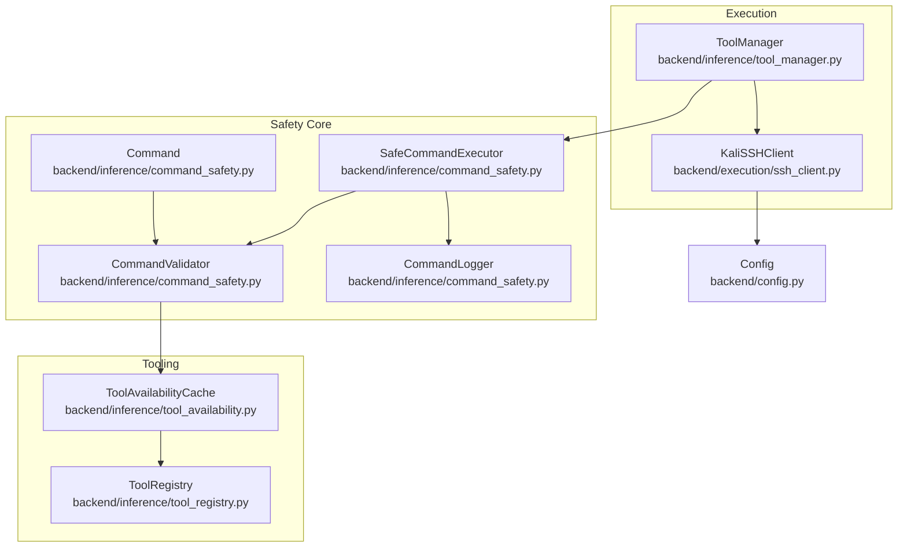
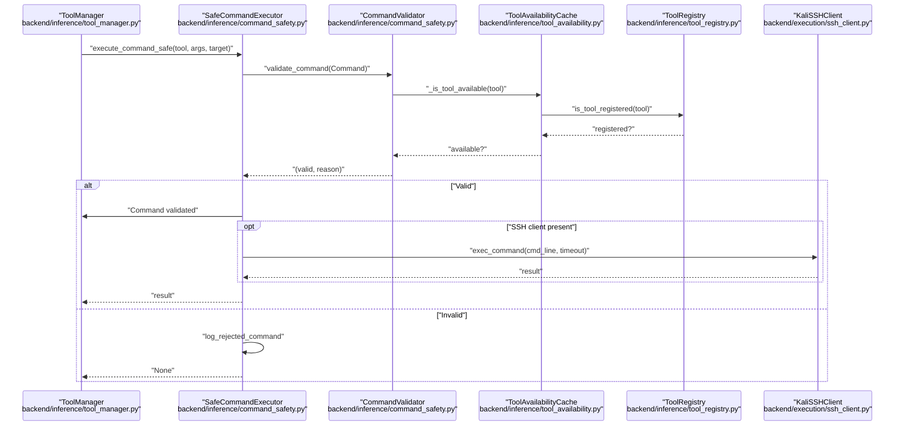
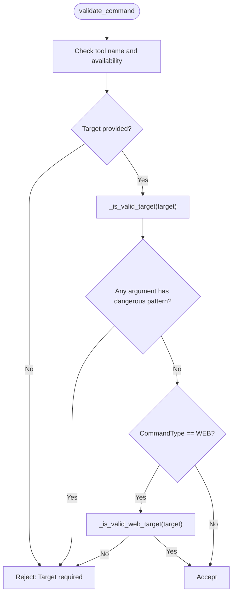
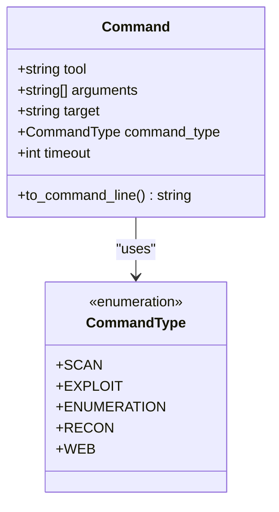
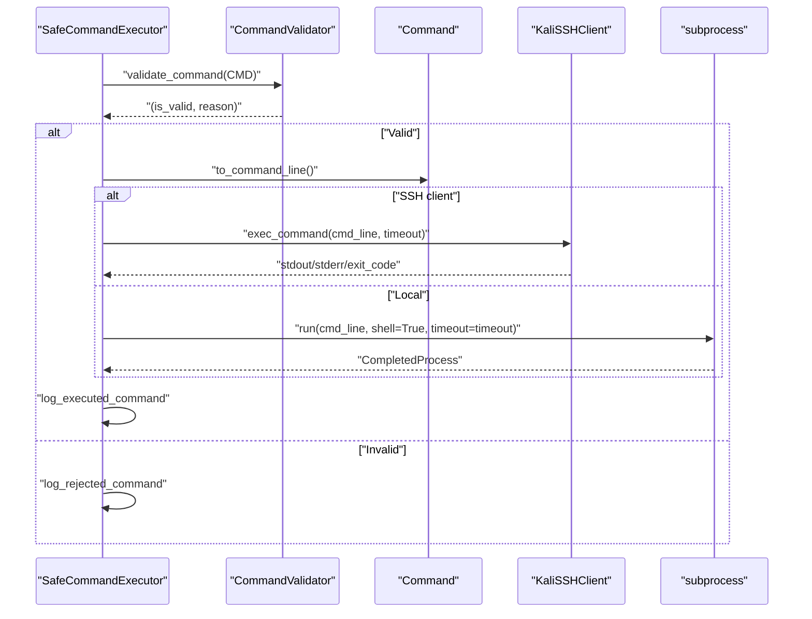
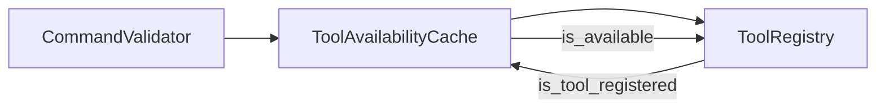
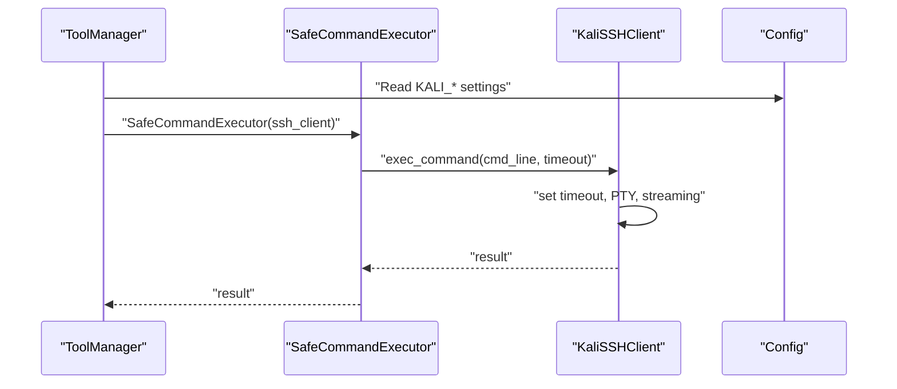
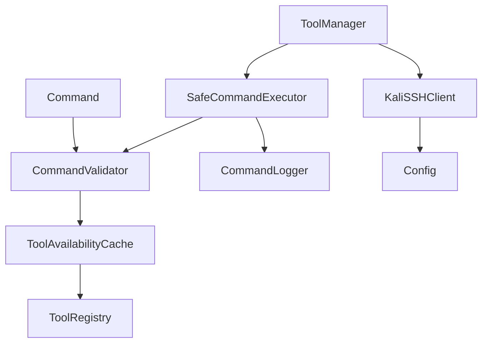

# Command Safety Controls

<cite>
**Referenced Files in This Document**
- [command_safety.py](file://backend/inference/command_safety.py)
- [tool_availability.py](file://backend/inference/tool_availability.py)
- [tool_registry.py](file://backend/inference/tool_registry.py)
- [tool_manager.py](file://backend/inference/tool_manager.py)
- [ssh_client.py](file://backend/execution/ssh_client.py)
- [config.py](file://backend/config.py)
- [test_optimus_backend_fixes.py](file://backend/testing/test_optimus_backend_fixes.py)
</cite>

## Table of Contents
1. [Introduction](#introduction)
2. [Project Structure](#project-structure)
3. [Core Components](#core-components)
4. [Architecture Overview](#architecture-overview)
5. [Detailed Component Analysis](#detailed-component-analysis)
6. [Dependency Analysis](#dependency-analysis)
7. [Performance Considerations](#performance-considerations)
8. [Troubleshooting Guide](#troubleshooting-guide)
9. [Conclusion](#conclusion)

## Introduction
This document describes the command safety controls subsystem responsible for validating, sanitizing, and executing commands in a safety-critical manner. It focuses on:
- The CommandValidator class that validates commands before execution, including target format validation for IP addresses, hostnames, URLs, CIDR notation, and port specifications.
- The dangerous pattern detection system that prevents command injection via semicolons, pipes, command substitution, and redirection operators.
- The Command class structure with tool, arguments, target, command_type, and timeout properties.
- The SafeCommandExecutor implementation that enforces strict separation between LLM suggestions and actual command execution.
- Timeout management, SSH-based execution fallback, and comprehensive logging of all validation attempts.

The goal is to provide security professionals with a clear understanding of the safeguards and developers with sufficient technical depth to implement similar systems.

## Project Structure
The command safety subsystem spans several modules:
- Command modeling and validation: backend/inference/command_safety.py
- Tool availability and registry: backend/inference/tool_availability.py, backend/inference/tool_registry.py
- Execution orchestration and SSH: backend/inference/tool_manager.py, backend/execution/ssh_client.py
- Configuration: backend/config.py
- Tests: backend/testing/test_optimus_backend_fixes.py

**Diagram sources**
- [command_safety.py](file://backend/inference/command_safety.py#L27-L319)
- [tool_availability.py](file://backend/inference/tool_availability.py#L15-L156)
- [tool_registry.py](file://backend/inference/tool_registry.py#L18-L200)
- [tool_manager.py](file://backend/inference/tool_manager.py#L440-L639)
- [ssh_client.py](file://backend/execution/ssh_client.py#L12-L216)
- [config.py](file://backend/config.py#L6-L35)

**Section sources**
- [command_safety.py](file://backend/inference/command_safety.py#L1-L319)
- [tool_availability.py](file://backend/inference/tool_availability.py#L1-L156)
- [tool_registry.py](file://backend/inference/tool_registry.py#L1-L200)
- [tool_manager.py](file://backend/inference/tool_manager.py#L440-L639)
- [ssh_client.py](file://backend/execution/ssh_client.py#L1-L216)
- [config.py](file://backend/config.py#L1-L115)

## Core Components
- Command: A structured representation of a command with tool, arguments, target, optional command_type, and timeout. Includes a method to convert to a command line string while preventing double injection of the target.
- CommandValidator: Validates commands against tool availability, target format, and dangerous patterns. Supports web-specific target validation and command-type-aware checks.
- CommandLogger: Logs rejected, validated, and executed commands for auditability.
- SafeCommandExecutor: Orchestrates validation and execution, supporting both local and SSH-based execution with timeouts and error handling.

Key behaviors:
- Target injection prevention: The Command.to_command_line method detects if the target is already present among arguments and avoids duplication.
- Dangerous pattern detection: Regex-based checks for command chaining, pipes, command substitution, redirection, and unsafe keywords.
- Tool availability: Uses a registry-backed cache to verify tools and optionally discovers new tools dynamically.
- Execution fallback: Executes via SSH when available; otherwise executes locally with a configurable timeout.

**Section sources**
- [command_safety.py](file://backend/inference/command_safety.py#L27-L319)

## Architecture Overview
The safety subsystem integrates with the tool execution pipeline to ensure only validated commands are executed.

**Diagram sources**
- [tool_manager.py](file://backend/inference/tool_manager.py#L464-L478)
- [command_safety.py](file://backend/inference/command_safety.py#L240-L315)
- [tool_availability.py](file://backend/inference/tool_availability.py#L26-L128)
- [tool_registry.py](file://backend/inference/tool_registry.py#L192-L200)
- [ssh_client.py](file://backend/execution/ssh_client.py#L87-L207)

## Detailed Component Analysis

### CommandValidator
Responsibilities:
- Tool availability: Confirms tool presence via ToolAvailabilityCache and ToolRegistry.
- Target validation: Accepts IPv4/IPv6 addresses, hostnames, URLs, CIDR ranges, and host:port combinations.
- Dangerous pattern detection: Blocks command chaining, pipes, command substitution, redirection, and unsafe keywords.
- Web-specific validation: Ensures web targets are valid URLs or convertible to valid URLs.

Target validation logic:
- IP address: IPv4 or IPv6.
- Hostname: Domain validation.
- URL: Full URL validation or scheme-less host with automatic scheme addition for web type.
- CIDR: Validates network/mask format for IPv4/IPv6.
- Port: Validates numeric port in host:port format when scheme is not http/https.

Dangerous pattern detection:
- Semicolons, logical AND/OR operators, pipes, command substitution with $() and backticks, redirection operators, environment variable expansion, and keywords like eval/exec/bash/sh.

**Diagram sources**
- [command_safety.py](file://backend/inference/command_safety.py#L102-L132)
- [command_safety.py](file://backend/inference/command_safety.py#L134-L187)
- [command_safety.py](file://backend/inference/command_safety.py#L189-L213)

**Section sources**
- [command_safety.py](file://backend/inference/command_safety.py#L91-L213)

### Command
Structure and behavior:
- Properties: tool, arguments (List[str]), target, command_type (optional), timeout (default 300 seconds).
- to_command_line: Builds a command string, prevents duplicate target injection, and adds nmap-specific timeout parameters when applicable.

**Diagram sources**
- [command_safety.py](file://backend/inference/command_safety.py#L27-L89)

**Section sources**
- [command_safety.py](file://backend/inference/command_safety.py#L27-L89)

### SafeCommandExecutor
Responsibilities:
- Validate commands via CommandValidator.
- Execute commands either locally (subprocess) or remotely (SSH) with timeouts.
- Comprehensive logging of rejection, validation, and execution outcomes.

Execution flow:
- Convert Command to command line.
- If SSH client is provided, execute via SSH with PTY and streaming output; otherwise execute locally with a timeout.
- Wrap SSH execution result into a compatible CompletedProcess-like object for downstream consumers.

**Diagram sources**
- [command_safety.py](file://backend/inference/command_safety.py#L240-L315)
- [ssh_client.py](file://backend/execution/ssh_client.py#L87-L207)

**Section sources**
- [command_safety.py](file://backend/inference/command_safety.py#L240-L315)

### Tool Availability and Registry
- ToolAvailabilityCache: Caches tool availability with TTL and supports registry-based verification and dynamic discovery via SSH or local mechanisms.
- ToolRegistry: Ground-truth registry enforcing that all tools must be registered and verified before use.

**Diagram sources**
- [tool_availability.py](file://backend/inference/tool_availability.py#L26-L128)
- [tool_registry.py](file://backend/inference/tool_registry.py#L192-L200)
- [command_safety.py](file://backend/inference/command_safety.py#L93-L100)

**Section sources**
- [tool_availability.py](file://backend/inference/tool_availability.py#L15-L156)
- [tool_registry.py](file://backend/inference/tool_registry.py#L18-L200)
- [command_safety.py](file://backend/inference/command_safety.py#L93-L100)

### SSH-Based Execution and Timeouts
- KaliSSHClient: Provides robust SSH execution with PTY, streaming output, overall and data timeouts, and keepalive configuration.
- Integration: ToolManager constructs SafeCommandExecutor with an SSH client and passes the configured timeout from Command.

**Diagram sources**
- [tool_manager.py](file://backend/inference/tool_manager.py#L464-L478)
- [ssh_client.py](file://backend/execution/ssh_client.py#L87-L207)
- [config.py](file://backend/config.py#L12-L35)

**Section sources**
- [ssh_client.py](file://backend/execution/ssh_client.py#L12-L216)
- [tool_manager.py](file://backend/inference/tool_manager.py#L464-L478)
- [config.py](file://backend/config.py#L12-L35)

## Dependency Analysis
- CommandValidator depends on:
  - ToolAvailabilityCache for tool verification.
  - ToolRegistry for ground-truth registration checks.
  - validators and urllib.parse for target validation.
- SafeCommandExecutor composes CommandValidator and CommandLogger, and conditionally uses KaliSSHClient for remote execution.
- ToolManager orchestrates command construction, safety validation, and execution, integrating with the safety subsystem.

**Diagram sources**
- [command_safety.py](file://backend/inference/command_safety.py#L27-L319)
- [tool_availability.py](file://backend/inference/tool_availability.py#L15-L156)
- [tool_registry.py](file://backend/inference/tool_registry.py#L18-L200)
- [tool_manager.py](file://backend/inference/tool_manager.py#L440-L639)
- [ssh_client.py](file://backend/execution/ssh_client.py#L12-L216)
- [config.py](file://backend/config.py#L6-L35)

**Section sources**
- [command_safety.py](file://backend/inference/command_safety.py#L27-L319)
- [tool_availability.py](file://backend/inference/tool_availability.py#L15-L156)
- [tool_registry.py](file://backend/inference/tool_registry.py#L18-L200)
- [tool_manager.py](file://backend/inference/tool_manager.py#L440-L639)
- [ssh_client.py](file://backend/execution/ssh_client.py#L12-L216)
- [config.py](file://backend/config.py#L6-L35)

## Performance Considerations
- Tool availability caching: Reduces repeated discovery overhead with TTL-based cache invalidation.
- SSH streaming: Non-blocking reads with data and overall timeouts prevent stalls and resource exhaustion.
- Command timeouts: Configurable per tool and phase; defaults tuned for long-running scans.
- Logging overhead: Structured logs provide visibility without heavy computation.

[No sources needed since this section provides general guidance]

## Troubleshooting Guide
Common issues and diagnostics:
- Tool not available: Verify tool registration and availability via ToolRegistry and ToolAvailabilityCache.
- Target validation failures: Confirm target format matches accepted patterns (IP, hostname, URL, CIDR, host:port).
- Dangerous pattern detected: Review arguments for prohibited operators or keywords; sanitize inputs accordingly.
- SSH execution failures: Check connection settings, credentials, and timeouts; ensure PTY support on the remote side.
- Local execution timeouts: Increase Command.timeout or adjust tool-specific parameters.

Operational logs:
- Rejected commands: Warning-level entries with tool, target, phase, and scan_id.
- Validated commands: Info-level entries with the constructed command line.
- Executed commands: Info-level entries with exit code and output lengths.

**Section sources**
- [command_safety.py](file://backend/inference/command_safety.py#L216-L238)
- [tool_availability.py](file://backend/inference/tool_availability.py#L26-L128)
- [ssh_client.py](file://backend/execution/ssh_client.py#L87-L207)

## Conclusion
The command safety controls subsystem establishes a robust, layered defense around command execution:
- Strict validation of targets and arguments prevents injection and misuse.
- Tool availability and registry enforcement ensure only trusted tools are used.
- SafeCommandExecutor enforces separation between suggestion and execution, with clear logging and fallback to SSH-based execution.
- Timeouts and streaming improve reliability for long-running tools.

These mechanisms collectively provide a strong foundation for secure automation in penetration testing and security tooling.