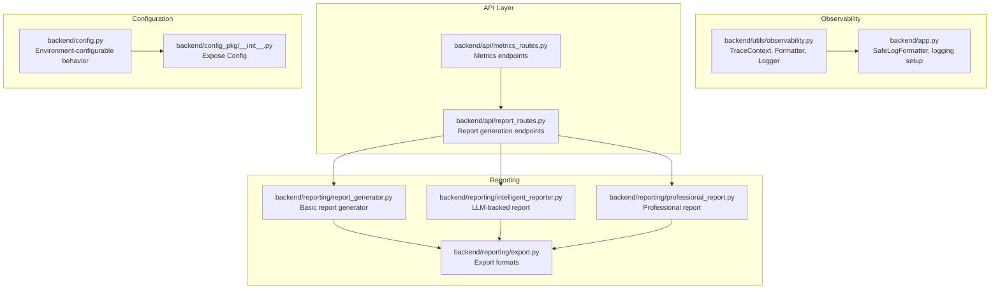
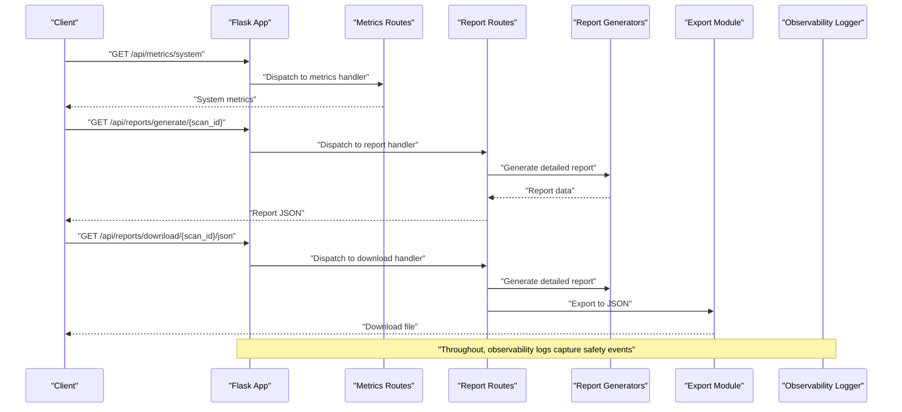
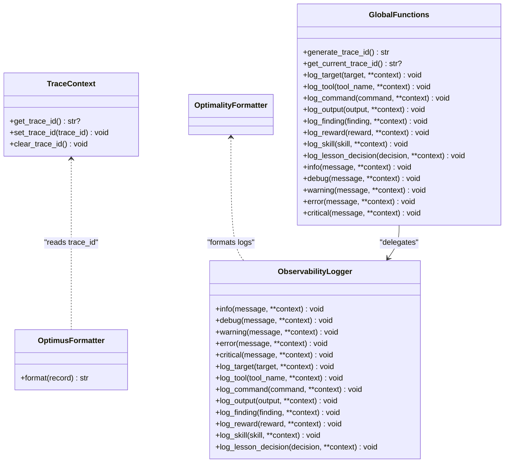
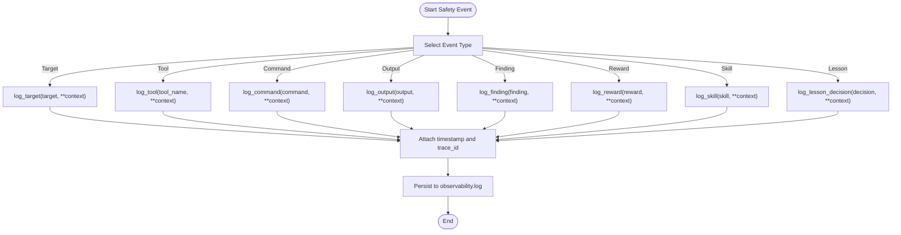
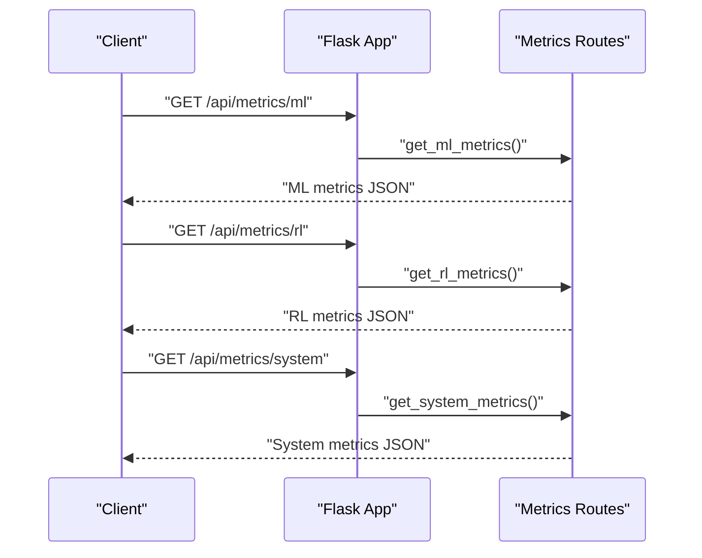
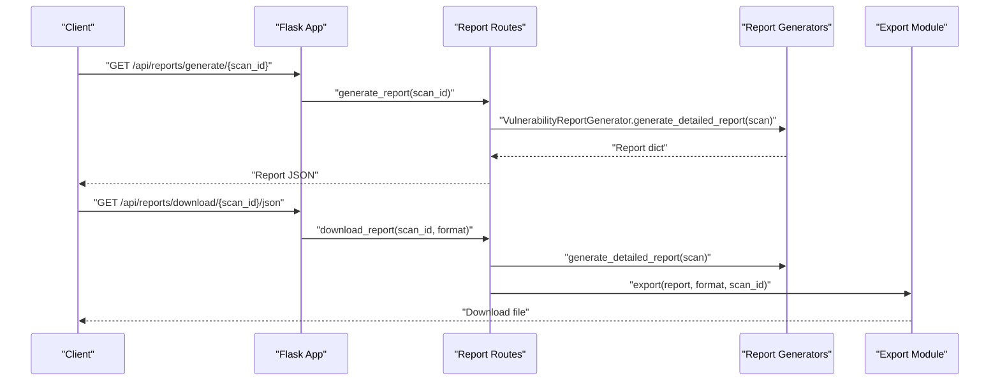
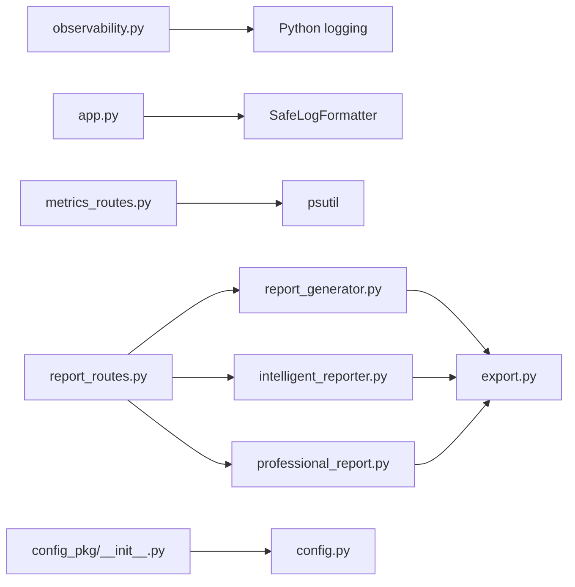

# Compliance and Monitoring

<cite>
**Referenced Files in This Document**
- [observability.py](file://backend/utils/observability.py)
- [app.py](file://backend/app.py)
- [metrics_routes.py](file://backend/api/metrics_routes.py)
- [report_routes.py](file://backend/api/report_routes.py)
- [report_generator.py](file://backend/reporting/report_generator.py)
- [intelligent_reporter.py](file://backend/reporting/intelligent_reporter.py)
- [professional_report.py](file://backend/reporting/professional_report.py)
- [export.py](file://backend/reporting/export.py)
- [config.py](file://backend/config.py)
- [config_pkg/__init__.py](file://backend/config_pkg/__init__.py)
</cite>

## Table of Contents
1. [Introduction](#introduction)
2. [Project Structure](#project-structure)
3. [Core Components](#core-components)
4. [Architecture Overview](#architecture-overview)
5. [Detailed Component Analysis](#detailed-component-analysis)
6. [Dependency Analysis](#dependency-analysis)
7. [Performance Considerations](#performance-considerations)
8. [Troubleshooting Guide](#troubleshooting-guide)
9. [Conclusion](#conclusion)
10. [Appendices](#appendices)

## Introduction
This document describes the compliance monitoring and observability systems that track safety protocol adherence and system behavior in the platform. It explains the observability framework that logs command execution, safety-related events, and compliance metrics; documents the audit trail implementation capturing security-relevant events; and provides concrete examples of how the system tracks safety enforcement, generates compliance reports, and triggers alerts for policy violations. It also covers integrations with external monitoring systems and compliance frameworks, real-time alerting mechanisms, and configuration options for compliance requirements, reporting formats, and retention policies.

## Project Structure
The observability and compliance stack spans several backend modules:
- Centralized logging and traceability via a dedicated observability utility
- Metrics endpoints exposing system and model performance
- Reporting pipeline generating compliance-ready reports
- Configuration management supporting environment-driven compliance behavior
- Application-wide logging and safe formatting for cross-platform compatibility

**Diagram sources**
- [observability.py](file://backend/utils/observability.py#L1-L269)
- [app.py](file://backend/app.py#L1-L343)
- [metrics_routes.py](file://backend/api/metrics_routes.py#L1-L109)
- [report_routes.py](file://backend/api/report_routes.py#L1-L124)
- [report_generator.py](file://backend/reporting/report_generator.py#L1-L438)
- [intelligent_reporter.py](file://backend/reporting/intelligent_reporter.py#L1-L555)
- [professional_report.py](file://backend/reporting/professional_report.py#L1-L715)
- [export.py](file://backend/reporting/export.py#L1-L191)
- [config.py](file://backend/config.py#L1-L115)
- [config_pkg/__init__.py](file://backend/config_pkg/__init__.py#L1-L14)

**Section sources**
- [observability.py](file://backend/utils/observability.py#L1-L269)
- [app.py](file://backend/app.py#L1-L343)
- [metrics_routes.py](file://backend/api/metrics_routes.py#L1-L109)
- [report_routes.py](file://backend/api/report_routes.py#L1-L124)
- [report_generator.py](file://backend/reporting/report_generator.py#L1-L438)
- [intelligent_reporter.py](file://backend/reporting/intelligent_reporter.py#L1-L555)
- [professional_report.py](file://backend/reporting/professional_report.py#L1-L715)
- [export.py](file://backend/reporting/export.py#L1-L191)
- [config.py](file://backend/config.py#L1-L115)
- [config_pkg/__init__.py](file://backend/config_pkg/__init__.py#L1-L14)

## Core Components
- Centralized observability logger with trace ID support for end-to-end correlation
- Safe logging formatter for cross-platform compatibility and correlation IDs
- Metrics endpoints for ML performance, RL metrics, scan history, and system stats
- Report generators producing compliance-ready outputs with executive summaries, remediation plans, and attack chain analysis
- Export module supporting JSON, HTML, and Markdown formats
- Configuration module enabling environment-driven behavior and compliance settings

Key capabilities:
- Track safety-relevant events (targets, tools, commands, outputs, findings, rewards, skills, lessons)
- Enforce safety via structured logging and controlled command execution
- Generate compliance reports aligned with industry standards (OWASP, CWE)
- Provide real-time visibility via WebSocket-enabled application and metrics endpoints
- Support configurable compliance behavior through environment variables

**Section sources**
- [observability.py](file://backend/utils/observability.py#L1-L269)
- [app.py](file://backend/app.py#L1-L343)
- [metrics_routes.py](file://backend/api/metrics_routes.py#L1-L109)
- [report_routes.py](file://backend/api/report_routes.py#L1-L124)
- [report_generator.py](file://backend/reporting/report_generator.py#L1-L438)
- [intelligent_reporter.py](file://backend/reporting/intelligent_reporter.py#L1-L555)
- [professional_report.py](file://backend/reporting/professional_report.py#L1-L715)
- [export.py](file://backend/reporting/export.py#L1-L191)
- [config.py](file://backend/config.py#L1-L115)

## Architecture Overview
The observability and compliance architecture integrates logging, metrics, reporting, and configuration into a cohesive system:

**Diagram sources**
- [metrics_routes.py](file://backend/api/metrics_routes.py#L85-L109)
- [report_routes.py](file://backend/api/report_routes.py#L35-L81)
- [report_generator.py](file://backend/reporting/report_generator.py#L19-L42)
- [intelligent_reporter.py](file://backend/reporting/intelligent_reporter.py#L102-L161)
- [professional_report.py](file://backend/reporting/professional_report.py#L82-L99)
- [export.py](file://backend/reporting/export.py#L16-L41)
- [observability.py](file://backend/utils/observability.py#L51-L155)
- [app.py](file://backend/app.py#L276-L290)

## Detailed Component Analysis

### Observability and Audit Trail
The centralized observability system provides:
- Thread-local trace ID management for end-to-end correlation across distributed operations
- Custom formatter that injects trace IDs into log records
- File and console handlers with consistent formatting
- Convenience methods for logging targets, tools, commands, outputs, findings, rewards, skills, and lesson decisions
- Global logger initialization and safe trace context lifecycle

Audit trail characteristics:
- Timestamps and trace IDs embedded in every log entry
- Structured context payloads for findings, commands, and outputs
- Persistent logs for forensic analysis and compliance reviews

**Diagram sources**
- [observability.py](file://backend/utils/observability.py#L15-L155)

**Section sources**
- [observability.py](file://backend/utils/observability.py#L1-L269)

### Logging and Safety Protocol Tracking
Safety protocol enforcement is tracked through structured logging:
- Targets: log_target
- Tools: log_tool
- Commands: log_command
- Outputs: log_output
- Security findings: log_finding
- Rewards: log_reward
- Skills and lessons: log_skill, log_lesson_decision

These methods automatically attach timestamps and trace IDs, ensuring end-to-end auditability for safety reviews.

**Diagram sources**
- [observability.py](file://backend/utils/observability.py#L86-L155)

**Section sources**
- [observability.py](file://backend/utils/observability.py#L86-L155)

### Metrics and Compliance Monitoring
Metrics endpoints provide:
- ML model performance metrics
- RL agent performance metrics
- Historical scan metrics placeholder
- System resource metrics (CPU, memory, disk)

These metrics support compliance dashboards and trend analysis for regulatory reporting.

**Diagram sources**
- [metrics_routes.py](file://backend/api/metrics_routes.py#L13-L109)

**Section sources**
- [metrics_routes.py](file://backend/api/metrics_routes.py#L1-L109)

### Reporting and Compliance Reports
The reporting pipeline supports multiple report types:
- Basic report generator: detailed vulnerability entries, executive summary, attack chain, recommendations
- Intelligent reporter: LLM-backed executive summaries, prioritized remediation, risk scoring, attack chain analysis
- Professional report: structured, professional report with scope, methodology, findings, risk assessment, recommendations
- Export module: JSON, HTML, Markdown export

**Diagram sources**
- [report_routes.py](file://backend/api/report_routes.py#L35-L81)
- [report_generator.py](file://backend/reporting/report_generator.py#L19-L42)
- [intelligent_reporter.py](file://backend/reporting/intelligent_reporter.py#L102-L161)
- [professional_report.py](file://backend/reporting/professional_report.py#L82-L99)
- [export.py](file://backend/reporting/export.py#L16-L41)

**Section sources**
- [report_routes.py](file://backend/api/report_routes.py#L1-L124)
- [report_generator.py](file://backend/reporting/report_generator.py#L1-L438)
- [intelligent_reporter.py](file://backend/reporting/intelligent_reporter.py#L1-L555)
- [professional_report.py](file://backend/reporting/professional_report.py#L1-L715)
- [export.py](file://backend/reporting/export.py#L1-L191)

### Configuration Options for Compliance
Configuration supports environment-driven behavior:
- Kali VM connectivity and timeouts
- Training and model parameters
- Ollama LLM integration
- Self-learning parser settings
- Deep RL configuration
- Intelligence and dark web settings
- Tool database per pentesting phase

These settings enable compliance-tailored behavior (e.g., stricter timeouts, reduced retries, and selective intelligence features).

**Section sources**
- [config.py](file://backend/config.py#L1-L115)
- [config_pkg/__init__.py](file://backend/config_pkg/__init__.py#L1-L14)

## Dependency Analysis
The observability and compliance system exhibits clear separation of concerns:
- Observability logger depends on Python logging and thread-local storage
- Application logging depends on a safe formatter for cross-platform compatibility
- Metrics routes depend on psutil for system metrics
- Reporting depends on report generators and export module
- Configuration is exposed via a package initializer

**Diagram sources**
- [observability.py](file://backend/utils/observability.py#L1-L269)
- [app.py](file://backend/app.py#L90-L117)
- [metrics_routes.py](file://backend/api/metrics_routes.py#L89-L105)
- [report_routes.py](file://backend/api/report_routes.py#L1-L124)
- [report_generator.py](file://backend/reporting/report_generator.py#L1-L438)
- [intelligent_reporter.py](file://backend/reporting/intelligent_reporter.py#L1-L555)
- [professional_report.py](file://backend/reporting/professional_report.py#L1-L715)
- [export.py](file://backend/reporting/export.py#L1-L191)
- [config.py](file://backend/config.py#L1-L115)
- [config_pkg/__init__.py](file://backend/config_pkg/__init__.py#L1-L14)

**Section sources**
- [observability.py](file://backend/utils/observability.py#L1-L269)
- [app.py](file://backend/app.py#L90-L117)
- [metrics_routes.py](file://backend/api/metrics_routes.py#L89-L105)
- [report_routes.py](file://backend/api/report_routes.py#L1-L124)
- [report_generator.py](file://backend/reporting/report_generator.py#L1-L438)
- [intelligent_reporter.py](file://backend/reporting/intelligent_reporter.py#L1-L555)
- [professional_report.py](file://backend/reporting/professional_report.py#L1-L715)
- [export.py](file://backend/reporting/export.py#L1-L191)
- [config.py](file://backend/config.py#L1-L115)
- [config_pkg/__init__.py](file://backend/config_pkg/__init__.py#L1-L14)

## Performance Considerations
- Logging overhead: Centralized logging with trace IDs adds minimal overhead; ensure appropriate log levels for production
- Metrics collection: System metrics rely on psutil; handle missing dependency gracefully
- Report generation: LLM-backed summaries fall back to templates if unavailable; export operations write to disk
- Cross-platform compatibility: Safe formatter ensures consistent logs on Windows and Unix-like systems

[No sources needed since this section provides general guidance]

## Troubleshooting Guide
Common issues and resolutions:
- Unicode encoding on Windows: SafeLogFormatter replaces Unicode characters and encodes output to ASCII-compatible formats
- Missing psutil: Metrics endpoints return default values and a note when psutil is not installed
- Log file creation failures: Application logs to console if file handler fails
- Circular imports: Report routes lazily import global scan storage to avoid import-time issues

**Section sources**
- [app.py](file://backend/app.py#L50-L114)
- [metrics_routes.py](file://backend/api/metrics_routes.py#L99-L105)
- [report_routes.py](file://backend/api/report_routes.py#L11-L19)

## Conclusion
The observability and compliance framework provides end-to-end traceability, structured safety event logging, comprehensive reporting aligned with industry standards, and flexible configuration for compliance requirements. Together with metrics endpoints and export capabilities, it enables effective monitoring, auditing, and reporting for both internal review and regulatory compliance.

[No sources needed since this section summarizes without analyzing specific files]

## Appendices

### Real-Time Alerting Mechanisms
- WebSocket-enabled application for live updates
- Metrics endpoints for system and model performance
- Anomaly detection and investigation queue in intelligence modules (for proactive alerts)
- Recommendations and risk scoring to guide alert thresholds

**Section sources**
- [app.py](file://backend/app.py#L151-L163)
- [metrics_routes.py](file://backend/api/metrics_routes.py#L85-L109)
- [intelligent_reporter.py](file://backend/reporting/intelligent_reporter.py#L484-L514)
- [professional_report.py](file://backend/reporting/professional_report.py#L641-L670)

### Compliance Reporting Formats and Standards
- JSON: primary machine-readable format for integration
- HTML and Markdown: human-readable formats for executive summaries and stakeholder review
- Industry mappings: OWASP Top 10 and CWE categorization included in reports
- Executive summaries: LLM-backed or template-based depending on availability

**Section sources**
- [export.py](file://backend/reporting/export.py#L16-L81)
- [report_generator.py](file://backend/reporting/report_generator.py#L148-L184)
- [intelligent_reporter.py](file://backend/reporting/intelligent_reporter.py#L388-L483)
- [professional_report.py](file://backend/reporting/professional_report.py#L23-L71)

### Retention Policies and Storage
- Logs are persisted to the logs directory with trace IDs and timestamps
- Reports are exported to the exports directory in selected formats
- Metrics are served from in-memory state and files; persistent storage requires external integration

**Section sources**
- [observability.py](file://backend/utils/observability.py#L68-L84)
- [export.py](file://backend/reporting/export.py#L28-L52)
- [metrics_routes.py](file://backend/api/metrics_routes.py#L17-L38)