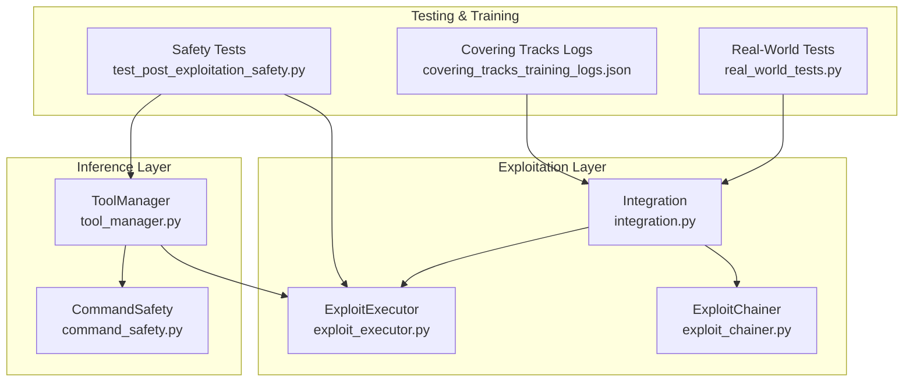
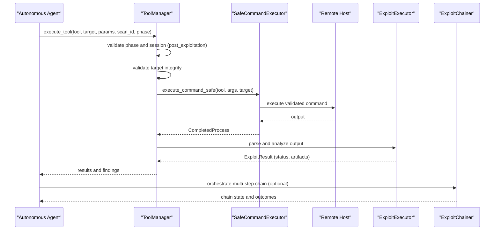
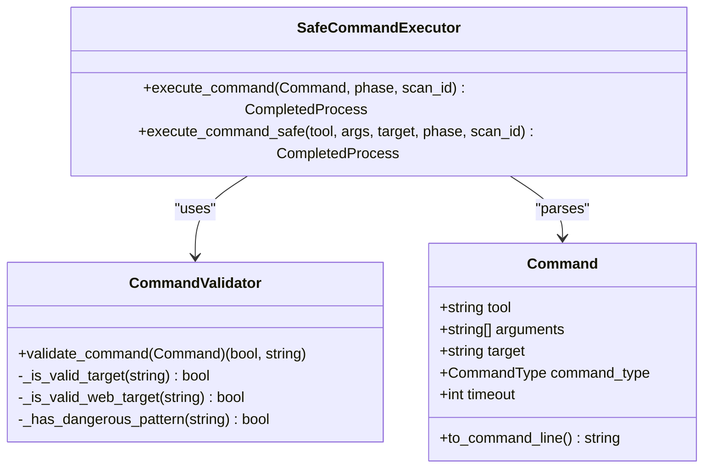
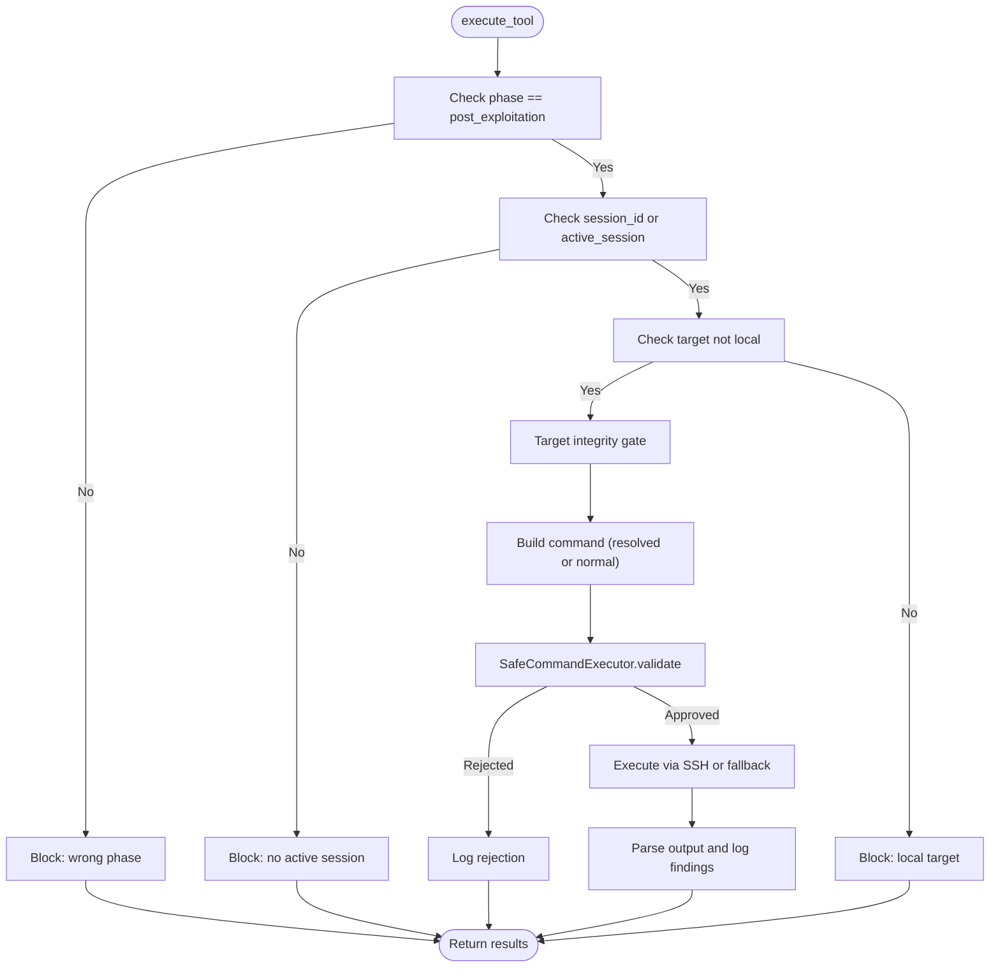
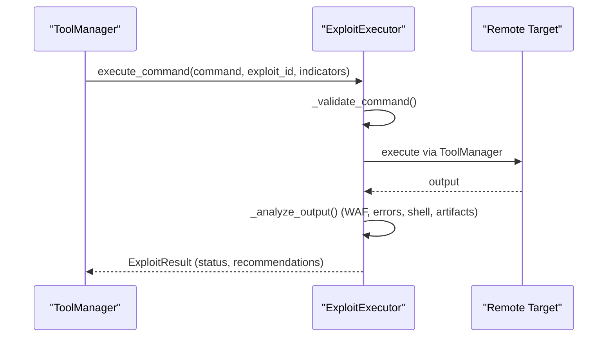
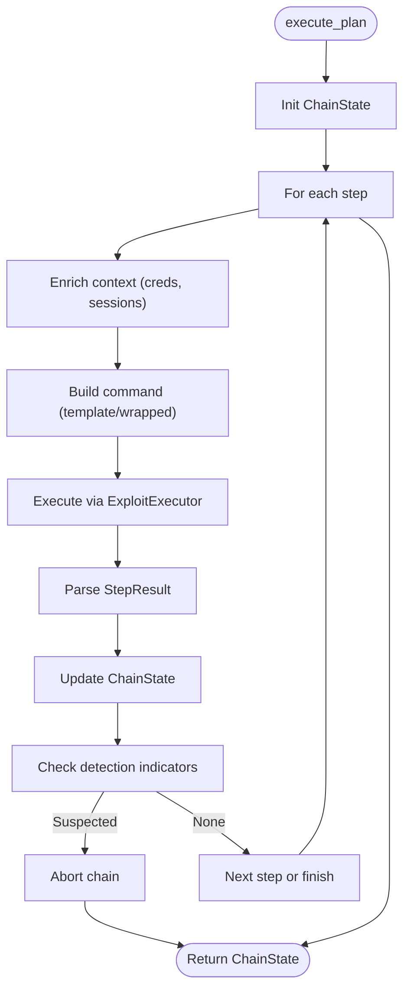
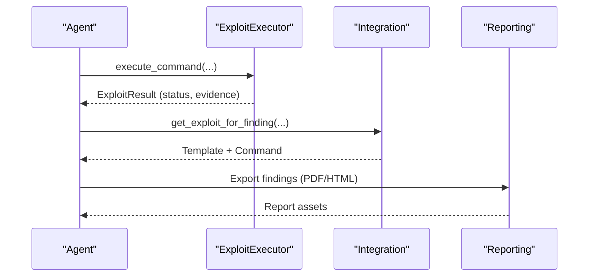
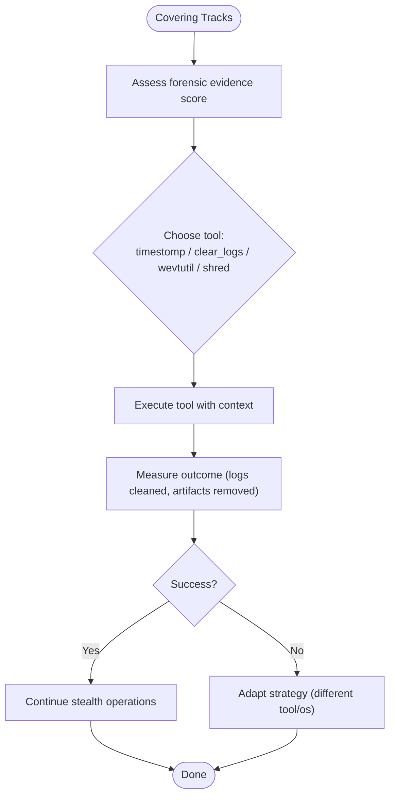
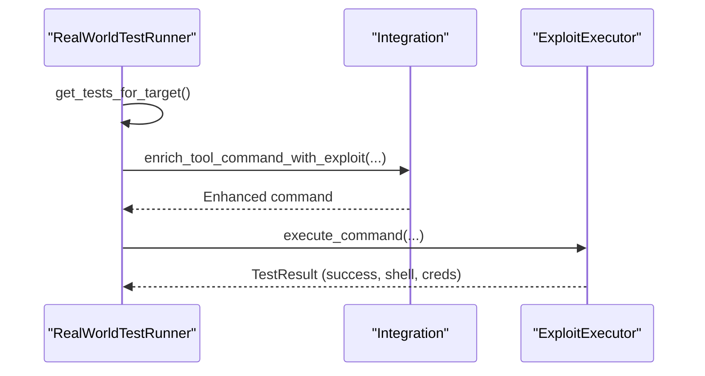
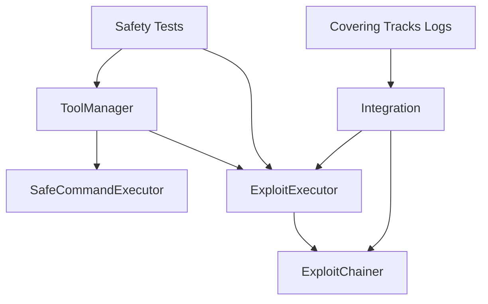

# Post-Exploitation Safety

<cite>
**Referenced Files in This Document**
- [command_safety.py](file://backend/inference/command_safety.py)
- [tool_manager.py](file://backend/inference/tool_manager.py)
- [exploit_executor.py](file://backend/exploitation/exploit_executor.py)
- [exploit_chainer.py](file://backend/exploitation/exploit_chainer.py)
- [integration.py](file://backend/exploitation/integration.py)
- [real_world_tests.py](file://backend/exploitation/real_world_tests.py)
- [test_post_exploitation_safety.py](file://backend/testing/test_post_exploitation_safety.py)
- [covering_tracks_training_logs.json](file://backend/training/data/phase_training_logs/covering_tracks_training_logs.json)
</cite>

## Table of Contents
1. [Introduction](#introduction)
2. [Project Structure](#project-structure)
3. [Core Components](#core-components)
4. [Architecture Overview](#architecture-overview)
5. [Detailed Component Analysis](#detailed-component-analysis)
6. [Dependency Analysis](#dependency-analysis)
7. [Performance Considerations](#performance-considerations)
8. [Troubleshooting Guide](#troubleshooting-guide)
9. [Conclusion](#conclusion)
10. [Appendices](#appendices)

## Introduction
This document describes the post-exploitation safety mechanisms implemented in the Optimus platform. It focuses on responsible disclosure practices and covering tracks protocols designed to minimize forensic traces and ensure ethical, controlled exploitation. The system enforces strict safety gates during post-exploitation phases, validates commands and sessions, and integrates with external reporting and compliance frameworks. It also documents automated safety checks, configuration profiles, and incident response procedures to maintain integrity and accountability.

## Project Structure
The post-exploitation safety spans several modules:
- Inference layer: command safety validation and execution gating
- Exploitation layer: exploit execution, result parsing, and safety checks
- Integration layer: orchestration and post-exploitation command recommendations
- Training and testing: covering tracks behavior modeling and safety guard verification

**Diagram sources**
- [command_safety.py](file://backend/inference/command_safety.py#L283-L361)
- [tool_manager.py](file://backend/inference/tool_manager.py#L226-L646)
- [exploit_executor.py](file://backend/exploitation/exploit_executor.py#L106-L729)
- [exploit_chainer.py](file://backend/exploitation/exploit_chainer.py#L256-L800)
- [integration.py](file://backend/exploitation/integration.py#L59-L630)
- [test_post_exploitation_safety.py](file://backend/testing/test_post_exploitation_safety.py#L1-L189)
- [covering_tracks_training_logs.json](file://backend/training/data/phase_training_logs/covering_tracks_training_logs.json#L1-L1002)
- [real_world_tests.py](file://backend/exploitation/real_world_tests.py#L334-L800)

**Section sources**
- [command_safety.py](file://backend/inference/command_safety.py#L1-L362)
- [tool_manager.py](file://backend/inference/tool_manager.py#L1-L800)
- [exploit_executor.py](file://backend/exploitation/exploit_executor.py#L1-L729)
- [exploit_chainer.py](file://backend/exploitation/exploit_chainer.py#L1-L865)
- [integration.py](file://backend/exploitation/integration.py#L1-L630)
- [test_post_exploitation_safety.py](file://backend/testing/test_post_exploitation_safety.py#L1-L189)
- [covering_tracks_training_logs.json](file://backend/training/data/phase_training_logs/covering_tracks_training_logs.json#L1-L1002)
- [real_world_tests.py](file://backend/exploitation/real_world_tests.py#L1-L899)

## Core Components
- Command Safety Engine: validates commands, prevents destructive patterns, and logs rejections
- ToolManager: enforces post-exploitation gating, session validation, and safe execution
- ExploitExecutor: validates commands, parses outputs, detects WAF/IPS blocks, and extracts artifacts
- ExploitChainer: orchestrates multi-step chains, maintains state, and aborts on detection
- Integration: provides post-exploitation command catalogs and exploit selection
- Covering Tracks Training: behavioral logs informing stealth tool selection and effectiveness

Key safety enforcement points:
- Post-exploitation phase gating for enumeration tools (e.g., linpeas, winpeas)
- Session/session_id validation to ensure remote compromise
- Target integrity validation and normalization
- Command safety validation via SafeCommandExecutor
- Automated detection of WAF/IPS blocks and timeouts
- Structured output parsing for credentials, shells, and artifacts

**Section sources**
- [command_safety.py](file://backend/inference/command_safety.py#L91-L361)
- [tool_manager.py](file://backend/inference/tool_manager.py#L226-L646)
- [exploit_executor.py](file://backend/exploitation/exploit_executor.py#L106-L729)
- [exploit_chainer.py](file://backend/exploitation/exploit_chainer.py#L256-L800)
- [integration.py](file://backend/exploitation/integration.py#L560-L630)
- [covering_tracks_training_logs.json](file://backend/training/data/phase_training_logs/covering_tracks_training_logs.json#L1-L1002)

## Architecture Overview
The post-exploitation safety architecture enforces controls at three layers:
- Input validation: CommandSafety validates commands and rejects unsafe patterns
- Execution gating: ToolManager verifies phase, session, and target integrity before execution
- Outcome monitoring: ExploitExecutor and ExploitChainer detect blocks, timeouts, and artifacts

**Diagram sources**
- [tool_manager.py](file://backend/inference/tool_manager.py#L226-L646)
- [command_safety.py](file://backend/inference/command_safety.py#L283-L361)
- [exploit_executor.py](file://backend/exploitation/exploit_executor.py#L273-L357)
- [exploit_chainer.py](file://backend/exploitation/exploit_chainer.py#L345-L461)

## Detailed Component Analysis

### Command Safety Engine
The Command Safety Engine validates commands prior to execution, preventing destructive or unsafe operations. It:
- Checks tool availability and target validity
- Scans arguments for dangerous patterns (e.g., pipes, redirections, eval)
- Adds network-scanner-specific timeouts and stability parameters
- Logs rejections and validations for auditability

**Diagram sources**
- [command_safety.py](file://backend/inference/command_safety.py#L27-L361)

**Section sources**
- [command_safety.py](file://backend/inference/command_safety.py#L91-L361)

### ToolManager Post-Exploitation Gating
ToolManager enforces strict post-exploitation safety:
- Blocks enumeration tools unless in post_exploitation phase
- Requires active session or session_id for remote targets
- Prevents execution on local targets for post-exploitation tools
- Validates targets via integrity gate and streams real-time output

**Diagram sources**
- [tool_manager.py](file://backend/inference/tool_manager.py#L226-L646)
- [command_safety.py](file://backend/inference/command_safety.py#L283-L361)

**Section sources**
- [tool_manager.py](file://backend/inference/tool_manager.py#L226-L646)

### ExploitExecutor Safety and Artifact Detection
ExploitExecutor validates commands, executes them, and parses results:
- Validates destructive patterns and blocks them
- Detects WAF/IPS blocks and timeouts
- Extracts credentials, shells, databases, and file paths
- Generates recommendations and maintains execution history

**Diagram sources**
- [exploit_executor.py](file://backend/exploitation/exploit_executor.py#L273-L533)
- [tool_manager.py](file://backend/inference/tool_manager.py#L359-L502)

**Section sources**
- [exploit_executor.py](file://backend/exploitation/exploit_executor.py#L106-L729)

### ExploitChainer Orchestration and Detection Abort
ExploitChainer coordinates multi-step chains:
- Maintains chain state, sessions, and credentials
- Aborts on detection indicators (e.g., blocked, denied, firewall)
- Adapts steps and retries with fallbacks
- Emits events for callbacks and monitoring

**Diagram sources**
- [exploit_chainer.py](file://backend/exploitation/exploit_chainer.py#L345-L461)
- [exploit_chainer.py](file://backend/exploitation/exploit_chainer.py#L773-L786)

**Section sources**
- [exploit_chainer.py](file://backend/exploitation/exploit_chainer.py#L256-L800)

### Responsible Disclosure Framework
The system supports responsible disclosure by:
- Detecting and flagging WAF/IPS blocks and timeouts
- Generating structured findings with severity and evidence
- Providing recommendations for remediation and follow-up actions
- Integrating with reporting pipelines for executive summaries and vulnerability details

**Diagram sources**
- [exploit_executor.py](file://backend/exploitation/exploit_executor.py#L89-L103)
- [integration.py](file://backend/exploitation/integration.py#L266-L332)

**Section sources**
- [exploit_executor.py](file://backend/exploitation/exploit_executor.py#L89-L103)
- [integration.py](file://backend/exploitation/integration.py#L266-L332)

### Covering Tracks Implementation
Covering tracks reduces forensic traces using:
- Timestamp modification (timestomp)
- Log clearing (clear_logs, wevtutil)
- Secure deletion (shred)
- Behavioral modeling from training logs

**Diagram sources**
- [covering_tracks_training_logs.json](file://backend/training/data/phase_training_logs/covering_tracks_training_logs.json#L1-L1002)
- [integration.py](file://backend/exploitation/integration.py#L560-L630)

**Section sources**
- [covering_tracks_training_logs.json](file://backend/training/data/phase_training_logs/covering_tracks_training_logs.json#L1-L1002)
- [integration.py](file://backend/exploitation/integration.py#L560-L630)

### Real-World Testing and Safety Protocols
Real-world tests demonstrate safety enforcement against live targets:
- SQL injection, XSS, command injection, file upload, LFI tests
- WAF bypass strategies and tamper options
- Timeout handling and detection of IDS/IPS

**Diagram sources**
- [real_world_tests.py](file://backend/exploitation/real_world_tests.py#L334-L800)
- [integration.py](file://backend/exploitation/integration.py#L518-L557)

**Section sources**
- [real_world_tests.py](file://backend/exploitation/real_world_tests.py#L334-L800)
- [integration.py](file://backend/exploitation/integration.py#L518-L557)

## Dependency Analysis
The safety mechanisms depend on:
- ToolManager for SSH execution and gating
- SafeCommandExecutor for command validation
- ExploitExecutor for result parsing and artifact detection
- ExploitChainer for chain orchestration and detection abort
- Integration for post-exploitation command catalogs and exploit selection

**Diagram sources**
- [tool_manager.py](file://backend/inference/tool_manager.py#L226-L646)
- [command_safety.py](file://backend/inference/command_safety.py#L283-L361)
- [exploit_executor.py](file://backend/exploitation/exploit_executor.py#L106-L729)
- [exploit_chainer.py](file://backend/exploitation/exploit_chainer.py#L256-L800)
- [integration.py](file://backend/exploitation/integration.py#L59-L630)
- [test_post_exploitation_safety.py](file://backend/testing/test_post_exploitation_safety.py#L1-L189)
- [covering_tracks_training_logs.json](file://backend/training/data/phase_training_logs/covering_tracks_training_logs.json#L1-L1002)

**Section sources**
- [tool_manager.py](file://backend/inference/tool_manager.py#L226-L646)
- [exploit_executor.py](file://backend/exploitation/exploit_executor.py#L106-L729)
- [exploit_chainer.py](file://backend/exploitation/exploit_chainer.py#L256-L800)
- [integration.py](file://backend/exploitation/integration.py#L59-L630)
- [test_post_exploitation_safety.py](file://backend/testing/test_post_exploitation_safety.py#L1-L189)
- [covering_tracks_training_logs.json](file://backend/training/data/phase_training_logs/covering_tracks_training_logs.json#L1-L1002)

## Performance Considerations
- Dynamic timeouts: ToolManager adjusts timeouts based on tool execution history and tool type
- Adaptive data timeouts: Network scanners and enumeration tools use extended timeouts with stall detection
- Streaming output: Real-time streaming reduces latency and improves UX
- Parser evolution: Output parsers adapt based on findings and tool performance

[No sources needed since this section provides general guidance]

## Troubleshooting Guide
Common issues and resolutions:
- Tool blocked without session: Ensure session_id or active_session is provided and target is remote
- Excessive timeout: Reduce timeout or adjust tool-specific parameters
- Rate limiting: Spread requests over time; reduce concurrent post-exploitation tasks
- WAF/IPS blocks: Use WAF bypass techniques and encoding; reduce scan aggressiveness
- SSH connection failures: Verify credentials and network reachability; check keepalive settings

**Section sources**
- [test_post_exploitation_safety.py](file://backend/testing/test_post_exploitation_safety.py#L11-L189)
- [tool_manager.py](file://backend/inference/tool_manager.py#L131-L211)
- [exploit_executor.py](file://backend/exploitation/exploit_executor.py#L336-L356)

## Conclusion
The Optimus post-exploitation safety framework combines input validation, execution gating, and outcome monitoring to enforce responsible disclosure and covering tracks. It protects systems from unintended harm, minimizes forensic traces, and supports ethical automation. The integration with reporting and training datasets enables continuous improvement and compliance with security standards.

[No sources needed since this section summarizes without analyzing specific files]

## Appendices

### Safety Profiles and Configuration Options
- Post-exploitation gating: Requires active session and remote target for enumeration tools
- Timeout profiles: Tool-specific defaults with adaptive adjustments
- Rate limiting: Enforced via repeated rapid execution blocking
- WAF bypass: Integrated tamper strategies for SQLMap and similar tools
- Covering tracks: OS-aware tool selection and behavioral modeling

**Section sources**
- [tool_manager.py](file://backend/inference/tool_manager.py#L226-L646)
- [integration.py](file://backend/exploitation/integration.py#L560-L630)
- [covering_tracks_training_logs.json](file://backend/training/data/phase_training_logs/covering_tracks_training_logs.json#L1-L1002)

### Regulatory Compliance and Incident Response
- Evidence preservation: Structured findings with severity and recommendations
- Audit logging: Detailed logs for rejected commands and execution outcomes
- Detection abort: Automatic chain abortion upon detection indicators
- Reporting: Executive summaries and vulnerability details for stakeholders

**Section sources**
- [exploit_executor.py](file://backend/exploitation/exploit_executor.py#L89-L103)
- [exploit_chainer.py](file://backend/exploitation/exploit_chainer.py#L417-L422)
- [integration.py](file://backend/exploitation/integration.py#L266-L332)