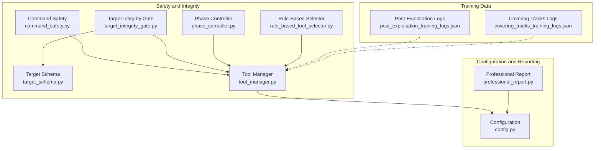
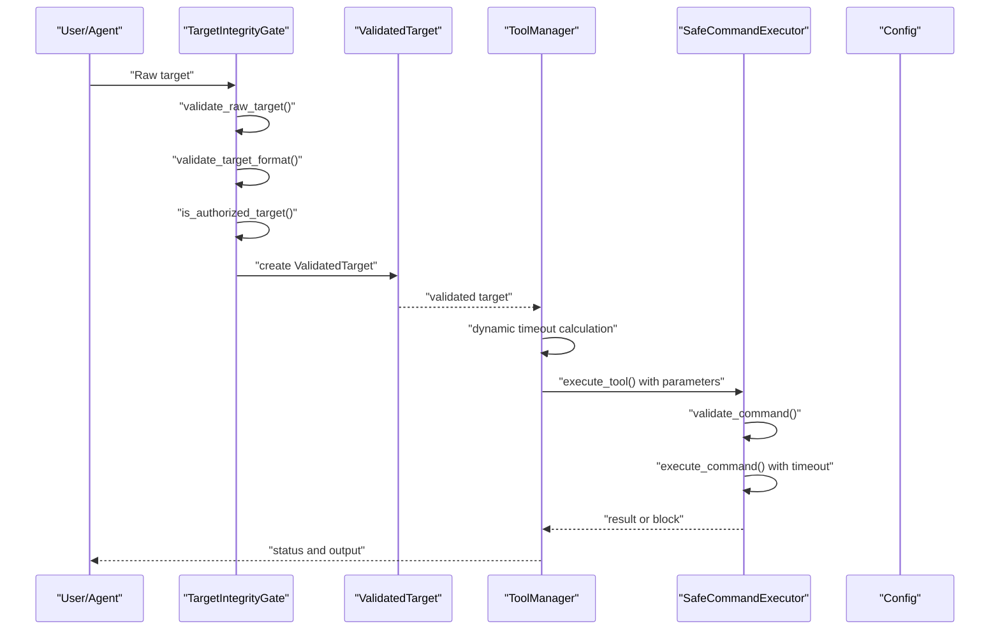
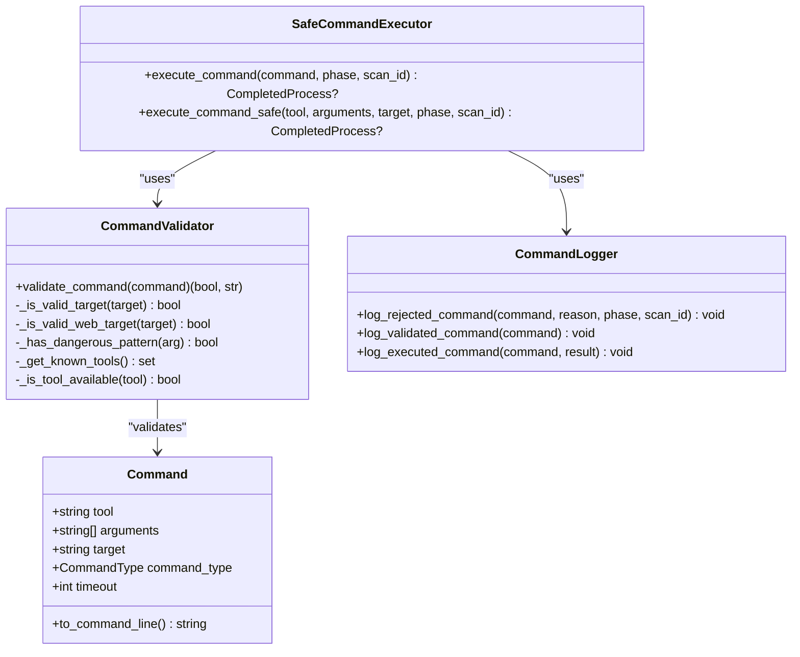
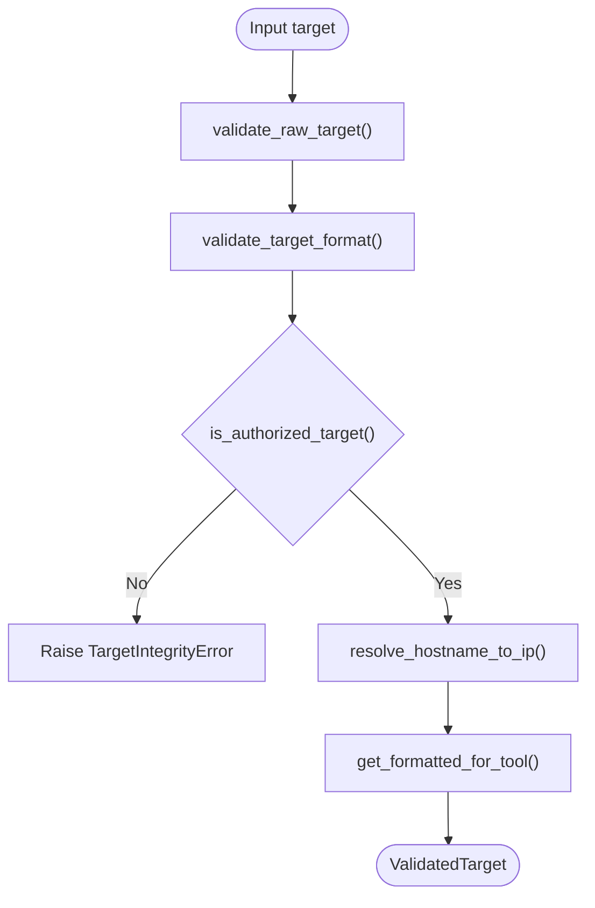
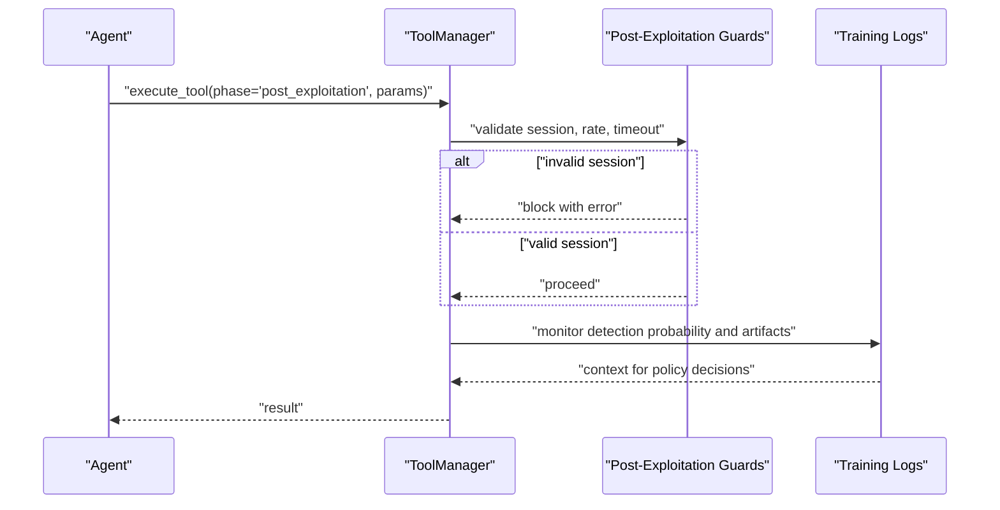
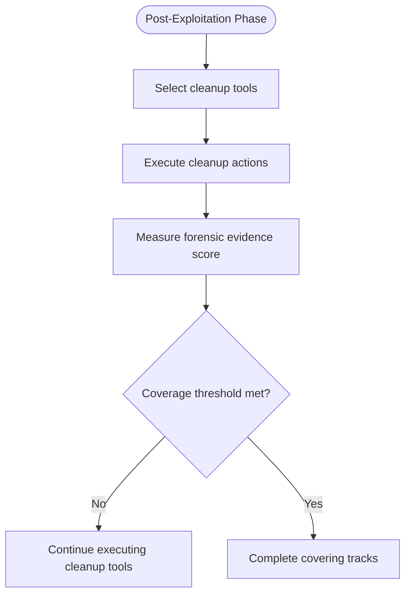
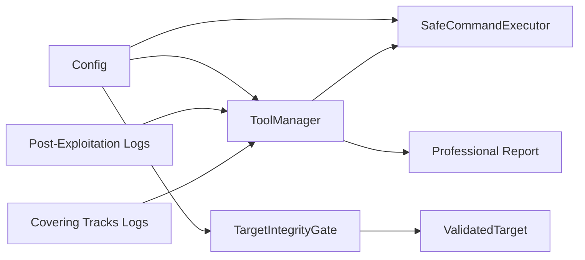

# Security and Safety Systems

<cite>
**Referenced Files in This Document**
- [command_safety.py](file://backend/inference/command_safety.py)
- [target_integrity_gate.py](file://backend/inference/target_integrity_gate.py)
- [target_schema.py](file://backend/inference/target_schema.py)
- [tool_manager.py](file://backend/inference/tool_manager.py)
- [config.py](file://backend/config.py)
- [test_post_exploitation_safety.py](file://backend/testing/test_post_exploitation_safety.py)
- [post_exploitation_training_logs.json](file://backend/training/data/phase_training_logs/post_exploitation_training_logs.json)
- [covering_tracks_training_logs.json](file://backend/training/data/phase_training_logs/covering_tracks_training_logs.json)
- [phase_controller.py](file://backend/inference/phase_controller.py)
- [rule_based_tool_selector.py](file://backend/inference/rule_based_tool_selector.py)
- [professional_report.py](file://backend/reporting/professional_report.py)
</cite>

## Table of Contents
1. [Introduction](#introduction)
2. [Project Structure](#project-structure)
3. [Core Components](#core-components)
4. [Architecture Overview](#architecture-overview)
5. [Detailed Component Analysis](#detailed-component-analysis)
6. [Dependency Analysis](#dependency-analysis)
7. [Performance Considerations](#performance-considerations)
8. [Troubleshooting Guide](#troubleshooting-guide)
9. [Conclusion](#conclusion)
10. [Appendices](#appendices)

## Introduction
This document details the security and safety systems in Optimus, focusing on three pillars:
- Command safety controls that validate and sanitize input commands before execution
- Target integrity gates that prevent destructive operations by enforcing authorized targets and safe formats
- Post-exploitation safety mechanisms that implement covering tracks and responsible disclosure practices

It explains how timeouts and resource limits are enforced, how input validation systems operate, and how these components collaborate to maintain system integrity during autonomous operations. Practical examples demonstrate configuration, risk assessment, and responsible disclosure alignment.

## Project Structure
The safety and integrity controls span several modules:
- Command safety: structured command validation, argument sanitization, and safe execution
- Target integrity: target normalization, authorization checks, and safe rendering per tool
- Post-exploitation safety: session gating, rate limiting, and timeout enforcement
- Supporting infrastructure: configuration, training logs, and reporting

**Diagram sources**
- [command_safety.py](file://backend/inference/command_safety.py#L1-L319)
- [target_integrity_gate.py](file://backend/inference/target_integrity_gate.py#L1-L361)
- [target_schema.py](file://backend/inference/target_schema.py#L1-L81)
- [tool_manager.py](file://backend/inference/tool_manager.py#L1-L1480)
- [config.py](file://backend/config.py#L1-L115)
- [phase_controller.py](file://backend/inference/phase_controller.py#L290-L326)
- [rule_based_tool_selector.py](file://backend/inference/rule_based_tool_selector.py#L378-L416)
- [post_exploitation_training_logs.json](file://backend/training/data/phase_training_logs/post_exploitation_training_logs.json#L1-L800)
- [covering_tracks_training_logs.json](file://backend/training/data/phase_training_logs/covering_tracks_training_logs.json#L93-L324)
- [professional_report.py](file://backend/reporting/professional_report.py#L1-L200)

**Section sources**
- [command_safety.py](file://backend/inference/command_safety.py#L1-L319)
- [target_integrity_gate.py](file://backend/inference/target_integrity_gate.py#L1-L361)
- [target_schema.py](file://backend/inference/target_schema.py#L1-L81)
- [tool_manager.py](file://backend/inference/tool_manager.py#L1-L1480)
- [config.py](file://backend/config.py#L1-L115)
- [phase_controller.py](file://backend/inference/phase_controller.py#L290-L326)
- [rule_based_tool_selector.py](file://backend/inference/rule_based_tool_selector.py#L378-L416)
- [post_exploitation_training_logs.json](file://backend/training/data/phase_training_logs/post_exploitation_training_logs.json#L1-L800)
- [covering_tracks_training_logs.json](file://backend/training/data/phase_training_logs/covering_tracks_training_logs.json#L93-L324)
- [professional_report.py](file://backend/reporting/professional_report.py#L1-L200)

## Core Components
- Command Safety: Structured command schema, validator, logger, and safe executor with timeout enforcement and SSH/local execution paths
- Target Integrity Gate: Raw target validation, authorization checks, hostname/IP resolution, and tool-specific target formatting
- Post-Exploitation Safety: Session gating, rate limiting, and timeout restrictions for post-exploitation phases
- Configuration: Centralized timeouts, phase definitions, and tool catalogs
- Training Data: Behavioral logs for post-exploitation and covering tracks to inform safety policies
- Reporting: Professional report generator supporting responsible disclosure and remediation guidance

**Section sources**
- [command_safety.py](file://backend/inference/command_safety.py#L18-L319)
- [target_integrity_gate.py](file://backend/inference/target_integrity_gate.py#L19-L361)
- [tool_manager.py](file://backend/inference/tool_manager.py#L910-L955)
- [config.py](file://backend/config.py#L78-L115)
- [post_exploitation_training_logs.json](file://backend/training/data/phase_training_logs/post_exploitation_training_logs.json#L1-L800)
- [covering_tracks_training_logs.json](file://backend/training/data/phase_training_logs/covering_tracks_training_logs.json#L93-L324)
- [professional_report.py](file://backend/reporting/professional_report.py#L73-L200)

## Architecture Overview
The safety architecture enforces a layered defense:
- Input normalization and validation occur early (target integrity gate)
- Command construction and execution are mediated by a safe executor with timeouts and logging
- Post-exploitation safety adds session, rate, and timeout controls
- Reporting supports responsible disclosure with remediation guidance

**Diagram sources**
- [target_integrity_gate.py](file://backend/inference/target_integrity_gate.py#L62-L326)
- [target_schema.py](file://backend/inference/target_schema.py#L8-L81)
- [tool_manager.py](file://backend/inference/tool_manager.py#L910-L955)
- [command_safety.py](file://backend/inference/command_safety.py#L240-L315)
- [config.py](file://backend/config.py#L19-L24)

## Detailed Component Analysis

### Command Safety Controls
Command safety separates LLM suggestions from execution through:
- Structured command schema with tool, arguments, target, optional type, and timeout
- Validator that checks tool availability, target validity, and absence of dangerous patterns
- Safe executor that logs rejections and executions, and enforces timeouts for both local and SSH execution

Key behaviors:
- Argument sanitization prevents command chaining and injection
- Target deduplication avoids double injection in constructed command lines
- Timeout enforcement via subprocess and SSH clients
- Logging for auditability and incident response

**Diagram sources**
- [command_safety.py](file://backend/inference/command_safety.py#L27-L319)

**Section sources**
- [command_safety.py](file://backend/inference/command_safety.py#L18-L319)

### Target Integrity Gate
The target integrity gate ensures only authorized and properly formatted targets are used:
- Raw target validation strips whitespace and rejects injection attempts
- Target format validation parses scheme/host/port and normalizes to a unified schema
- Authorization checks against authorized and blacklisted patterns and private networks
- Hostname resolution to IP with error handling
- Tool-specific target formatting for CLI and web tools

**Diagram sources**
- [target_integrity_gate.py](file://backend/inference/target_integrity_gate.py#L62-L349)
- [target_schema.py](file://backend/inference/target_schema.py#L56-L81)

**Section sources**
- [target_integrity_gate.py](file://backend/inference/target_integrity_gate.py#L19-L361)
- [target_schema.py](file://backend/inference/target_schema.py#L8-L81)

### Post-Exploitation Safety Mechanisms
Post-exploitation safety integrates session gating, rate limiting, and timeout enforcement:
- Session gating requires a valid session identifier for post-exploitation tools
- Rate limiting blocks rapid-fire tool execution to reduce risk
- Timeout restrictions cap execution duration for post-exploitation tasks
- Training logs inform policies around detection probability, artifacts, and cleanup completeness

**Diagram sources**
- [test_post_exploitation_safety.py](file://backend/testing/test_post_exploitation_safety.py#L11-L144)
- [tool_manager.py](file://backend/inference/tool_manager.py#L910-L955)
- [post_exploitation_training_logs.json](file://backend/training/data/phase_training_logs/post_exploitation_training_logs.json#L1-L800)
- [covering_tracks_training_logs.json](file://backend/training/data/phase_training_logs/covering_tracks_training_logs.json#L93-L324)

**Section sources**
- [test_post_exploitation_safety.py](file://backend/testing/test_post_exploitation_safety.py#L1-L189)
- [tool_manager.py](file://backend/inference/tool_manager.py#L910-L955)
- [post_exploitation_training_logs.json](file://backend/training/data/phase_training_logs/post_exploitation_training_logs.json#L1-L800)
- [covering_tracks_training_logs.json](file://backend/training/data/phase_training_logs/covering_tracks_training_logs.json#L93-L324)

### Covering Tracks and Responsible Disclosure
Covering tracks focuses on minimizing forensic footprint:
- Cleanup tools (e.g., clear logs, timestomp, shred) are prioritized
- Completion criteria include coverage thresholds and number of tools executed
- Responsible disclosure is supported by structured reporting with remediation guidance

**Diagram sources**
- [rule_based_tool_selector.py](file://backend/inference/rule_based_tool_selector.py#L402-L416)
- [phase_controller.py](file://backend/inference/phase_controller.py#L303-L321)
- [covering_tracks_training_logs.json](file://backend/training/data/phase_training_logs/covering_tracks_training_logs.json#L93-L324)
- [professional_report.py](file://backend/reporting/professional_report.py#L73-L200)

**Section sources**
- [rule_based_tool_selector.py](file://backend/inference/rule_based_tool_selector.py#L402-L416)
- [phase_controller.py](file://backend/inference/phase_controller.py#L303-L321)
- [covering_tracks_training_logs.json](file://backend/training/data/phase_training_logs/covering_tracks_training_logs.json#L93-L324)
- [professional_report.py](file://backend/reporting/professional_report.py#L73-L200)

## Dependency Analysis
Safety components depend on configuration and training data:
- Configuration defines timeouts and phase/tool catalogs
- Training logs guide policy decisions for detection probability and cleanup effectiveness
- Tool manager orchestrates dynamic timeout adjustments and safety checks

**Diagram sources**
- [config.py](file://backend/config.py#L19-L115)
- [tool_manager.py](file://backend/inference/tool_manager.py#L910-L955)
- [command_safety.py](file://backend/inference/command_safety.py#L240-L315)
- [target_integrity_gate.py](file://backend/inference/target_integrity_gate.py#L19-L361)
- [target_schema.py](file://backend/inference/target_schema.py#L8-L81)
- [post_exploitation_training_logs.json](file://backend/training/data/phase_training_logs/post_exploitation_training_logs.json#L1-L800)
- [covering_tracks_training_logs.json](file://backend/training/data/phase_training_logs/covering_tracks_training_logs.json#L93-L324)
- [professional_report.py](file://backend/reporting/professional_report.py#L73-L200)

**Section sources**
- [config.py](file://backend/config.py#L19-L115)
- [tool_manager.py](file://backend/inference/tool_manager.py#L910-L955)
- [command_safety.py](file://backend/inference/command_safety.py#L240-L315)
- [target_integrity_gate.py](file://backend/inference/target_integrity_gate.py#L19-L361)
- [target_schema.py](file://backend/inference/target_schema.py#L8-L81)
- [post_exploitation_training_logs.json](file://backend/training/data/phase_training_logs/post_exploitation_training_logs.json#L1-L800)
- [covering_tracks_training_logs.json](file://backend/training/data/phase_training_logs/covering_tracks_training_logs.json#L93-L324)
- [professional_report.py](file://backend/reporting/professional_report.py#L73-L200)

## Performance Considerations
- Timeouts: Centralized via configuration and dynamically adjusted by tool category and coverage/time remaining
- Resource limiting: Enforced by timeouts and rate limiting in post-exploitation
- Validation overhead: Target integrity gate and command validator add minimal cost compared to tool execution
- Logging: Structured logs support auditing without significant runtime overhead

[No sources needed since this section provides general guidance]

## Troubleshooting Guide
Common issues and resolutions:
- Command rejected due to dangerous patterns: Review arguments for injection indicators and adjust tool parameters
- Target blocked by integrity gate: Verify target format and authorization; ensure hostname resolves to private or authorized networks
- Post-exploitation blocked: Confirm valid session ID, reduce execution frequency to avoid rate limits, and lower timeout values
- Excessive execution time: Adjust dynamic timeout parameters and tool categories in configuration

**Section sources**
- [command_safety.py](file://backend/inference/command_safety.py#L102-L133)
- [target_integrity_gate.py](file://backend/inference/target_integrity_gate.py#L102-L149)
- [test_post_exploitation_safety.py](file://backend/testing/test_post_exploitation_safety.py#L11-L144)
- [tool_manager.py](file://backend/inference/tool_manager.py#L910-L955)

## Conclusion
Optimus employs a layered safety architecture combining command validation, target integrity, and post-exploitation controls. Together with dynamic timeouts, rate limiting, and responsible disclosure reporting, these mechanisms preserve system integrity and minimize unintended impact during autonomous operations.

[No sources needed since this section summarizes without analyzing specific files]

## Appendices

### Practical Examples

- Configure timeouts and limits
  - Set command timeouts and connection parameters in configuration
  - Example paths:
    - [config.py](file://backend/config.py#L19-L24)
    - [tool_manager.py](file://backend/inference/tool_manager.py#L910-L955)

- Validate and execute a command safely
  - Build a structured command and pass through the safe executor
  - Example paths:
    - [command_safety.py](file://backend/inference/command_safety.py#L27-L319)

- Enforce target integrity
  - Normalize and authorize targets before tool execution
  - Example paths:
    - [target_integrity_gate.py](file://backend/inference/target_integrity_gate.py#L62-L349)
    - [target_schema.py](file://backend/inference/target_schema.py#L56-L81)

- Post-exploitation safety configuration
  - Enforce session gating, rate limiting, and timeout restrictions
  - Example paths:
    - [test_post_exploitation_safety.py](file://backend/testing/test_post_exploitation_safety.py#L11-L144)

- Responsible disclosure practices
  - Use professional report generator for remediation guidance
  - Example paths:
    - [professional_report.py](file://backend/reporting/professional_report.py#L73-L200)

### Risk Assessment Procedures
- Evaluate detection probability and forensic evidence from training logs
  - Example paths:
    - [post_exploitation_training_logs.json](file://backend/training/data/phase_training_logs/post_exploitation_training_logs.json#L1-L800)
    - [covering_tracks_training_logs.json](file://backend/training/data/phase_training_logs/covering_tracks_training_logs.json#L93-L324)

- Define acceptable risk thresholds for post-exploitation and covering tracks
  - Use completion criteria and coverage metrics
  - Example paths:
    - [phase_controller.py](file://backend/inference/phase_controller.py#L303-L321)
    - [rule_based_tool_selector.py](file://backend/inference/rule_based_tool_selector.py#L402-L416)