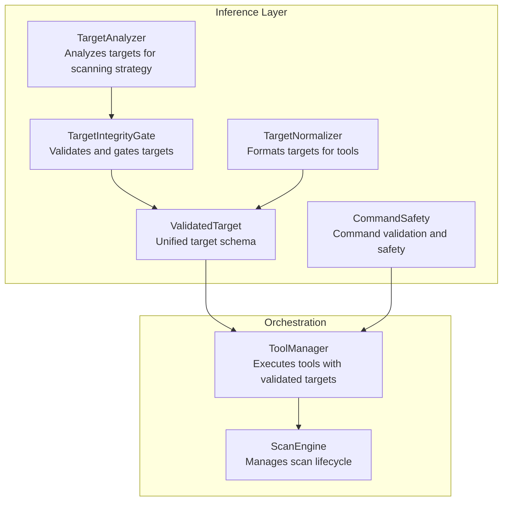
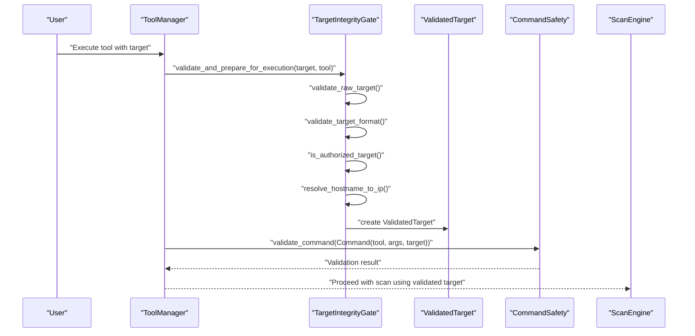
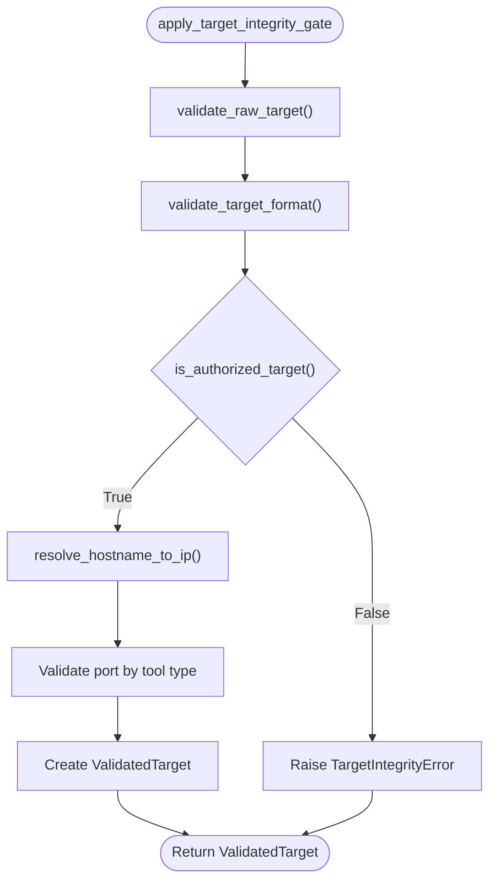
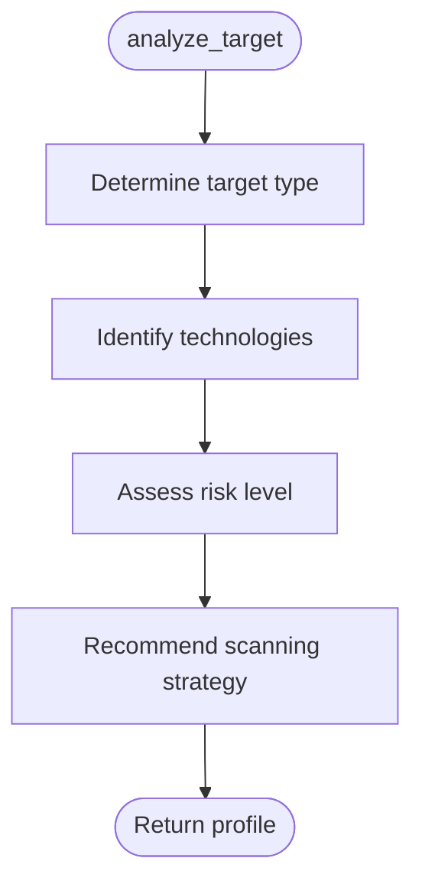
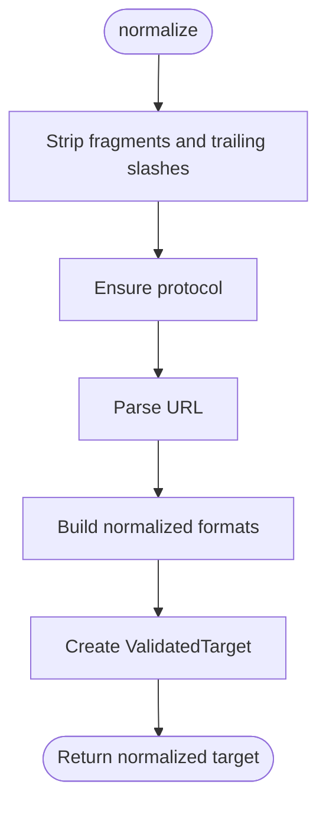
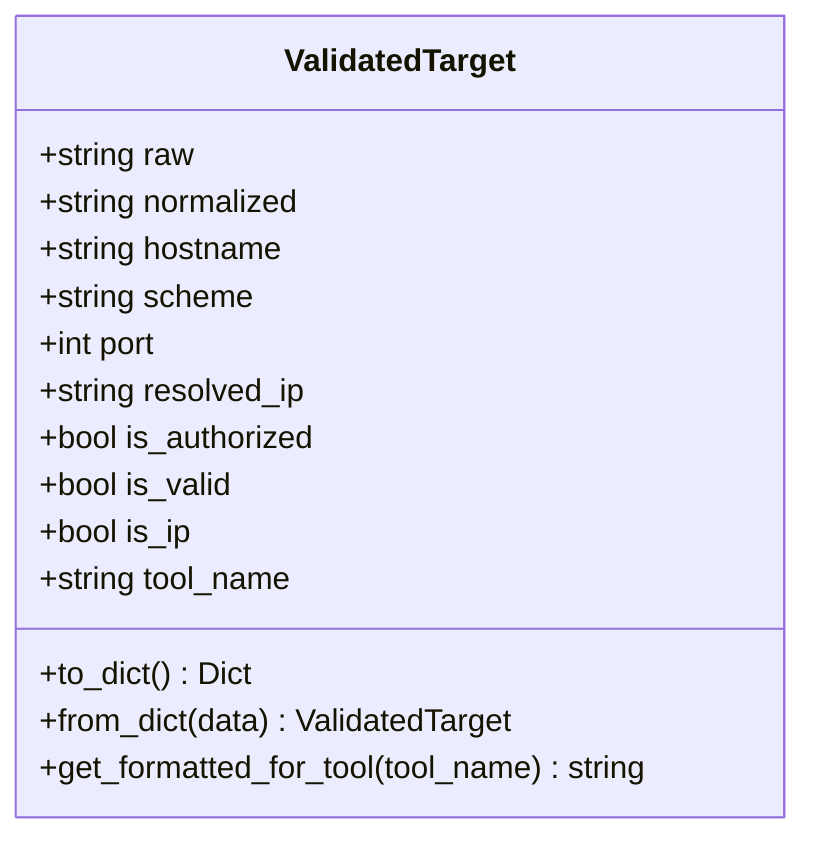
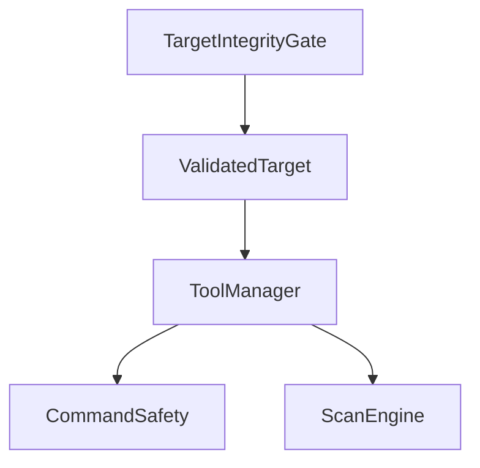
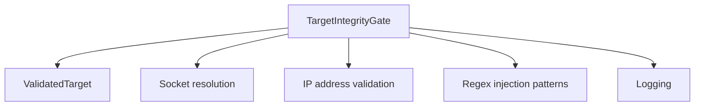

# Target Integrity Gate

<cite>
**Referenced Files in This Document**
- [target_integrity_gate.py](file://backend/inference/target_integrity_gate.py)
- [target_analyzer.py](file://backend/inference/target_analyzer.py)
- [target_normalizer.py](file://backend/inference/target_normalizer.py)
- [target_schema.py](file://backend/inference/target_schema.py)
- [command_safety.py](file://backend/inference/command_safety.py)
- [tool_manager.py](file://backend/inference/tool_manager.py)
- [scan_engine.py](file://backend/core/scan_engine.py)
- [config.py](file://backend/config.py)
</cite>

## Table of Contents
1. [Introduction](#introduction)
2. [Project Structure](#project-structure)
3. [Core Components](#core-components)
4. [Architecture Overview](#architecture-overview)
5. [Detailed Component Analysis](#detailed-component-analysis)
6. [Dependency Analysis](#dependency-analysis)
7. [Performance Considerations](#performance-considerations)
8. [Troubleshooting Guide](#troubleshooting-guide)
9. [Conclusion](#conclusion)
10. [Appendices](#appendices)

## Introduction
This document describes the Target Integrity Gate system that protects against destructive operations and maintains system stability by validating and controlling target processing. It explains the target validation mechanisms that prevent unauthorized or potentially harmful targets from being processed, documents the target analyzer implementation that assesses target characteristics and enforces policy compliance, and details integration with external validation systems. The document also covers configuration options for whitelisting, blacklisting, and custom validation rules, and demonstrates how the system’s decisions contribute to the overall security posture.

## Project Structure
The Target Integrity Gate resides in the backend inference layer and collaborates with normalization, schema, safety, and orchestration components. The following diagram shows the primary modules involved in target integrity and validation.

**Diagram sources**
- [target_integrity_gate.py](file://backend/inference/target_integrity_gate.py#L1-L366)
- [target_analyzer.py](file://backend/inference/target_analyzer.py#L1-L81)
- [target_normalizer.py](file://backend/inference/target_normalizer.py#L1-L210)
- [target_schema.py](file://backend/inference/target_schema.py#L1-L81)
- [command_safety.py](file://backend/inference/command_safety.py#L1-L362)
- [tool_manager.py](file://backend/inference/tool_manager.py#L360-L380)
- [scan_engine.py](file://backend/core/scan_engine.py#L1-L554)

**Section sources**
- [target_integrity_gate.py](file://backend/inference/target_integrity_gate.py#L1-L366)
- [target_analyzer.py](file://backend/inference/target_analyzer.py#L1-L81)
- [target_normalizer.py](file://backend/inference/target_normalizer.py#L1-L210)
- [target_schema.py](file://backend/inference/target_schema.py#L1-L81)
- [command_safety.py](file://backend/inference/command_safety.py#L1-L362)
- [tool_manager.py](file://backend/inference/tool_manager.py#L360-L380)
- [scan_engine.py](file://backend/core/scan_engine.py#L1-L554)

## Core Components
- TargetIntegrityGate: Validates raw inputs, formats targets, checks authorization, resolves hostnames to IPs, and produces a unified ValidatedTarget object.
- TargetAnalyzer: Builds a target profile for scanning strategy selection.
- TargetNormalizer: Produces normalized target formats and tool-specific renderings.
- ValidatedTarget: Unified schema for consistent target handling across the pipeline.
- CommandSafety: Validates commands and arguments to prevent injection and unsafe execution.
- ToolManager: Integrates target integrity validation into tool execution.
- ScanEngine: Orchestrates scans and invokes target integrity validation during initialization.

**Section sources**
- [target_integrity_gate.py](file://backend/inference/target_integrity_gate.py#L19-L366)
- [target_analyzer.py](file://backend/inference/target_analyzer.py#L9-L81)
- [target_normalizer.py](file://backend/inference/target_normalizer.py#L13-L210)
- [target_schema.py](file://backend/inference/target_schema.py#L8-L81)
- [command_safety.py](file://backend/inference/command_safety.py#L18-L362)
- [tool_manager.py](file://backend/inference/tool_manager.py#L360-L380)
- [scan_engine.py](file://backend/core/scan_engine.py#L413-L431)

## Architecture Overview
The Target Integrity Gate sits at the boundary between user input and tool execution. It performs multi-stage validation and normalization, then passes a validated target object downstream to the tool manager and orchestrator.

**Diagram sources**
- [tool_manager.py](file://backend/inference/tool_manager.py#L360-L380)
- [target_integrity_gate.py](file://backend/inference/target_integrity_gate.py#L267-L354)
- [target_schema.py](file://backend/inference/target_schema.py#L8-L81)
- [command_safety.py](file://backend/inference/command_safety.py#L145-L175)
- [scan_engine.py](file://backend/core/scan_engine.py#L413-L431)

## Detailed Component Analysis

### TargetIntegrityGate
The TargetIntegrityGate enforces strict validation and authorization policies to protect against unauthorized or potentially harmful targets. It performs:
- Raw target validation: Ensures non-empty strings and blocks common command injection patterns.
- Target format validation: Parses and normalizes URLs, hostnames, and ports; sets defaults for missing components.
- Authorization checks: Whitelists local/private targets and blacklists known public domains; resolves hostnames to private IP ranges.
- Port validation: Warns on non-standard ports for specific tool categories.
- Unified output: Produces a ValidatedTarget object for downstream use.

Key behaviors and examples:
- Injection prevention: Rejects targets containing command chaining or substitution patterns.
- Scope enforcement: Only allows local, private, or explicitly authorized targets (e.g., vulnerable lab containers and domains).
- Boundary protection: Resolves hostnames to IPs and verifies private or loopback ranges.
- Tool-aware normalization: Adjusts port expectations based on tool category.

**Diagram sources**
- [target_integrity_gate.py](file://backend/inference/target_integrity_gate.py#L67-L331)

**Section sources**
- [target_integrity_gate.py](file://backend/inference/target_integrity_gate.py#L19-L366)

### TargetAnalyzer
The TargetAnalyzer builds a lightweight profile to guide scanning strategy:
- Determines target type (web, network, unknown) based on URL patterns.
- Identifies likely technologies (e.g., PHP, ASP.NET, Java, Python) from URL hints.
- Assesses risk level (moderate for training contexts).
- Recommends scanning strategy (web application, network scanning, or comprehensive).

**Diagram sources**
- [target_analyzer.py](file://backend/inference/target_analyzer.py#L12-L79)

**Section sources**
- [target_analyzer.py](file://backend/inference/target_analyzer.py#L9-L81)

### TargetNormalizer
The TargetNormalizer provides consistent target formats for different tools:
- Normalizes URLs, strips fragments and trailing slashes, ensures protocol presence, and sets default ports.
- Produces a unified ValidatedTarget when possible.
- Formats targets for specific tools: hostname-only for CLI network tools, full URL for web tools, and injectable endpoints for injection tools.

**Diagram sources**
- [target_normalizer.py](file://backend/inference/target_normalizer.py#L37-L113)

**Section sources**
- [target_normalizer.py](file://backend/inference/target_normalizer.py#L13-L210)

### ValidatedTarget Schema
ValidatedTarget unifies target metadata and provides tool-specific formatting:
- Fields: raw, normalized, hostname, scheme, port, resolved_ip, is_authorized, is_valid, is_ip, tool_name.
- Methods: to_dict/from_dict for serialization, get_formatted_for_tool for tool-specific rendering.

**Diagram sources**
- [target_schema.py](file://backend/inference/target_schema.py#L8-L81)

**Section sources**
- [target_schema.py](file://backend/inference/target_schema.py#L8-L81)

### Integration with External Validation Systems
- CommandSafety validates commands and arguments to prevent injection and unsafe execution, complementing target integrity by ensuring safe command construction and execution.
- ToolManager integrates target integrity validation into tool execution, falling back to normalization when integrity gate is unavailable.
- ScanEngine initializes scans and applies target integrity validation during scan setup.

**Diagram sources**
- [command_safety.py](file://backend/inference/command_safety.py#L145-L175)
- [tool_manager.py](file://backend/inference/tool_manager.py#L360-L380)
- [scan_engine.py](file://backend/core/scan_engine.py#L413-L431)

**Section sources**
- [command_safety.py](file://backend/inference/command_safety.py#L1-L362)
- [tool_manager.py](file://backend/inference/tool_manager.py#L360-L380)
- [scan_engine.py](file://backend/core/scan_engine.py#L413-L431)

## Dependency Analysis
The Target Integrity Gate depends on:
- TargetNormalization for URL parsing and default port assignment.
- ValidatedTarget for a unified representation across the pipeline.
- Socket and IP address libraries for hostname resolution and private IP detection.
- Logging for audit trails and warnings.

**Diagram sources**
- [target_integrity_gate.py](file://backend/inference/target_integrity_gate.py#L4-L12)
- [target_schema.py](file://backend/inference/target_schema.py#L1-L81)

**Section sources**
- [target_integrity_gate.py](file://backend/inference/target_integrity_gate.py#L1-L366)
- [target_schema.py](file://backend/inference/target_schema.py#L1-L81)

## Performance Considerations
- DNS resolution: Hostname-to-IP resolution adds latency; cache results where feasible in higher-level orchestrators.
- Pattern matching: Regex-based injection detection is linear in target length; keep patterns minimal and targeted.
- Port validation: Tool-aware port checks are constant-time lookups; maintain compact lists for performance.
- Logging overhead: Excessive logging can slow validation; tune log levels in production.

## Troubleshooting Guide
Common issues and resolutions:
- Unauthorized target errors: Ensure the target matches authorized patterns or resolves to a private IP. Review the authorized and blacklisted lists.
- DNS resolution failures: Verify network connectivity and DNS configuration; the gate raises explicit errors on resolution failure.
- Non-standard ports: Adjust tool configuration to use standard ports for the selected tool category.
- Command safety violations: Review command arguments for dangerous patterns; CommandSafety blocks injection attempts.

Operational tips:
- Use the unified ValidatedTarget to inspect normalized and resolved values for debugging.
- Enable debug logs to trace validation steps and decisions.
- Validate targets early in the pipeline to fail fast and reduce wasted computation.

**Section sources**
- [target_integrity_gate.py](file://backend/inference/target_integrity_gate.py#L156-L176)
- [command_safety.py](file://backend/inference/command_safety.py#L232-L256)

## Conclusion
The Target Integrity Gate provides a robust, multi-layered validation and authorization mechanism that prevents unauthorized or potentially harmful targets from entering the scanning pipeline. By combining raw input sanitization, format validation, authorization checks, and tool-aware normalization, it ensures boundary protection and policy compliance. Its integration with the unified schema and safety components creates a cohesive system that enhances overall security posture while enabling flexible scanning strategies.

## Appendices

### Configuration Options
- Authorized targets: Configure patterns for local/private environments and vulnerable labs.
- Blacklisted targets: Define domains or patterns to block.
- Network scanning ports: Standard ports for network scanners.
- Web scanning ports: Standard ports for web scanners.

These lists are maintained within the TargetIntegrityGate initialization and can be extended or adjusted to match organizational policies.

**Section sources**
- [target_integrity_gate.py](file://backend/inference/target_integrity_gate.py#L25-L66)

### Example Decision Scenarios
- Unsafe target rejected: A public domain not in the authorized list triggers an unauthorized target error.
- Scope validation: A hostname resolving to a public IP is rejected; a private IP or localhost is accepted.
- Boundary protection: A target with non-standard ports for a given tool category triggers a warning.
- Tool-specific formatting: Injection tools receive a URL with testable parameters; network tools receive a hostname or IP.

**Section sources**
- [target_integrity_gate.py](file://backend/inference/target_integrity_gate.py#L107-L154)
- [target_integrity_gate.py](file://backend/inference/target_integrity_gate.py#L308-L313)
- [target_normalizer.py](file://backend/inference/target_normalizer.py#L114-L166)