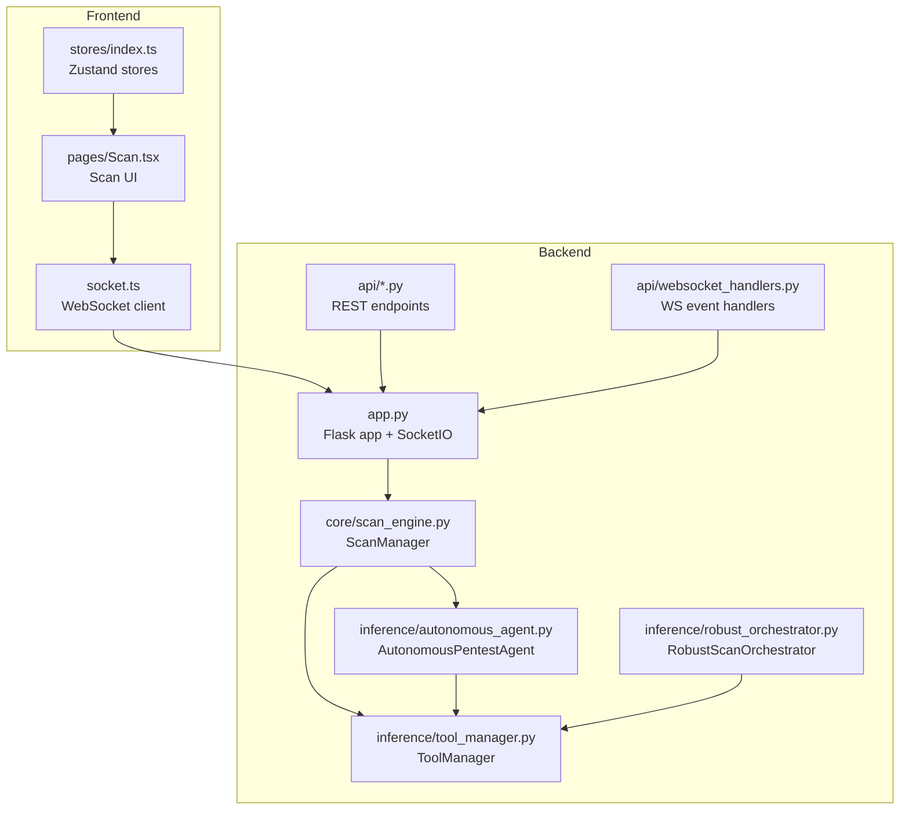
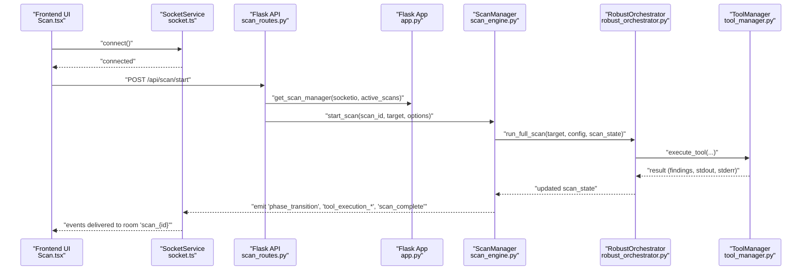
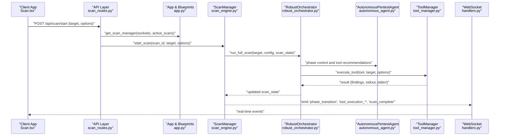
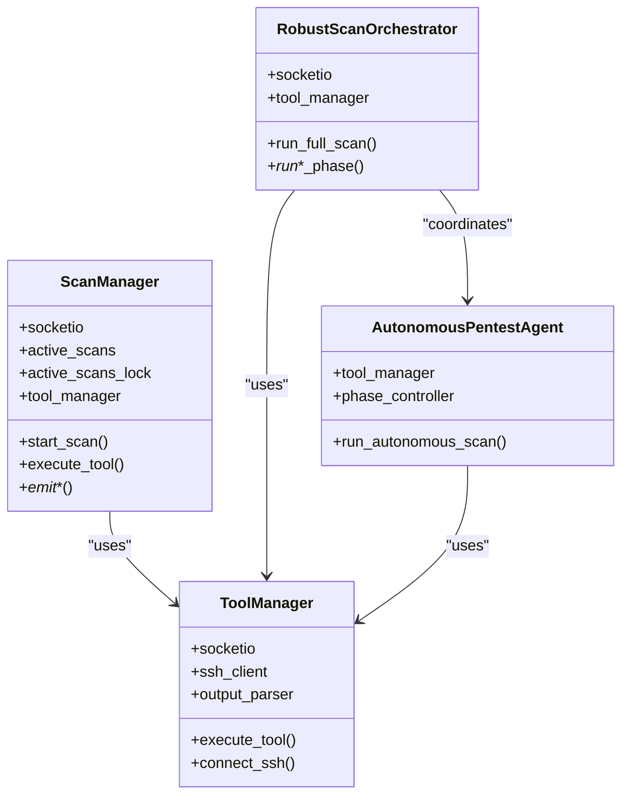
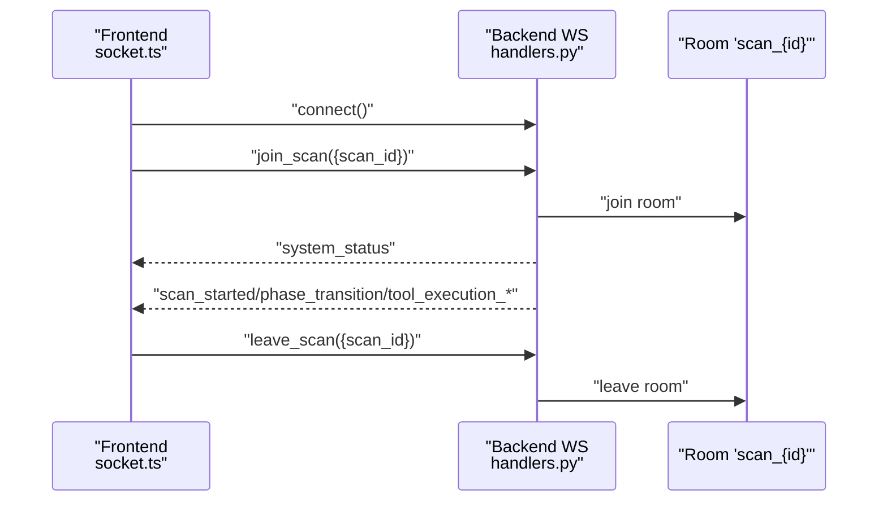
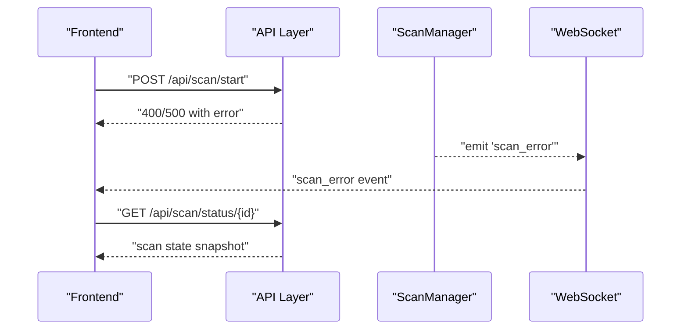
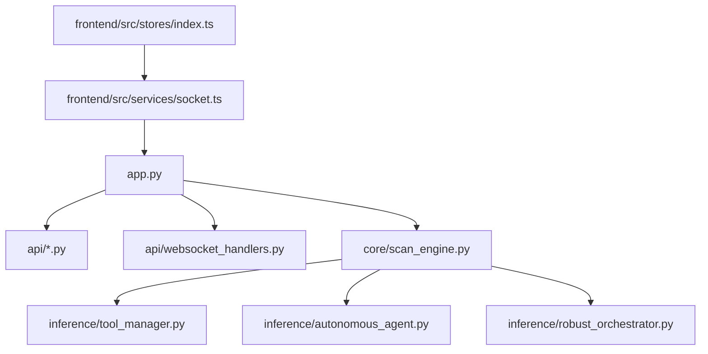

# Component Relationships and Data Flows

<cite>
**Referenced Files in This Document**
- [app.py](file://backend/app.py)
- [routes.py](file://backend/api/routes.py)
- [scan_routes.py](file://backend/api/scan_routes.py)
- [websocket_handlers.py](file://backend/api/websocket_handlers.py)
- [handlers.py](file://backend/websocket/handlers.py)
- [scan_engine.py](file://backend/core/scan_engine.py)
- [tool_manager.py](file://backend/inference/tool_manager.py)
- [autonomous_agent.py](file://backend/inference/autonomous_agent.py)
- [robust_orchestrator.py](file://backend/inference/robust_orchestrator.py)
- [socket.ts](file://frontend/src/services/socket.ts)
- [index.ts](file://frontend/src/stores/index.ts)
- [Scan.tsx](file://frontend/src/pages/Scan.tsx)
</cite>

## Table of Contents
1. [Introduction](#introduction)
2. [Project Structure](#project-structure)
3. [Core Components](#core-components)
4. [Architecture Overview](#architecture-overview)
5. [Detailed Component Analysis](#detailed-component-analysis)
6. [Dependency Analysis](#dependency-analysis)
7. [Performance Considerations](#performance-considerations)
8. [Troubleshooting Guide](#troubleshooting-guide)
9. [Conclusion](#conclusion)

## Introduction
This document explains the component relationships and data flow patterns in Optimus, focusing on how the React frontend communicates with the Flask backend over WebSocket to coordinate autonomous penetration tests. It details the lifecycle from scan initiation through reconnaissance, scanning, exploitation, and reporting, and clarifies the roles of ScanManager, ToolManager, and Intelligence modules. Thread safety mechanisms using locks are documented, along with real-time communication patterns and error propagation.

## Project Structure
Optimus follows a layered architecture:
- Frontend (React) provides the user interface and real-time WebSocket subscriptions
- Backend (Flask) exposes REST APIs and WebSocket endpoints
- Core orchestration (ScanManager) coordinates scanning threads and emits real-time events
- Inference modules (ToolManager, AutonomousPentestAgent, RobustScanOrchestrator) implement scanning logic and tool execution
- Intelligence modules provide higher-level reasoning and memory

**Diagram sources**
- [app.py](file://backend/app.py#L120-L163)
- [routes.py](file://backend/api/routes.py#L8-L54)
- [websocket_handlers.py](file://backend/api/websocket_handlers.py#L9-L115)
- [scan_engine.py](file://backend/core/scan_engine.py#L26-L81)
- [tool_manager.py](file://backend/inference/tool_manager.py#L49-L130)
- [autonomous_agent.py](file://backend/inference/autonomous_agent.py#L50-L132)
- [robust_orchestrator.py](file://backend/inference/robust_orchestrator.py#L129-L156)
- [socket.ts](file://frontend/src/services/socket.ts#L64-L106)

**Section sources**
- [app.py](file://backend/app.py#L120-L163)
- [routes.py](file://backend/api/routes.py#L8-L54)
- [websocket_handlers.py](file://backend/api/websocket_handlers.py#L9-L115)
- [scan_engine.py](file://backend/core/scan_engine.py#L26-L81)
- [tool_manager.py](file://backend/inference/tool_manager.py#L49-L130)
- [autonomous_agent.py](file://backend/inference/autonomous_agent.py#L50-L132)
- [robust_orchestrator.py](file://backend/inference/robust_orchestrator.py#L129-L156)
- [socket.ts](file://frontend/src/services/socket.ts#L64-L106)

## Core Components
- ScanManager: Central coordinator that initializes ToolManager and agents, manages scan threads, and emits real-time events via SocketIO. It maintains shared state in active_scans and uses active_scans_lock for thread safety.
- ToolManager: Executes tools against a Kali VM via SSH, streams output in real time, parses findings, and integrates with hybrid tool system and evolving parsers.
- AutonomousPentestAgent: Orchestrates scanning phases, selects tools, learns from executions, and coordinates with ToolManager and optional intelligence modules.
- RobustScanOrchestrator: Ensures all phases execute with minimum tool coverage, explicit exploitation, and comprehensive reporting.
- Frontend Stores and SocketService: Manage UI state and WebSocket subscriptions for real-time updates.

Key thread safety:
- active_scans_lock protects concurrent access to the shared scan registry.
- Background threads guard critical sections when updating scan state.

**Section sources**
- [scan_engine.py](file://backend/core/scan_engine.py#L26-L81)
- [scan_engine.py](file://backend/core/scan_engine.py#L154-L169)
- [tool_manager.py](file://backend/inference/tool_manager.py#L49-L130)
- [autonomous_agent.py](file://backend/inference/autonomous_agent.py#L50-L132)
- [robust_orchestrator.py](file://backend/inference/robust_orchestrator.py#L129-L156)
- [socket.ts](file://frontend/src/services/socket.ts#L64-L106)

## Architecture Overview
The system uses Flask with SocketIO for real-time bidirectional communication. REST endpoints create and control scans; WebSocket rooms deliver live updates to subscribed clients.

**Diagram sources**
- [scan_routes.py](file://backend/api/scan_routes.py#L40-L140)
- [app.py](file://backend/app.py#L252-L274)
- [scan_engine.py](file://backend/core/scan_engine.py#L82-L148)
- [robust_orchestrator.py](file://backend/inference/robust_orchestrator.py#L271-L411)
- [tool_manager.py](file://backend/inference/tool_manager.py#L226-L630)
- [socket.ts](file://frontend/src/services/socket.ts#L107-L118)

## Detailed Component Analysis

### Scan Lifecycle and Data Flow
End-to-end flow from frontend to backend and back:
1. Frontend initiates a scan via REST API.
2. Backend registers the scan in active_scans and starts a background thread managed by ScanManager.
3. ScanManager delegates to RobustScanOrchestrator (or legacy AutonomousPentestAgent) to execute phases.
4. ToolManager executes tools against the target and streams output via WebSocket.
5. Frontend receives real-time updates and renders findings and terminal output.

**Diagram sources**
- [scan_routes.py](file://backend/api/scan_routes.py#L40-L140)
- [app.py](file://backend/app.py#L252-L274)
- [scan_engine.py](file://backend/core/scan_engine.py#L82-L148)
- [robust_orchestrator.py](file://backend/inference/robust_orchestrator.py#L271-L411)
- [autonomous_agent.py](file://backend/inference/autonomous_agent.py#L133-L327)
- [tool_manager.py](file://backend/inference/tool_manager.py#L226-L630)
- [handlers.py](file://backend/websocket/handlers.py#L122-L294)

**Section sources**
- [scan_routes.py](file://backend/api/scan_routes.py#L40-L140)
- [scan_engine.py](file://backend/core/scan_engine.py#L82-L148)
- [robust_orchestrator.py](file://backend/inference/robust_orchestrator.py#L271-L411)
- [autonomous_agent.py](file://backend/inference/autonomous_agent.py#L133-L327)
- [tool_manager.py](file://backend/inference/tool_manager.py#L226-L630)
- [handlers.py](file://backend/websocket/handlers.py#L122-L294)

### Component Interactions: ScanManager, ToolManager, Intelligence
- ScanManager composes ToolManager and agents, and emits events to SocketIO.
- ToolManager encapsulates SSH connectivity, command execution, output streaming, and parsing.
- Intelligence modules (when available) enhance decision-making and memory.

**Diagram sources**
- [scan_engine.py](file://backend/core/scan_engine.py#L26-L81)
- [tool_manager.py](file://backend/inference/tool_manager.py#L49-L130)
- [robust_orchestrator.py](file://backend/inference/robust_orchestrator.py#L129-L156)
- [autonomous_agent.py](file://backend/inference/autonomous_agent.py#L50-L132)

**Section sources**
- [scan_engine.py](file://backend/core/scan_engine.py#L26-L81)
- [tool_manager.py](file://backend/inference/tool_manager.py#L49-L130)
- [robust_orchestrator.py](file://backend/inference/robust_orchestrator.py#L129-L156)
- [autonomous_agent.py](file://backend/inference/autonomous_agent.py#L50-L132)

### Real-Time Communication Patterns
- Frontend establishes a WebSocket connection and joins a scan room using the scan ID.
- Backend emits events for scan lifecycle, tool execution, and findings.
- Frontend stores state locally and renders updates in real time.

**Diagram sources**
- [socket.ts](file://frontend/src/services/socket.ts#L107-L118)
- [handlers.py](file://backend/websocket/handlers.py#L50-L81)

**Section sources**
- [socket.ts](file://frontend/src/services/socket.ts#L107-L118)
- [handlers.py](file://backend/websocket/handlers.py#L50-L81)

### Error Propagation and State Synchronization
- REST endpoints validate inputs and propagate errors to the frontend.
- WebSocket handlers emit error events to the client.
- Shared scan state is synchronized through SocketIO rooms and periodic polling.

**Diagram sources**
- [scan_routes.py](file://backend/api/scan_routes.py#L136-L140)
- [scan_engine.py](file://backend/core/scan_engine.py#L346-L364)
- [handlers.py](file://backend/websocket/handlers.py#L277-L293)

**Section sources**
- [scan_routes.py](file://backend/api/scan_routes.py#L136-L140)
- [scan_engine.py](file://backend/core/scan_engine.py#L346-L364)
- [handlers.py](file://backend/websocket/handlers.py#L277-L293)

## Dependency Analysis
- Flask app registers blueprints for API routes and WebSocket handlers, initializes SocketIO, and shares global state (active_scans, active_scans_lock).
- ScanManager depends on ToolManager and agents; ToolManager depends on SSH connectivity and parsers.
- Frontend depends on SocketService for real-time updates and Zustand stores for state management.

**Diagram sources**
- [app.py](file://backend/app.py#L179-L228)
- [scan_engine.py](file://backend/core/scan_engine.py#L26-L81)
- [tool_manager.py](file://backend/inference/tool_manager.py#L49-L130)
- [autonomous_agent.py](file://backend/inference/autonomous_agent.py#L50-L132)
- [robust_orchestrator.py](file://backend/inference/robust_orchestrator.py#L129-L156)
- [socket.ts](file://frontend/src/services/socket.ts#L64-L106)
- [index.ts](file://frontend/src/stores/index.ts#L47-L151)

**Section sources**
- [app.py](file://backend/app.py#L179-L228)
- [scan_engine.py](file://backend/core/scan_engine.py#L26-L81)
- [tool_manager.py](file://backend/inference/tool_manager.py#L49-L130)
- [autonomous_agent.py](file://backend/inference/autonomous_agent.py#L50-L132)
- [robust_orchestrator.py](file://backend/inference/robust_orchestrator.py#L129-L156)
- [socket.ts](file://frontend/src/services/socket.ts#L64-L106)
- [index.ts](file://frontend/src/stores/index.ts#L47-L151)

## Performance Considerations
- Background threads: ScanManager runs scans in daemon threads to avoid blocking the main process.
- Adaptive timeouts: ToolManager adjusts timeouts per tool category and tracks execution history for dynamic tuning.
- Streaming output: Real-time output streaming prevents UI stalls and reduces latency.
- Lock contention: active_scans_lock minimizes critical sections; state updates are batched where possible.

[No sources needed since this section provides general guidance]

## Troubleshooting Guide
Common issues and diagnostics:
- WebSocket connection failures: Verify backend SocketIO configuration and CORS settings.
- SSH connectivity errors: Confirm Kali VM credentials and network reachability; ToolManager retries with backoff.
- Scan stuck or not progressing: Check phase transitions and tool execution logs; ensure stop/pause flags are respected.
- Frontend not receiving updates: Ensure the client joined the correct room and that SocketService is connected.

**Section sources**
- [app.py](file://backend/app.py#L152-L163)
- [tool_manager.py](file://backend/inference/tool_manager.py#L131-L212)
- [handlers.py](file://backend/websocket/handlers.py#L50-L81)
- [socket.ts](file://frontend/src/services/socket.ts#L140-L153)

## Conclusion
Optimus integrates a React frontend with a Flask backend over WebSocket to deliver a responsive, real-time autonomous penetration testing platform. ScanManager orchestrates scanning threads, ToolManager executes tools securely, and optional intelligence modules enhance decision-making. Thread safety is ensured via locks and careful state management, while robust WebSocket event emission enables seamless frontend-backend synchronization across reconnaissance, scanning, exploitation, and reporting phases.