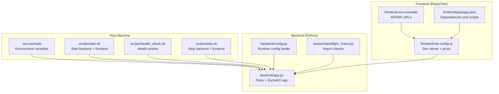
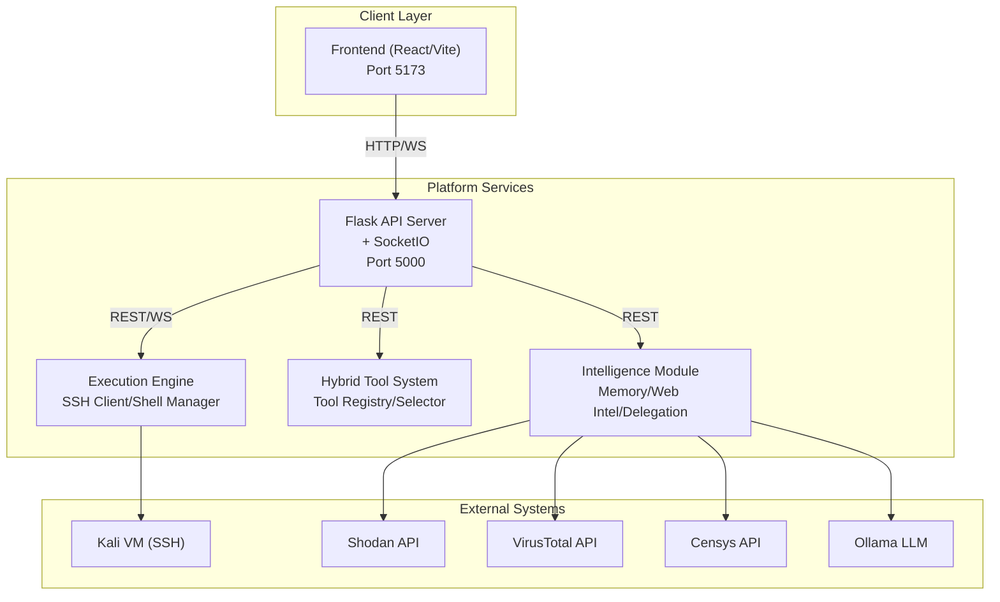
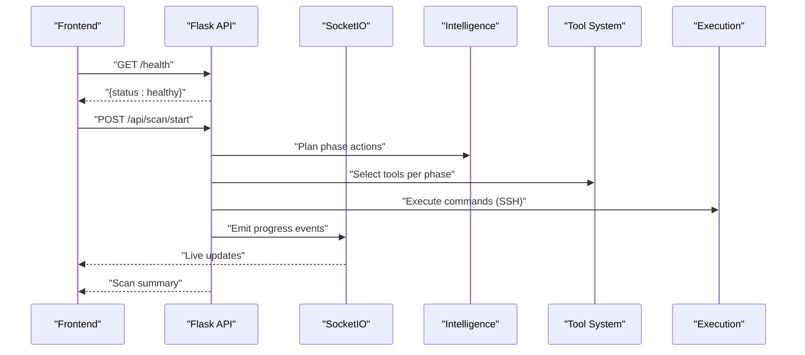
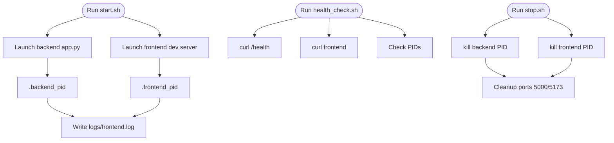
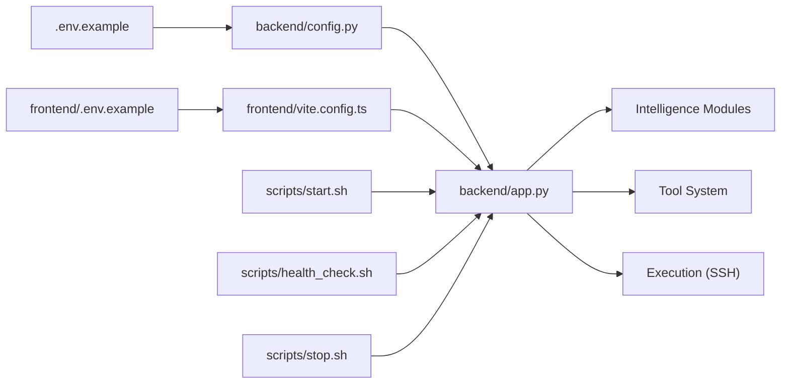

# Deployment Architecture

<cite>
**Referenced Files in This Document**
- [app.py](file://backend/app.py)
- [.env.example](file://.env.example)
- [config.py](file://backend/config.py)
- [start.sh](file://scripts/start.sh)
- [health_check.sh](file://scripts/health_check.sh)
- [stop.sh](file://scripts/stop.sh)
- [preflight_check.py](file://backend/preflight_check.py)
- [frontend/.env.example](file://frontend/.env.example)
- [frontend/package.json](file://frontend/package.json)
- [frontend/vite.config.ts](file://frontend/vite.config.ts)
</cite>

## Table of Contents
1. [Introduction](#introduction)
2. [Project Structure](#project-structure)
3. [Core Components](#core-components)
4. [Architecture Overview](#architecture-overview)
5. [Detailed Component Analysis](#detailed-component-analysis)
6. [Dependency Analysis](#dependency-analysis)
7. [Performance Considerations](#performance-considerations)
8. [Troubleshooting Guide](#troubleshooting-guide)
9. [Conclusion](#conclusion)
10. [Appendices](#appendices)

## Introduction
This document describes the deployment architecture and operational requirements for Optimus, an AI-driven autonomous penetration testing platform. It covers production-grade configuration, service orchestration, scaling considerations, containerization strategies, cloud-native patterns, monitoring and logging, health checks, backup and recovery, performance optimization, security hardening, network configuration, and CI/CD integration points.

## Project Structure
Optimus consists of:
- A Flask-based backend API server with WebSocket support
- A React-based frontend served via Vite
- Shared environment configuration and deployment scripts
- Intelligence, inference, training, and execution subsystems

**Diagram sources**
- [app.py](file://backend/app.py#L1-L343)
- [config.py](file://backend/config.py#L1-L115)
- [start.sh](file://scripts/start.sh#L1-L53)
- [health_check.sh](file://scripts/health_check.sh#L1-L63)
- [stop.sh](file://scripts/stop.sh#L1-L41)
- [preflight_check.py](file://backend/preflight_check.py#L1-L81)
- [frontend/.env.example](file://frontend/.env.example#L1-L11)
- [frontend/package.json](file://frontend/package.json#L1-L50)
- [frontend/vite.config.ts](file://frontend/vite.config.ts#L1-L39)

**Section sources**
- [app.py](file://backend/app.py#L1-L343)
- [config.py](file://backend/config.py#L1-L115)
- [start.sh](file://scripts/start.sh#L1-L53)
- [health_check.sh](file://scripts/health_check.sh#L1-L63)
- [stop.sh](file://scripts/stop.sh#L1-L41)
- [preflight_check.py](file://backend/preflight_check.py#L1-L81)
- [frontend/.env.example](file://frontend/.env.example#L1-L11)
- [frontend/package.json](file://frontend/package.json#L1-L50)
- [frontend/vite.config.ts](file://frontend/vite.config.ts#L1-L39)

## Core Components
- Flask API server with CORS and SocketIO for real-time updates
- WebSocket handlers for live scan progress and events
- Intelligence and tool orchestration modules
- Configuration loader supporting environment variables and defaults
- Frontend proxy to backend API and WebSocket endpoints
- Health check endpoint and startup/shutdown scripts

Key runtime behaviors:
- Backend listens on configurable host/port, registers API blueprints, initializes intelligence and tool systems, and exposes a /health endpoint
- Frontend runs on port 5173 with proxy rules to backend API and WebSocket transport
- Environment variables drive feature toggles, external integrations, and SSH/Kali VM connectivity

**Section sources**
- [app.py](file://backend/app.py#L120-L343)
- [config.py](file://backend/config.py#L6-L115)
- [frontend/vite.config.ts](file://frontend/vite.config.ts#L13-L34)
- [frontend/.env.example](file://frontend/.env.example#L1-L11)

## Architecture Overview
The Optimus deployment topology integrates:
- Flask API server (HTTP + WebSocket)
- AI/ML inference engines (intelligent selectors, autonomous agent, tool manager)
- External security tool execution environment (Kali VM via SSH)
- Frontend dashboard communicating via REST and WebSocket

**Diagram sources**
- [app.py](file://backend/app.py#L179-L274)
- [config.py](file://backend/config.py#L12-L76)
- [frontend/vite.config.ts](file://frontend/vite.config.ts#L18-L33)

## Detailed Component Analysis

### Flask API Server and WebSocket Orchestration
- Initializes Flask app, CORS, and SocketIO with threading mode and ping timeouts
- Registers API blueprints for scans, tools, intelligence, metrics, reports, and training
- Exposes a health endpoint returning component status
- Uses environment-configurable host/port and lazy-initializes intelligence and tool systems

**Diagram sources**
- [app.py](file://backend/app.py#L151-L290)
- [app.py](file://backend/app.py#L252-L274)

**Section sources**
- [app.py](file://backend/app.py#L120-L343)

### Configuration Management
- Centralized configuration via environment variables with sensible defaults
- Feature toggles for intelligence, training, parsers, and RL
- External API keys for Shodan, VirusTotal, Censys
- Ollama LLM base URL/model/timeout and enable flag
- SSH/Kali VM connection tuning for Windows environments

Recommended production overrides:
- Set SECRET_KEY, FLASK_ENV=production, FLASK_PORT, HOST
- Provide API keys for external services
- Configure OLLAMA_BASE_URL to point to a reachable LLM service
- Tune KALI_* timeouts for your network latency

**Section sources**
- [.env.example](file://.env.example#L1-L77)
- [config.py](file://backend/config.py#L6-L115)

### Frontend Integration and Proxy
- Frontend consumes VITE_API_URL and VITE_WS_URL
- Vite dev server proxies /api, /socket.io, and /health to backend
- Strict port 5173 enforcement and host binding for containerized deployments

Operational notes:
- Ensure VITE_API_URL and VITE_WS_URL match backend host/port
- In production builds, configure reverse proxy or CDN upstream to backend

**Section sources**
- [frontend/.env.example](file://frontend/.env.example#L1-L11)
- [frontend/vite.config.ts](file://frontend/vite.config.ts#L13-L39)
- [frontend/package.json](file://frontend/package.json#L1-L50)

### Startup, Health, and Shutdown Scripts
- Start script launches backend (Python app.py) and frontend (npm run dev), saves PIDs, and creates logs
- Health check script validates backend /health, frontend basic response, and process presence
- Stop script kills backend/frontend PIDs and cleans up orphaned processes on ports 5000/5173

**Diagram sources**
- [start.sh](file://scripts/start.sh#L1-L53)
- [health_check.sh](file://scripts/health_check.sh#L1-L63)
- [stop.sh](file://scripts/stop.sh#L1-L41)

**Section sources**
- [start.sh](file://scripts/start.sh#L1-L53)
- [health_check.sh](file://scripts/health_check.sh#L1-L63)
- [stop.sh](file://scripts/stop.sh#L1-L41)

### Preflight Checks
- Validates importability of core modules (tool manager, autonomous agent, training components, SSH client)
- Reports success/failure and warnings for optional dependencies

Use preflight checks during CI/CD to catch missing packages early.

**Section sources**
- [preflight_check.py](file://backend/preflight_check.py#L1-L81)

## Dependency Analysis
- Backend depends on environment configuration, SocketIO for real-time, and modular subsystems (intelligence, tools, execution)
- Frontend depends on Vite proxy configuration and Socket.IO client
- Scripts depend on process IDs and port availability

**Diagram sources**
- [.env.example](file://.env.example#L1-L77)
- [config.py](file://backend/config.py#L1-L115)
- [app.py](file://backend/app.py#L179-L274)
- [frontend/.env.example](file://frontend/.env.example#L1-L11)
- [frontend/vite.config.ts](file://frontend/vite.config.ts#L13-L39)
- [start.sh](file://scripts/start.sh#L1-L53)
- [health_check.sh](file://scripts/health_check.sh#L1-L63)
- [stop.sh](file://scripts/stop.sh#L1-L41)

**Section sources**
- [app.py](file://backend/app.py#L179-L274)
- [config.py](file://backend/config.py#L1-L115)
- [frontend/vite.config.ts](file://frontend/vite.config.ts#L13-L39)

## Performance Considerations
- Use asynchronous mode and threading for SocketIO to handle concurrent clients
- Tune ping intervals/timeouts to balance responsiveness and overhead
- Reduce Kali VM timeouts for faster feedback loops in development
- Enable production logging and disable debug reloader in production
- Consider horizontal scaling of the Flask app behind a reverse proxy with sticky sessions for WebSocket continuity
- Offload static assets to CDN and cache API responses where feasible

[No sources needed since this section provides general guidance]

## Troubleshooting Guide
Common operational issues and remedies:
- Backend not responding: verify /health endpoint and inspect logs/backend.log
- Frontend proxy failures: confirm VITE_API_URL/VITE_WS_URL and Vite proxy rules
- Port conflicts: ensure ports 5000 and 5173 are free or adjust configuration
- SSH connectivity to Kali VM: validate KALI_HOST, KALI_PORT, credentials, and timeouts
- Missing dependencies: run preflight checks to identify import errors

Health verification:
- Use health_check.sh to validate backend and frontend status and process IDs

**Section sources**
- [health_check.sh](file://scripts/health_check.sh#L1-L63)
- [app.py](file://backend/app.py#L276-L290)
- [frontend/vite.config.ts](file://frontend/vite.config.ts#L18-L33)

## Conclusion
Optimus deployment centers on a Flask API server with integrated WebSocket support, orchestrated intelligence and tool systems, and a React frontend proxied through Vite. Production readiness requires environment-driven configuration, robust health monitoring, careful SSH/Kali VM tuning, and scalable hosting patterns. The included scripts and configuration provide a solid foundation for local development and can be extended for containerized and cloud-native deployments.

[No sources needed since this section summarizes without analyzing specific files]

## Appendices

### A. Production Deployment Configuration Checklist
- Set SECRET_KEY, FLASK_ENV=production, FLASK_PORT, HOST
- Provide external API keys (Shodan, VirusTotal, Censys)
- Configure OLLAMA_BASE_URL and model for inference
- Tune KALI_* parameters for your network
- Enable persistent storage for logs and data directories
- Configure reverse proxy (nginx/caddy) and TLS termination
- Set up process supervision (systemd) and log rotation

**Section sources**
- [.env.example](file://.env.example#L1-L77)
- [config.py](file://backend/config.py#L12-L76)
- [app.py](file://backend/app.py#L323-L343)

### B. Containerization Strategy (Docker)
- Build two images: backend (Python) and frontend (Node)
- Use multi-stage builds to minimize image sizes
- Mount persistent volumes for logs/data and models
- Expose port 5000 for backend; serve frontend via reverse proxy
- Run health checks against /health endpoint
- Example Dockerfile outlines (conceptual): set environment variables, copy requirements, install dependencies, collect static assets, run backend and frontend

[No sources needed since this section provides general guidance]

### C. Kubernetes Deployment Patterns
- Deploy backend as a StatefulSet or Deployment with readiness/liveness probes
- Expose frontend via Ingress/NLB with WebSocket passthrough
- Use ConfigMap for environment variables and Secrets for API keys
- Scale backend pods horizontally; ensure sticky sessions for WebSocket continuity
- Persist logs and data via PersistentVolumes

[No sources needed since this section provides general guidance]

### D. Monitoring and Logging Setup
- Backend writes structured logs to logs/backend.log with UTF-8 handling
- Use health endpoint for liveness/readiness probes
- Aggregate logs with centralized logging (e.g., ELK/Fluentd/Loki)
- Instrument metrics endpoints for scan progress and system health

**Section sources**
- [app.py](file://backend/app.py#L90-L117)
- [app.py](file://backend/app.py#L276-L290)

### E. Backup and Recovery Procedures
- Back up database files (memory DB), scan history, and trained models
- Automate periodic snapshots of persistent volumes
- Test restore procedures regularly and document RTO/RPO targets

[No sources needed since this section provides general guidance]

### F. Security Hardening Measures
- Enforce HTTPS/TLS termination at ingress
- Restrict CORS origins to trusted domains
- Rotate SECRET_KEY and API keys regularly
- Limit Kali VM access to dedicated networks and firewall rules
- Scan container images and lock dependency versions

[No sources needed since this section provides general guidance]

### G. Network Configuration Requirements
- Allow outbound access to external APIs (Shodan, VirusTotal, Censys)
- Open SSH to Kali VM (port 22) from backend nodes
- Configure WebSocket proxy for /socket.io traffic
- Use private networks for internal communications

**Section sources**
- [config.py](file://backend/config.py#L15-L17)
- [frontend/vite.config.ts](file://frontend/vite.config.ts#L24-L28)

### H. CI/CD Integration
- Use preflight checks in pipeline stages to validate imports
- Build and push Docker images on successful tests
- Deploy to staging with automated health checks
- Promote to production after manual approval and smoke tests

**Section sources**
- [preflight_check.py](file://backend/preflight_check.py#L35-L81)
- [health_check.sh](file://scripts/health_check.sh#L19-L37)