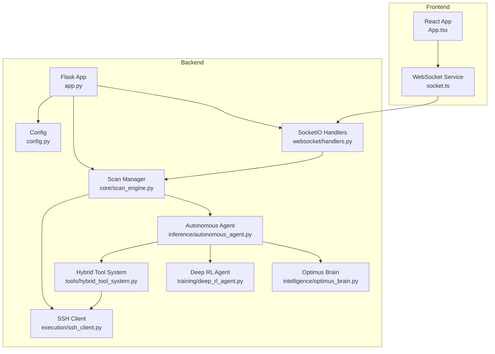
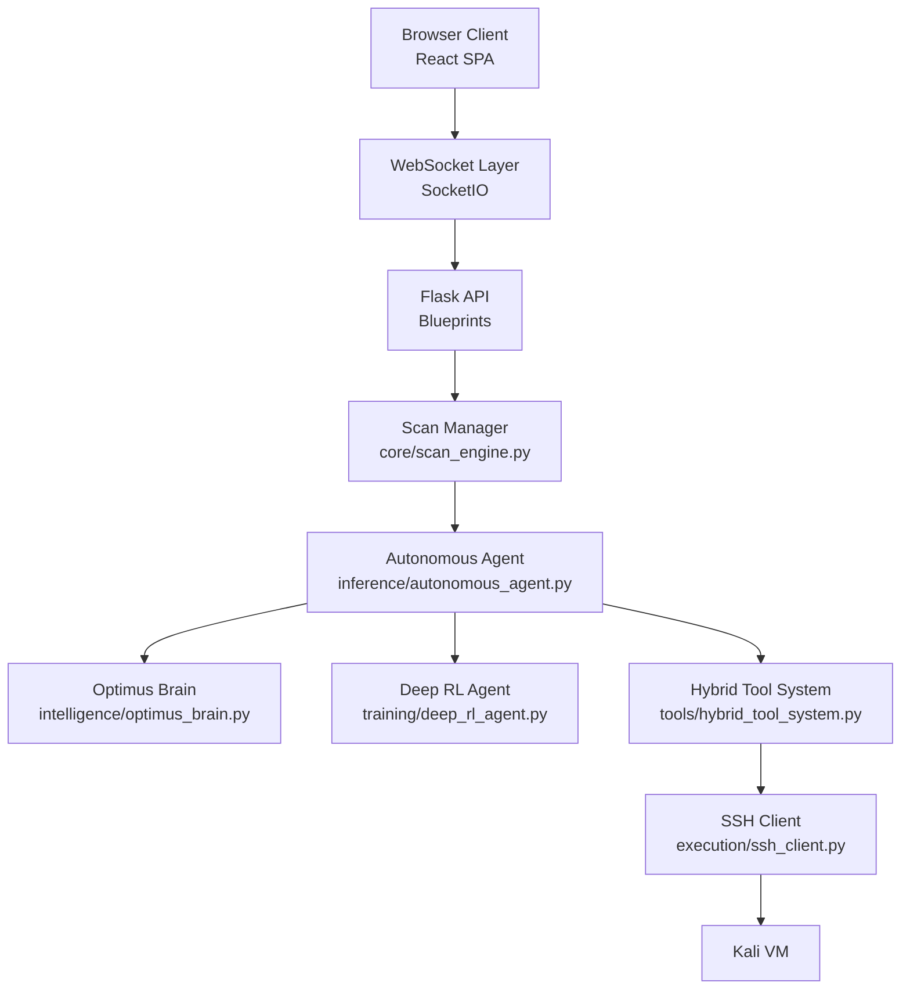
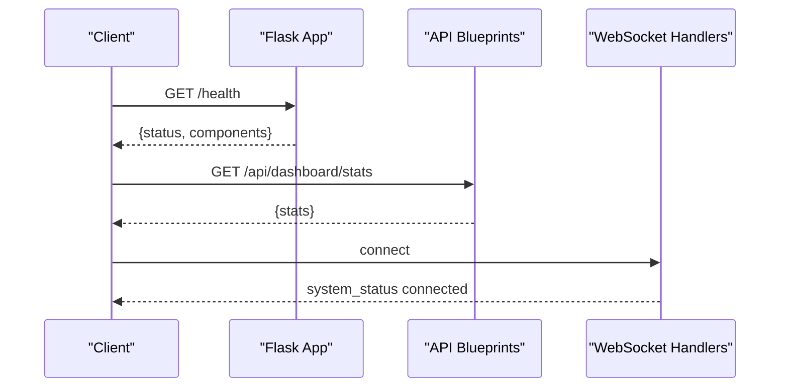
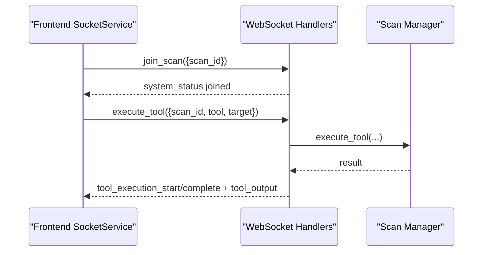
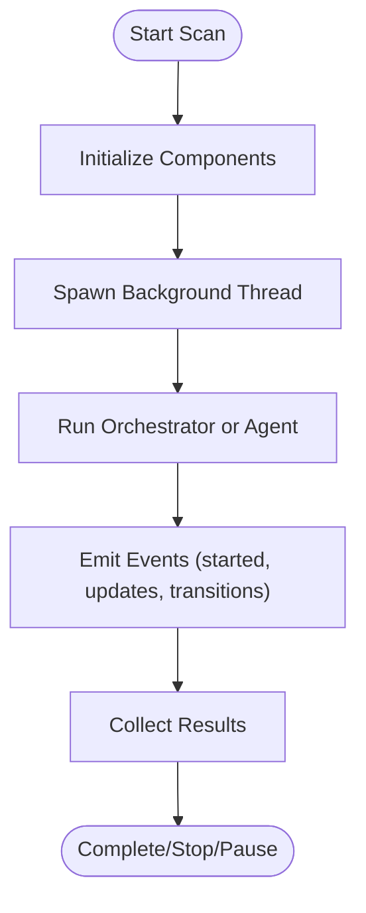
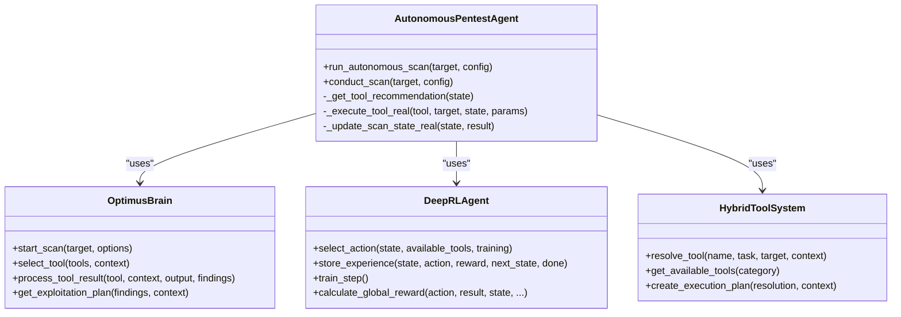
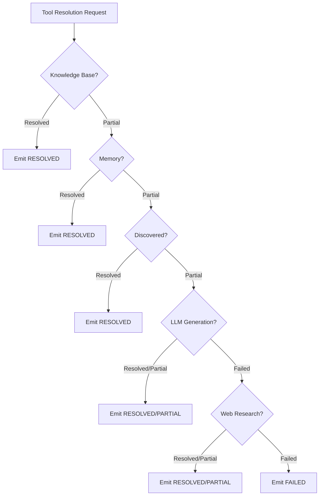
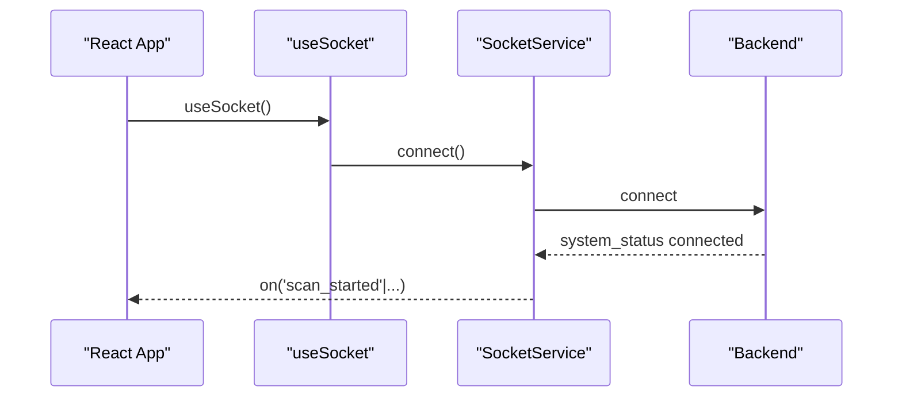
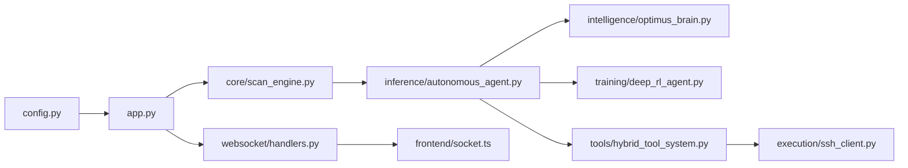

# Overall Design

<cite>
**Referenced Files in This Document**
- [backend/app.py](file://backend/app.py)
- [backend/websocket/handlers.py](file://backend/websocket/handlers.py)
- [backend/core/scan_engine.py](file://backend/core/scan_engine.py)
- [backend/inference/autonomous_agent.py](file://backend/inference/autonomous_agent.py)
- [backend/execution/ssh_client.py](file://backend/execution/ssh_client.py)
- [backend/config.py](file://backend/config.py)
- [backend/intelligence/optimus_brain.py](file://backend/intelligence/optimus_brain.py)
- [backend/training/deep_rl_agent.py](file://backend/training/deep_rl_agent.py)
- [backend/tools/hybrid_tool_system.py](file://backend/tools/hybrid_tool_system.py)
- [frontend/src/App.tsx](file://frontend/src/App.tsx)
- [frontend/src/services/socket.ts](file://frontend/src/services/socket.ts)
- [frontend/package.json](file://frontend/package.json)
- [README.md](file://README.md)
</cite>

## Table of Contents
1. [Introduction](#introduction)
2. [Project Structure](#project-structure)
3. [Core Components](#core-components)
4. [Architecture Overview](#architecture-overview)
5. [Detailed Component Analysis](#detailed-component-analysis)
6. [Dependency Analysis](#dependency-analysis)
7. [Performance Considerations](#performance-considerations)
8. [Troubleshooting Guide](#troubleshooting-guide)
9. [Conclusion](#conclusion)
10. [Appendices](#appendices)

## Introduction
Optimus is an AI-driven autonomous penetration testing platform that integrates a React-based frontend dashboard with a Flask backend API. The backend orchestrates multi-phase security assessments, leveraging AI/ML capabilities for intelligent tool selection, adaptive exploitation, and real-time reporting. It uses SSH-based integration with a Kali Linux VM to execute security tools, emitting live progress via WebSocket connections to the frontend. The system balances centralized orchestration with distributed tool execution, trading off performance for security and operational control.

## Project Structure
The repository follows a layered backend architecture with a dedicated frontend SPA:
- Backend (Flask + SocketIO): API endpoints, WebSocket handlers, scan orchestration, AI/ML engines, and tool integration.
- Frontend (React + TypeScript): Dashboard UI, routing, real-time WebSocket subscriptions, and typed event handling.
- AI/ML subsystems: Deep RL agents, explainable AI, memory systems, and LLM integrations.
- Infrastructure: SSH client for Kali VM execution, configuration management, and environment variables.

**Diagram sources**
- [backend/app.py](file://backend/app.py#L120-L163)
- [backend/websocket/handlers.py](file://backend/websocket/handlers.py#L26-L119)
- [backend/core/scan_engine.py](file://backend/core/scan_engine.py#L26-L81)
- [backend/inference/autonomous_agent.py](file://backend/inference/autonomous_agent.py#L50-L132)
- [backend/intelligence/optimus_brain.py](file://backend/intelligence/optimus_brain.py#L46-L170)
- [backend/training/deep_rl_agent.py](file://backend/training/deep_rl_agent.py#L187-L300)
- [backend/tools/hybrid_tool_system.py](file://backend/tools/hybrid_tool_system.py#L65-L113)
- [backend/execution/ssh_client.py](file://backend/execution/ssh_client.py#L12-L86)
- [backend/config.py](file://backend/config.py#L6-L115)

**Section sources**
- [backend/app.py](file://backend/app.py#L120-L163)
- [frontend/src/App.tsx](file://frontend/src/App.tsx#L81-L161)
- [frontend/src/services/socket.ts](file://frontend/src/services/socket.ts#L64-L106)
- [README.md](file://README.md#L15-L22)

## Core Components
- Flask application with CORS and SocketIO initialization, global state for active scans, and blueprints for API routes.
- WebSocket handlers for real-time scan lifecycle events, tool execution, and AI recommendations.
- Scan manager coordinating autonomous scans, background threads, and event emission.
- Autonomous agent implementing multi-phase decision-making, tool selection, and state updates.
- AI/ML engines: Optimus Brain for unified intelligence, Deep RL agent for adaptive tool selection.
- Hybrid tool system resolving and generating commands with multiple sources (KB, memory, discovery, LLM, web).
- SSH client for secure execution on a Kali VM with configurable timeouts and retries.
- Configuration module centralizing environment-driven settings for tools, LLMs, and RL parameters.

**Section sources**
- [backend/app.py](file://backend/app.py#L168-L275)
- [backend/websocket/handlers.py](file://backend/websocket/handlers.py#L26-L119)
- [backend/core/scan_engine.py](file://backend/core/scan_engine.py#L26-L81)
- [backend/inference/autonomous_agent.py](file://backend/inference/autonomous_agent.py#L50-L132)
- [backend/intelligence/optimus_brain.py](file://backend/intelligence/optimus_brain.py#L46-L170)
- [backend/training/deep_rl_agent.py](file://backend/training/deep_rl_agent.py#L187-L300)
- [backend/tools/hybrid_tool_system.py](file://backend/tools/hybrid_tool_system.py#L65-L113)
- [backend/execution/ssh_client.py](file://backend/execution/ssh_client.py#L12-L86)
- [backend/config.py](file://backend/config.py#L6-L115)

## Architecture Overview
Optimus employs a centralized orchestration model with distributed tool execution:
- Centralized orchestration: Flask app initializes components, registers routes, and manages global state. The scan manager coordinates autonomous scans and emits real-time events.
- Distributed tool execution: The hybrid tool system resolves commands and delegates execution to the SSH client on the Kali VM. This maintains security isolation and reduces backend load.
- Event-driven architecture: WebSocket connections propagate scan lifecycle events, tool execution updates, and AI recommendations to the frontend.
- AI/ML integration: The autonomous agent leverages the Optimus Brain and Deep RL agent to adaptively select tools and strategies based on scan context and historical performance.

**Diagram sources**
- [backend/app.py](file://backend/app.py#L120-L163)
- [backend/websocket/handlers.py](file://backend/websocket/handlers.py#L26-L119)
- [backend/core/scan_engine.py](file://backend/core/scan_engine.py#L26-L81)
- [backend/inference/autonomous_agent.py](file://backend/inference/autonomous_agent.py#L50-L132)
- [backend/intelligence/optimus_brain.py](file://backend/intelligence/optimus_brain.py#L46-L170)
- [backend/training/deep_rl_agent.py](file://backend/training/deep_rl_agent.py#L187-L300)
- [backend/tools/hybrid_tool_system.py](file://backend/tools/hybrid_tool_system.py#L65-L113)
- [backend/execution/ssh_client.py](file://backend/execution/ssh_client.py#L12-L86)

## Detailed Component Analysis

### Flask Application and API Routing
- Initializes logging, creates required directories, sets CORS policies, and configures SocketIO.
- Registers blueprints for API endpoints and WebSocket handlers.
- Provides health checks and root endpoint exposing available endpoints.
- Manages global state for active scans and integrates intelligence and hybrid tool systems.

**Diagram sources**
- [backend/app.py](file://backend/app.py#L276-L308)
- [backend/api/routes.py](file://backend/api/routes.py#L10-L54)
- [backend/websocket/handlers.py](file://backend/websocket/handlers.py#L29-L48)

**Section sources**
- [backend/app.py](file://backend/app.py#L90-L163)
- [backend/api/routes.py](file://backend/api/routes.py#L10-L54)

### WebSocket Event Handling
- Establishes connection, tracks clients, and manages rooms per scan.
- Emits lifecycle events: scan_started, scan_update, phase_transition, tool_execution_start/complete, tool_output, finding_discovered, scan_complete/error.
- Provides event emitters for other modules to publish updates.

**Diagram sources**
- [frontend/src/services/socket.ts](file://frontend/src/services/socket.ts#L165-L232)
- [backend/websocket/handlers.py](file://backend/websocket/handlers.py#L50-L119)
- [backend/core/scan_engine.py](file://backend/core/scan_engine.py#L423-L434)

**Section sources**
- [backend/websocket/handlers.py](file://backend/websocket/handlers.py#L26-L119)
- [frontend/src/services/socket.ts](file://frontend/src/services/socket.ts#L64-L106)

### Scan Orchestration and Management
- Centralized ScanManager coordinates autonomous scans in background threads, manages stop/pause/resume, and emits events.
- Integrates with the robust orchestrator or legacy agent depending on availability.
- Tracks scan state, calculates elapsed time, and updates findings/tools executed.

**Diagram sources**
- [backend/core/scan_engine.py](file://backend/core/scan_engine.py#L82-L148)
- [backend/core/scan_engine.py](file://backend/core/scan_engine.py#L150-L310)

**Section sources**
- [backend/core/scan_engine.py](file://backend/core/scan_engine.py#L26-L81)
- [backend/core/scan_engine.py](file://backend/core/scan_engine.py#L82-L148)
- [backend/core/scan_engine.py](file://backend/core/scan_engine.py#L150-L310)

### Autonomous Agent and AI/ML Integration
- Orchestrates multi-phase scanning, selects tools, executes them, and adapts strategy based on findings.
- Integrates Optimus Brain for intelligence and Deep RL agent for adaptive tool selection.
- Maintains state, tracks findings, and coordinates with the hybrid tool system.

**Diagram sources**
- [backend/inference/autonomous_agent.py](file://backend/inference/autonomous_agent.py#L50-L132)
- [backend/intelligence/optimus_brain.py](file://backend/intelligence/optimus_brain.py#L46-L170)
- [backend/training/deep_rl_agent.py](file://backend/training/deep_rl_agent.py#L187-L300)
- [backend/tools/hybrid_tool_system.py](file://backend/tools/hybrid_tool_system.py#L65-L113)

**Section sources**
- [backend/inference/autonomous_agent.py](file://backend/inference/autonomous_agent.py#L133-L327)
- [backend/intelligence/optimus_brain.py](file://backend/intelligence/optimus_brain.py#L173-L226)
- [backend/training/deep_rl_agent.py](file://backend/training/deep_rl_agent.py#L312-L369)

### Hybrid Tool System and SSH Execution
- Resolves tools through a priority chain: knowledge base, memory, discovered tools, LLM generation, web research.
- Generates commands tailored to tasks and targets, with confidence and warnings.
- Executes resolved commands via SSH client on the Kali VM with configurable timeouts and retries.

**Diagram sources**
- [backend/tools/hybrid_tool_system.py](file://backend/tools/hybrid_tool_system.py#L166-L220)
- [backend/execution/ssh_client.py](file://backend/execution/ssh_client.py#L87-L196)

**Section sources**
- [backend/tools/hybrid_tool_system.py](file://backend/tools/hybrid_tool_system.py#L166-L220)
- [backend/execution/ssh_client.py](file://backend/execution/ssh_client.py#L87-L196)

### Frontend Integration and Real-Time Updates
- React SPA with routing and WebSocket service for real-time updates.
- SocketService manages connection, reconnection, and event subscriptions.
- App initializes WebSocket on startup and renders pages with real-time scan data.

**Diagram sources**
- [frontend/src/App.tsx](file://frontend/src/App.tsx#L81-L84)
- [frontend/src/services/socket.ts](file://frontend/src/services/socket.ts#L83-L106)
- [backend/websocket/handlers.py](file://backend/websocket/handlers.py#L29-L48)

**Section sources**
- [frontend/src/App.tsx](file://frontend/src/App.tsx#L81-L84)
- [frontend/src/services/socket.ts](file://frontend/src/services/socket.ts#L64-L106)
- [frontend/package.json](file://frontend/package.json#L29-L29)

## Dependency Analysis
- Backend depends on configuration for SSH credentials, LLM settings, and RL parameters.
- Scan manager depends on the autonomous agent and tool manager for orchestration.
- Hybrid tool system depends on SSH client and optional LLM/memory integrations.
- Frontend depends on SocketIO client and typed event contracts.

**Diagram sources**
- [backend/config.py](file://backend/config.py#L6-L115)
- [backend/app.py](file://backend/app.py#L232-L275)
- [backend/core/scan_engine.py](file://backend/core/scan_engine.py#L26-L81)
- [backend/inference/autonomous_agent.py](file://backend/inference/autonomous_agent.py#L50-L132)
- [backend/intelligence/optimus_brain.py](file://backend/intelligence/optimus_brain.py#L46-L170)
- [backend/training/deep_rl_agent.py](file://backend/training/deep_rl_agent.py#L187-L300)
- [backend/tools/hybrid_tool_system.py](file://backend/tools/hybrid_tool_system.py#L65-L113)
- [backend/execution/ssh_client.py](file://backend/execution/ssh_client.py#L12-L86)
- [backend/websocket/handlers.py](file://backend/websocket/handlers.py#L26-L119)
- [frontend/src/services/socket.ts](file://frontend/src/services/socket.ts#L64-L106)

**Section sources**
- [backend/config.py](file://backend/config.py#L6-L115)
- [backend/app.py](file://backend/app.py#L232-L275)
- [backend/core/scan_engine.py](file://backend/core/scan_engine.py#L26-L81)

## Performance Considerations
- Centralized orchestration with background threads ensures non-blocking event emission and scan coordination.
- SSH timeouts and retries are tuned for Windows environments and long-running tools, balancing reliability and responsiveness.
- WebSocket threading mode and keepalive settings optimize real-time updates.
- RL agent uses prioritized experience replay and target networks to stabilize training and improve sample efficiency.
- Frontend uses polling and WebSocket transports with reconnection strategies to maintain UX continuity.

[No sources needed since this section provides general guidance]

## Troubleshooting Guide
- Logging: Safe formatter handles Unicode and adds correlation IDs for traceability.
- Error handling: Flask error handlers return structured JSON for 404/500.
- WebSocket: Connection/disconnect events and reconnection attempts tracked by SocketService.
- SSH connectivity: Connection retries, keepalive, and data timeout safeguards against stalled sessions.
- Environment configuration: Ensure Kali VM credentials and Ollama settings are correctly set in environment variables.

**Section sources**
- [backend/app.py](file://backend/app.py#L50-L117)
- [backend/app.py](file://backend/app.py#L311-L318)
- [frontend/src/services/socket.ts](file://frontend/src/services/socket.ts#L137-L160)
- [backend/execution/ssh_client.py](file://backend/execution/ssh_client.py#L20-L78)
- [backend/config.py](file://backend/config.py#L12-L52)

## Conclusion
Optimus combines a React frontend with a Flask backend to deliver an event-driven, AI-enhanced penetration testing platform. Centralized orchestration coordinates autonomous scans, while distributed tool execution on a Kali VM enforces security boundaries. The integration of AI/ML components—particularly the Deep RL agent and Optimus Brain—enables adaptive, intelligent decision-making. Trade-offs emphasize security and operational control through SSH-based execution and centralized management, with performance optimized via background threads, prioritized experience replay, and resilient WebSocket communications.

## Appendices

### System Boundaries and Integrations
- Frontend boundary: React SPA with typed WebSocket events and routing.
- Backend boundary: Flask API with SocketIO and global state management.
- External security tools: SSH-based execution on Kali VM; tool discovery and command generation.
- AI/ML: Local LLMs via Ollama, Deep RL models, and explainable AI components.

**Section sources**
- [README.md](file://README.md#L15-L22)
- [backend/config.py](file://backend/config.py#L48-L52)
- [backend/execution/ssh_client.py](file://backend/execution/ssh_client.py#L12-L86)

### Infrastructure Requirements
- Local development: Python 3.10+, Node.js 16+, Ollama, Kali Linux VM with SSH access.
- Production deployment: Containerized backend with persistent volumes for logs and models; reverse proxy for HTTPS; scalable WebSocket handling; isolated Kali VM network access.

**Section sources**
- [README.md](file://README.md#L23-L30)
- [backend/config.py](file://backend/config.py#L12-L52)

### Scalability Considerations
- Concurrency: Background threads per scan; SocketIO threading mode supports multiple clients.
- Throughput: SSH client timeouts accommodate long-running tools; WebSocket batching for frequent updates.
- AI/ML: RL agent training decoupled from scan execution; model persistence for reuse.

**Section sources**
- [backend/core/scan_engine.py](file://backend/core/scan_engine.py#L118-L126)
- [backend/websocket/handlers.py](file://backend/websocket/handlers.py#L152-L162)
- [backend/execution/ssh_client.py](file://backend/execution/ssh_client.py#L87-L196)
- [backend/training/deep_rl_agent.py](file://backend/training/deep_rl_agent.py#L617-L697)