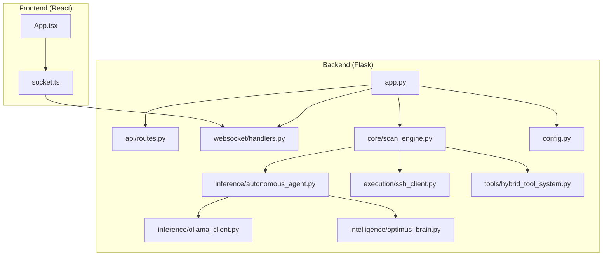
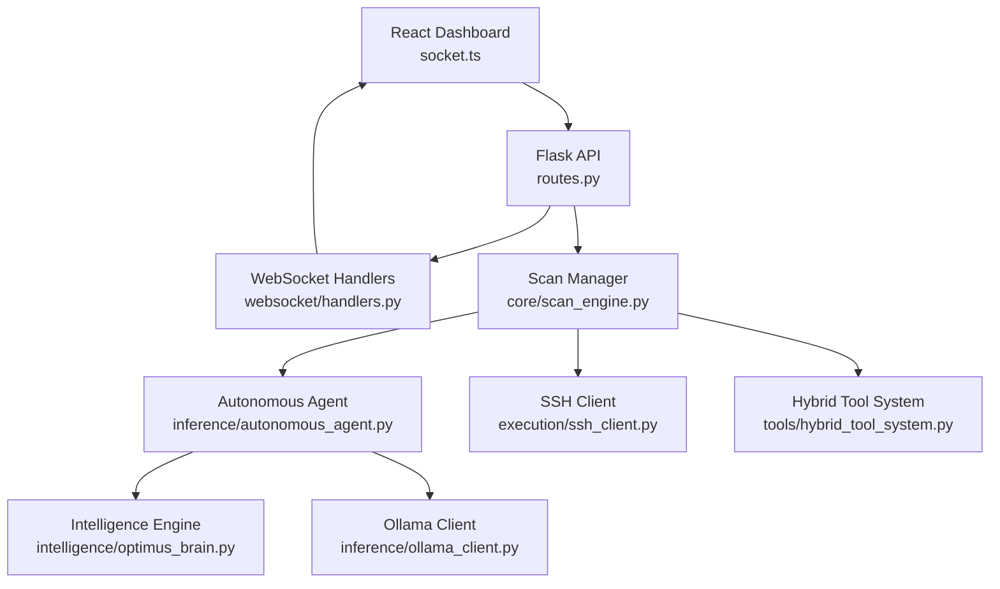
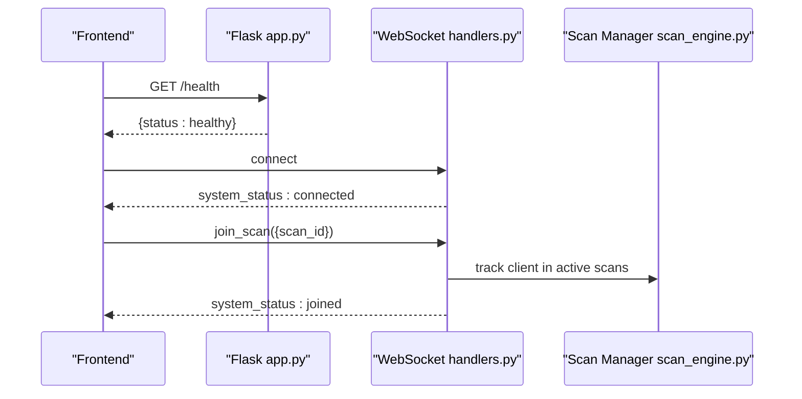
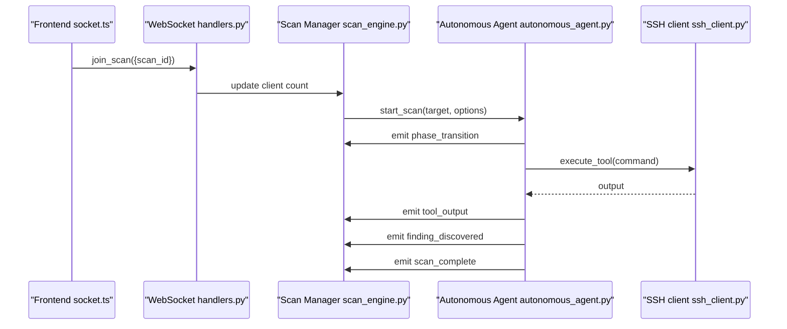
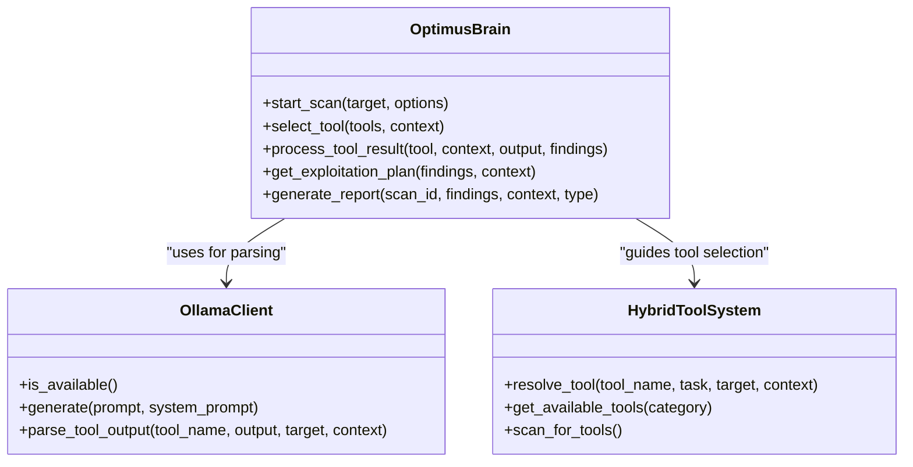
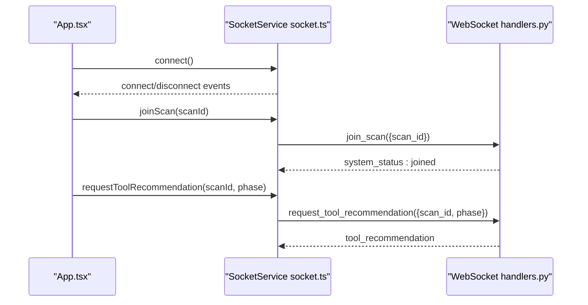
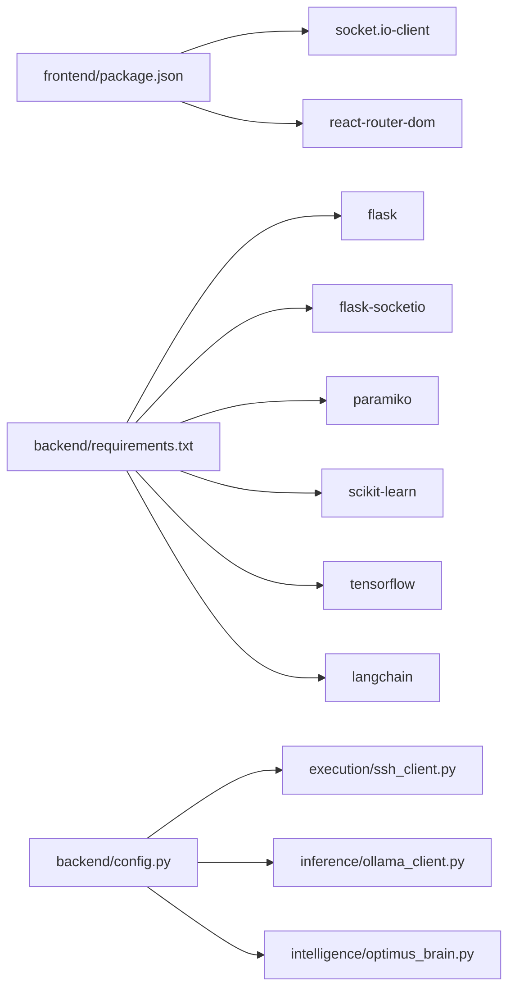
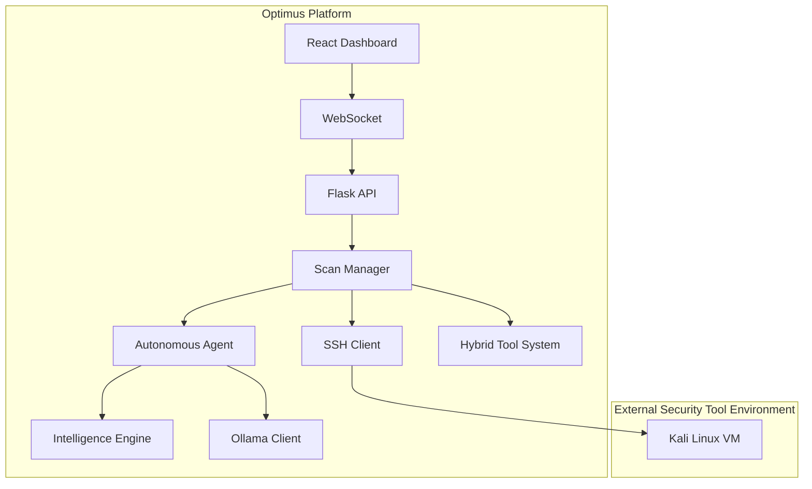

# System Architecture

<cite>
**Referenced Files in This Document**
- [README.md](file://README.md)
- [app.py](file://backend/app.py)
- [routes.py](file://backend/api/routes.py)
- [scan_engine.py](file://backend/core/scan_engine.py)
- [handlers.py](file://backend/websocket/handlers.py)
- [autonomous_agent.py](file://backend/inference/autonomous_agent.py)
- [ssh_client.py](file://backend/execution/ssh_client.py)
- [hybrid_tool_system.py](file://backend/tools/hybrid_tool_system.py)
- [config.py](file://backend/config.py)
- [optimus_brain.py](file://backend/intelligence/optimus_brain.py)
- [ollama_client.py](file://backend/inference/ollama_client.py)
- [socket.ts](file://frontend/src/services/socket.ts)
- [App.tsx](file://frontend/src/App.tsx)
- [package.json](file://frontend/package.json)
- [requirements.txt](file://backend/requirements.txt)
</cite>

## Table of Contents
1. [Introduction](#introduction)
2. [Project Structure](#project-structure)
3. [Core Components](#core-components)
4. [Architecture Overview](#architecture-overview)
5. [Detailed Component Analysis](#detailed-component-analysis)
6. [Dependency Analysis](#dependency-analysis)
7. [Performance Considerations](#performance-considerations)
8. [Troubleshooting Guide](#troubleshooting-guide)
9. [Conclusion](#conclusion)
10. [Appendices](#appendices)

## Introduction
Optimus is an AI-powered autonomous penetration testing platform that integrates a React-based frontend dashboard with a Flask backend API and WebSocket real-time communication. The backend orchestrates multi-phase scanning, integrates AI/ML inference engines, and executes tools against a Kali Linux VM via SSH. The system emphasizes event-driven communication, centralized orchestration with distributed tool execution, and real-time monitoring of scan progress.

## Project Structure
The repository follows a clear separation of concerns:
- Frontend: React application with TypeScript, routing, and WebSocket client service.
- Backend: Flask application with Blueprints for modular APIs, WebSocket handlers, and core orchestration.
- Intelligence and AI/ML: Unified intelligence engine, LLM client, and autonomous agent.
- Execution and Tools: SSH client for remote tool execution and hybrid tool resolution system.
- Configuration: Centralized configuration for environment variables and runtime tuning.

**Diagram sources**
- [app.py](file://backend/app.py#L120-L343)
- [routes.py](file://backend/api/routes.py#L1-L54)
- [handlers.py](file://backend/websocket/handlers.py#L26-L120)
- [scan_engine.py](file://backend/core/scan_engine.py#L26-L554)
- [autonomous_agent.py](file://backend/inference/autonomous_agent.py#L50-L800)
- [ssh_client.py](file://backend/execution/ssh_client.py#L12-L216)
- [hybrid_tool_system.py](file://backend/tools/hybrid_tool_system.py#L65-L783)
- [config.py](file://backend/config.py#L6-L115)
- [optimus_brain.py](file://backend/intelligence/optimus_brain.py#L46-L712)
- [ollama_client.py](file://backend/inference/ollama_client.py#L39-L414)
- [socket.ts](file://frontend/src/services/socket.ts#L64-L237)
- [App.tsx](file://frontend/src/App.tsx#L81-L187)

**Section sources**
- [README.md](file://README.md#L1-L96)
- [app.py](file://backend/app.py#L120-L343)
- [routes.py](file://backend/api/routes.py#L1-L54)
- [handlers.py](file://backend/websocket/handlers.py#L26-L120)
- [scan_engine.py](file://backend/core/scan_engine.py#L26-L554)
- [autonomous_agent.py](file://backend/inference/autonomous_agent.py#L50-L800)
- [ssh_client.py](file://backend/execution/ssh_client.py#L12-L216)
- [hybrid_tool_system.py](file://backend/tools/hybrid_tool_system.py#L65-L783)
- [config.py](file://backend/config.py#L6-L115)
- [optimus_brain.py](file://backend/intelligence/optimus_brain.py#L46-L712)
- [ollama_client.py](file://backend/inference/ollama_client.py#L39-L414)
- [socket.ts](file://frontend/src/services/socket.ts#L64-L237)
- [App.tsx](file://frontend/src/App.tsx#L81-L187)

## Core Components
- Flask Application and Blueprints: Central API endpoints and WebSocket registration.
- Scan Manager: Orchestrates multi-phase scanning, manages threads, and emits real-time events.
- Autonomous Agent: AI-driven decision-making, tool selection, and adaptive execution.
- Intelligence Engine: Unified layer for memory, web intelligence, chaining, and explainability.
- LLM Client: Local Ollama integration for structured parsing and command generation.
- SSH Client: Reliable remote execution against Kali Linux VM with timeouts and streaming.
- Hybrid Tool System: Resolves tools via knowledge base, discovery, LLM, and web research.
- Frontend WebSocket Service: Real-time updates, scan rooms, and interactive controls.

**Section sources**
- [app.py](file://backend/app.py#L176-L275)
- [scan_engine.py](file://backend/core/scan_engine.py#L26-L554)
- [autonomous_agent.py](file://backend/inference/autonomous_agent.py#L50-L800)
- [optimus_brain.py](file://backend/intelligence/optimus_brain.py#L46-L712)
- [ollama_client.py](file://backend/inference/ollama_client.py#L39-L414)
- [ssh_client.py](file://backend/execution/ssh_client.py#L12-L216)
- [hybrid_tool_system.py](file://backend/tools/hybrid_tool_system.py#L65-L783)
- [socket.ts](file://frontend/src/services/socket.ts#L64-L237)

## Architecture Overview
Optimus employs a layered architecture:
- Presentation Layer: React dashboard with real-time monitoring and interactive controls.
- API Layer: Flask Blueprints expose REST endpoints for dashboard statistics and management.
- Orchestration Layer: Scan Manager coordinates phases, threads, and events.
- Intelligence Layer: AI/ML engines guide tool selection and parsing.
- Execution Layer: SSH client executes tools on the Kali Linux VM; Hybrid Tool System resolves commands.
- Communication Layer: WebSocket handlers broadcast live updates to the frontend.

**Diagram sources**
- [routes.py](file://backend/api/routes.py#L1-L54)
- [handlers.py](file://backend/websocket/handlers.py#L26-L120)
- [scan_engine.py](file://backend/core/scan_engine.py#L26-L554)
- [autonomous_agent.py](file://backend/inference/autonomous_agent.py#L50-L800)
- [optimus_brain.py](file://backend/intelligence/optimus_brain.py#L46-L712)
- [ollama_client.py](file://backend/inference/ollama_client.py#L39-L414)
- [ssh_client.py](file://backend/execution/ssh_client.py#L12-L216)
- [hybrid_tool_system.py](file://backend/tools/hybrid_tool_system.py#L65-L783)
- [socket.ts](file://frontend/src/services/socket.ts#L64-L237)

## Detailed Component Analysis

### Flask Application and WebSocket Integration
- Initializes logging, CORS, and SocketIO with threading.
- Registers Blueprints for modular API endpoints.
- Provides health checks and root endpoint.
- Links Scan Manager and Intelligence modules.

**Diagram sources**
- [app.py](file://backend/app.py#L276-L309)
- [handlers.py](file://backend/websocket/handlers.py#L29-L81)
- [scan_engine.py](file://backend/core/scan_engine.py#L48-L537)

**Section sources**
- [app.py](file://backend/app.py#L120-L343)
- [handlers.py](file://backend/websocket/handlers.py#L26-L120)
- [scan_engine.py](file://backend/core/scan_engine.py#L26-L554)

### Scan Orchestration and Real-Time Events
- Scan Manager creates background threads per scan, emits lifecycle events, and updates shared state.
- Emits events for phase transitions, tool execution, findings, and completion.
- Integrates Tool Manager and optional Robust Orchestrator.

**Diagram sources**
- [handlers.py](file://backend/websocket/handlers.py#L50-L119)
- [scan_engine.py](file://backend/core/scan_engine.py#L82-L365)
- [autonomous_agent.py](file://backend/inference/autonomous_agent.py#L133-L328)
- [ssh_client.py](file://backend/execution/ssh_client.py#L87-L208)

**Section sources**
- [scan_engine.py](file://backend/core/scan_engine.py#L82-L365)
- [autonomous_agent.py](file://backend/inference/autonomous_agent.py#L133-L328)
- [ssh_client.py](file://backend/execution/ssh_client.py#L87-L208)
- [handlers.py](file://backend/websocket/handlers.py#L122-L314)

### AI/ML Integration and Tool Resolution
- Intelligence Engine coordinates memory, web intelligence, chaining, and explainability.
- Autonomous Agent integrates LLM client for parsing and adaptive decision-making.
- Hybrid Tool System resolves commands via knowledge base, discovery, LLM, and web research.

**Diagram sources**
- [optimus_brain.py](file://backend/intelligence/optimus_brain.py#L46-L712)
- [ollama_client.py](file://backend/inference/ollama_client.py#L39-L414)
- [hybrid_tool_system.py](file://backend/tools/hybrid_tool_system.py#L65-L783)

**Section sources**
- [optimus_brain.py](file://backend/intelligence/optimus_brain.py#L173-L510)
- [ollama_client.py](file://backend/inference/ollama_client.py#L148-L402)
- [hybrid_tool_system.py](file://backend/tools/hybrid_tool_system.py#L166-L220)

### Frontend Dashboard and WebSocket Client
- React App initializes WebSocket connection and routes.
- SocketService manages connection, reconnection, and event subscriptions.
- Supports joining scan rooms, requesting tool recommendations, and executing tools.

**Diagram sources**
- [App.tsx](file://frontend/src/App.tsx#L81-L161)
- [socket.ts](file://frontend/src/services/socket.ts#L83-L237)
- [handlers.py](file://backend/websocket/handlers.py#L102-L115)

**Section sources**
- [App.tsx](file://frontend/src/App.tsx#L81-L187)
- [socket.ts](file://frontend/src/services/socket.ts#L64-L237)

## Dependency Analysis
- Frontend depends on socket.io-client and React ecosystem.
- Backend depends on Flask, Flask-SocketIO, paramiko, and ML libraries.
- Intelligence and tool systems depend on configuration and environment variables.
- SSH client depends on Kali VM credentials and network connectivity.

**Diagram sources**
- [package.json](file://frontend/package.json#L12-L50)
- [requirements.txt](file://backend/requirements.txt#L1-L49)
- [config.py](file://backend/config.py#L6-L115)
- [ssh_client.py](file://backend/execution/ssh_client.py#L12-L216)
- [ollama_client.py](file://backend/inference/ollama_client.py#L39-L414)
- [optimus_brain.py](file://backend/intelligence/optimus_brain.py#L46-L712)

**Section sources**
- [package.json](file://frontend/package.json#L12-L50)
- [requirements.txt](file://backend/requirements.txt#L1-L49)
- [config.py](file://backend/config.py#L6-L115)

## Performance Considerations
- Concurrency: Scan Manager uses background threads per scan; ensure thread-safe access to shared state.
- WebSocket: Threading mode and ping intervals configured for responsiveness; monitor overhead with many concurrent scans.
- SSH: Long-running tool execution requires extended timeouts and streaming output handling.
- AI/ML: Ollama client includes retry logic and truncation for large outputs; adjust model and timeouts per environment.
- Scalability: Horizontal scaling may require state synchronization or a queue-based executor for distributed tool execution.

[No sources needed since this section provides general guidance]

## Troubleshooting Guide
- Health Checks: Use the health endpoint to verify API, WebSocket, and intelligence/tool availability.
- Logging: Backend uses safe logging with Unicode replacement and file handlers; inspect logs for errors.
- WebSocket Connectivity: Verify origins and credentials; ensure frontend and backend ports align.
- SSH Connectivity: Confirm Kali VM credentials and firewall; check retries and keepalive settings.
- LLM Availability: Ensure Ollama is running and the configured model is available; auto-selection occurs if needed.

**Section sources**
- [app.py](file://backend/app.py#L276-L290)
- [app.py](file://backend/app.py#L90-L117)
- [handlers.py](file://backend/websocket/handlers.py#L29-L81)
- [ssh_client.py](file://backend/execution/ssh_client.py#L20-L79)
- [ollama_client.py](file://backend/inference/ollama_client.py#L69-L147)

## Conclusion
Optimus integrates a React dashboard with a Flask backend and WebSocket real-time updates, orchestrated by an AI/ML-enabled autonomous agent. The system balances centralized orchestration with distributed tool execution via SSH, while leveraging local LLMs for parsing and decision support. The architecture supports scalable concurrent scans and extensible tool resolution through a hybrid system.

[No sources needed since this section summarizes without analyzing specific files]

## Appendices

### System Context Diagram

**Diagram sources**
- [socket.ts](file://frontend/src/services/socket.ts#L64-L237)
- [handlers.py](file://backend/websocket/handlers.py#L26-L120)
- [app.py](file://backend/app.py#L176-L275)
- [scan_engine.py](file://backend/core/scan_engine.py#L26-L554)
- [autonomous_agent.py](file://backend/inference/autonomous_agent.py#L50-L800)
- [optimus_brain.py](file://backend/intelligence/optimus_brain.py#L46-L712)
- [ollama_client.py](file://backend/inference/ollama_client.py#L39-L414)
- [ssh_client.py](file://backend/execution/ssh_client.py#L12-L216)
- [hybrid_tool_system.py](file://backend/tools/hybrid_tool_system.py#L65-L783)

### Deployment Topology
- Local Development: Run Flask backend and React frontend locally; configure environment variables for Ollama and Kali VM.
- Production: Deploy Flask behind a reverse proxy; scale WebSocket connections; ensure persistent storage for logs and reports; secure SSH credentials and network policies.

**Section sources**
- [README.md](file://README.md#L23-L88)
- [config.py](file://backend/config.py#L6-L115)
- [requirements.txt](file://backend/requirements.txt#L1-L49)
- [package.json](file://frontend/package.json#L12-L50)