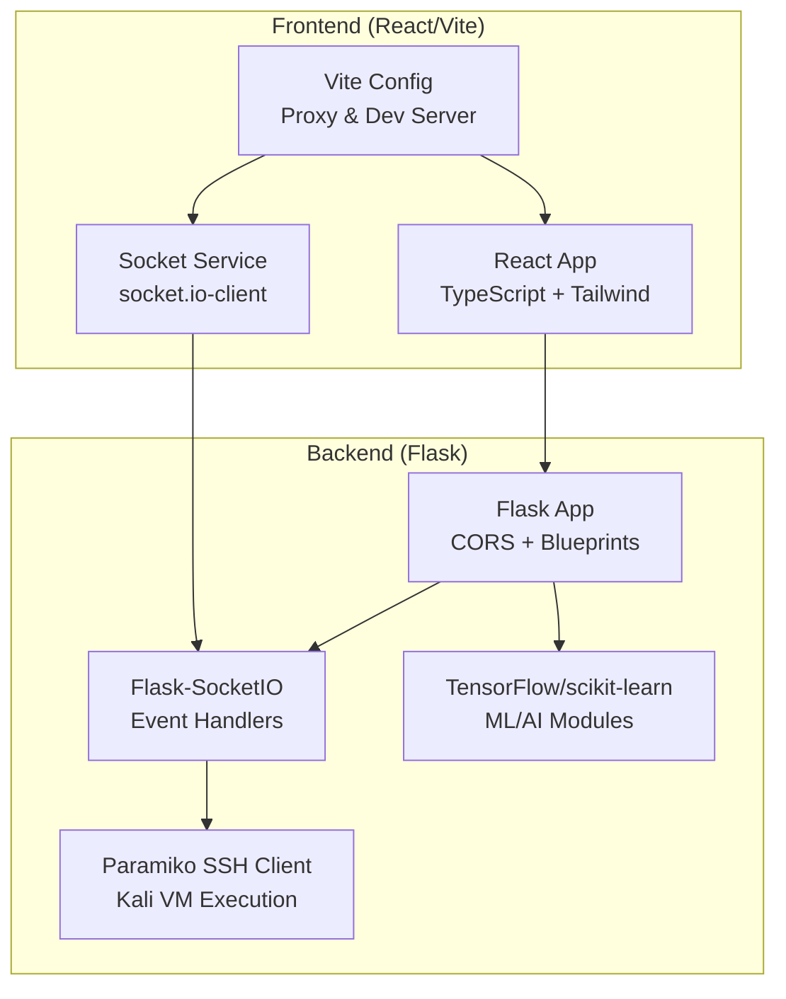
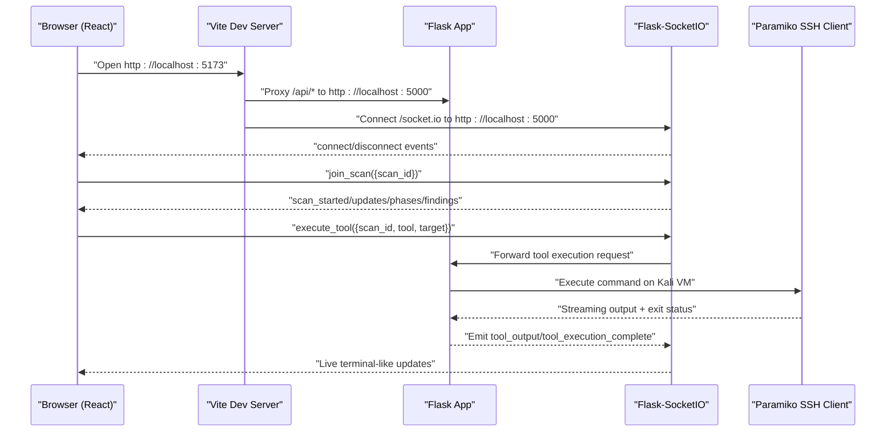
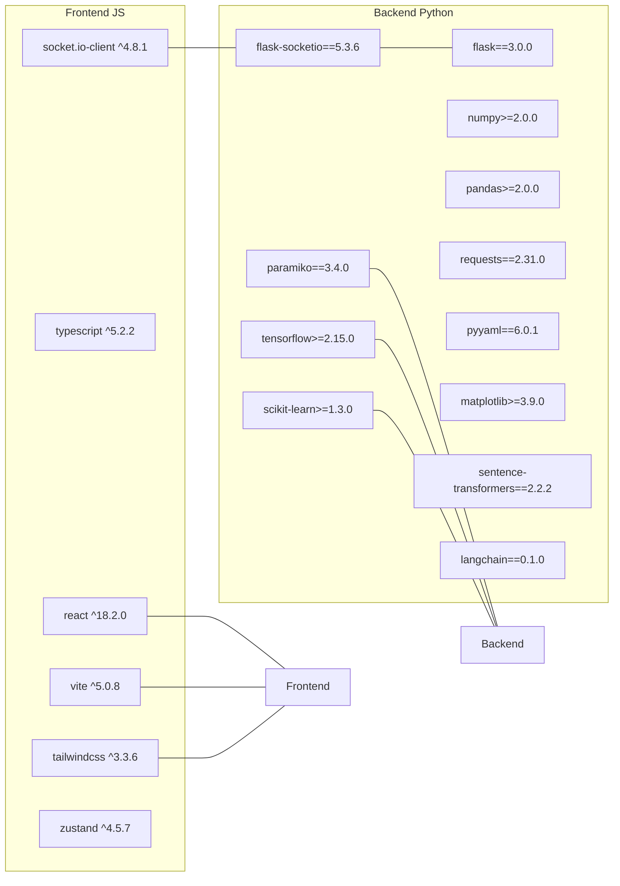

# Technology Stack and Dependencies

<cite>
**Referenced Files in This Document**
- [backend/requirements.txt](file://backend/requirements.txt)
- [backend/app.py](file://backend/app.py)
- [backend/config.py](file://backend/config.py)
- [backend/websocket/handlers.py](file://backend/websocket/handlers.py)
- [backend/execution/ssh_client.py](file://backend/execution/ssh_client.py)
- [backend/inference/autonomous_agent.py](file://backend/inference/autonomous_agent.py)
- [backend/preflight_check.py](file://backend/preflight_check.py)
- [frontend/package.json](file://frontend/package.json)
- [frontend/src/services/socket.ts](file://frontend/src/services/socket.ts)
- [frontend/src/config/index.ts](file://frontend/src/config/index.ts)
- [frontend/vite.config.ts](file://frontend/vite.config.ts)
- [frontend/tailwind.config.js](file://frontend/tailwind.config.js)
</cite>

## Table of Contents
1. [Introduction](#introduction)
2. [Project Structure](#project-structure)
3. [Core Components](#core-components)
4. [Architecture Overview](#architecture-overview)
5. [Detailed Component Analysis](#detailed-component-analysis)
6. [Dependency Analysis](#dependency-analysis)
7. [Performance Considerations](#performance-considerations)
8. [Security Considerations](#security-considerations)
9. [Development Environment Setup](#development-environment-setup)
10. [Containerization Options](#containerization-options)
11. [Third-Party Integrations](#third-party-integrations)
12. [Troubleshooting Guide](#troubleshooting-guide)
13. [Conclusion](#conclusion)

## Introduction
This document provides a comprehensive overview of the Optimus technology stack and dependencies spanning the Python backend and React frontend. It details the Python backend components built on Flask and Flask-SocketIO, Paramiko for SSH connectivity, TensorFlow and scikit-learn for AI/ML capabilities, and supporting libraries. On the frontend, it covers the React application written in TypeScript, styled with Tailwind CSS, powered by Vite, and integrated with Socket.IO client for real-time communication. The document also outlines dependency versions, compatibility requirements, integration patterns, development setup, containerization options, and security considerations.

## Project Structure
Optimus follows a clear separation between the backend (Python/Flask) and the frontend (React/Vite). The backend exposes REST APIs and WebSocket endpoints, manages AI/ML workflows, orchestrates penetration testing tools via SSH, and streams real-time updates to the frontend. The frontend proxies API and WebSocket traffic to the backend, renders interactive dashboards, and manages state with a lightweight store.

**Diagram sources**
- [frontend/vite.config.ts](file://frontend/vite.config.ts#L13-L34)
- [frontend/src/services/socket.ts](file://frontend/src/services/socket.ts#L1-L237)
- [backend/app.py](file://backend/app.py#L120-L163)
- [backend/websocket/handlers.py](file://backend/websocket/handlers.py#L26-L119)
- [backend/execution/ssh_client.py](file://backend/execution/ssh_client.py#L12-L78)
- [backend/requirements.txt](file://backend/requirements.txt#L1-L49)

**Section sources**
- [backend/app.py](file://backend/app.py#L120-L163)
- [frontend/vite.config.ts](file://frontend/vite.config.ts#L13-L34)

## Core Components
- Python Backend (Flask)
  - Flask application with CORS enabled and multiple blueprints for API routes.
  - Flask-SocketIO for real-time bidirectional communication.
  - Global state management for active scans and thread-safe access.
- SSH Execution (Paramiko)
  - Kali VM SSH client with configurable timeouts, retries, and keepalive.
  - Streaming command execution with non-blocking I/O and stall detection.
- AI/ML Stack
  - TensorFlow and scikit-learn for machine learning models and data processing.
  - Additional libraries for embeddings, LLM integration, and visualization.
- Frontend (React)
  - Vite-powered React application with TypeScript.
  - Socket.IO client for real-time updates and event-driven UI.
  - Tailwind CSS for styling with a cyber-themed design system.

**Section sources**
- [backend/app.py](file://backend/app.py#L120-L163)
- [backend/execution/ssh_client.py](file://backend/execution/ssh_client.py#L12-L78)
- [backend/requirements.txt](file://backend/requirements.txt#L1-L49)
- [frontend/package.json](file://frontend/package.json#L1-L50)

## Architecture Overview
The system architecture centers around a Flask backend exposing REST endpoints and WebSocket rooms for real-time scan updates. The frontend runs on Vite, proxies API and WebSocket traffic to the backend, and subscribes to scan rooms to receive live updates. The backend orchestrates AI/ML decision-making, tool selection, and SSH-based execution against a Kali Linux VM.

**Diagram sources**
- [frontend/vite.config.ts](file://frontend/vite.config.ts#L17-L33)
- [frontend/src/services/socket.ts](file://frontend/src/services/socket.ts#L83-L106)
- [backend/websocket/handlers.py](file://backend/websocket/handlers.py#L50-L119)
- [backend/execution/ssh_client.py](file://backend/execution/ssh_client.py#L87-L207)

## Detailed Component Analysis

### Backend Flask Application
- Initializes logging with a safe formatter for cross-platform compatibility.
- Configures CORS for multiple origins and credentials support.
- Sets up Flask-SocketIO with threading, ping intervals, and credential handling.
- Registers multiple blueprints for API routes and integrates intelligence and tool systems.
- Provides health check and root endpoints for monitoring and discovery.

**Section sources**
- [backend/app.py](file://backend/app.py#L90-L163)
- [backend/app.py](file://backend/app.py#L176-L275)
- [backend/app.py](file://backend/app.py#L276-L308)

### WebSocket Integration
- Centralized event handlers for client connections, room joining/leaving, tool execution requests, and recommendations.
- Emits structured events for scan lifecycle, phase transitions, tool execution, and findings.
- Maintains connected clients and room membership for targeted broadcasting.

**Section sources**
- [backend/websocket/handlers.py](file://backend/websocket/handlers.py#L26-L119)
- [backend/websocket/handlers.py](file://backend/websocket/handlers.py#L122-L314)

### SSH Client for Kali VM
- Establishes SSH connections with configurable retries, timeouts, and keepalive.
- Executes commands with PTY allocation, streaming output, and stall detection.
- Handles both key-based and password-based authentication.

**Section sources**
- [backend/execution/ssh_client.py](file://backend/execution/ssh_client.py#L12-L78)
- [backend/execution/ssh_client.py](file://backend/execution/ssh_client.py#L87-L207)

### AI/ML and Tool Orchestration
- Autonomous agent orchestrates scanning phases, tool selection, and learning.
- Integrates TensorFlow-based Deep RL agents and scikit-learn for data processing.
- Supports dynamic tool databases, knowledge bases, and strategy selection.

**Section sources**
- [backend/inference/autonomous_agent.py](file://backend/inference/autonomous_agent.py#L50-L132)
- [backend/inference/autonomous_agent.py](file://backend/inference/autonomous_agent.py#L133-L327)
- [backend/requirements.txt](file://backend/requirements.txt#L5-L49)

### Frontend Socket Service
- Singleton service wrapping socket.io-client with automatic reconnection and event subscriptions.
- Exposes typed event interfaces and convenience methods for joining scan rooms and emitting commands.
- Manages listener registration and unsubscription for clean-up.

**Section sources**
- [frontend/src/services/socket.ts](file://frontend/src/services/socket.ts#L64-L191)
- [frontend/src/services/socket.ts](file://frontend/src/services/socket.ts#L207-L232)

### Frontend Configuration and Build
- Vite dev server configured with proxy rules for API and WebSocket traffic.
- Environment-driven configuration for API and WebSocket URLs.
- Tailwind CSS configured with a cyber-themed color palette and animations.

**Section sources**
- [frontend/vite.config.ts](file://frontend/vite.config.ts#L13-L34)
- [frontend/src/config/index.ts](file://frontend/src/config/index.ts#L15-L23)
- [frontend/tailwind.config.js](file://frontend/tailwind.config.js#L1-L102)

## Dependency Analysis
The backend declares explicit versions for core libraries and optional AI/ML dependencies. The frontend defines React, TypeScript, Vite, and UI/client libraries. Cross-cutting concerns include environment configuration and runtime behavior.

**Diagram sources**
- [backend/requirements.txt](file://backend/requirements.txt#L1-L49)
- [frontend/package.json](file://frontend/package.json#L12-L32)

**Section sources**
- [backend/requirements.txt](file://backend/requirements.txt#L1-L49)
- [frontend/package.json](file://frontend/package.json#L12-L32)

## Performance Considerations
- Backend
  - Flask-SocketIO configured with threading and tuned ping intervals to balance responsiveness and resource usage.
  - SSH command execution uses non-blocking I/O and stall detection to prevent deadlocks during long-running scans.
  - Logging avoids encoding issues on Windows and writes to file for observability.
- Frontend
  - Vite dev server proxies API and WebSocket traffic to minimize cross-origin complexity.
  - Socket service maintains a singleton with efficient listener management to avoid memory leaks.

**Section sources**
- [backend/app.py](file://backend/app.py#L151-L163)
- [backend/execution/ssh_client.py](file://backend/execution/ssh_client.py#L123-L167)
- [frontend/vite.config.ts](file://frontend/vite.config.ts#L17-L33)
- [frontend/src/services/socket.ts](file://frontend/src/services/socket.ts#L165-L191)

## Security Considerations
- Backend
  - CORS configured per route prefix with credentials support; ensure production origins are locked down.
  - Secret key is configurable via environment; default value is present in code for development.
  - SSH client supports both key-based and password-based authentication; prefer key-based with restricted permissions.
  - Logging includes correlation IDs and sanitized Unicode for safer diagnostics.
- Frontend
  - Vite proxy targets localhost endpoints; ensure production deployment enforces HTTPS and secure cookies.
  - Socket service emits events only when connected; includes basic reconnection logic.
- AI/ML
  - TensorFlow and scikit-learn are used for model inference and data processing; ensure model artifacts are secured and validated.

**Section sources**
- [backend/app.py](file://backend/app.py#L124-L149)
- [backend/app.py](file://backend/app.py#L121)
- [backend/execution/ssh_client.py](file://backend/execution/ssh_client.py#L34-L53)
- [frontend/src/services/socket.ts](file://frontend/src/services/socket.ts#L196-L202)

## Development Environment Setup
- Backend
  - Install dependencies from the backend requirements file.
  - Set environment variables for Flask, SSH, and AI/ML configurations.
  - Run the Flask application with SocketIO; health endpoint confirms operational status.
- Frontend
  - Install dependencies from the frontend package file.
  - Start Vite dev server; it proxies API and WebSocket traffic to the backend.
  - Configure environment variables for API and WebSocket URLs if needed.

**Section sources**
- [backend/requirements.txt](file://backend/requirements.txt#L1-L49)
- [backend/config.py](file://backend/config.py#L6-L52)
- [backend/app.py](file://backend/app.py#L323-L340)
- [frontend/package.json](file://frontend/package.json#L6-L11)
- [frontend/vite.config.ts](file://frontend/vite.config.ts#L13-L34)

## Containerization Options
- The repository does not include Docker configuration files. To containerize:
  - Build a Python image with the backend application and installed dependencies.
  - Build a Node.js image with the frontend application and installed dependencies.
  - Expose ports 5000 (backend) and 5173 (frontend dev server).
  - Configure environment variables for backend services (e.g., SSH credentials, AI/ML endpoints).
  - Use a reverse proxy or single-page application hosting for production deployments.

[No sources needed since this section provides general guidance]

## Third-Party Integrations
- SSH Execution
  - Paramiko integrates with a Kali Linux VM for remote tool execution.
  - Authentication supports keys and passwords; timeouts and retries are configurable.
- AI/ML
  - TensorFlow and scikit-learn enable model training and inference.
  - Sentence Transformers and LangChain integrate embedding and LLM capabilities.
- Reporting and Visualization
  - ReportLab, WeasyPrint, and Python DocX for document generation.
  - Matplotlib and Seaborn for charts and visualizations.
- Frontend
  - Socket.IO client for real-time updates.
  - Radix UI, Recharts, and Tailwind CSS for UI components and styling.

**Section sources**
- [backend/execution/ssh_client.py](file://backend/execution/ssh_client.py#L12-L78)
- [backend/requirements.txt](file://backend/requirements.txt#L5-L49)
- [frontend/package.json](file://frontend/package.json#L12-L32)

## Troubleshooting Guide
- Preflight Checks
  - Use the preflight script to validate imports of core modules and optional dependencies.
- Backend Logs
  - Confirm logs directory creation and UTF-8 encoding handling on Windows.
- Frontend Proxy
  - Verify Vite proxy settings for API and WebSocket targets.
- SSH Connectivity
  - Adjust connection timeouts, retries, and keepalive settings if VM responsiveness varies.

**Section sources**
- [backend/preflight_check.py](file://backend/preflight_check.py#L35-L77)
- [backend/app.py](file://backend/app.py#L42-L47)
- [frontend/vite.config.ts](file://frontend/vite.config.ts#L17-L33)
- [backend/config.py](file://backend/config.py#L19-L23)

## Conclusion
Optimus combines a robust Python backend with Flask and Flask-SocketIO, Paramiko-based SSH execution, and a modern React frontend with TypeScript and Tailwind CSS. The AI/ML stack leverages TensorFlow and scikit-learn for intelligent decision-making and tool orchestration. The architecture emphasizes real-time communication, modular design, and cross-platform compatibility, with clear separation of concerns between frontend and backend services.