# Testing and Quality Assurance

<cite>
**Referenced Files in This Document**
- [evaluate_ml_models.py](file://backend/testing/evaluate_ml_models.py)
- [evaluate_rl_agent.py](file://backend/testing/evaluate_rl_agent.py)
- [simple_training_session.py](file://backend/testing/simple_training_session.py)
- [comprehensive_training_session.py](file://backend/testing/comprehensive_training_session.py)
- [demo_training_session.py](file://backend/testing/demo_training_session.py)
- [all_tools_training_session.py](file://backend/testing/all_tools_training_session.py)
- [training_session_1.py](file://backend/testing/training_session_1.py)
- [test_agent_and_reporting.py](file://backend/testing/test_agent_and_reporting.py)
- [test_agent_intelligence.py](file://backend/testing/test_agent_intelligence.py)
- [test_frontend_backend_integration.py](file://backend/testing/test_frontend_backend_integration.py)
- [test_knowledge_base.py](file://backend/testing/test_knowledge_base.py)
- [test_live_scan.py](file://backend/testing/test_live_scan.py)
- [training_targets.json](file://backend/testing/data/training_targets.json)
- [ml_training_state.json](file://backend/data/ml_training_state.json)
- [vulnerability_detector_evaluation.json](file://backend/evaluation_results/vulnerability_detector_evaluation.json)
- [rl_convergence_evaluation.json](file://backend/evaluation_results/rl_convergence_evaluation.json)
- [rl_exploration_evaluation.json](file://backend/evaluation_results/rl_exploration_evaluation.json)
- [rl_model_integrity_evaluation.json](file://backend/evaluation_results/rl_model_integrity_evaluation.json)
- [attack_classifier_evaluation.json](file://backend/evaluation_results/attack_classifier_evaluation.json)
- [rl_model_integrity_evaluation.json](file://backend/evaluation_results/rl_model_integrity_evaluation.json)
- [severity_predictor_evaluation.json](file://backend/evaluation_results/severity_predictor_evaluation.json)
</cite>

## Table of Contents
1. [Introduction](#introduction)
2. [Project Structure](#project-structure)
3. [Core Components](#core-components)
4. [Architecture Overview](#architecture-overview)
5. [Detailed Component Analysis](#detailed-component-analysis)
6. [Dependency Analysis](#dependency-analysis)
7. [Performance Considerations](#performance-considerations)
8. [Troubleshooting Guide](#troubleshooting-guide)
9. [Conclusion](#conclusion)
10. [Appendices](#appendices)

## Introduction
This document describes the testing and quality assurance systems within Optimus with a focus on validation and verification of AI/ML components and end-to-end workflows. It covers:
- Unit testing for individual components (agent intelligence, knowledge base, reporting)
- Integration testing for multi-component workflows (frontend-backend synchronization, live scans)
- Model performance evaluation for machine learning classifiers and regression predictors
- Reinforcement learning agent evaluation for convergence, exploration/exploitation balance, and model integrity
- Training data validation and cross-validation techniques to ensure reliable AI/ML systems
- Practical examples for creating test cases, automating testing procedures, and collecting quality metrics

The content aligns with terminology used in the codebase such as “training session,” “model evaluation,” and “performance testing.”

## Project Structure
The testing and QA assets are primarily located under backend/testing and backend/evaluation_results. Training data and logs are stored under backend/testing/data and backend/data respectively. The evaluation results are persisted to backend/evaluation_results for traceability and auditing.

```mermaid
graph TB
subgraph "Testing"
TS1["simple_training_session.py"]
TS2["comprehensive_training_session.py"]
TS3["demo_training_session.py"]
TS4["all_tools_training_session.py"]
TS5["training_session_1.py"]
U1["test_agent_and_reporting.py"]
U2["test_agent_intelligence.py"]
U3["test_knowledge_base.py"]
U4["test_frontend_backend_integration.py"]
U5["test_live_scan.py"]
EML["evaluate_ml_models.py"]
ERA["evaluate_rl_agent.py"]
TD["training_targets.json"]
MTS["ml_training_state.json"]
end
subgraph "Evaluation Outputs"
ER1["vulnerability_detector_evaluation.json"]
ER2["attack_classifier_evaluation.json"]
ER3["severity_predictor_evaluation.json"]
ER4["rl_convergence_evaluation.json"]
ER5["rl_exploration_evaluation.json"]
ER6["rl_model_integrity_evaluation.json"]
end
TS1 --> TD
TS2 --> TD
TS3 --> TD
TS4 --> TD
TS5 --> TD
EML --> ER1
EML --> ER2
EML --> ER3
ERA --> ER4
ERA --> ER5
ERA --> ER6
MTS --> ERA
```

**Diagram sources**
- [simple_training_session.py](file://backend/testing/simple_training_session.py#L1-L110)
- [comprehensive_training_session.py](file://backend/testing/comprehensive_training_session.py#L1-L116)
- [demo_training_session.py](file://backend/testing/demo_training_session.py#L1-L106)
- [all_tools_training_session.py](file://backend/testing/all_tools_training_session.py#L1-L102)
- [training_session_1.py](file://backend/testing/training_session_1.py#L1-L77)
- [test_agent_and_reporting.py](file://backend/testing/test_agent_and_reporting.py#L1-L129)
- [test_agent_intelligence.py](file://backend/testing/test_agent_intelligence.py#L1-L202)
- [test_knowledge_base.py](file://backend/testing/test_knowledge_base.py#L1-L131)
- [test_frontend_backend_integration.py](file://backend/testing/test_frontend_backend_integration.py#L1-L326)
- [test_live_scan.py](file://backend/testing/test_live_scan.py#L1-L97)
- [evaluate_ml_models.py](file://backend/testing/evaluate_ml_models.py#L1-L316)
- [evaluate_rl_agent.py](file://backend/testing/evaluate_rl_agent.py#L1-L223)
- [training_targets.json](file://backend/testing/data/training_targets.json)
- [ml_training_state.json](file://backend/data/ml_training_state.json)
- [vulnerability_detector_evaluation.json](file://backend/evaluation_results/vulnerability_detector_evaluation.json)
- [attack_classifier_evaluation.json](file://backend/evaluation_results/attack_classifier_evaluation.json)
- [severity_predictor_evaluation.json](file://backend/evaluation_results/severity_predictor_evaluation.json)
- [rl_convergence_evaluation.json](file://backend/evaluation_results/rl_convergence_evaluation.json)
- [rl_exploration_evaluation.json](file://backend/evaluation_results/rl_exploration_evaluation.json)
- [rl_model_integrity_evaluation.json](file://backend/evaluation_results/rl_model_integrity_evaluation.json)

**Section sources**
- [evaluate_ml_models.py](file://backend/testing/evaluate_ml_models.py#L1-L316)
- [evaluate_rl_agent.py](file://backend/testing/evaluate_rl_agent.py#L1-L223)
- [simple_training_session.py](file://backend/testing/simple_training_session.py#L1-L110)
- [comprehensive_training_session.py](file://backend/testing/comprehensive_training_session.py#L1-L116)
- [demo_training_session.py](file://backend/testing/demo_training_session.py#L1-L106)
- [all_tools_training_session.py](file://backend/testing/all_tools_training_session.py#L1-L102)
- [training_session_1.py](file://backend/testing/training_session_1.py#L1-L77)
- [test_agent_and_reporting.py](file://backend/testing/test_agent_and_reporting.py#L1-L129)
- [test_agent_intelligence.py](file://backend/testing/test_agent_intelligence.py#L1-L202)
- [test_frontend_backend_integration.py](file://backend/testing/test_frontend_backend_integration.py#L1-L326)
- [test_knowledge_base.py](file://backend/testing/test_knowledge_base.py#L1-L131)
- [test_live_scan.py](file://backend/testing/test_live_scan.py#L1-L97)
- [training_targets.json](file://backend/testing/data/training_targets.json)
- [ml_training_state.json](file://backend/data/ml_training_state.json)

## Core Components
- ML Model Evaluation Suite: Validates binary classification (vulnerability detector), multi-class classification (attack classifier), and regression (severity predictor) using held-out test sets and predefined success criteria.
- RL Agent Evaluation Suite: Assesses learning convergence, exploration/exploitation balance, and model file integrity using training state and model artifacts.
- Training Sessions: Automated “training session” scripts that execute tools against targets, collect findings, and log production data for later analysis.
- Unit Tests: Component-level tests for agent/reporting, intelligence behaviors, knowledge base mappings, and frontend-backend integration.
- Integration Tests: End-to-end tests validating live scans and cross-system synchronization.

Key success criteria and thresholds are embedded in evaluation modules to ensure reproducible quality gates.

**Section sources**
- [evaluate_ml_models.py](file://backend/testing/evaluate_ml_models.py#L25-L316)
- [evaluate_rl_agent.py](file://backend/testing/evaluate_rl_agent.py#L18-L223)
- [simple_training_session.py](file://backend/testing/simple_training_session.py#L13-L110)
- [comprehensive_training_session.py](file://backend/testing/comprehensive_training_session.py#L13-L116)
- [demo_training_session.py](file://backend/testing/demo_training_session.py#L12-L106)
- [all_tools_training_session.py](file://backend/testing/all_tools_training_session.py#L13-L102)
- [training_session_1.py](file://backend/testing/training_session_1.py#L12-L77)
- [test_agent_and_reporting.py](file://backend/testing/test_agent_and_reporting.py#L17-L129)
- [test_agent_intelligence.py](file://backend/testing/test_agent_intelligence.py#L11-L202)
- [test_frontend_backend_integration.py](file://backend/testing/test_frontend_backend_integration.py#L26-L326)
- [test_knowledge_base.py](file://backend/testing/test_knowledge_base.py#L15-L131)
- [test_live_scan.py](file://backend/testing/test_live_scan.py#L10-L97)

## Architecture Overview
The testing architecture integrates training sessions, evaluation suites, and unit/integration tests around shared data and artifacts. Training sessions produce logs and findings consumed by evaluation suites. Evaluation results are persisted for auditability.

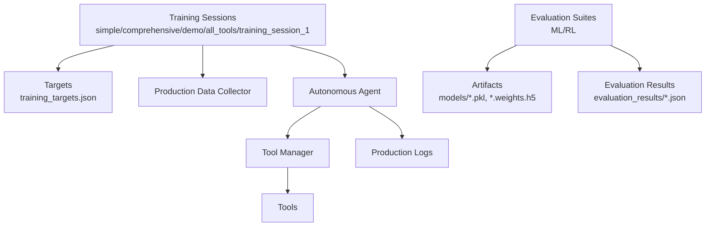

**Diagram sources**
- [simple_training_session.py](file://backend/testing/simple_training_session.py#L13-L110)
- [comprehensive_training_session.py](file://backend/testing/comprehensive_training_session.py#L13-L116)
- [demo_training_session.py](file://backend/testing/demo_training_session.py#L12-L106)
- [all_tools_training_session.py](file://backend/testing/all_tools_training_session.py#L13-L102)
- [training_session_1.py](file://backend/testing/training_session_1.py#L12-L77)
- [training_targets.json](file://backend/testing/data/training_targets.json)
- [evaluate_ml_models.py](file://backend/testing/evaluate_ml_models.py#L25-L316)
- [evaluate_rl_agent.py](file://backend/testing/evaluate_rl_agent.py#L18-L223)
- [vulnerability_detector_evaluation.json](file://backend/evaluation_results/vulnerability_detector_evaluation.json)
- [rl_model_integrity_evaluation.json](file://backend/evaluation_results/rl_model_integrity_evaluation.json)
- [severity_predictor_evaluation.json](file://backend/evaluation_results/severity_predictor_evaluation.json)

## Detailed Component Analysis

### ML Model Evaluation
The ML evaluation suite assesses three trained models:
- Vulnerability Detector (binary classification): success criteria include F1 ≥ 0.85, recall ≥ 0.80, precision ≥ 0.85.
- Attack Type Classifier (multi-class): macro F1 ≥ 0.80 with minimum per-class F1 ≥ 0.75 for critical attacks.
- Severity Predictor (regression): MAE ≤ 1.0, R² ≥ 0.75, severity band accuracy ≥ 0.85.

Metrics are computed using scikit-learn and results are persisted to evaluation_results.

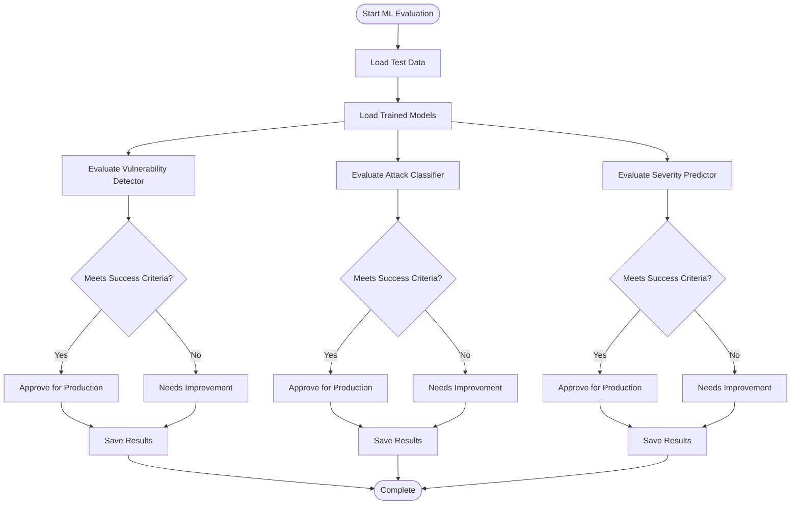

**Diagram sources**
- [evaluate_ml_models.py](file://backend/testing/evaluate_ml_models.py#L25-L316)
- [vulnerability_detector_evaluation.json](file://backend/evaluation_results/vulnerability_detector_evaluation.json)
- [attack_classifier_evaluation.json](file://backend/evaluation_results/attack_classifier_evaluation.json)
- [severity_predictor_evaluation.json](file://backend/evaluation_results/severity_predictor_evaluation.json)

**Section sources**
- [evaluate_ml_models.py](file://backend/testing/evaluate_ml_models.py#L25-L316)

### RL Agent Evaluation
The RL evaluation suite validates:
- Learning Convergence: sufficient training episodes and reward improvement trends.
- Exploration/Exploitation Balance: epsilon decay to ≤0.1.
- Model Integrity: existence and loadability of the RL model weights.

Results are persisted to evaluation_results for auditability.

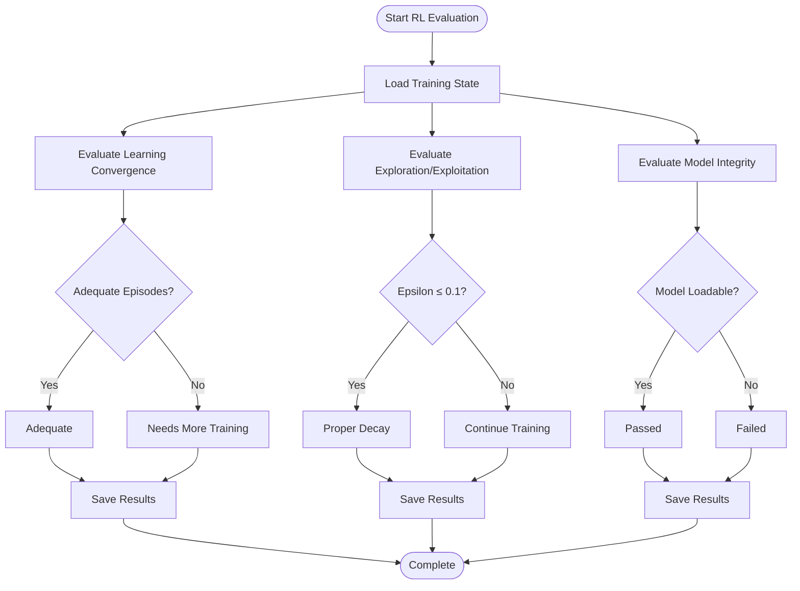

**Diagram sources**
- [evaluate_rl_agent.py](file://backend/testing/evaluate_rl_agent.py#L18-L223)
- [ml_training_state.json](file://backend/data/ml_training_state.json)
- [rl_convergence_evaluation.json](file://backend/evaluation_results/rl_convergence_evaluation.json)
- [rl_exploration_evaluation.json](file://backend/evaluation_results/rl_exploration_evaluation.json)
- [rl_model_integrity_evaluation.json](file://backend/evaluation_results/rl_model_integrity_evaluation.json)

**Section sources**
- [evaluate_rl_agent.py](file://backend/testing/evaluate_rl_agent.py#L18-L223)

### Training Sessions
Training sessions automate multi-tool execution against targets and log production data. They support:
- Simple training session: basic reconnaissance tools.
- Comprehensive training session: all available tools with autonomous agent.
- Demo training session: key tools for quick demonstrations.
- All-tools training session: agent-driven selection of tools.
- Training session 1: focus on reconnaissance and scanning phases.

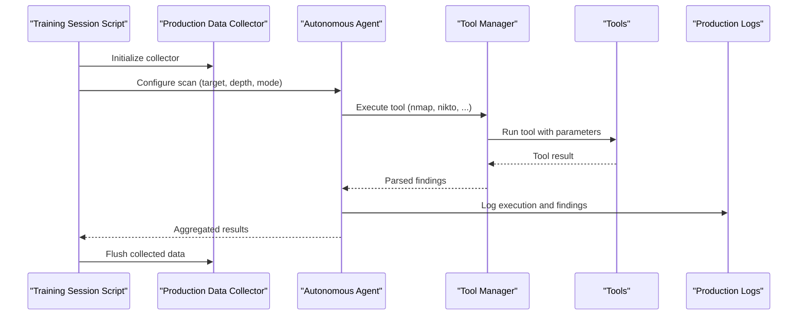

**Diagram sources**
- [simple_training_session.py](file://backend/testing/simple_training_session.py#L13-L110)
- [comprehensive_training_session.py](file://backend/testing/comprehensive_training_session.py#L13-L116)
- [demo_training_session.py](file://backend/testing/demo_training_session.py#L12-L106)
- [all_tools_training_session.py](file://backend/testing/all_tools_training_session.py#L13-L102)
- [training_session_1.py](file://backend/testing/training_session_1.py#L12-L77)

**Section sources**
- [simple_training_session.py](file://backend/testing/simple_training_session.py#L13-L110)
- [comprehensive_training_session.py](file://backend/testing/comprehensive_training_session.py#L13-L116)
- [demo_training_session.py](file://backend/testing/demo_training_session.py#L12-L106)
- [all_tools_training_session.py](file://backend/testing/all_tools_training_session.py#L13-L102)
- [training_session_1.py](file://backend/testing/training_session_1.py#L12-L77)

### Unit Tests: Agent and Reporting
Unit tests validate:
- Agent initialization and scan execution.
- Report generation structure and severity categorization.
- Mock-based assertions for deterministic outcomes.

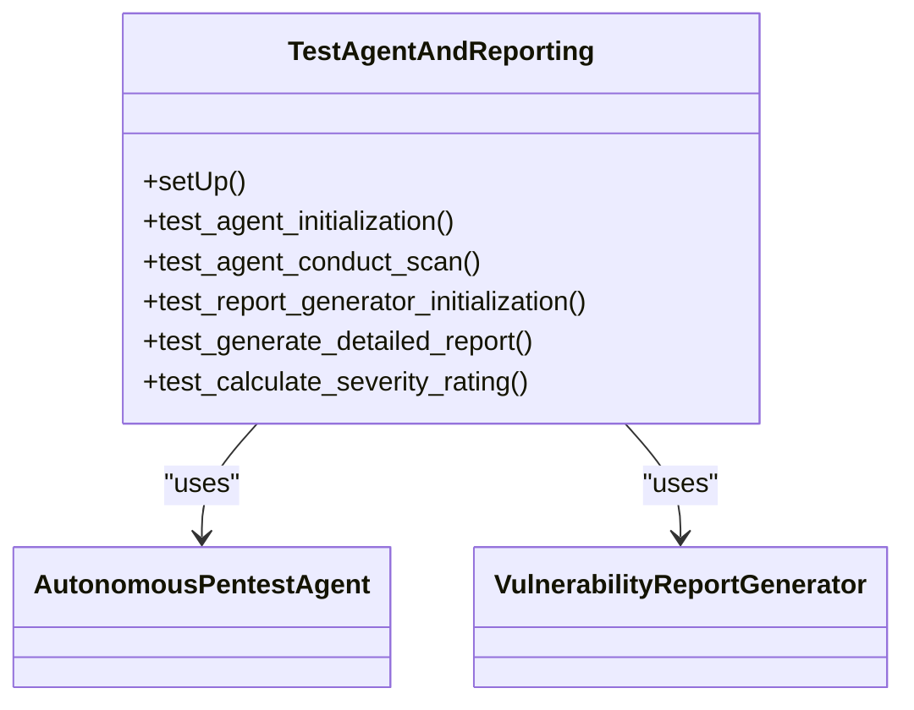

**Diagram sources**
- [test_agent_and_reporting.py](file://backend/testing/test_agent_and_reporting.py#L17-L129)

**Section sources**
- [test_agent_and_reporting.py](file://backend/testing/test_agent_and_reporting.py#L17-L129)

### Unit Tests: Agent Intelligence Behaviors
Unit tests validate:
- Tool repetition prevention via blacklisting.
- Automatic phase transitions when stuck.
- Dynamic command generation based on context.
- Graceful handling of missing API keys with fallbacks.
- Coverage calculation reflecting progress.

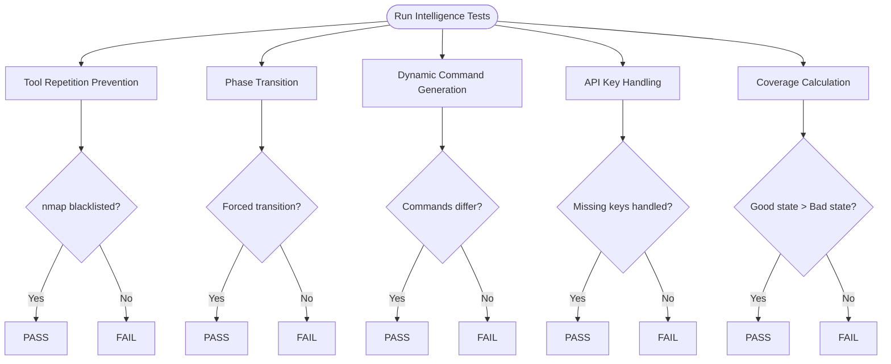

**Diagram sources**
- [test_agent_intelligence.py](file://backend/testing/test_agent_intelligence.py#L11-L202)

**Section sources**
- [test_agent_intelligence.py](file://backend/testing/test_agent_intelligence.py#L11-L202)

### Unit Tests: Knowledge Base
Unit tests validate:
- Initialization and retrieval of exploitation techniques, reproduction templates, and remediation knowledge.
- Mapping findings to CWE and OWASP categories.
- Adapting reproduction steps and providing language/framework-specific remediation.

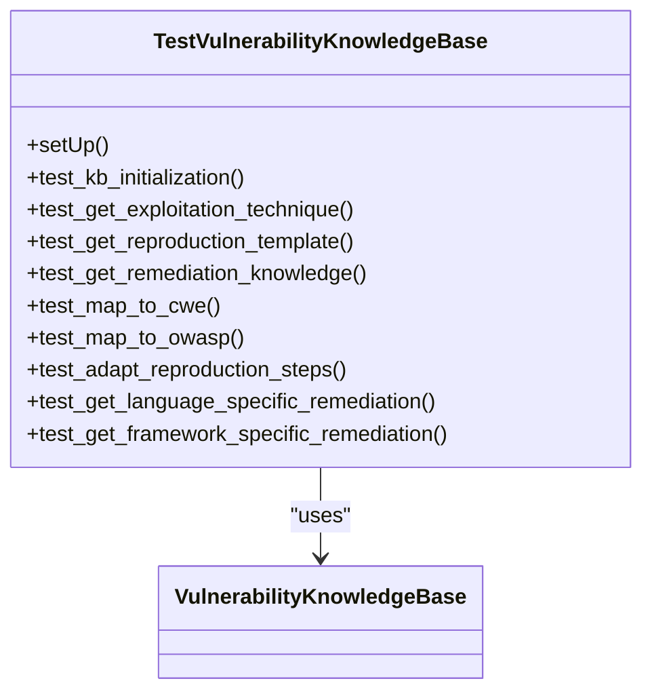

**Diagram sources**
- [test_knowledge_base.py](file://backend/testing/test_knowledge_base.py#L15-L131)

**Section sources**
- [test_knowledge_base.py](file://backend/testing/test_knowledge_base.py#L15-L131)

### Integration Tests: Frontend-Backend
Integration tests validate:
- Threading locks preventing race conditions in shared scan state.
- Unified scan data model across WebSocket and API.
- Correlation ID propagation and timestamp inclusion.
- Target validation enforced in backend.
- WebSocket and API synchronization.

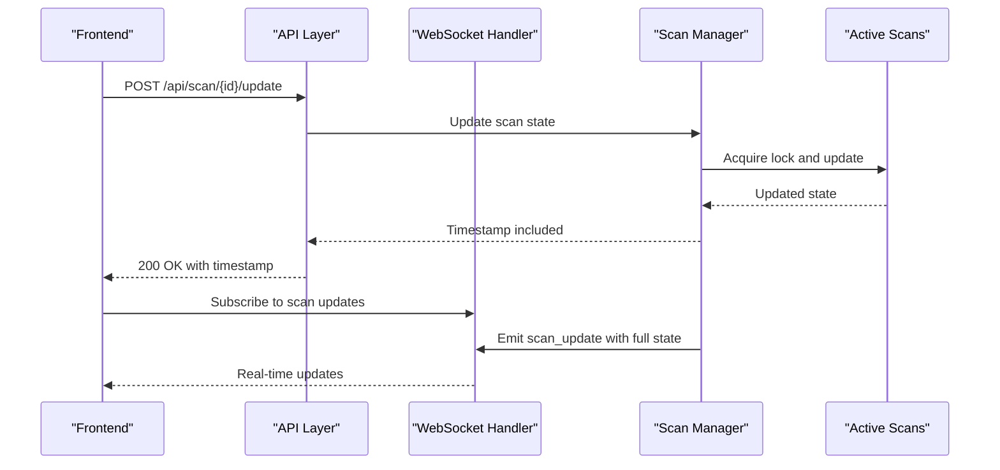

**Diagram sources**
- [test_frontend_backend_integration.py](file://backend/testing/test_frontend_backend_integration.py#L26-L326)

**Section sources**
- [test_frontend_backend_integration.py](file://backend/testing/test_frontend_backend_integration.py#L26-L326)

### Integration Tests: Live Scan
End-to-end integration test executes a complete autonomous scan against a target (e.g., OWASP Juice Shop) and verifies:
- Completion within iteration limits.
- Discovery of specific vulnerabilities (e.g., SQL injection).
- Coverage thresholds and absence of excessive tool repetition.

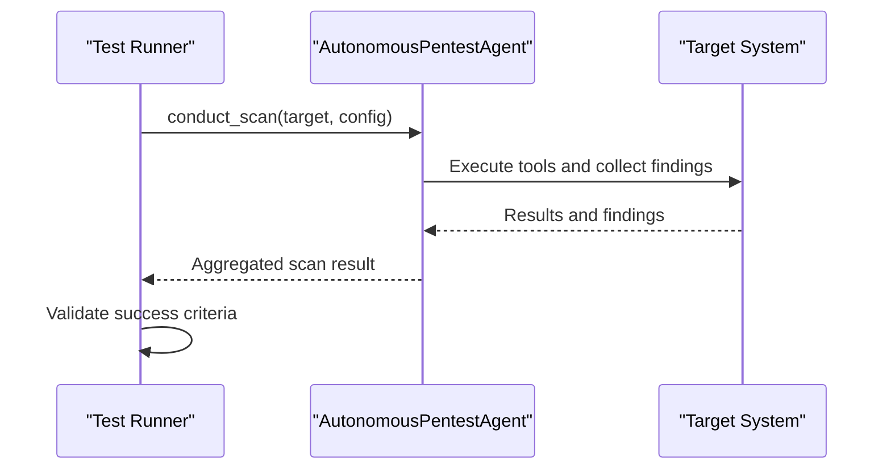

**Diagram sources**
- [test_live_scan.py](file://backend/testing/test_live_scan.py#L10-L97)

**Section sources**
- [test_live_scan.py](file://backend/testing/test_live_scan.py#L10-L97)

## Dependency Analysis
The testing components depend on shared modules and artifacts:
- Training sessions depend on production data collector and tool managers.
- Evaluation suites depend on trained models and training state.
- Unit/integration tests depend on mocked or real components and shared data models.

```mermaid
graph TB
U1["test_agent_and_reporting.py"] --> AG["autonomous_agent.py"]
U1 --> RG["report_generator.py"]
U2["test_agent_intelligence.py"] --> AG
U2 --> TC["phase_controller.py"]
U2 --> TK["tool_knowledge_base.py"]
U2 --> TSel["tool_selector.py"]
U3["test_knowledge_base.py"] --> KB["vulnerability_kb.py"]
U4["test_frontend_backend_integration.py"] --> APP["app.py"]
U4 --> SM["scan_engine.py"]
U4 --> WH["websocket_handlers.py"]
U5["test_live_scan.py"] --> AG
EML["evaluate_ml_models.py"] --> TR["training.feature_extractor"]
EML --> PR["training.pattern_extractor"]
ERA["evaluate_rl_agent.py"] --> RLTrainer["training.rl_trainer.py"]
ERA --> RLState["training.rl_state.py"]
TS["Training Sessions"] --> PM["production_data_collector.py"]
TS --> AG
TS --> TM["tool_manager.py"]
```

**Diagram sources**
- [test_agent_and_reporting.py](file://backend/testing/test_agent_and_reporting.py#L13-L14)
- [test_agent_intelligence.py](file://backend/testing/test_agent_intelligence.py#L7-L10)
- [test_knowledge_base.py](file://backend/testing/test_knowledge_base.py#L12)
- [test_frontend_backend_integration.py](file://backend/testing/test_frontend_backend_integration.py#L20-L23)
- [test_live_scan.py](file://backend/testing/test_live_scan.py#L6)
- [evaluate_ml_models.py](file://backend/testing/evaluate_ml_models.py#L22-L23)
- [evaluate_rl_agent.py](file://backend/testing/evaluate_rl_agent.py#L15-L16)
- [simple_training_session.py](file://backend/testing/simple_training_session.py#L8-L9)

**Section sources**
- [test_agent_and_reporting.py](file://backend/testing/test_agent_and_reporting.py#L13-L14)
- [test_agent_intelligence.py](file://backend/testing/test_agent_intelligence.py#L7-L10)
- [test_knowledge_base.py](file://backend/testing/test_knowledge_base.py#L12)
- [test_frontend_backend_integration.py](file://backend/testing/test_frontend_backend_integration.py#L20-L23)
- [test_live_scan.py](file://backend/testing/test_live_scan.py#L6)
- [evaluate_ml_models.py](file://backend/testing/evaluate_ml_models.py#L22-L23)
- [evaluate_rl_agent.py](file://backend/testing/evaluate_rl_agent.py#L15-L16)
- [simple_training_session.py](file://backend/testing/simple_training_session.py#L8-L9)

## Performance Considerations
- Training sessions should cap execution time per tool and per target to avoid resource exhaustion.
- Evaluation suites compute metrics on held-out datasets; synthetic data is acceptable for demos but replace with real test splits for production.
- RL evaluation relies on sufficient episodes and epsilon decay thresholds; insufficient training can lead to suboptimal decisions.
- Frontend-backend integration tests highlight the importance of thread-safe shared state and consistent data models to prevent race conditions and synchronization errors.

[No sources needed since this section provides general guidance]

## Troubleshooting Guide
Common issues and resolutions:
- Model file not found during evaluation: ensure models are saved to expected paths and accessible by evaluation scripts.
- Insufficient training episodes for RL: increase episode count or adjust training configuration.
- Missing API keys for tools: configure required credentials or rely on fallback tools.
- Race conditions in shared scan state: verify threading locks are used when updating active scans.
- Target validation failures: restrict targets to authorized domains and ensure backend validation is enforced.

**Section sources**
- [evaluate_ml_models.py](file://backend/testing/evaluate_ml_models.py#L53-L55)
- [evaluate_rl_agent.py](file://backend/testing/evaluate_rl_agent.py#L44-L46)
- [test_agent_intelligence.py](file://backend/testing/test_agent_intelligence.py#L102-L126)
- [test_frontend_backend_integration.py](file://backend/testing/test_frontend_backend_integration.py#L44-L73)
- [test_frontend_backend_integration.py](file://backend/testing/test_frontend_backend_integration.py#L200-L231)

## Conclusion
Optimus employs a layered testing strategy:
- Unit tests validate component behavior and data mappings.
- Integration tests ensure frontend-backend synchronization and end-to-end workflows.
- Model evaluation enforces strict success criteria for ML and RL systems.
- Training sessions provide controlled environments to validate tool execution and data collection.

These practices collectively improve system reliability, maintainability, and trustworthiness of AI/ML-driven security automation.

[No sources needed since this section summarizes without analyzing specific files]

## Appendices

### Practical Examples

- Creating a new training session:
  - Use the pattern from existing scripts to define targets, configure the agent, execute tools, and log results.
  - Reference: [simple_training_session.py](file://backend/testing/simple_training_session.py#L13-L110), [comprehensive_training_session.py](file://backend/testing/comprehensive_training_session.py#L13-L116)

- Running ML model evaluation:
  - Execute the evaluation script to compute metrics and persist results.
  - Reference: [evaluate_ml_models.py](file://backend/testing/evaluate_ml_models.py#L278-L316)

- Running RL agent evaluation:
  - Load training state and run convergence, exploration, and integrity tests.
  - Reference: [evaluate_rl_agent.py](file://backend/testing/evaluate_rl_agent.py#L174-L223)

- Writing unit tests:
  - Follow the structure in test modules to validate agent/reporting, intelligence behaviors, knowledge base mappings, and integration points.
  - References: [test_agent_and_reporting.py](file://backend/testing/test_agent_and_reporting.py#L17-L129), [test_agent_intelligence.py](file://backend/testing/test_agent_intelligence.py#L11-L202), [test_knowledge_base.py](file://backend/testing/test_knowledge_base.py#L15-L131), [test_frontend_backend_integration.py](file://backend/testing/test_frontend_backend_integration.py#L26-L326)

- Collecting quality metrics:
  - Persist evaluation results to evaluation_results for auditability and trend analysis.
  - References: [vulnerability_detector_evaluation.json](file://backend/evaluation_results/vulnerability_detector_evaluation.json), [rl_model_integrity_evaluation.json](file://backend/evaluation_results/rl_model_integrity_evaluation.json), [severity_predictor_evaluation.json](file://backend/evaluation_results/severity_predictor_evaluation.json)

[No sources needed since this section aggregates previously cited examples]