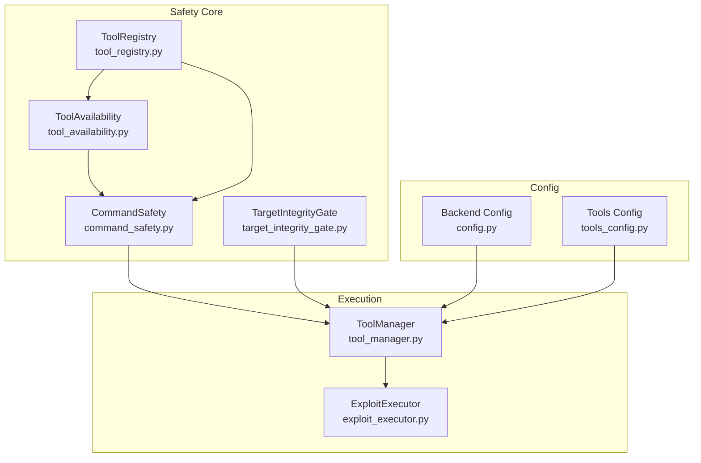
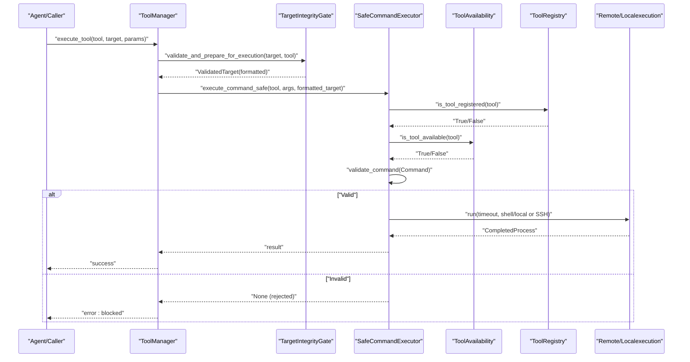
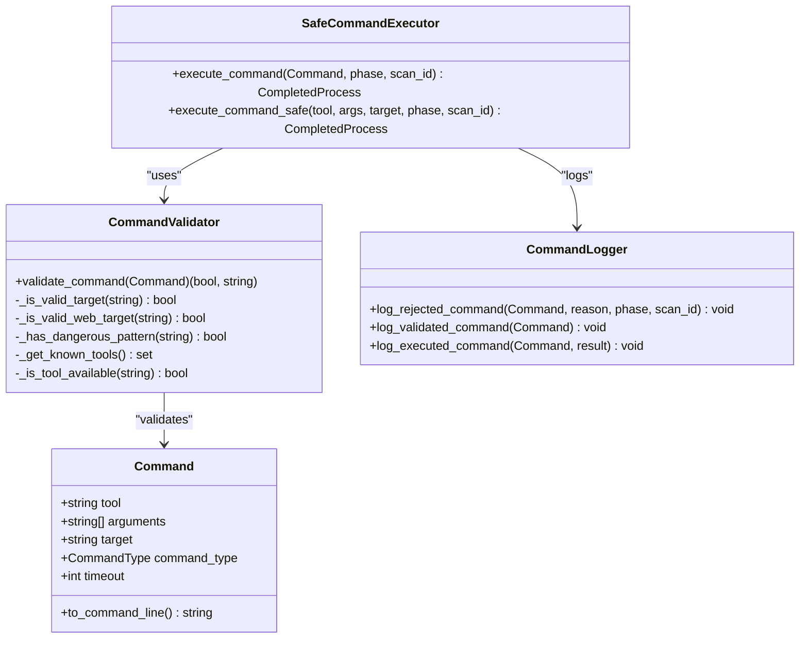
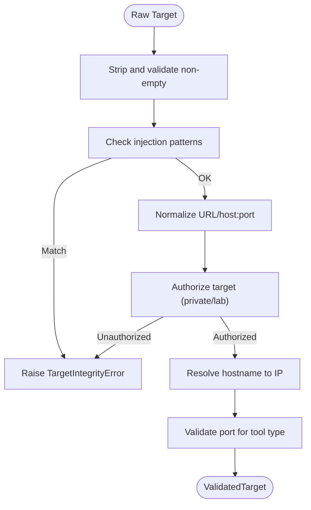
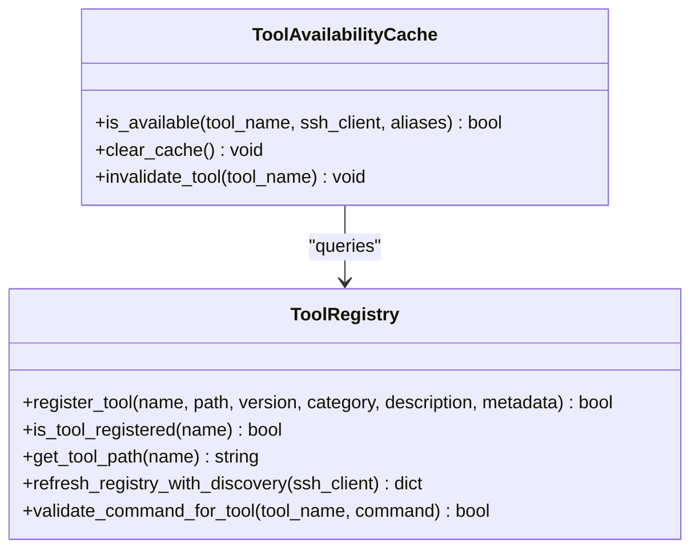
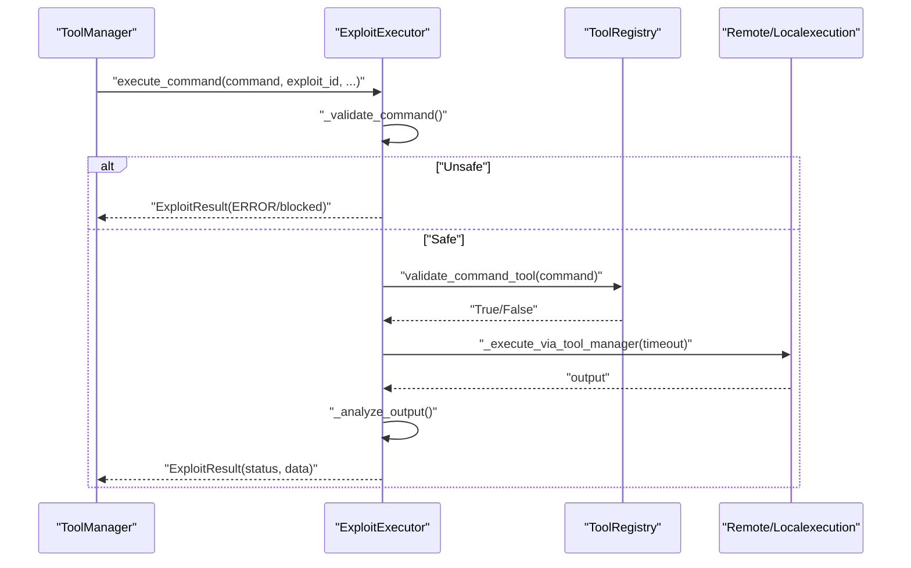
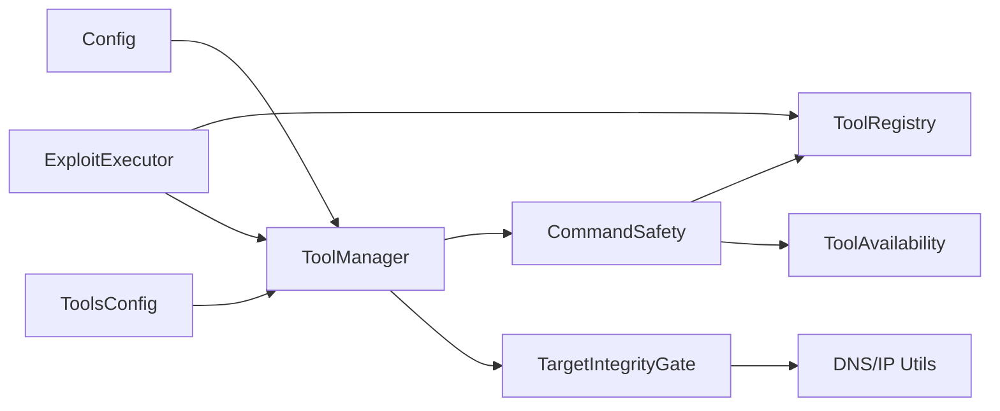

# Command Safety and Validation

<cite>
**Referenced Files in This Document**
- [command_safety.py](file://backend/inference/command_safety.py)
- [target_integrity_gate.py](file://backend/inference/target_integrity_gate.py)
- [tool_availability.py](file://backend/inference/tool_availability.py)
- [tool_registry.py](file://backend/inference/tool_registry.py)
- [tool_manager.py](file://backend/inference/tool_manager.py)
- [exploit_executor.py](file://backend/exploitation/exploit_executor.py)
- [tools_config.py](file://backend/config_pkg/tools_config.py)
- [config.py](file://backend/config.py)
- [test_post_exploitation_safety.py](file://backend/testing/test_post_exploitation_safety.py)
</cite>

## Table of Contents
1. [Introduction](#introduction)
2. [Project Structure](#project-structure)
3. [Core Components](#core-components)
4. [Architecture Overview](#architecture-overview)
5. [Detailed Component Analysis](#detailed-component-analysis)
6. [Dependency Analysis](#dependency-analysis)
7. [Performance Considerations](#performance-considerations)
8. [Troubleshooting Guide](#troubleshooting-guide)
9. [Conclusion](#conclusion)

## Introduction
This document describes the command safety and validation system that protects both target systems and the execution environment. It explains input sanitization to prevent command injection, the target integrity gate that validates targets before execution, and the command validation framework that analyzes tool commands for safety risks and policy compliance. It also documents configuration options for safety thresholds, allowed patterns, and emergency safeguards, and shows how exploit execution integrates with safety controls.

## Project Structure
The safety system spans several modules:
- Command safety and execution: command_safety.py
- Target integrity validation: target_integrity_gate.py
- Tool availability and registry: tool_availability.py, tool_registry.py
- Tool orchestration and execution: tool_manager.py
- Exploit execution safety: exploit_executor.py
- Configuration: config.py, tools_config.py
- Safety tests: test_post_exploitation_safety.py

**Diagram sources**
- [command_safety.py](file://backend/inference/command_safety.py#L1-L362)
- [target_integrity_gate.py](file://backend/inference/target_integrity_gate.py#L1-L366)
- [tool_availability.py](file://backend/inference/tool_availability.py#L1-L165)
- [tool_registry.py](file://backend/inference/tool_registry.py#L1-L567)
- [tool_manager.py](file://backend/inference/tool_manager.py#L1-L200)
- [exploit_executor.py](file://backend/exploitation/exploit_executor.py#L1-L729)
- [config.py](file://backend/config.py#L1-L115)
- [tools_config.py](file://backend/config_pkg/tools_config.py#L1-L63)

**Section sources**
- [command_safety.py](file://backend/inference/command_safety.py#L1-L362)
- [target_integrity_gate.py](file://backend/inference/target_integrity_gate.py#L1-L366)
- [tool_availability.py](file://backend/inference/tool_availability.py#L1-L165)
- [tool_registry.py](file://backend/inference/tool_registry.py#L1-L567)
- [tool_manager.py](file://backend/inference/tool_manager.py#L1-L200)
- [exploit_executor.py](file://backend/exploitation/exploit_executor.py#L1-L729)
- [config.py](file://backend/config.py#L1-L115)
- [tools_config.py](file://backend/config_pkg/tools_config.py#L1-L63)

## Core Components
- CommandSafety engine: validates commands, prevents injection, enforces timeouts, and executes via SSH or local process.
- TargetIntegrityGate: validates and normalizes targets, authorizes use, resolves hostnames, and enforces port constraints per tool type.
- ToolAvailability and ToolRegistry: maintain a ground-truth registry of tools, cache availability, and enforce that only registered tools are executed.
- ToolManager: orchestrates tool execution, integrates SSH, and coordinates safety gates.
- ExploitExecutor: validates and executes exploit commands with safety checks and result parsing.
- Configuration: environment-driven safety thresholds, timeouts, and allowed patterns.

**Section sources**
- [command_safety.py](file://backend/inference/command_safety.py#L91-L362)
- [target_integrity_gate.py](file://backend/inference/target_integrity_gate.py#L19-L366)
- [tool_availability.py](file://backend/inference/tool_availability.py#L15-L165)
- [tool_registry.py](file://backend/inference/tool_registry.py#L18-L567)
- [tool_manager.py](file://backend/inference/tool_manager.py#L49-L200)
- [exploit_executor.py](file://backend/exploitation/exploit_executor.py#L106-L729)
- [tools_config.py](file://backend/config_pkg/tools_config.py#L8-L63)
- [config.py](file://backend/config.py#L19-L35)

## Architecture Overview
The system enforces safety at multiple layers:
- Input sanitization and command construction prevent injection and double-target insertion.
- Target integrity gate validates targets, resolves hostnames, and enforces authorized/private networks.
- Tool registry and availability checks ensure only known, verified tools are used.
- Exploit executor adds additional safety checks for destructive patterns and parses outcomes.
- Configuration controls timeouts, allowed patterns, and operational parameters.

**Diagram sources**
- [tool_manager.py](file://backend/inference/tool_manager.py#L478-L509)
- [target_integrity_gate.py](file://backend/inference/target_integrity_gate.py#L333-L354)
- [command_safety.py](file://backend/inference/command_safety.py#L283-L362)
- [tool_registry.py](file://backend/inference/tool_registry.py#L474-L502)
- [tool_availability.py](file://backend/inference/tool_availability.py#L155-L165)

## Detailed Component Analysis

### Command Safety Engine
The CommandSafety engine constructs safe command lines, prevents double injection, and enforces timeouts. It validates targets, arguments, and command types, and executes via SSH or local process with logging and error handling.

Key behaviors:
- Command construction avoids duplicating the target in the command line.
- Adds conservative nmap timeouts for external targets and faster defaults for internal targets.
- Validates targets using IP/domain/URL/CIDR/port patterns.
- Blocks dangerous argument patterns (pipes, redirections, eval/exec, shell invocation).
- Enforces per-command timeouts and logs rejection/execution events.

**Diagram sources**
- [command_safety.py](file://backend/inference/command_safety.py#L27-L362)

**Section sources**
- [command_safety.py](file://backend/inference/command_safety.py#L27-L362)

### Target Integrity Gate
The TargetIntegrityGate validates raw targets, normalizes formats, checks authorization, resolves hostnames to IPs, and enforces tool-specific port constraints. It raises explicit errors for unauthorized or malformed targets.

Key behaviors:
- Rejects injection attempts in raw targets.
- Authorizes localhost/private networks and known lab domains.
- Resolves hostnames and validates IP/port formats.
- Enforces standard ports per tool category.
- Produces a unified validated target for downstream execution.

**Diagram sources**
- [target_integrity_gate.py](file://backend/inference/target_integrity_gate.py#L67-L354)

**Section sources**
- [target_integrity_gate.py](file://backend/inference/target_integrity_gate.py#L19-L366)

### Tool Availability and Registry
The ToolRegistry maintains a ground-truth database of tools and modules, ensuring only registered tools are executed. ToolAvailability caches checks with TTL and supports discovery and registration.

Key behaviors:
- Registers tools after verifying executability and path.
- Validates commands use registered tools.
- Caches availability with TTL and supports SSH-based discovery.
- Integrates with CommandValidator for tool presence checks.

**Diagram sources**
- [tool_registry.py](file://backend/inference/tool_registry.py#L18-L567)
- [tool_availability.py](file://backend/inference/tool_availability.py#L15-L165)

**Section sources**
- [tool_registry.py](file://backend/inference/tool_registry.py#L18-L567)
- [tool_availability.py](file://backend/inference/tool_availability.py#L15-L165)

### Exploit Execution Safety
ExploitExecutor validates commands for destructive patterns, executes via ToolManager, and parses results to determine success, partial, blocked, or failure states. It extracts credentials, databases, and files, and generates recommendations.

Key behaviors:
- Blocks known destructive patterns and unsafe commands unless explicitly allowed.
- Executes via ToolManager’s SSH-capable pipeline.
- Parses output for WAF, errors, shell, and data indicators.
- Maintains execution history and statistics.

**Diagram sources**
- [exploit_executor.py](file://backend/exploitation/exploit_executor.py#L273-L533)
- [tool_registry.py](file://backend/inference/tool_registry.py#L474-L502)
- [tool_manager.py](file://backend/inference/tool_manager.py#L478-L509)

**Section sources**
- [exploit_executor.py](file://backend/exploitation/exploit_executor.py#L106-L729)
- [tool_registry.py](file://backend/inference/tool_registry.py#L474-L502)
- [tool_manager.py](file://backend/inference/tool_manager.py#L478-L509)

### Safety Validation Workflows and Examples
Concrete examples from the codebase demonstrate safety validation:
- Double-target prevention in command construction.
- Target integrity gate rejecting unauthorized targets and resolving hostnames.
- Tool availability checks via registry and cache.
- Exploit executor blocking destructive patterns.

Examples by file path:
- Double-target prevention: [command_safety.py](file://backend/inference/command_safety.py#L36-L58)
- Injection detection in raw targets: [target_integrity_gate.py](file://backend/inference/target_integrity_gate.py#L88-L99)
- Tool registry validation: [tool_registry.py](file://backend/inference/tool_registry.py#L474-L502)
- Destructive pattern blocking: [exploit_executor.py](file://backend/exploitation/exploit_executor.py#L394-L414)

**Section sources**
- [command_safety.py](file://backend/inference/command_safety.py#L36-L58)
- [target_integrity_gate.py](file://backend/inference/target_integrity_gate.py#L88-L99)
- [tool_registry.py](file://backend/inference/tool_registry.py#L474-L502)
- [exploit_executor.py](file://backend/exploitation/exploit_executor.py#L394-L414)

### Configuration Options for Safety
Environment-driven safety controls:
- Backend timeouts and SSH tuning: [config.py](file://backend/config.py#L19-L35)
- Tools execution timeout and blocked patterns: [tools_config.py](file://backend/config_pkg/tools_config.py#L26-L63)
- Tool categories and phases: [config.py](file://backend/config.py#L88-L115)

Operational guidance:
- Adjust KALI_COMMAND_TIMEOUT for long-running scans.
- Tune ToolsConfig.blocked_command_patterns to align with organizational policy.
- Use ToolAvailabilityCache TTL to balance freshness and performance.

**Section sources**
- [config.py](file://backend/config.py#L19-L35)
- [config.py](file://backend/config.py#L88-L115)
- [tools_config.py](file://backend/config_pkg/tools_config.py#L26-L63)

### Integration with Exploit Execution and Safety Controls
ExploitExecutor integrates with ToolManager and ToolRegistry to ensure only registered tools are used and commands are validated before execution. It also parses results to inform subsequent actions and recommendations.

- Integration points: [exploit_executor.py](file://backend/exploitation/exploit_executor.py#L106-L153)
- Tool selection and execution: [tool_manager.py](file://backend/inference/tool_manager.py#L478-L509)
- Registry validation: [tool_registry.py](file://backend/inference/tool_registry.py#L474-L502)

**Section sources**
- [exploit_executor.py](file://backend/exploitation/exploit_executor.py#L106-L153)
- [tool_manager.py](file://backend/inference/tool_manager.py#L478-L509)
- [tool_registry.py](file://backend/inference/tool_registry.py#L474-L502)

## Dependency Analysis
The safety system exhibits strong cohesion around validation and execution, with clear boundaries:
- CommandSafety depends on ToolRegistry and ToolAvailability for tool validation.
- TargetIntegrityGate depends on DNS resolution and IP validation.
- ExploitExecutor depends on ToolRegistry for command validation and ToolManager for execution.
- ToolManager orchestrates all components and applies configuration-driven timeouts.

**Diagram sources**
- [command_safety.py](file://backend/inference/command_safety.py#L91-L144)
- [target_integrity_gate.py](file://backend/inference/target_integrity_gate.py#L156-L176)
- [exploit_executor.py](file://backend/exploitation/exploit_executor.py#L128-L153)
- [tool_manager.py](file://backend/inference/tool_manager.py#L49-L130)
- [config.py](file://backend/config.py#L19-L35)
- [tools_config.py](file://backend/config_pkg/tools_config.py#L26-L63)

**Section sources**
- [command_safety.py](file://backend/inference/command_safety.py#L91-L144)
- [target_integrity_gate.py](file://backend/inference/target_integrity_gate.py#L156-L176)
- [exploit_executor.py](file://backend/exploitation/exploit_executor.py#L128-L153)
- [tool_manager.py](file://backend/inference/tool_manager.py#L49-L130)
- [config.py](file://backend/config.py#L19-L35)
- [tools_config.py](file://backend/config_pkg/tools_config.py#L26-L63)

## Performance Considerations
- ToolAvailabilityCache reduces repeated discovery overhead with TTL-based caching.
- Target resolution occurs once per target normalization; cache results where feasible.
- Command construction avoids shell=True for local execution when possible to reduce parsing overhead.
- ExploitExecutor truncates output for performance and memory safety.

[No sources needed since this section provides general guidance]

## Troubleshooting Guide
Common safety violations and remedies:
- Unauthorized targets: Blocked by TargetIntegrityGate; ensure targets are localhost/private/lab domains.
  - Reference: [target_integrity_gate.py](file://backend/inference/target_integrity_gate.py#L107-L154)
- Dangerous patterns in arguments: Blocked by CommandValidator; sanitize inputs and avoid pipes/redirections.
  - Reference: [command_safety.py](file://backend/inference/command_safety.py#L232-L256)
- Unregistered tools: Blocked by ToolRegistry; register tools via discovery or manual registration.
  - Reference: [tool_registry.py](file://backend/inference/tool_registry.py#L191-L208)
- Destructive commands: Blocked by ExploitExecutor; adjust patterns or use safer techniques.
  - Reference: [exploit_executor.py](file://backend/exploitation/exploit_executor.py#L394-L414)
- Excessive timeouts: Post-exploitation safety tests enforce rate limiting and timeout caps.
  - Reference: [test_post_exploitation_safety.py](file://backend/testing/test_post_exploitation_safety.py#L91-L144)

Emergency response procedures:
- Immediate isolation: Stop execution, disable affected modules, and audit logs.
- Review logs: CommandLogger and TargetIntegrityGate emit detailed warnings/errors.
  - References: [command_safety.py](file://backend/inference/command_safety.py#L259-L281), [target_integrity_gate.py](file://backend/inference/target_integrity_gate.py#L14-L16)
- Policy updates: Adjust ToolsConfig.blocked_command_patterns and backend timeouts.
  - References: [tools_config.py](file://backend/config_pkg/tools_config.py#L26-L48), [config.py](file://backend/config.py#L19-L35)

**Section sources**
- [target_integrity_gate.py](file://backend/inference/target_integrity_gate.py#L107-L154)
- [command_safety.py](file://backend/inference/command_safety.py#L232-L256)
- [tool_registry.py](file://backend/inference/tool_registry.py#L191-L208)
- [exploit_executor.py](file://backend/exploitation/exploit_executor.py#L394-L414)
- [test_post_exploitation_safety.py](file://backend/testing/test_post_exploitation_safety.py#L91-L144)
- [tools_config.py](file://backend/config_pkg/tools_config.py#L26-L48)
- [config.py](file://backend/config.py#L19-L35)

## Conclusion
The command safety and validation system enforces strict safety boundaries across input sanitization, target integrity, tool registry verification, and exploit execution. By combining explicit validation rules, authorization gates, and configuration-driven controls, it protects both target systems and the execution environment while enabling effective penetration testing automation.

[No sources needed since this section summarizes without analyzing specific files]