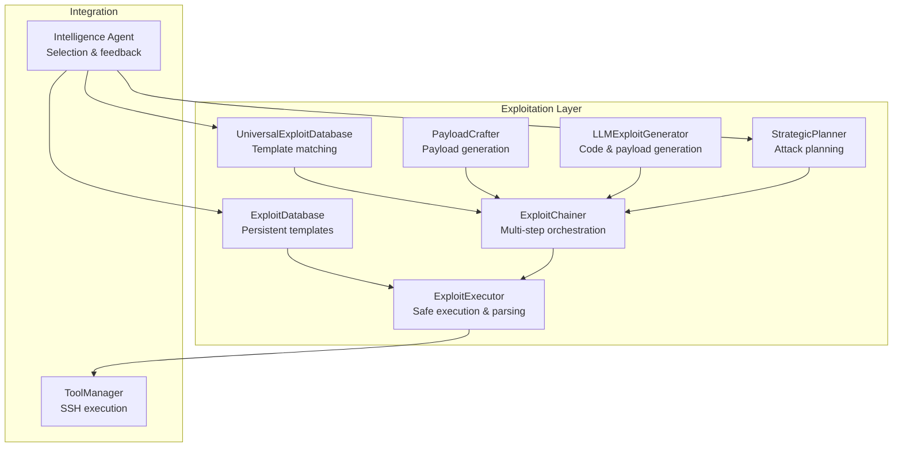
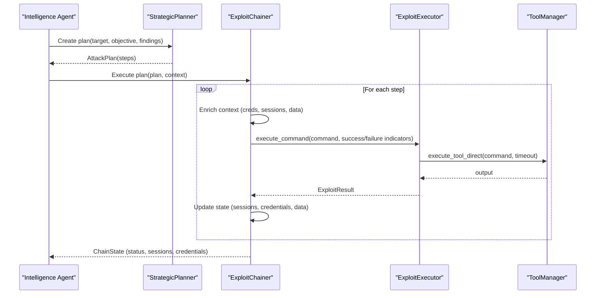
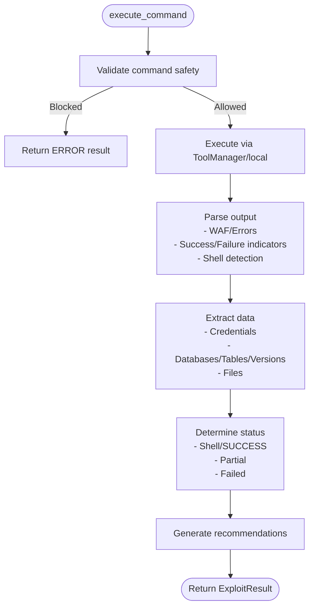
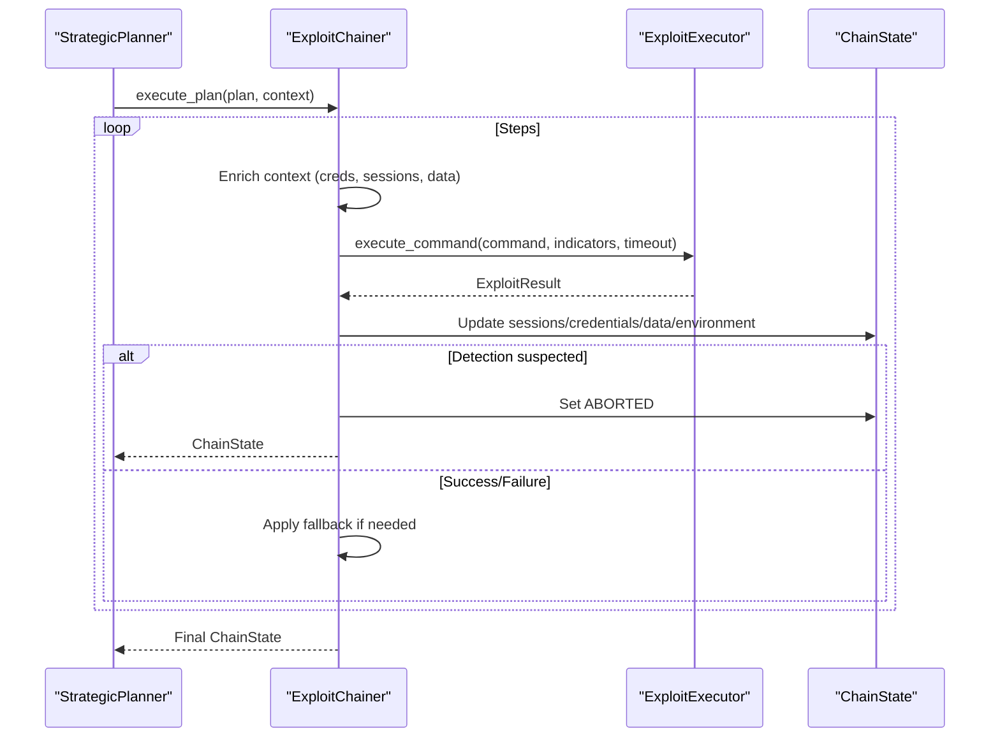
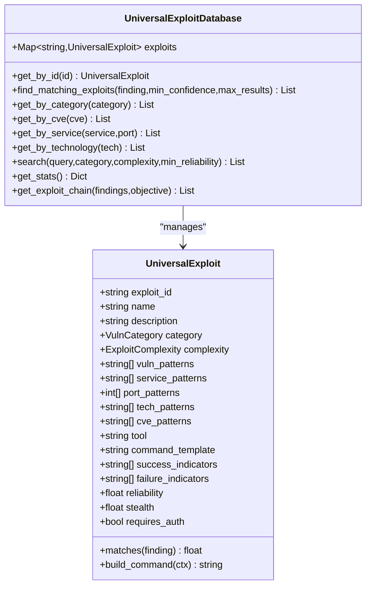
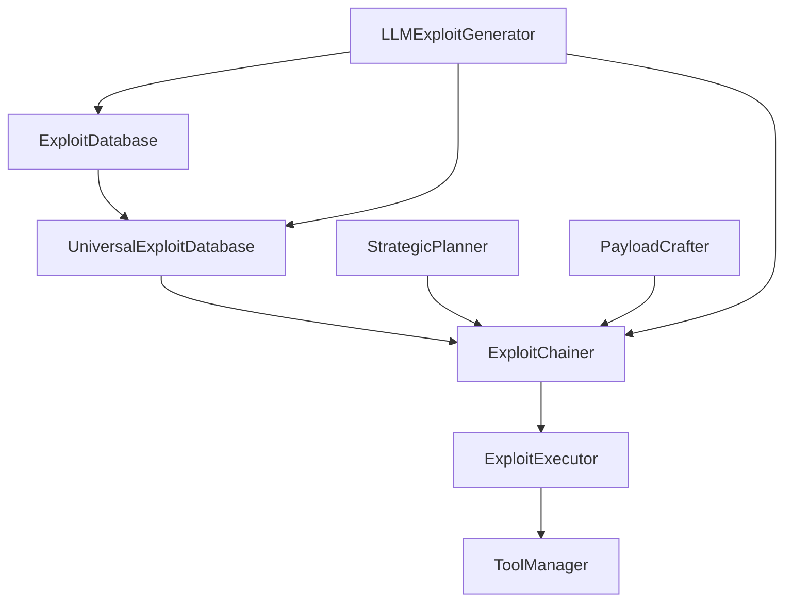

# Exploit Execution and Management

<cite>
**Referenced Files in This Document**
- [exploit_executor.py](file://backend/exploitation/exploit_executor.py)
- [exploit_chainer.py](file://backend/exploitation/exploit_chainer.py)
- [universal_exploits.py](file://backend/exploitation/universal_exploits.py)
- [exploit_db.py](file://backend/exploitation/exploit_db.py)
- [payload_crafter.py](file://backend/exploitation/payload_crafter.py)
- [llm_generator.py](file://backend/exploitation/llm_generator.py)
- [strategic_planner.py](file://backend/exploitation/strategic_planner.py)
- [exploit_templates.json](file://backend/exploitation/data/exploit_templates.json)
- [__init__.py](file://backend/exploitation/__init__.py)
</cite>

## Table of Contents
1. [Introduction](#introduction)
2. [Project Structure](#project-structure)
3. [Core Components](#core-components)
4. [Architecture Overview](#architecture-overview)
5. [Detailed Component Analysis](#detailed-component-analysis)
6. [Dependency Analysis](#dependency-analysis)
7. [Performance Considerations](#performance-considerations)
8. [Troubleshooting Guide](#troubleshooting-guide)
9. [Conclusion](#conclusion)

## Introduction
This document describes the exploit execution and management system in the Optimus penetration testing framework. It covers three pillars:
- Exploit Executor: Safe, validated execution of commands with result parsing and feedback.
- Exploit Chainer: Multi-step orchestration across vulnerabilities with state management and fallbacks.
- Universal Exploits Framework: Standardized templates and matching for consistent execution across diverse vulnerability classes.

It also documents configuration options, integration with the intelligence system for exploit selection, and operational safeguards such as safety validation and detection avoidance.

## Project Structure
The exploit subsystem resides under backend/exploitation and exposes a cohesive API surface for exploitation tasks. Key modules include:
- Executor: Validates commands, executes via ToolManager, parses output, and aggregates results.
- Chainer: Builds attack plans, orchestrates step execution, tracks state, and adapts on failure.
- Universal Exploits: A curated database of exploit templates for rapid matching and execution.
- Exploit DB: Persistent template storage with categories, indicators, and reliability metadata.
- Payload Crafter: Generates and encodes payloads for multiple exploit types.
- LLM Generator: Creates custom exploits, adapts payloads for WAF bypass, and designs attack chains.
- Strategic Planner: Translates high-level objectives into actionable steps aligned with MITRE ATT&CK.

**Diagram sources**
- [exploit_executor.py](file://backend/exploitation/exploit_executor.py#L106-L729)
- [exploit_chainer.py](file://backend/exploitation/exploit_chainer.py#L256-L800)
- [universal_exploits.py](file://backend/exploitation/universal_exploits.py#L441-L546)
- [exploit_db.py](file://backend/exploitation/exploit_db.py#L186-L944)
- [payload_crafter.py](file://backend/exploitation/payload_crafter.py#L103-L851)
- [llm_generator.py](file://backend/exploitation/llm_generator.py#L93-L833)
- [strategic_planner.py](file://backend/exploitation/strategic_planner.py#L181-L662)

**Section sources**
- [__init__.py](file://backend/exploitation/__init__.py#L1-L176)

## Core Components
- ExploitExecutor
  - Validates commands against dangerous patterns, executes via ToolManager or local subprocess, and parses output into structured results.
  - Extracts credentials, databases, tables, versions, and files; detects shells and WAF/IPS blocks.
  - Provides success rate tracking and execution statistics.
- ExploitChainer
  - Executes AttackPlan step-by-step, enriching context with discovered credentials, sessions, and data.
  - Implements retry/adaptation loops, fallback strategies, and detection-aware aborts.
  - Emits real-time events for step completion, session establishment, and credential discovery.
- UniversalExploitDatabase
  - Maintains a catalog of exploit templates across categories (e.g., SQLi, XSS, LFI, SSRF, Auth, Privesc).
  - Matches findings to templates with confidence scoring and builds commands with standardized placeholders.
- ExploitDatabase
  - Persistent JSON-backed template store with categories, success/failure indicators, reliability, and tool mappings.
- PayloadCrafter
  - Generates payloads for reverse shells, SQLi, XSS, command injection, and LFI with encoding and WAF evasion.
- LLMExploitGenerator
  - Generates custom exploit code, adapts payloads for WAF bypass, and creates multi-step attack chains.
- StrategicPlanner
  - Translates objectives into MITRE-aligned AttackSteps, supports fallbacks, and adapts plans dynamically.

**Section sources**
- [exploit_executor.py](file://backend/exploitation/exploit_executor.py#L106-L729)
- [exploit_chainer.py](file://backend/exploitation/exploit_chainer.py#L256-L800)
- [universal_exploits.py](file://backend/exploitation/universal_exploits.py#L441-L546)
- [exploit_db.py](file://backend/exploitation/exploit_db.py#L186-L944)
- [payload_crafter.py](file://backend/exploitation/payload_crafter.py#L103-L851)
- [llm_generator.py](file://backend/exploitation/llm_generator.py#L93-L833)
- [strategic_planner.py](file://backend/exploitation/strategic_planner.py#L181-L662)

## Architecture Overview
The system integrates exploitation modules with the ToolManager for remote execution and with the intelligence agent for selection and feedback. The flow begins with StrategicPlanner creating AttackPlans, followed by ExploitChainer orchestrating steps, and finally ExploitExecutor executing commands with robust validation and parsing.

**Diagram sources**
- [strategic_planner.py](file://backend/exploitation/strategic_planner.py#L266-L316)
- [exploit_chainer.py](file://backend/exploitation/exploit_chainer.py#L345-L462)
- [exploit_executor.py](file://backend/exploitation/exploit_executor.py#L273-L357)

## Detailed Component Analysis

### Exploit Executor
Responsibilities:
- Command validation against destructive patterns and dangerous flags.
- Execution via ToolManager with timeout handling and local fallback.
- Output parsing for success/failure indicators, shell detection, WAF blocks, and error conditions.
- Structured result extraction for credentials, databases, tables, versions, and files.
- Recommendations and execution statistics for learning and adaptation.

Key behaviors:
- Safety validation prevents destructive commands unless explicitly allowed.
- Timeout and exception handling produce structured results with recommendations.
- Extraction patterns cover databases, tables, versions, file content, and shell indicators.
- Success determination considers shell acquisition, success indicators, partial vs. failure, and data extraction.

**Diagram sources**
- [exploit_executor.py](file://backend/exploitation/exploit_executor.py#L273-L534)

**Section sources**
- [exploit_executor.py](file://backend/exploitation/exploit_executor.py#L106-L729)

### Exploit Chainer
Responsibilities:
- Execute AttackPlan step-by-step with dependency resolution and fallback handling.
- Maintain ChainState across sessions, credentials, extracted data, and environment metadata.
- Enrich execution context with discovered information and adapt steps on failure.
- Detect potential detection and abort chain execution when configured.

Key behaviors:
- Dependency checking ensures steps run only when prerequisites are satisfied.
- Retry/adapt loop modifies step parameters or payloads between attempts.
- Fallback selection tries alternative steps when primary attempts fail.
- Real-time callbacks enable UI updates and external integrations.

**Diagram sources**
- [exploit_chainer.py](file://backend/exploitation/exploit_chainer.py#L345-L462)
- [exploit_executor.py](file://backend/exploitation/exploit_executor.py#L273-L357)

**Section sources**
- [exploit_chainer.py](file://backend/exploitation/exploit_chainer.py#L256-L800)

### Universal Exploits Framework
Responsibilities:
- Provide standardized exploit templates across vulnerability categories.
- Match discovered findings to the best-matching templates with confidence scoring.
- Build executable commands from templates using context variables.

Key behaviors:
- Template attributes include category, complexity, reliability, success/failure indicators, and tool mappings.
- Matching algorithm scores templates based on vulnerability type, service, port, technology, and CVE.
- Command building replaces placeholders with target, host, port, parameters, and credentials.

**Diagram sources**
- [universal_exploits.py](file://backend/exploitation/universal_exploits.py#L41-L113)
- [universal_exploits.py](file://backend/exploitation/universal_exploits.py#L441-L546)

**Section sources**
- [universal_exploits.py](file://backend/exploitation/universal_exploits.py#L115-L546)

### Exploit Template Database
Responsibilities:
- Persist exploit templates with categories, indicators, reliability, and tool mappings.
- Support loading from JSON and dynamic addition of templates.
- Provide fast lookup by CVE, service, category, and tool.

Key behaviors:
- Templates include placeholders for target, URL, host, port, endpoint, parameter, payload, credentials, and timeouts.
- Validation logic checks output for success/failure indicators to determine outcome.

**Section sources**
- [exploit_db.py](file://backend/exploitation/exploit_db.py#L186-L944)
- [exploit_templates.json](file://backend/exploitation/data/exploit_templates.json#L1-L924)

### Payload Crafter
Responsibilities:
- Generate payloads for reverse shells, SQLi, XSS, command injection, and LFI.
- Apply encoding (base64, URL, hex, unicode) and WAF evasion techniques.
- Provide platform-specific variants and obfuscation.

Key behaviors:
- Reverse shell templates cover Bash, Python, Perl, PHP, PowerShell, and others.
- SQLi payloads include union, error-based, boolean/time-blind, stacked queries, and auth bypass variants.
- XSS payloads include basic, event handlers, cookie theft, keylogging, and polyglots.
- Command injection payloads include semicolon, pipe, backtick, and blind variants.
- LFI payloads include traversal, null byte, wrapper abuse (php://filter, php://input, data://), and log poisoning.

**Section sources**
- [payload_crafter.py](file://backend/exploitation/payload_crafter.py#L103-L851)

### LLM Exploit Generator
Responsibilities:
- Generate custom exploit code for discovered vulnerabilities.
- Adapt payloads for WAF bypass and create multi-step attack chains.
- Produce privilege escalation scripts and persistence mechanisms.

Key behaviors:
- Uses Ollama client with a code-focused model and configurable temperature and token limits.
- Parses structured responses into GeneratedExploit artifacts with execution steps and success indicators.
- Supports enhancement of existing templates with LLM-adapted commands.

**Section sources**
- [llm_generator.py](file://backend/exploitation/llm_generator.py#L93-L833)

### Strategic Planner
Responsibilities:
- Convert high-level objectives into actionable AttackSteps aligned with MITRE ATT&CK.
- Map vulnerabilities to techniques and tools, and plan optimal attack paths.
- Provide fallback strategies and adapt plans dynamically.

Key behaviors:
- Technique-to-tool mapping enables automated step generation.
- Rule-based and LLM-based planning modes with fallback generation.
- Step dependency resolution and progress tracking.

**Section sources**
- [strategic_planner.py](file://backend/exploitation/strategic_planner.py#L181-L662)

## Dependency Analysis
The modules are loosely coupled and communicate primarily through:
- Shared dataclasses (ExploitResult, ChainState, AttackStep, etc.) for state and results.
- ToolManager for command execution.
- Intelligence agent for selection and feedback loops.

**Diagram sources**
- [exploit_db.py](file://backend/exploitation/exploit_db.py#L186-L944)
- [universal_exploits.py](file://backend/exploitation/universal_exploits.py#L441-L546)
- [exploit_chainer.py](file://backend/exploitation/exploit_chainer.py#L256-L800)
- [exploit_executor.py](file://backend/exploitation/exploit_executor.py#L106-L729)
- [strategic_planner.py](file://backend/exploitation/strategic_planner.py#L181-L662)
- [payload_crafter.py](file://backend/exploitation/payload_crafter.py#L103-L851)
- [llm_generator.py](file://backend/exploitation/llm_generator.py#L93-L833)

**Section sources**
- [__init__.py](file://backend/exploitation/__init__.py#L1-L176)

## Performance Considerations
- Execution timeouts: Configure per-step timeouts in ExploitChainer and per-command in ExploitExecutor to prevent hangs.
- Reliability weighting: Prefer higher-reliability templates and adapt lower-reliability ones via LLM.
- Parallelization: Where safe, execute independent steps concurrently; ensure ToolManager concurrency limits are respected.
- Output truncation: ExploitResult truncates long outputs to reduce memory overhead.
- Pattern matching: Extraction patterns are optimized for common formats; adjust or add patterns for domain-specific targets.

[No sources needed since this section provides general guidance]

## Troubleshooting Guide
Common execution failures and remedies:
- Blocked by WAF/IPS
  - Symptoms: BLOCKED status with WAF indicators.
  - Actions: Enable WAF bypass techniques, switch to alternative exploit, or use LLM-adapted payloads.
- Connection/execution errors
  - Symptoms: ERROR status with connection refused/timed out messages.
  - Actions: Verify target reachability, increase timeouts, confirm tool installation, and retry.
- Timeout exceeded
  - Symptoms: TIMEOUT status.
  - Actions: Increase timeout, optimize command, or switch to faster technique.
- Partial success
  - Symptoms: PARTIAL status with extracted data or credentials.
  - Actions: Expand enumeration, escalate privileges, or pivot to lateral movement.
- No success indicators
  - Actions: Adjust success/failure indicators, refine payload encoding, or change exploit type.

Safety and reliability:
- Dangerous command prevention: ExploitExecutor validates commands against known destructive patterns.
- Detection awareness: ExploitChainer can abort chain execution upon detection indicators.
- Post-exploitation safety: Use cleanup commands from LLM-generated persistence modules and ensure reversible actions.

**Section sources**
- [exploit_executor.py](file://backend/exploitation/exploit_executor.py#L336-L357)
- [exploit_chainer.py](file://backend/exploitation/exploit_chainer.py#L417-L423)
- [llm_generator.py](file://backend/exploitation/llm_generator.py#L245-L293)

## Conclusion
The exploit execution and management system provides a robust, extensible framework for automated exploitation:
- ExploitExecutor ensures safe, validated execution with rich result parsing.
- ExploitChainer orchestrates multi-step attacks with state management and adaptive fallbacks.
- UniversalExploits offers standardized templates for consistent execution across vulnerability classes.
- Integration with StrategicPlanner, PayloadCrafter, and LLMExploitGenerator enables intelligent selection, customization, and attack planning.
- Built-in safety validations, detection awareness, and reliability weighting improve operational resilience and reduce risk.