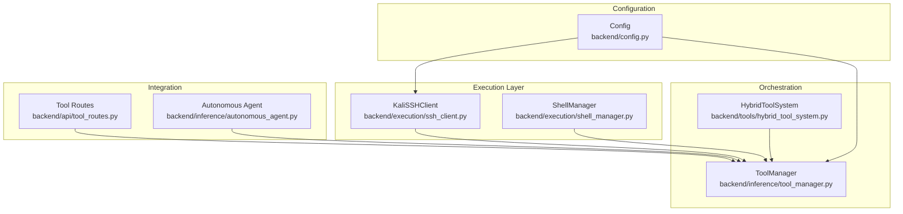
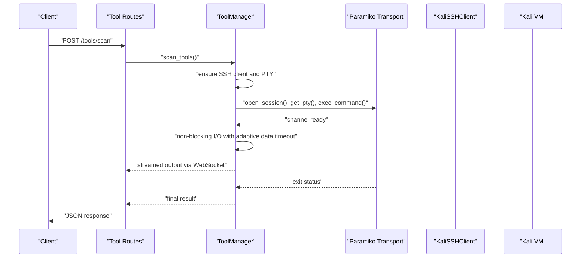
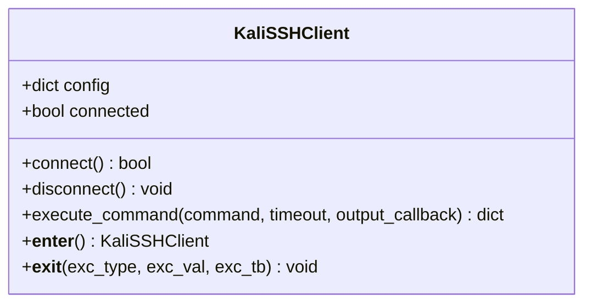
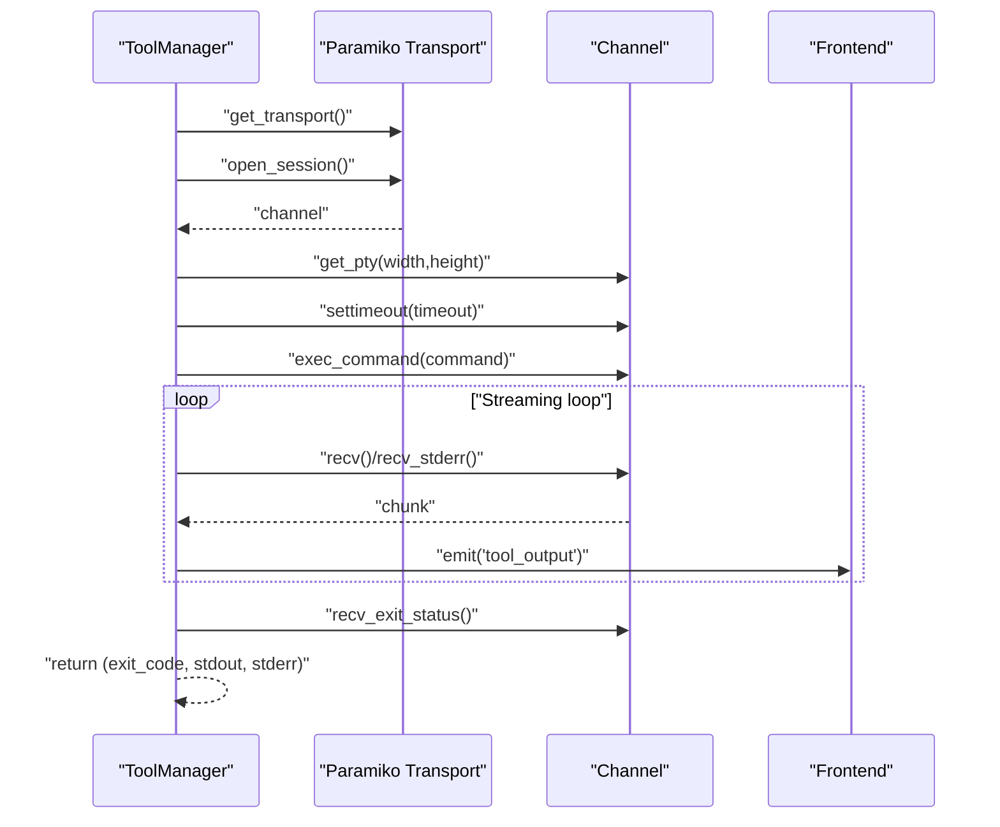
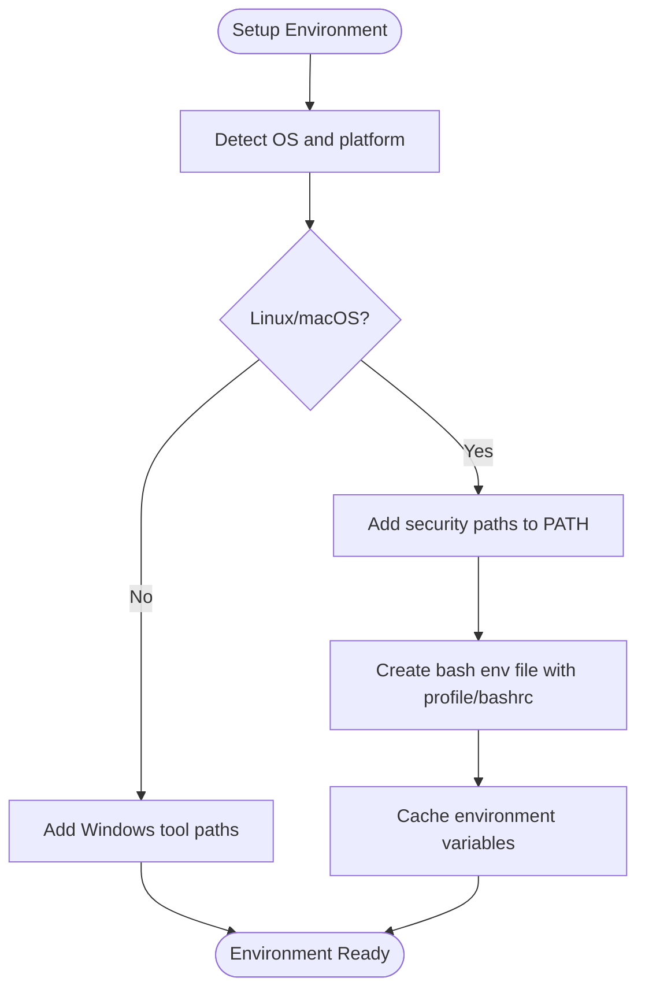
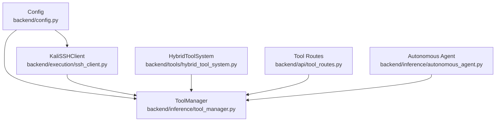

# SSH-based Tool Execution

<cite>
**Referenced Files in This Document**
- [ssh_client.py](file://backend/execution/ssh_client.py)
- [shell_manager.py](file://backend/execution/shell_manager.py)
- [config.py](file://backend/config.py)
- [tool_manager.py](file://backend/inference/tool_manager.py)
- [tool_routes.py](file://backend/api/tool_routes.py)
- [hybrid_tool_system.py](file://backend/tools/hybrid_tool_system.py)
- [autonomous_agent.py](file://backend/inference/autonomous_agent.py)
</cite>

## Table of Contents
1. [Introduction](#introduction)
2. [Project Structure](#project-structure)
3. [Core Components](#core-components)
4. [Architecture Overview](#architecture-overview)
5. [Detailed Component Analysis](#detailed-component-analysis)
6. [Dependency Analysis](#dependency-analysis)
7. [Performance Considerations](#performance-considerations)
8. [Troubleshooting Guide](#troubleshooting-guide)
9. [Conclusion](#conclusion)

## Introduction
This document explains the SSH-based tool execution subsystem that powers secure, remote execution of penetration testing tools on a Kali Linux virtual machine. It focuses on the KaliSSHClient implementation for connection management, robust retry and keepalive configuration, and the command execution pipeline with PTY allocation, streaming output, and timeout handling. It also covers integration with the broader tool management system and the autonomous agent workflow, including security considerations and common operational issues.

## Project Structure
The SSH execution capability spans several modules:
- Execution layer: KaliSSHClient for direct SSH connections and streaming command execution
- Environment management: ShellManager for PATH and shell initialization
- Configuration: Centralized SSH and tool timeouts via Config
- Tool orchestration: ToolManager orchestrating SSH connections and streaming execution
- Hybrid tool system: Provides tool discovery and command resolution integrated with SSH
- API and agent integration: Exposes tool APIs and integrates SSH into autonomous workflows

**Diagram sources**
- [ssh_client.py](file://backend/execution/ssh_client.py#L12-L216)
- [shell_manager.py](file://backend/execution/shell_manager.py#L13-L320)
- [config.py](file://backend/config.py#L6-L35)
- [tool_manager.py](file://backend/inference/tool_manager.py#L49-L129)
- [hybrid_tool_system.py](file://backend/tools/hybrid_tool_system.py#L65-L105)
- [tool_routes.py](file://backend/api/tool_routes.py#L106-L169)
- [autonomous_agent.py](file://backend/inference/autonomous_agent.py#L50-L65)

**Section sources**
- [ssh_client.py](file://backend/execution/ssh_client.py#L1-L216)
- [shell_manager.py](file://backend/execution/shell_manager.py#L1-L320)
- [config.py](file://backend/config.py#L1-L115)
- [tool_manager.py](file://backend/inference/tool_manager.py#L1-L129)
- [hybrid_tool_system.py](file://backend/tools/hybrid_tool_system.py#L1-L113)
- [tool_routes.py](file://backend/api/tool_routes.py#L1-L169)
- [autonomous_agent.py](file://backend/inference/autonomous_agent.py#L1-L65)

## Core Components
- KaliSSHClient: Provides SSH connection establishment with AutoAddPolicy host key management, configurable retries and timeouts, keepalive configuration, and streaming command execution with PTY allocation and dual timeout handling (overall and data).
- ToolManager: Orchestrates SSH connections, manages PTY channels, streams output to WebSocket clients, adapts data timeouts per tool family, and handles sudo-wrapped commands.
- ShellManager: Ensures proper PATH and shell environment for local and non-interactive contexts, complementing SSH execution.
- Config: Centralizes SSH connection and command timeouts, host/port/credentials, and keepalive intervals.
- HybridToolSystem: Resolves tools and commands, integrates SSH client updates, and supports tool discovery on the Kali VM.
- API and Agent Integration: Exposes tool APIs and integrates SSH execution into autonomous agent workflows.

**Section sources**
- [ssh_client.py](file://backend/execution/ssh_client.py#L12-L216)
- [tool_manager.py](file://backend/inference/tool_manager.py#L131-L824)
- [shell_manager.py](file://backend/execution/shell_manager.py#L13-L320)
- [config.py](file://backend/config.py#L12-L35)
- [hybrid_tool_system.py](file://backend/tools/hybrid_tool_system.py#L93-L105)
- [tool_routes.py](file://backend/api/tool_routes.py#L106-L169)
- [autonomous_agent.py](file://backend/inference/autonomous_agent.py#L50-L65)

## Architecture Overview
The SSH execution subsystem is layered:
- Configuration layer defines connection parameters and timeouts.
- Execution layer establishes SSH sessions and executes commands with PTY.
- Orchestration layer manages streaming, dynamic timeouts, and sudo handling.
- Integration layer exposes APIs and embeds SSH into autonomous agent workflows.

**Diagram sources**
- [tool_routes.py](file://backend/api/tool_routes.py#L106-L169)
- [tool_manager.py](file://backend/inference/tool_manager.py#L631-L824)

**Section sources**
- [tool_routes.py](file://backend/api/tool_routes.py#L106-L169)
- [tool_manager.py](file://backend/inference/tool_manager.py#L631-L824)

## Detailed Component Analysis

### KaliSSHClient: Secure Connection and Command Execution
KaliSSHClient encapsulates:
- Host key policy: Auto-add policy for seamless VM connectivity.
- Authentication: Key-based authentication when a key path is provided; otherwise password-based.
- Retry and backoff: Attempts configured retries with incremental sleep between attempts.
- Keepalive: Enables periodic keepalive on the transport to maintain long-running sessions.
- Command execution: PTY-enabled execution with non-blocking I/O, overall timeout, and data timeout to detect stalls.
- Streaming: Optional callback for real-time output processing.

**Diagram sources**
- [ssh_client.py](file://backend/execution/ssh_client.py#L12-L216)

Key behaviors and configurations:
- Connection establishment with AutoAddPolicy and configurable retries/timeouts.
- Authentication selection based on presence of key_path.
- Keepalive activation via transport.set_keepalive.
- PTY allocation and streaming with dual timeout logic (overall and data).
- Context manager support for safe resource lifecycle.

**Section sources**
- [ssh_client.py](file://backend/execution/ssh_client.py#L20-L78)
- [ssh_client.py](file://backend/execution/ssh_client.py#L87-L207)
- [config.py](file://backend/config.py#L19-L35)

### ToolManager: Orchestration, PTY, and Streaming
ToolManager complements KaliSSHClient by:
- Managing persistent SSH connections with reuse and keepalive.
- Opening PTY channels with explicit terminal dimensions.
- Executing commands with channel.settimeout and non-blocking I/O.
- Dynamically adapting data timeouts based on tool families and overall timeout.
- Streaming output to WebSocket rooms and handling sudo-wrapped commands.

**Diagram sources**
- [tool_manager.py](file://backend/inference/tool_manager.py#L631-L824)

Operational details:
- Connection reuse and keepalive verification.
- Adaptive data timeout logic tailored to tool categories.
- Frontend streaming via SocketIO events.
- Sudo handling by wrapping commands for automated password input.

**Section sources**
- [tool_manager.py](file://backend/inference/tool_manager.py#L131-L211)
- [tool_manager.py](file://backend/inference/tool_manager.py#L631-L824)

### ShellManager: Environment and PATH Management
While not directly SSH-based, ShellManager ensures tools are discoverable and executable in both interactive and non-interactive contexts by:
- Detecting OS and setting appropriate PATH entries for security tools.
- Creating a temporary bash environment file sourcing profiles and appending security tool paths.
- Providing convenience functions to execute commands with proper PATH and validate tool availability.

**Diagram sources**
- [shell_manager.py](file://backend/execution/shell_manager.py#L23-L205)

**Section sources**
- [shell_manager.py](file://backend/execution/shell_manager.py#L23-L205)

### Configuration: SSH Tunables and Defaults
Config centralizes:
- Kali VM connection parameters (host, port, user, password, key path).
- Connection tuning (connect timeout, retries, keepalive).
- Command timeout defaults.

These values feed both KaliSSHClient and ToolManager to ensure consistent behavior across the system.

**Section sources**
- [config.py](file://backend/config.py#L12-L35)

### Hybrid Tool System Integration
HybridToolSystem:
- Updates SSH client dynamically when a new connection is established.
- Provides tool discovery and command resolution that can leverage SSH for scanning and execution.
- Maintains statistics and references to tool_manager for lazy SSH client access.

**Section sources**
- [hybrid_tool_system.py](file://backend/tools/hybrid_tool_system.py#L93-L105)
- [tool_manager.py](file://backend/inference/tool_manager.py#L182-L189)

### API and Agent Integration
- Tool routes expose tool discovery and scanning capabilities, optionally leveraging an SSH client for VM-side scanning.
- The autonomous agent initializes ToolManager and a tool selector that can consume the SSH client for remote execution.

**Section sources**
- [tool_routes.py](file://backend/api/tool_routes.py#L106-L169)
- [autonomous_agent.py](file://backend/inference/autonomous_agent.py#L50-L65)

## Dependency Analysis
The SSH execution subsystem exhibits cohesive coupling around shared configuration and orchestration:

**Diagram sources**
- [config.py](file://backend/config.py#L12-L35)
- [ssh_client.py](file://backend/execution/ssh_client.py#L15-L18)
- [tool_manager.py](file://backend/inference/tool_manager.py#L49-L57)
- [hybrid_tool_system.py](file://backend/tools/hybrid_tool_system.py#L93-L105)
- [tool_routes.py](file://backend/api/tool_routes.py#L106-L169)
- [autonomous_agent.py](file://backend/inference/autonomous_agent.py#L50-L65)

Observations:
- KaliSSHClient depends on Config for connection parameters.
- ToolManager depends on Config and Paramiko for transport management.
- HybridToolSystem updates ToolManager’s SSH client for discovery and execution.
- Tool routes and autonomous agent depend on ToolManager for orchestration.

**Section sources**
- [config.py](file://backend/config.py#L12-L35)
- [ssh_client.py](file://backend/execution/ssh_client.py#L15-L18)
- [tool_manager.py](file://backend/inference/tool_manager.py#L49-L57)
- [hybrid_tool_system.py](file://backend/tools/hybrid_tool_system.py#L93-L105)
- [tool_routes.py](file://backend/api/tool_routes.py#L106-L169)
- [autonomous_agent.py](file://backend/inference/autonomous_agent.py#L50-L65)

## Performance Considerations
- Connection tuning: Reduced connect timeout and retries are optimized for development/debugging scenarios; adjust for production stability.
- Keepalive: Periodic keepalive prevents idle disconnects during long-running scans.
- Streaming I/O: Non-blocking reads with small polling delays balance responsiveness and CPU usage.
- Adaptive data timeouts: Tool-specific data timeouts prevent premature termination while avoiding indefinite stalls.
- PTY sizing: Larger PTY dimensions improve compatibility with interactive tools and colored output.

[No sources needed since this section provides general guidance]

## Troubleshooting Guide
Common issues and resolutions:
- Connection timeouts: Verify host/port/credentials and reduce connect timeout/retries for unstable networks; ensure keepalive is enabled.
- Command stalls: Confirm adaptive data timeouts are appropriate for the tool; check for silent progress indicators or periodic output.
- Resource cleanup: Ensure channels and transports are closed on exceptions; ToolManager closes channels and returns exit codes.
- Sudo prompts: Commands requiring elevated privileges are wrapped to auto-provide the password; confirm the wrapper does not interfere with intended behavior.
- Frontend streaming: If output does not appear, verify SocketIO event handlers and room subscriptions.

**Section sources**
- [tool_manager.py](file://backend/inference/tool_manager.py#L730-L744)
- [tool_manager.py](file://backend/inference/tool_manager.py#L814-L824)
- [ssh_client.py](file://backend/execution/ssh_client.py#L130-L144)

## Conclusion
The SSH-based tool execution subsystem combines a robust client (KaliSSHClient) with orchestration (ToolManager), environment management (ShellManager), and integration points (API and autonomous agent). It emphasizes secure, resilient, and observable execution of security tools on a Kali VM through PTY allocation, streaming output, adaptive timeouts, and keepalive configuration. Proper configuration and monitoring ensure reliable operation across diverse tool categories and long-running scans.