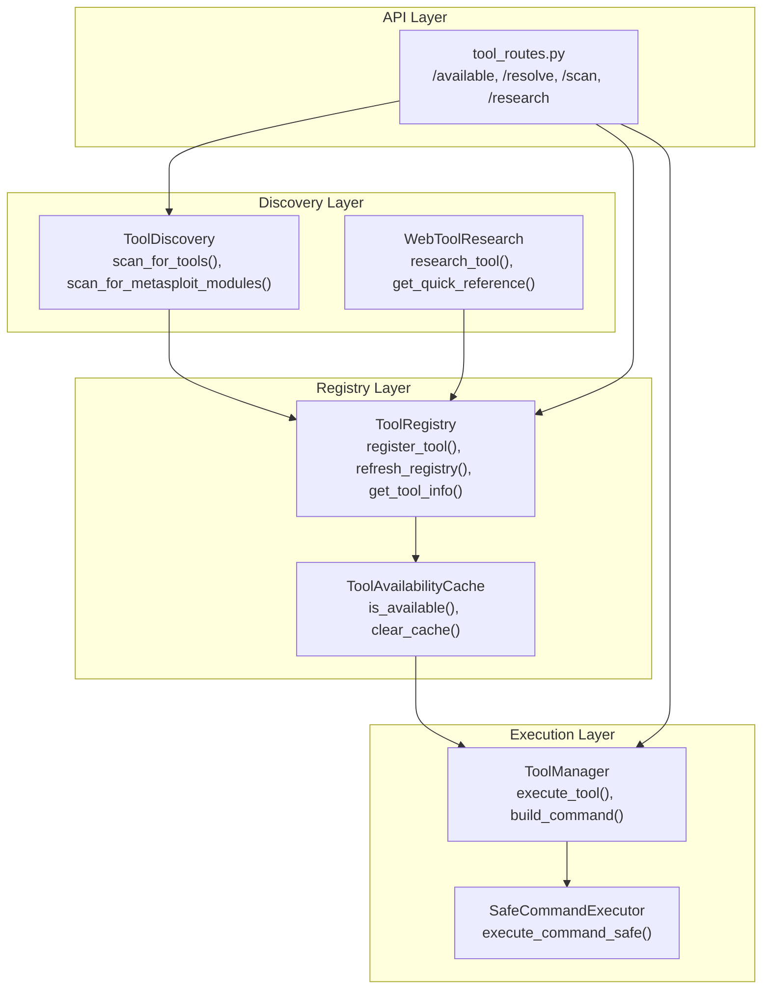
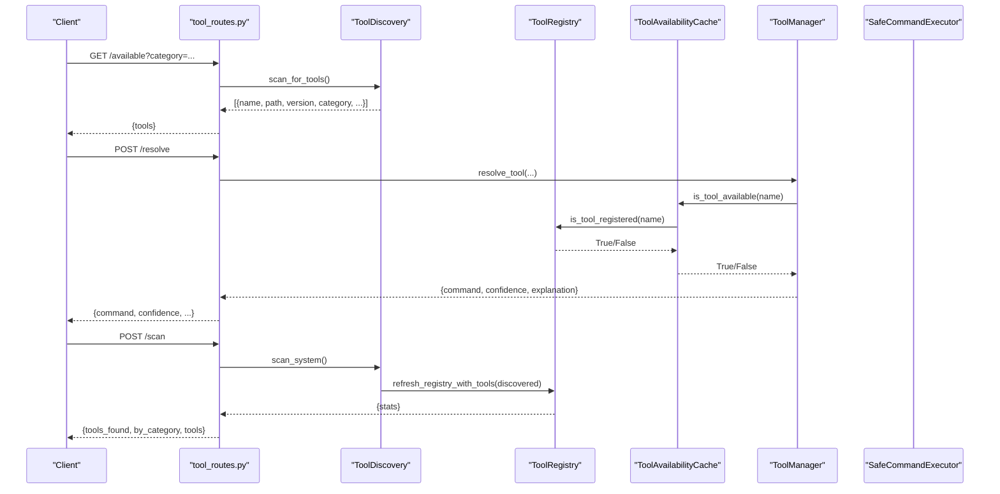
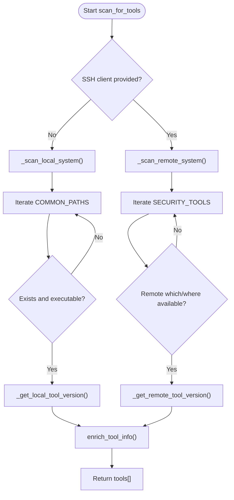
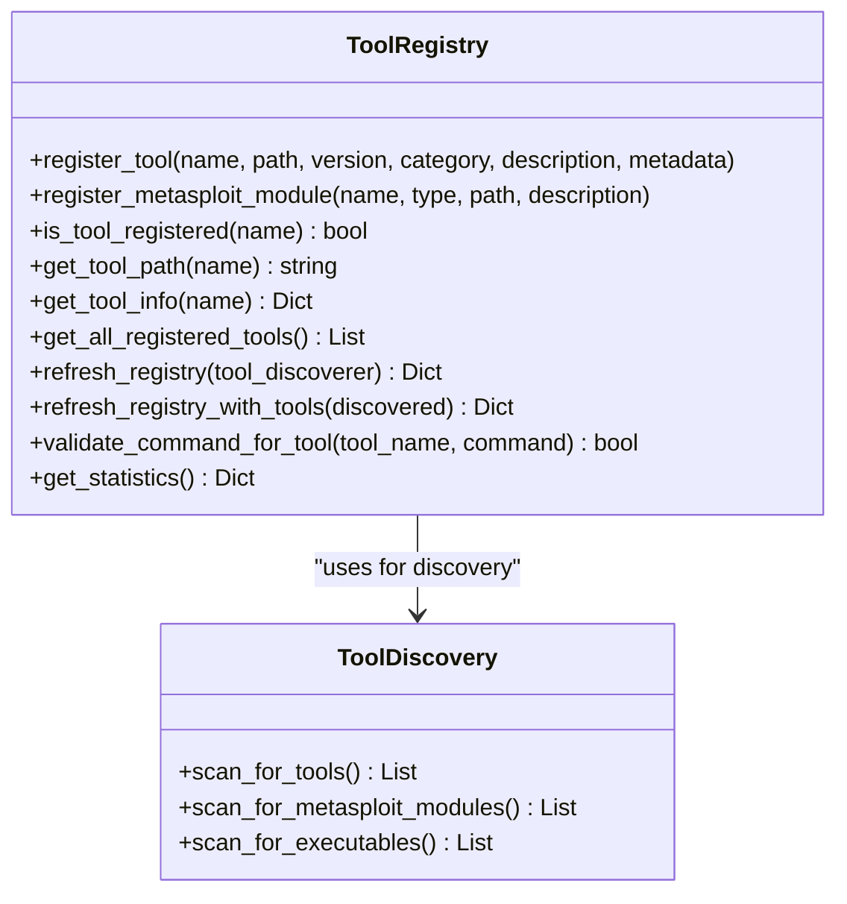
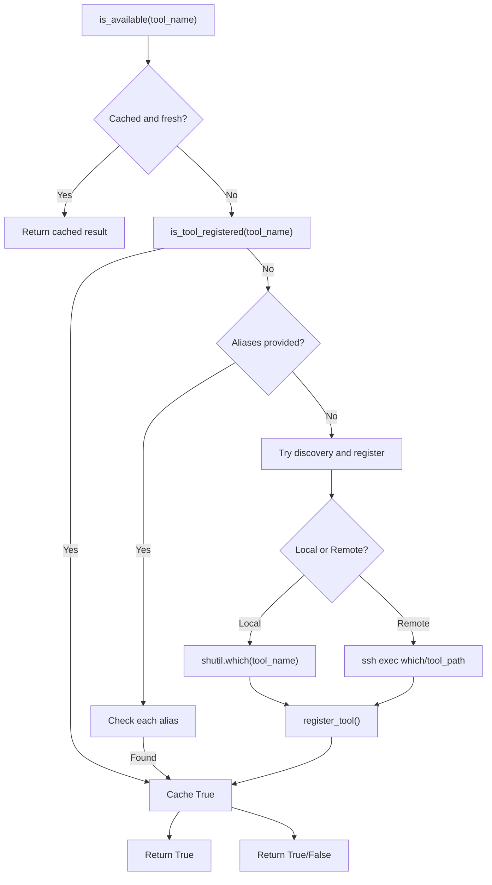
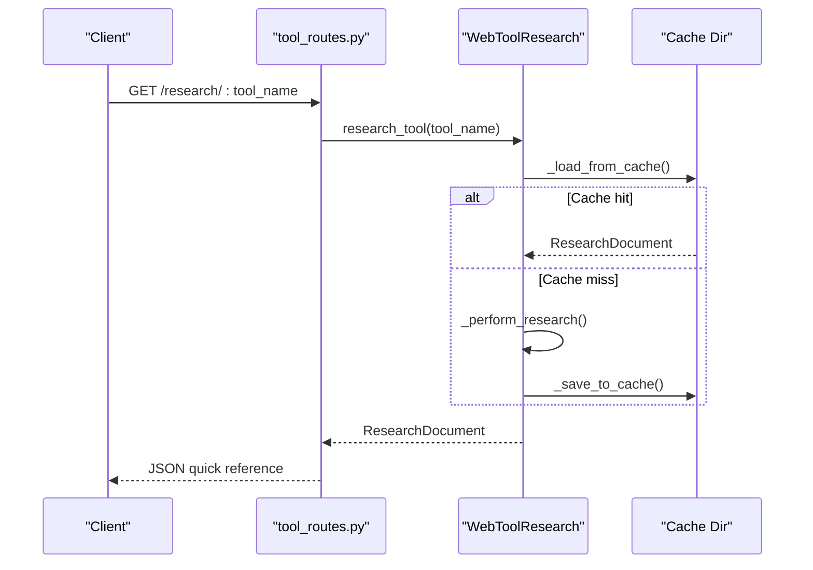
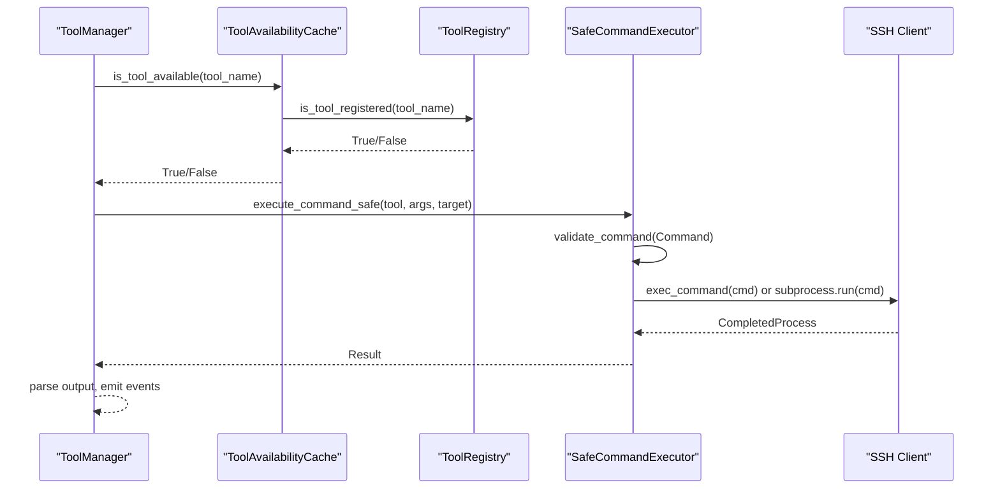
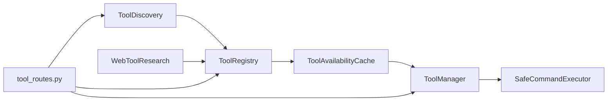

# Tool Discovery and Registration

<cite>
**Referenced Files in This Document**
- [backend/tools/tool_discovery.py](file://backend/tools/tool_discovery.py)
- [backend/inference/tool_registry.py](file://backend/inference/tool_registry.py)
- [backend/inference/tool_manager.py](file://backend/inference/tool_manager.py)
- [backend/tools/web_tool_research.py](file://backend/tools/web_tool_research.py)
- [backend/config_pkg/tools_config.py](file://backend/config_pkg/tools_config.py)
- [backend/inference/tool_availability.py](file://backend/inference/tool_availability.py)
- [backend/inference/command_safety.py](file://backend/inference/command_safety.py)
- [backend/api/tool_routes.py](file://backend/api/tool_routes.py)
- [KALI_VM_TOOL_CONFIGURATION.md](file://KALI_VM_TOOL_CONFIGURATION.md)
- [TOOL_COMMAND_TEMPLATES.md](file://TOOL_COMMAND_TEMPLATES.md)
</cite>

## Table of Contents
1. [Introduction](#introduction)
2. [Project Structure](#project-structure)
3. [Core Components](#core-components)
4. [Architecture Overview](#architecture-overview)
5. [Detailed Component Analysis](#detailed-component-analysis)
6. [Dependency Analysis](#dependency-analysis)
7. [Performance Considerations](#performance-considerations)
8. [Troubleshooting Guide](#troubleshooting-guide)
9. [Conclusion](#conclusion)
10. [Appendices](#appendices)

## Introduction
This document explains the tool discovery and registration system that powers automated identification and integration of security tools on Kali Linux VMs. It covers:
- Automated detection of tools such as nmap, sqlmap, nikto, and others
- A centralized registry that maintains verified metadata and availability
- Web-based tool research that enriches tool profiles from online sources
- Configuration options for discovery, caching, and safety
- Integration with the tool manager so discovered tools become available to the autonomous agent

## Project Structure
The tool discovery and registration system spans several modules:
- Discovery: scans local and remote systems for tools and Metasploit modules
- Registry: central SQLite-backed registry with verification and synchronization
- Availability: cache-driven verification against the registry
- Safety: command validation and safe execution enforcement
- Web research: online enrichment of tool profiles
- API: endpoints to expose tool catalogs and discovery results
- Configuration: environment-driven tuning of discovery and safety behavior

**Diagram sources**
- [backend/tools/tool_discovery.py](file://backend/tools/tool_discovery.py#L13-L504)
- [backend/inference/tool_registry.py](file://backend/inference/tool_registry.py#L18-L567)
- [backend/inference/tool_availability.py](file://backend/inference/tool_availability.py#L15-L165)
- [backend/inference/tool_manager.py](file://backend/inference/tool_manager.py#L49-L800)
- [backend/inference/command_safety.py](file://backend/inference/command_safety.py#L283-L362)
- [backend/tools/web_tool_research.py](file://backend/tools/web_tool_research.py#L28-L223)
- [backend/api/tool_routes.py](file://backend/api/tool_routes.py#L1-L299)

**Section sources**
- [backend/tools/tool_discovery.py](file://backend/tools/tool_discovery.py#L13-L504)
- [backend/inference/tool_registry.py](file://backend/inference/tool_registry.py#L18-L567)
- [backend/inference/tool_availability.py](file://backend/inference/tool_availability.py#L15-L165)
- [backend/inference/tool_manager.py](file://backend/inference/tool_manager.py#L49-L800)
- [backend/inference/command_safety.py](file://backend/inference/command_safety.py#L283-L362)
- [backend/tools/web_tool_research.py](file://backend/tools/web_tool_research.py#L28-L223)
- [backend/api/tool_routes.py](file://backend/api/tool_routes.py#L1-L299)

## Core Components
- ToolDiscovery: enumerates tools across common paths, PATH, and Metasploit module directories; retrieves help/version; enriches metadata; supports local and remote SSH scans
- ToolRegistry: SQLite-backed registry with verification, categories, and synchronization; validates commands and provides tool metadata
- ToolAvailabilityCache: registry-backed cache with TTL to accelerate availability checks and dynamic registration
- SafeCommandExecutor: enforces safety rules and executes validated commands locally or via SSH
- WebToolResearch: web-based research and quick reference generation with caching
- API endpoints: expose discovery, resolution, and inventory operations

**Section sources**
- [backend/tools/tool_discovery.py](file://backend/tools/tool_discovery.py#L13-L504)
- [backend/inference/tool_registry.py](file://backend/inference/tool_registry.py#L18-L567)
- [backend/inference/tool_availability.py](file://backend/inference/tool_availability.py#L15-L165)
- [backend/inference/command_safety.py](file://backend/inference/command_safety.py#L283-L362)
- [backend/tools/web_tool_research.py](file://backend/tools/web_tool_research.py#L28-L223)
- [backend/api/tool_routes.py](file://backend/api/tool_routes.py#L1-L299)

## Architecture Overview
The system follows a layered approach:
- Discovery layer identifies tools and modules
- Registry layer verifies and persists tool metadata
- Availability layer accelerates checks against the registry
- Execution layer validates and runs commands safely
- API layer exposes discovery and catalog operations

**Diagram sources**
- [backend/api/tool_routes.py](file://backend/api/tool_routes.py#L27-L169)
- [backend/tools/tool_discovery.py](file://backend/tools/tool_discovery.py#L66-L182)
- [backend/inference/tool_registry.py](file://backend/inference/tool_registry.py#L270-L472)
- [backend/inference/tool_availability.py](file://backend/inference/tool_availability.py#L26-L137)
- [backend/inference/tool_manager.py](file://backend/inference/tool_manager.py#L292-L336)

## Detailed Component Analysis

### ToolDiscovery: Automated Detection and Enrichment
- Scans local and remote systems for tools and Metasploit modules
- Searches common paths and PATH entries
- Retrieves help text and version information
- Categorizes tools and enriches metadata
- Supports SSH-based discovery for remote Kali VMs

Key behaviors:
- Local discovery walks common directories and PATH
- Remote discovery uses SSH to locate tools and query versions
- Version extraction uses multiple flags and patterns
- Enrichment adds help text, version, and category

**Diagram sources**
- [backend/tools/tool_discovery.py](file://backend/tools/tool_discovery.py#L66-L182)
- [backend/tools/tool_discovery.py](file://backend/tools/tool_discovery.py#L137-L182)
- [backend/tools/tool_discovery.py](file://backend/tools/tool_discovery.py#L184-L253)

**Section sources**
- [backend/tools/tool_discovery.py](file://backend/tools/tool_discovery.py#L13-L504)

### ToolRegistry: Centralized Ground-Truth Registry
- SQLite-backed registry with tables for tools, Metasploit modules, and categories
- Verifies tool paths and executability
- Synchronizes with discovery results and removes unavailable tools
- Validates commands against registered tools
- Provides statistics and metadata access

**Diagram sources**
- [backend/inference/tool_registry.py](file://backend/inference/tool_registry.py#L18-L567)
- [backend/tools/tool_discovery.py](file://backend/tools/tool_discovery.py#L66-L110)

**Section sources**
- [backend/inference/tool_registry.py](file://backend/inference/tool_registry.py#L18-L567)

### ToolAvailabilityCache: Registry-Backed Availability Checks
- Caches availability decisions with TTL
- Uses registry membership as authoritative source
- Attempts dynamic discovery and registration for unknown tools
- Supports aliases and SSH clients for remote checks

**Diagram sources**
- [backend/inference/tool_availability.py](file://backend/inference/tool_availability.py#L26-L137)

**Section sources**
- [backend/inference/tool_availability.py](file://backend/inference/tool_availability.py#L15-L165)

### WebToolResearch: Online Tool Research and Quick Reference
- Loads cached research documents or performs research
- Generates quick reference cards and alternative tool suggestions
- Stores results in a cache directory for reuse

**Diagram sources**
- [backend/tools/web_tool_research.py](file://backend/tools/web_tool_research.py#L39-L162)
- [backend/api/tool_routes.py](file://backend/api/tool_routes.py#L171-L185)

**Section sources**
- [backend/tools/web_tool_research.py](file://backend/tools/web_tool_research.py#L28-L223)
- [backend/api/tool_routes.py](file://backend/api/tool_routes.py#L171-L185)

### ToolManager Integration and Safety Enforcement
- Executes tools with real-time streaming and output parsing
- Resolves hybrid tool commands when available
- Validates commands via SafeCommandExecutor and ToolRegistry
- Manages SSH connectivity and timeouts
- Integrates with knowledge base templates for dynamic command generation

**Diagram sources**
- [backend/inference/tool_manager.py](file://backend/inference/tool_manager.py#L292-L502)
- [backend/inference/tool_availability.py](file://backend/inference/tool_availability.py#L26-L137)
- [backend/inference/command_safety.py](file://backend/inference/command_safety.py#L283-L362)

**Section sources**
- [backend/inference/tool_manager.py](file://backend/inference/tool_manager.py#L49-L800)
- [backend/inference/command_safety.py](file://backend/inference/command_safety.py#L283-L362)

## Dependency Analysis
- ToolDiscovery depends on system paths, PATH, and optional SSH client
- ToolRegistry depends on ToolDiscovery for live discovery and SQLite persistence
- ToolAvailabilityCache depends on ToolRegistry for authoritative availability
- ToolManager depends on ToolAvailabilityCache, ToolRegistry, and SafeCommandExecutor
- WebToolResearch is independent but integrates with ToolRegistry via enrichment
- API endpoints depend on ToolDiscovery, ToolRegistry, and ToolManager

**Diagram sources**
- [backend/tools/tool_discovery.py](file://backend/tools/tool_discovery.py#L66-L110)
- [backend/inference/tool_registry.py](file://backend/inference/tool_registry.py#L270-L472)
- [backend/inference/tool_availability.py](file://backend/inference/tool_availability.py#L26-L137)
- [backend/inference/tool_manager.py](file://backend/inference/tool_manager.py#L49-L800)
- [backend/inference/command_safety.py](file://backend/inference/command_safety.py#L283-L362)
- [backend/api/tool_routes.py](file://backend/api/tool_routes.py#L1-L299)

**Section sources**
- [backend/tools/tool_discovery.py](file://backend/tools/tool_discovery.py#L13-L504)
- [backend/inference/tool_registry.py](file://backend/inference/tool_registry.py#L18-L567)
- [backend/inference/tool_availability.py](file://backend/inference/tool_availability.py#L15-L165)
- [backend/inference/tool_manager.py](file://backend/inference/tool_manager.py#L49-L800)
- [backend/inference/command_safety.py](file://backend/inference/command_safety.py#L283-L362)
- [backend/api/tool_routes.py](file://backend/api/tool_routes.py#L1-L299)

## Performance Considerations
- Discovery scans multiple directories and PATH entries; consider limiting directories or using SSH caching
- Registry synchronization removes unavailable tools; schedule periodic refreshes to balance freshness and cost
- Availability cache reduces repeated registry checks; tune TTL for your environment
- Command execution timeouts vary by tool; ToolManager adapts timeouts based on tool type and history
- Web research caches results; configure cache duration to balance freshness and bandwidth

[No sources needed since this section provides general guidance]

## Troubleshooting Guide
Common issues and resolutions:
- Tool path resolution
  - Ensure tools are in PATH or known directories; ToolDiscovery checks COMMON_PATHS and PATH
  - For Go-installed tools, confirm installation in /home/kali/go/bin or /root/go/bin
  - Verify executability permissions
- Capability detection
  - Use get_tool_version and get_tool_help to verify tool availability and metadata
  - For remote tools, ensure SSH connectivity and that which/where commands are available
- Registry synchronization
  - Use refresh_registry_with_discovery to reconcile registry with system state
  - Remove stale entries by comparing discovered vs registered tools
- Command safety
  - Validate commands via ToolRegistry.validate_command_for_tool or SafeCommandExecutor
  - Review blocked patterns and thresholds in configuration
- Kali VM integration
  - Confirm PATH includes /home/kali/go/bin and /root/go/bin
  - Install missing tools and verify with which

**Section sources**
- [backend/tools/tool_discovery.py](file://backend/tools/tool_discovery.py#L137-L182)
- [backend/inference/tool_registry.py](file://backend/inference/tool_registry.py#L270-L472)
- [backend/inference/tool_availability.py](file://backend/inference/tool_availability.py#L55-L137)
- [backend/inference/command_safety.py](file://backend/inference/command_safety.py#L145-L256)
- [KALI_VM_TOOL_CONFIGURATION.md](file://KALI_VM_TOOL_CONFIGURATION.md#L37-L78)

## Conclusion
The tool discovery and registration system provides a robust, registry-backed mechanism to detect, verify, and integrate security tools on Kali Linux VMs. It supports both local and remote environments, enforces safety through validation, and exposes discovery and resolution APIs for broader integration. Proper configuration of discovery paths, caching, and safety rules ensures reliable operation in autonomous scanning scenarios.

[No sources needed since this section summarizes without analyzing specific files]

## Appendices

### Configuration Options
- ToolsConfig controls discovery, LLM generation, web research, safety, storage paths, and timeouts
- Environment variables override defaults for discovery, startup behavior, and thresholds

**Section sources**
- [backend/config_pkg/tools_config.py](file://backend/config_pkg/tools_config.py#L8-L63)

### Example Workflows

- Tool detection workflow
  - Call ToolDiscovery.scan_for_tools()
  - Optionally enrich with ToolDiscovery.enrich_tool_info()
  - Register results via ToolRegistry.refresh_registry_with_tools()

- Registry population process
  - ToolRegistry.refresh_registry_with_discovery() triggers live discovery
  - Compares discovered vs registered tools and removes unavailable ones

- Integration with ToolManager
  - ToolManager.execute_tool() resolves hybrid commands, validates safety, and streams output
  - Uses ToolAvailabilityCache and ToolRegistry for availability and metadata

- Web-based tool research integration
  - WebToolResearch.research_tool() loads cached or performs research
  - Quick reference and alternative suggestions aid selection

**Section sources**
- [backend/tools/tool_discovery.py](file://backend/tools/tool_discovery.py#L66-L182)
- [backend/inference/tool_registry.py](file://backend/inference/tool_registry.py#L270-L472)
- [backend/inference/tool_manager.py](file://backend/inference/tool_manager.py#L226-L621)
- [backend/tools/web_tool_research.py](file://backend/tools/web_tool_research.py#L39-L162)

### Kali VM Tool Configuration Notes
- PATH includes /home/kali/go/bin and /root/go/bin
- Go-installed tools like subfinder, gospider, katana, etc., are supported
- Install missing tools to expand capabilities

**Section sources**
- [KALI_VM_TOOL_CONFIGURATION.md](file://KALI_VM_TOOL_CONFIGURATION.md#L37-L78)

### Command Templates Overview
- Knowledge base templates guide dynamic command generation for 35+ tools
- Templates adapt by phase (recon, scanning, exploitation, post-exploitation)
- Contextual conditions (technology detection, WAF presence, time constraints) influence parameters

**Section sources**
- [TOOL_COMMAND_TEMPLATES.md](file://TOOL_COMMAND_TEMPLATES.md#L1-L222)