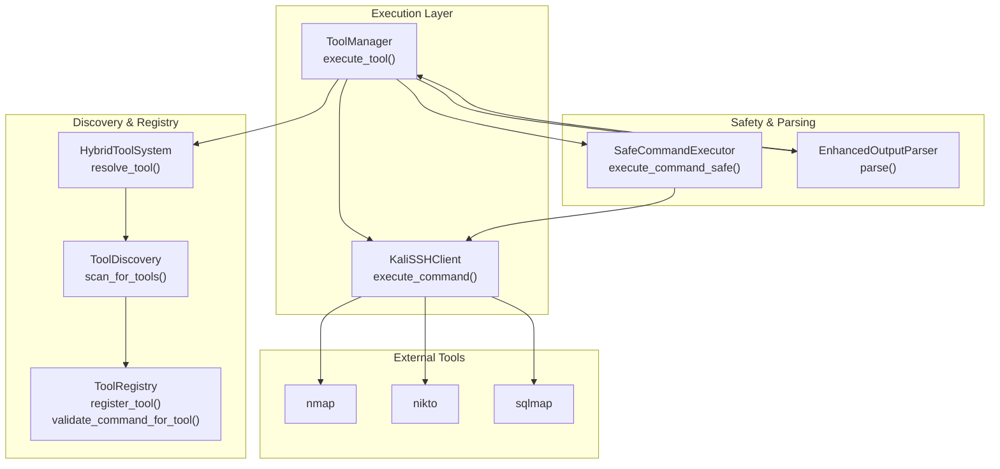
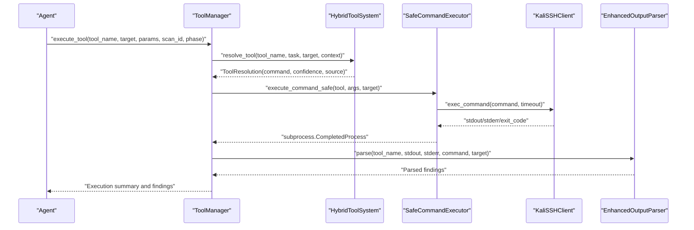
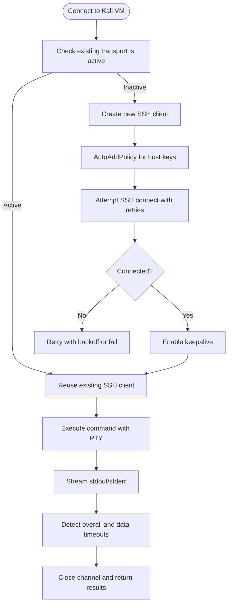
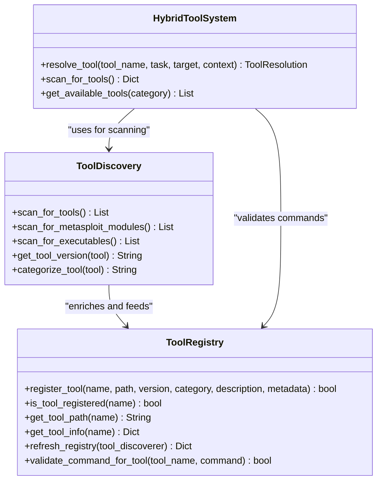
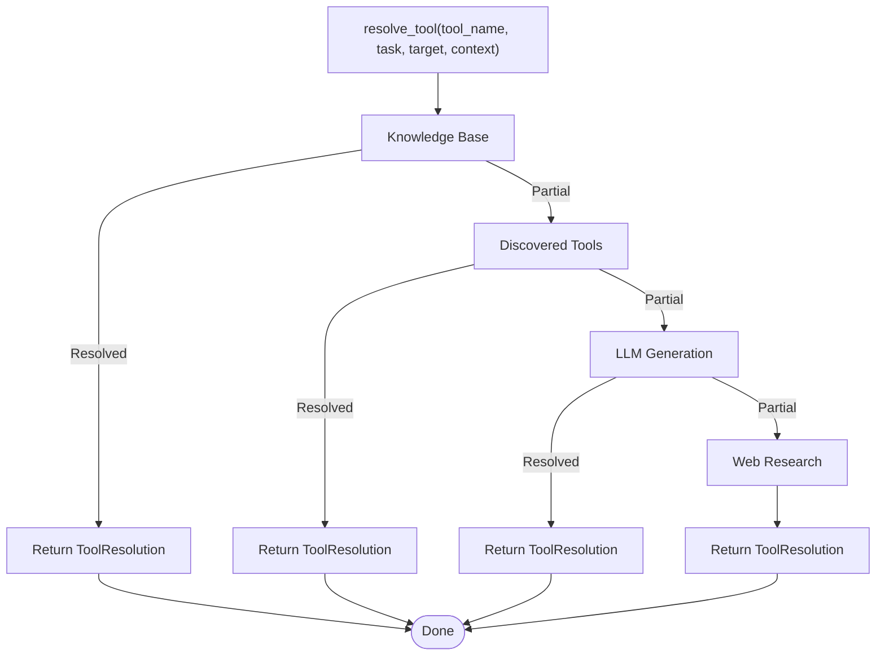
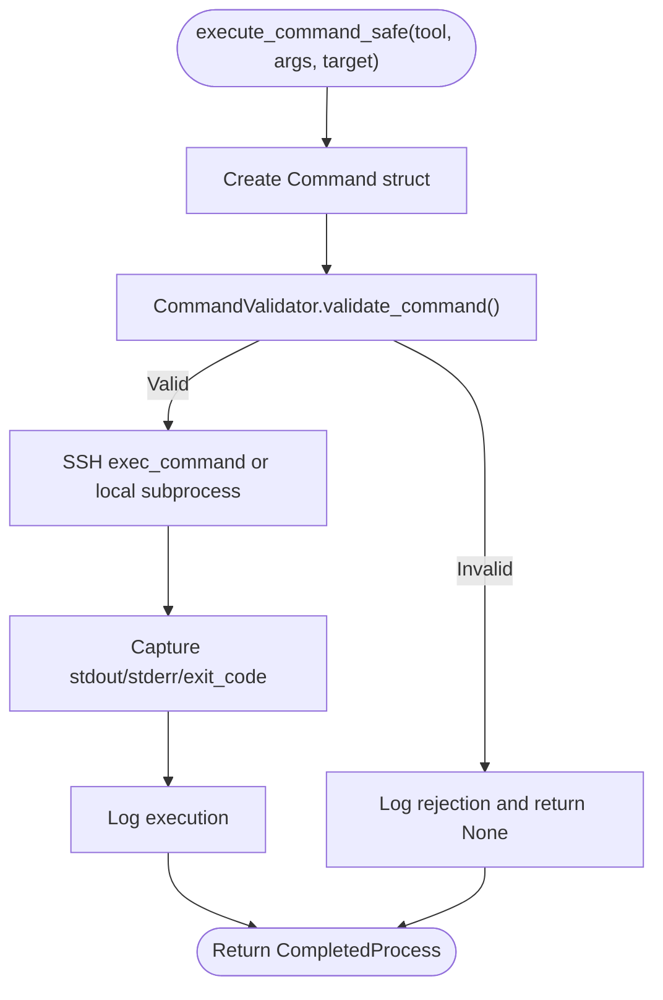
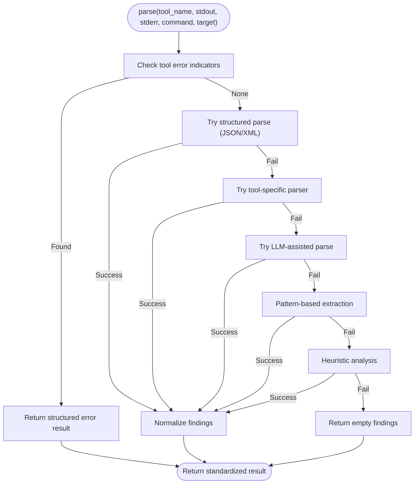
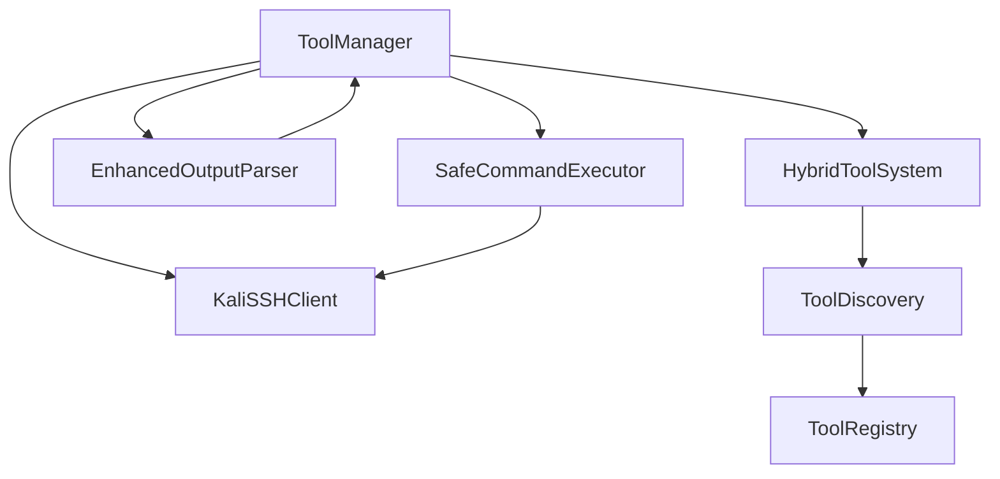

# Tool Integration and Management

<cite>
**Referenced Files in This Document**
- [tool_manager.py](file://backend/inference/tool_manager.py)
- [ssh_client.py](file://backend/execution/ssh_client.py)
- [exploit_executor.py](file://backend/exploitation/exploit_executor.py)
- [tool_discovery.py](file://backend/tools/tool_discovery.py)
- [hybrid_tool_system.py](file://backend/tools/hybrid_tool_system.py)
- [command_safety.py](file://backend/inference/command_safety.py)
- [enhanced_output_parser.py](file://backend/inference/enhanced_output_parser.py)
- [tool_registry.py](file://backend/inference/tool_registry.py)
- [tools_config.py](file://backend/config_pkg/tools_config.py)
</cite>

## Table of Contents
1. [Introduction](#introduction)
2. [Project Structure](#project-structure)
3. [Core Components](#core-components)
4. [Architecture Overview](#architecture-overview)
5. [Detailed Component Analysis](#detailed-component-analysis)
6. [Dependency Analysis](#dependency-analysis)
7. [Performance Considerations](#performance-considerations)
8. [Troubleshooting Guide](#troubleshooting-guide)
9. [Conclusion](#conclusion)

## Introduction
This document explains the tool integration and management capabilities within Optimus, focusing on secure execution of security tools against a Kali Linux virtual machine, discovery and registration of tools, and a hybrid system that combines automated and manual tool execution. It covers secure connection management, command execution safety controls, and output parsing for structured vulnerability data. Both cybersecurity practitioners and developers can use this guide to understand how Optimus orchestrates tools, maintains safety, and integrates with external security tools such as nmap, sqlmap, and nikto.

## Project Structure
The tool integration layer spans several modules:
- Execution and connection: SSH client and tool manager orchestrate secure tool execution.
- Discovery and registry: Tool discovery enumerates available tools and registers them in a ground-truth registry.
- Hybrid system: A multi-source resolution pipeline generates or selects appropriate commands.
- Safety and parsing: Command safety validation and multi-strategy output parsing ensure secure and reliable results.

**Diagram sources**
- [tool_manager.py](file://backend/inference/tool_manager.py#L226-L630)
- [ssh_client.py](file://backend/execution/ssh_client.py#L87-L207)
- [command_safety.py](file://backend/inference/command_safety.py#L240-L318)
- [enhanced_output_parser.py](file://backend/inference/enhanced_output_parser.py#L89-L200)
- [tool_discovery.py](file://backend/tools/tool_discovery.py#L66-L78)
- [tool_registry.py](file://backend/inference/tool_registry.py#L121-L147)
- [hybrid_tool_system.py](file://backend/tools/hybrid_tool_system.py#L166-L220)

**Section sources**
- [tool_manager.py](file://backend/inference/tool_manager.py#L1-L130)
- [ssh_client.py](file://backend/execution/ssh_client.py#L12-L86)
- [command_safety.py](file://backend/inference/command_safety.py#L18-L54)
- [enhanced_output_parser.py](file://backend/inference/enhanced_output_parser.py#L60-L90)
- [tool_discovery.py](file://backend/tools/tool_discovery.py#L13-L65)
- [tool_registry.py](file://backend/inference/tool_registry.py#L18-L50)
- [hybrid_tool_system.py](file://backend/tools/hybrid_tool_system.py#L65-L113)

## Core Components
- ToolManager: Orchestrates secure SSH connections, resolves and validates commands, streams tool output, parses findings, and records execution results. It integrates the hybrid tool system, command safety, and output parsing.
- KaliSSHClient: Provides a robust SSH client for long-running tool executions with keepalive, timeouts, and streaming output.
- SafeCommandExecutor: Validates commands against a whitelist of known tools, target formats, and dangerous patterns, then executes via SSH or locally.
- EnhancedOutputParser: Parses tool output using multiple strategies (structured, tool-specific, LLM-assisted, pattern-based, heuristic) to produce standardized vulnerability findings.
- ToolDiscovery: Discovers tools on local or remote systems, including executables and Metasploit modules, and enriches metadata.
- ToolRegistry: Maintains a ground-truth registry of tools and validates that commands use registered tools only.
- HybridToolSystem: Resolves tool commands through a priority chain (knowledge base, memory, discovery, LLM, web research) and supports execution planning and learning.

**Section sources**
- [tool_manager.py](file://backend/inference/tool_manager.py#L49-L129)
- [ssh_client.py](file://backend/execution/ssh_client.py#L12-L86)
- [command_safety.py](file://backend/inference/command_safety.py#L240-L318)
- [enhanced_output_parser.py](file://backend/inference/enhanced_output_parser.py#L60-L90)
- [tool_discovery.py](file://backend/tools/tool_discovery.py#L13-L65)
- [tool_registry.py](file://backend/inference/tool_registry.py#L18-L50)
- [hybrid_tool_system.py](file://backend/tools/hybrid_tool_system.py#L65-L113)

## Architecture Overview
The system follows a layered architecture:
- Secure connection layer: SSH client establishes and maintains persistent connections to the Kali VM.
- Command safety layer: Validates commands before execution to prevent misuse.
- Execution layer: ToolManager coordinates hybrid resolution, target normalization, and tool execution.
- Parsing layer: EnhancedOutputParser standardizes findings for downstream use.
- Discovery and registry: ToolDiscovery and ToolRegistry maintain an authoritative catalog of tools.

**Diagram sources**
- [tool_manager.py](file://backend/inference/tool_manager.py#L226-L630)
- [hybrid_tool_system.py](file://backend/tools/hybrid_tool_system.py#L166-L220)
- [command_safety.py](file://backend/inference/command_safety.py#L240-L318)
- [ssh_client.py](file://backend/execution/ssh_client.py#L87-L207)
- [enhanced_output_parser.py](file://backend/inference/enhanced_output_parser.py#L89-L200)

## Detailed Component Analysis

### SSH-based Tool Execution System
The SSH-based execution system ensures secure, persistent connections to the Kali Linux VM and robust handling of long-running tools:
- Persistent connections with keepalive to minimize overhead and maintain session liveness.
- Adaptive timeouts tailored to tool categories (e.g., scanners vs. web tools).
- Streaming output with configurable data timeouts to detect stalls.
- Automatic sudo handling for privileged commands.

**Diagram sources**
- [tool_manager.py](file://backend/inference/tool_manager.py#L131-L211)
- [ssh_client.py](file://backend/execution/ssh_client.py#L20-L78)
- [ssh_client.py](file://backend/execution/ssh_client.py#L87-L207)

**Section sources**
- [tool_manager.py](file://backend/inference/tool_manager.py#L131-L211)
- [ssh_client.py](file://backend/execution/ssh_client.py#L20-L78)
- [ssh_client.py](file://backend/execution/ssh_client.py#L87-L207)

### Tool Discovery and Registration Mechanisms
The discovery and registry system maintains a ground-truth catalog of tools:
- ToolDiscovery scans local or remote systems for executables and Metasploit modules, enriching metadata and categorizing tools.
- ToolRegistry persists tool information in a SQLite database, verifies tools, and validates commands to ensure only registered tools are executed.
- HybridToolSystem integrates discovery results to generate or select commands dynamically.

**Diagram sources**
- [tool_discovery.py](file://backend/tools/tool_discovery.py#L13-L65)
- [tool_registry.py](file://backend/inference/tool_registry.py#L18-L50)
- [hybrid_tool_system.py](file://backend/tools/hybrid_tool_system.py#L65-L113)

**Section sources**
- [tool_discovery.py](file://backend/tools/tool_discovery.py#L66-L78)
- [tool_registry.py](file://backend/inference/tool_registry.py#L121-L147)
- [hybrid_tool_system.py](file://backend/tools/hybrid_tool_system.py#L136-L165)

### Hybrid Tool System: Automated and Manual Execution
The hybrid system resolves tool commands through a priority chain:
- Knowledge Base: Uses predefined templates and metadata for known tools.
- Memory System: Integrates learned patterns (placeholder).
- Discovered Tools: Generates commands from discovered tool help text.
- LLM Generation: Produces commands with confidence and safety metadata.
- Web Research: Gathers external references and examples.

**Diagram sources**
- [hybrid_tool_system.py](file://backend/tools/hybrid_tool_system.py#L166-L220)
- [hybrid_tool_system.py](file://backend/tools/hybrid_tool_system.py#L221-L351)

**Section sources**
- [hybrid_tool_system.py](file://backend/tools/hybrid_tool_system.py#L166-L220)
- [hybrid_tool_system.py](file://backend/tools/hybrid_tool_system.py#L221-L351)

### Command Safety Controls
Command safety prevents misuse by validating:
- Tool availability against a known set.
- Target format for IPs, hostnames, URLs, CIDR, and host:port combinations.
- Arguments for dangerous patterns (pipes, redirections, command substitution).
- Optional web-specific validation and timeout enforcement.

**Diagram sources**
- [command_safety.py](file://backend/inference/command_safety.py#L240-L318)
- [command_safety.py](file://backend/inference/command_safety.py#L102-L132)
- [command_safety.py](file://backend/inference/command_safety.py#L134-L176)

**Section sources**
- [command_safety.py](file://backend/inference/command_safety.py#L102-L132)
- [command_safety.py](file://backend/inference/command_safety.py#L134-L176)
- [command_safety.py](file://backend/inference/command_safety.py#L189-L213)
- [command_safety.py](file://backend/inference/command_safety.py#L240-L318)

### Output Parsing for Structured Vulnerability Data
The enhanced output parser standardizes findings across diverse tool outputs:
- Structured output parsing (JSON/XML) with fallbacks.
- Tool-specific parsers for nmap, nikto, nuclei, sqlmap, and others.
- LLM-assisted parsing for complex or unknown formats.
- Pattern-based extraction and heuristic analysis.
- Confidence scoring and standardized finding schema.

**Diagram sources**
- [enhanced_output_parser.py](file://backend/inference/enhanced_output_parser.py#L89-L200)
- [enhanced_output_parser.py](file://backend/inference/enhanced_output_parser.py#L206-L252)
- [enhanced_output_parser.py](file://backend/inference/enhanced_output_parser.py#L560-L592)
- [enhanced_output_parser.py](file://backend/inference/enhanced_output_parser.py#L691-L741)

**Section sources**
- [enhanced_output_parser.py](file://backend/inference/enhanced_output_parser.py#L89-L200)
- [enhanced_output_parser.py](file://backend/inference/enhanced_output_parser.py#L560-L592)
- [enhanced_output_parser.py](file://backend/inference/enhanced_output_parser.py#L691-L741)

### Practical Examples
- Tool availability validation: Use ToolRegistry to verify a tool is registered and executable before attempting execution.
- Command safety mechanisms: SafeCommandExecutor validates tool availability, target format, and argument patterns prior to execution.
- Integration with external tools:
  - nmap: Resolved via knowledge base templates; executed via SSH; parsed for open ports and CVE indicators.
  - nikto: Resolved via knowledge base; executed via SSH; parsed for web vulnerabilities.
  - sqlmap: Resolved via knowledge base; executed via SSH; parsed for SQL injection findings.

**Section sources**
- [tool_registry.py](file://backend/inference/tool_registry.py#L192-L200)
- [command_safety.py](file://backend/inference/command_safety.py#L102-L132)
- [hybrid_tool_system.py](file://backend/tools/hybrid_tool_system.py#L446-L614)
- [enhanced_output_parser.py](file://backend/inference/enhanced_output_parser.py#L594-L689)
- [enhanced_output_parser.py](file://backend/inference/enhanced_output_parser.py#L743-L795)
- [enhanced_output_parser.py](file://backend/inference/enhanced_output_parser.py#L797-L840)

## Dependency Analysis
Key dependencies and relationships:
- ToolManager depends on SSH client, hybrid tool system, command safety, and output parser.
- HybridToolSystem depends on ToolDiscovery and ToolRegistry for validation.
- EnhancedOutputParser is invoked by ToolManager after execution.
- ToolRegistry validates commands and integrates with discovery.

**Diagram sources**
- [tool_manager.py](file://backend/inference/tool_manager.py#L49-L129)
- [hybrid_tool_system.py](file://backend/tools/hybrid_tool_system.py#L65-L113)
- [tool_discovery.py](file://backend/tools/tool_discovery.py#L66-L78)
- [tool_registry.py](file://backend/inference/tool_registry.py#L121-L147)
- [command_safety.py](file://backend/inference/command_safety.py#L240-L318)
- [enhanced_output_parser.py](file://backend/inference/enhanced_output_parser.py#L89-L200)

**Section sources**
- [tool_manager.py](file://backend/inference/tool_manager.py#L49-L129)
- [hybrid_tool_system.py](file://backend/tools/hybrid_tool_system.py#L65-L113)
- [tool_discovery.py](file://backend/tools/tool_discovery.py#L66-L78)
- [tool_registry.py](file://backend/inference/tool_registry.py#L121-L147)
- [command_safety.py](file://backend/inference/command_safety.py#L240-L318)
- [enhanced_output_parser.py](file://backend/inference/enhanced_output_parser.py#L89-L200)

## Performance Considerations
- Connection reuse: ToolManager checks transport activity to avoid reconnecting unnecessarily.
- Adaptive timeouts: ToolManager and KaliSSHClient adjust timeouts based on tool type and overall duration.
- Streaming I/O: Non-blocking reads with periodic timeouts prevent CPU spin and improve responsiveness.
- Parsing efficiency: EnhancedOutputParser prioritizes structured and tool-specific parsing to minimize fallback costs.

[No sources needed since this section provides general guidance]

## Troubleshooting Guide
Common issues and resolutions:
- SSH connection failures: Review connection retries, timeouts, and keepalive settings; verify host key policy and credentials.
- Tool not found or permission denied: Confirm tool availability via ToolRegistry and ensure proper path resolution.
- Stalled output: Adjust data timeouts for long-running tools; verify PTY allocation and streaming logic.
- Parsing failures: Validate tool output formats; leverage tool-specific parsers or structured output when available.
- Safety rejections: Ensure tool names are whitelisted, targets conform to allowed formats, and arguments avoid dangerous patterns.

**Section sources**
- [tool_manager.py](file://backend/inference/tool_manager.py#L131-L211)
- [ssh_client.py](file://backend/execution/ssh_client.py#L20-L78)
- [ssh_client.py](file://backend/execution/ssh_client.py#L128-L144)
- [tool_registry.py](file://backend/inference/tool_registry.py#L168-L190)
- [command_safety.py](file://backend/inference/command_safety.py#L189-L213)
- [enhanced_output_parser.py](file://backend/inference/enhanced_output_parser.py#L110-L137)

## Conclusion
Optimus integrates a secure, resilient tool execution pipeline that combines SSH-based execution, hybrid command resolution, strict safety validation, and robust output parsing. The system’s modular design enables scalable integration with external security tools while maintaining strong safety and reliability guarantees. Cybersecurity teams can rely on standardized findings, while developers can extend discovery, registry, and parsing capabilities to support new tools and workflows.