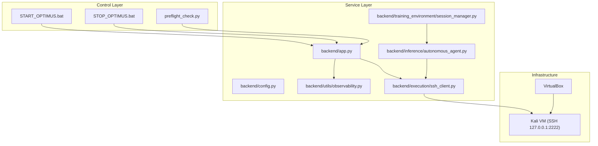
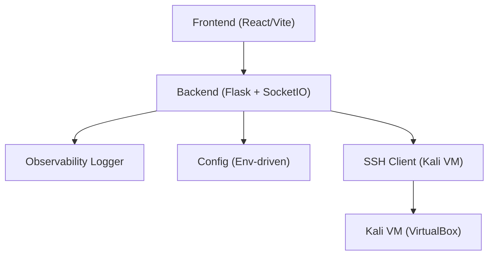
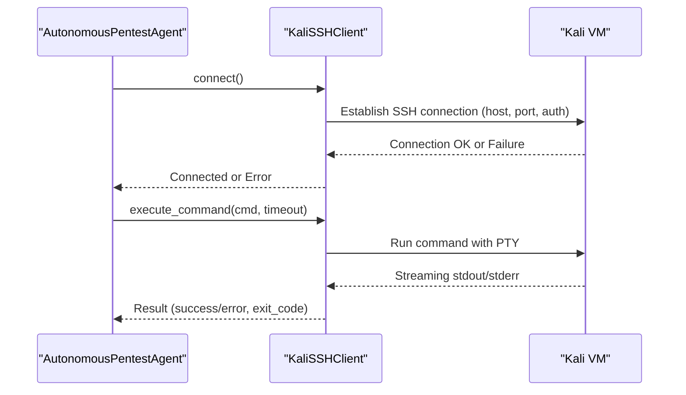
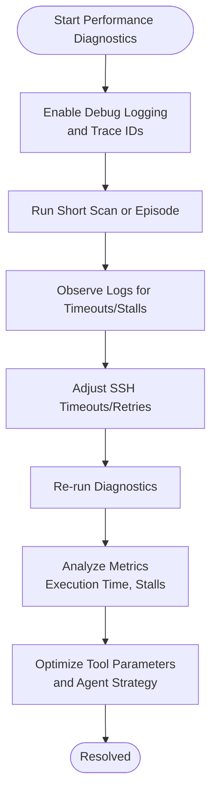
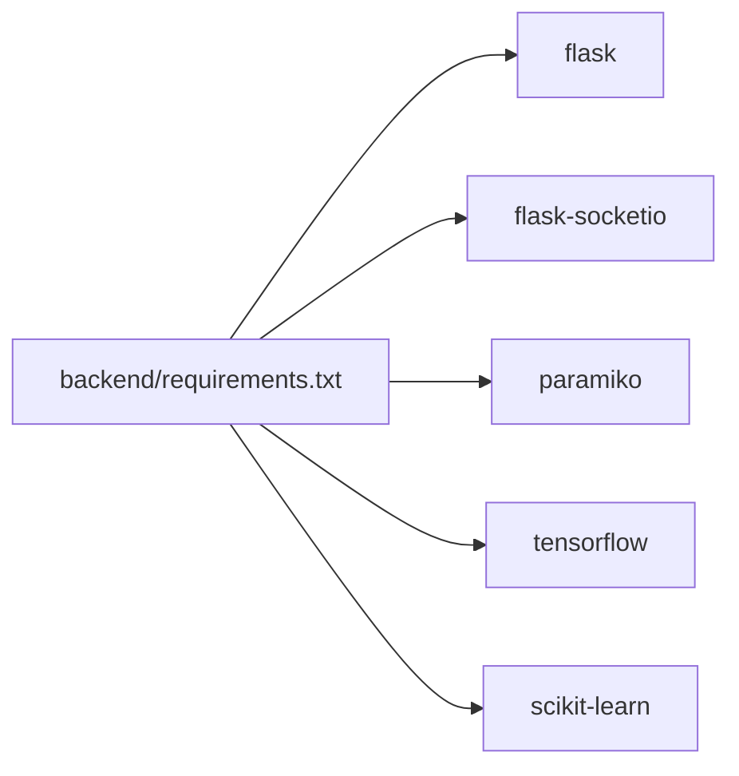

# Troubleshooting and FAQ

<cite>
**Referenced Files in This Document**
- [TROUBLESHOOTING_SUMMARY.md](file://TROUBLESHOOTING_SUMMARY.md)
- [FINAL_TROUBLESHOOTING_REPORT.md](file://FINAL_TROUBLESHOOTING_REPORT.md)
- [observability.py](file://backend/utils/observability.py)
- [app.py](file://backend/app.py)
- [config.py](file://backend/config.py)
- [ssh_client.py](file://backend/execution/ssh_client.py)
- [preflight_check.py](file://backend/preflight_check.py)
- [health_check.sh](file://scripts/health_check.sh)
- [START_OPTIMUS.bat](file://START_OPTIMUS.bat)
- [STOP_OPTIMUS.bat](file://STOP_OPTIMUS.bat)
- [requirements.txt](file://backend/requirements.txt)
- [autonomous_agent.py](file://backend/inference/autonomous_agent.py)
- [session_manager.py](file://backend/training_environment/session_manager.py)
</cite>

## Table of Contents
1. [Introduction](#introduction)
2. [Project Structure](#project-structure)
3. [Core Components](#core-components)
4. [Architecture Overview](#architecture-overview)
5. [Detailed Component Analysis](#detailed-component-analysis)
6. [Dependency Analysis](#dependency-analysis)
7. [Performance Considerations](#performance-considerations)
8. [Troubleshooting Guide](#troubleshooting-guide)
9. [Conclusion](#conclusion)
10. [Appendices](#appendices)

## Introduction
This document provides a comprehensive troubleshooting and FAQ guide for the Optimus platform. It focuses on:
- Connection troubleshooting with the Kali Linux VM
- Performance diagnostics for tool execution and AI processing
- Configuration validation for reliable operation
- Log analysis procedures, system profiling, and debug mode usage
- Practical workflows for resolving issues and preventive maintenance

The content is grounded in the repository’s implementation and aligns with terminology used in the codebase such as “connection troubleshooting,” “performance diagnostics,” and “configuration validation.”

## Project Structure
The troubleshooting workflow spans three layers:
- Control layer: Startup/shutdown scripts and process management
- Service layer: Backend API and frontend application
- Infrastructure: VirtualBox-managed Kali VM and SSH connectivity

**Diagram sources**
- [START_OPTIMUS.bat](file://START_OPTIMUS.bat#L1-L91)
- [STOP_OPTIMUS.bat](file://STOP_OPTIMUS.bat#L1-L75)
- [preflight_check.py](file://backend/preflight_check.py#L1-L81)
- [app.py](file://backend/app.py#L1-L343)
- [config.py](file://backend/config.py#L1-L115)
- [observability.py](file://backend/utils/observability.py#L1-L269)
- [ssh_client.py](file://backend/execution/ssh_client.py#L1-L216)
- [autonomous_agent.py](file://backend/inference/autonomous_agent.py#L1-L800)
- [session_manager.py](file://backend/training_environment/session_manager.py#L1-L361)

**Section sources**
- [START_OPTIMUS.bat](file://START_OPTIMUS.bat#L1-L91)
- [STOP_OPTIMUS.bat](file://STOP_OPTIMUS.bat#L1-L75)
- [app.py](file://backend/app.py#L1-L343)
- [config.py](file://backend/config.py#L1-L115)

## Core Components
- Centralized observability with trace ID support for end-to-end tracing
- SSH client for secure remote execution on the Kali VM
- Configuration management for timeouts, retries, and credentials
- Preflight checks for module and dependency validation
- Health check script for backend/frontend and process status
- Startup/shutdown scripts orchestrating VM lifecycle and service startup

Key responsibilities:
- Observability: log aggregation, trace correlation, structured context
- SSH: connection establishment, command execution with timeouts, streaming output
- Config: environment-driven tuning for connection stability and performance
- Preflight: import-time validation to catch missing modules early
- Health: automated checks for service availability and process liveness

**Section sources**
- [observability.py](file://backend/utils/observability.py#L1-L269)
- [ssh_client.py](file://backend/execution/ssh_client.py#L1-L216)
- [config.py](file://backend/config.py#L1-L115)
- [preflight_check.py](file://backend/preflight_check.py#L1-L81)
- [health_check.sh](file://scripts/health_check.sh#L1-L63)

## Architecture Overview
The platform integrates a cross-platform startup system with VM orchestration and a resilient backend with observability and SSH connectivity.

**Diagram sources**
- [app.py](file://backend/app.py#L1-L343)
- [observability.py](file://backend/utils/observability.py#L1-L269)
- [config.py](file://backend/config.py#L1-L115)
- [ssh_client.py](file://backend/execution/ssh_client.py#L1-L216)

## Detailed Component Analysis

### Connection Troubleshooting with Kali VM
Common symptoms:
- SSH connection failures during tool execution
- VM not reachable at configured host/port
- Long-running commands timing out or stalling

Resolution steps:
- Validate VM state and SSH accessibility
- Confirm environment variables for host, port, credentials, and timeouts
- Adjust retry and timeout settings for SSH connectivity
- Use SSH client diagnostics to capture connection attempts and errors

**Diagram sources**
- [autonomous_agent.py](file://backend/inference/autonomous_agent.py#L1-L800)
- [ssh_client.py](file://backend/execution/ssh_client.py#L1-L216)

**Section sources**
- [ssh_client.py](file://backend/execution/ssh_client.py#L1-L216)
- [config.py](file://backend/config.py#L12-L35)
- [app.py](file://backend/app.py#L276-L290)

### Performance Diagnostics for Tool Execution and AI Processing
Focus areas:
- Long-running tool execution timeouts and stalls
- Logging overhead and output volume
- Memory/CPU usage during autonomous scans and training sessions

Diagnostic techniques:
- Enable debug logging and inspect trace IDs for correlation
- Monitor execution time and stall detection in SSH client
- Use health checks to validate backend/frontend responsiveness
- Profile training sessions and scan iterations for bottlenecks

**Diagram sources**
- [observability.py](file://backend/utils/observability.py#L1-L269)
- [ssh_client.py](file://backend/execution/ssh_client.py#L87-L208)
- [session_manager.py](file://backend/training_environment/session_manager.py#L77-L151)

**Section sources**
- [observability.py](file://backend/utils/observability.py#L1-L269)
- [ssh_client.py](file://backend/execution/ssh_client.py#L87-L208)
- [session_manager.py](file://backend/training_environment/session_manager.py#L77-L151)

### Configuration Validation
Critical configuration keys and tuning:
- Kali VM connectivity: host, port, username, password/key path, connect timeout, retries, keepalive
- Tool execution: command timeout for long-running tools
- Environment variables for ports, dataset/model paths, training flags, and AI model settings

Validation steps:
- Use preflight checks to verify imports and optional dependencies
- Review environment variables loaded by the configuration class
- Confirm backend health endpoint and service readiness

**Section sources**
- [config.py](file://backend/config.py#L12-L67)
- [preflight_check.py](file://backend/preflight_check.py#L35-L81)
- [app.py](file://backend/app.py#L276-L290)

### Log Analysis Procedures
Implementation details:
- Centralized logger with trace ID propagation across threads
- Structured logging for targets, tools, commands, outputs, findings, rewards, skills, and lessons
- Safe log formatting for Windows environments with Unicode fallback
- File and console handlers with consistent formatting

Practical usage:
- Correlate events using trace ID to reconstruct end-to-end flows
- Filter by context fields (target, tool, phase) for targeted investigations
- Inspect backend.log and observability.log for errors and warnings

**Section sources**
- [observability.py](file://backend/utils/observability.py#L1-L269)
- [app.py](file://backend/app.py#L49-L117)

### System Profiling Techniques
Methods:
- Measure execution time for tool commands and scan iterations
- Track stall detection thresholds and timeouts
- Monitor strategy transitions and phase changes during autonomous scans
- Evaluate training session performance and feedback cadence

Tools:
- Backend health endpoint for service readiness
- Shell-based health check script for process and log inspection
- Training session manager for episode-level metrics and checkpoints

**Section sources**
- [ssh_client.py](file://backend/execution/ssh_client.py#L87-L208)
- [autonomous_agent.py](file://backend/inference/autonomous_agent.py#L133-L328)
- [session_manager.py](file://backend/training_environment/session_manager.py#L77-L151)
- [health_check.sh](file://scripts/health_check.sh#L1-L63)

### Debug Mode Usage
Mechanisms:
- Toggle debug logging via environment variable
- Safe log formatting that replaces Unicode artifacts on Windows
- Centralized logging with structured context and trace IDs

Operational tips:
- Start backend with debug enabled to capture verbose logs
- Use trace IDs to correlate multi-threaded operations
- Inspect backend.log for stack traces and warnings

**Section sources**
- [app.py](file://backend/app.py#L90-L117)
- [observability.py](file://backend/utils/observability.py#L1-L269)

## Dependency Analysis
External dependencies impacting troubleshooting:
- Flask, SocketIO, and related packages for backend/websocket
- Paramiko for SSH connectivity
- TensorFlow/scikit-learn for AI/ML components
- Requests, YAML, and dotenv for integrations and configuration

Validation:
- Use preflight checks to verify import success
- Confirm dependency installation matches pinned versions

**Diagram sources**
- [requirements.txt](file://backend/requirements.txt#L1-L49)

**Section sources**
- [requirements.txt](file://backend/requirements.txt#L1-L49)
- [preflight_check.py](file://backend/preflight_check.py#L35-L81)

## Performance Considerations
- SSH command timeouts: adjust for long-running tools; monitor stall detection
- Logging verbosity: balance INFO/DEBUG levels to minimize overhead
- Training session cadence: tune feedback frequency and episode budgets
- VM resource allocation: ensure adequate CPU/RAM for concurrent scans and training

[No sources needed since this section provides general guidance]

## Troubleshooting Guide

### Connection Troubleshooting (Kali VM)
Symptoms:
- SSH connection refused or timed out
- VM not starting or not reachable via SSH

Resolutions:
- Verify VirtualBox and VBoxManage availability
- Confirm VM name and state; start VM before backend
- Check KALI_HOST, KALI_PORT, KALI_USER, KALI_PASSWORD, and KALI_KEY_PATH
- Reduce connect timeout and retries for faster failure feedback
- Use SSH client diagnostics to capture connection errors

Preventive actions:
- Add VirtualBox path to environment if not in PATH
- Ensure SSH key or password is correct and accessible
- Validate firewall and NAT port forwarding for 127.0.0.1:2222

**Section sources**
- [START_OPTIMUS.bat](file://START_OPTIMUS.bat#L13-L47)
- [config.py](file://backend/config.py#L12-L35)
- [ssh_client.py](file://backend/execution/ssh_client.py#L20-L78)

### Performance Diagnostics (Tool Execution and AI)
Symptoms:
- Tools hang or exceed timeouts
- Scans stall with no output
- Training sessions underperform

Resolutions:
- Increase command timeout for long-running tools
- Enable debug logging and correlate with trace IDs
- Monitor backend health endpoint and process status
- Reduce logging verbosity in production for performance

Preventive actions:
- Tune strategy and phase transitions based on findings
- Periodically review training metrics and strategy performance
- Validate environment variables for AI model and training flags

**Section sources**
- [ssh_client.py](file://backend/execution/ssh_client.py#L87-L208)
- [observability.py](file://backend/utils/observability.py#L1-L269)
- [health_check.sh](file://scripts/health_check.sh#L1-L63)
- [session_manager.py](file://backend/training_environment/session_manager.py#L77-L151)

### Configuration Validation
Symptoms:
- Backend fails to start or exposes unexpected defaults
- Tools not available or misconfigured
- Environment-dependent features disabled

Resolutions:
- Run preflight checks to validate imports and optional dependencies
- Set required environment variables for backend, VM, and AI components
- Confirm configuration precedence and defaults in the config class

Preventive actions:
- Pin dependency versions and verify installation
- Document environment variables and their impact
- Regularly validate configuration via health checks

**Section sources**
- [preflight_check.py](file://backend/preflight_check.py#L35-L81)
- [config.py](file://backend/config.py#L1-L115)
- [app.py](file://backend/app.py#L276-L290)

### Log Analysis and Debug Mode
Steps:
- Enable debug logging and reproduce the issue
- Search logs for trace IDs to reconstruct the flow
- Inspect backend.log and observability.log for errors and warnings
- Use safe log formatting to avoid encoding issues on Windows

Preventive actions:
- Standardize log context fields for consistent queries
- Rotate logs and monitor disk usage
- Integrate structured logs with centralized log management

**Section sources**
- [observability.py](file://backend/utils/observability.py#L1-L269)
- [app.py](file://backend/app.py#L90-L117)

### Startup/Shutdown and Process Management
Symptoms:
- Services fail to start or conflict on ports
- Frontend dependencies missing
- VM not managed by scripts

Resolutions:
- Use batch scripts or Python scripts for cross-platform startup/shutdown
- Force-kill processes on standard ports if needed
- Install frontend dependencies and verify Node.js/npm availability
- Ensure VirtualBox path and VM name are correct

Preventive actions:
- Test startup/shutdown sequences regularly
- Add verification steps to confirm service readiness
- Automate dependency installation and environment setup

**Section sources**
- [START_OPTIMUS.bat](file://START_OPTIMUS.bat#L1-L91)
- [STOP_OPTIMUS.bat](file://STOP_OPTIMUS.bat#L1-L75)
- [FINAL_TROUBLESHOOTING_REPORT.md](file://FINAL_TROUBLESHOOTING_REPORT.md#L121-L167)

## Conclusion
This guide consolidates actionable troubleshooting procedures for Optimus, focusing on connection stability with the Kali VM, performance diagnostics for tool execution and AI processing, and configuration validation. By leveraging the platform’s observability, SSH client, configuration, and health checks, support teams can systematically diagnose and resolve issues while maintaining system reliability and user support.

[No sources needed since this section summarizes without analyzing specific files]

## Appendices

### Quick Reference: Access Points and Health Checks
- Backend API: http://localhost:5000
- Frontend UI: http://localhost:5173
- Health endpoint: http://localhost:5000/health
- Kali VM SSH: 127.0.0.1:2222
- Backend log: backend.log
- Observability log: observability.log

**Section sources**
- [FINAL_TROUBLESHOOTING_REPORT.md](file://FINAL_TROUBLESHOOTING_REPORT.md#L114-L119)
- [health_check.sh](file://scripts/health_check.sh#L19-L37)