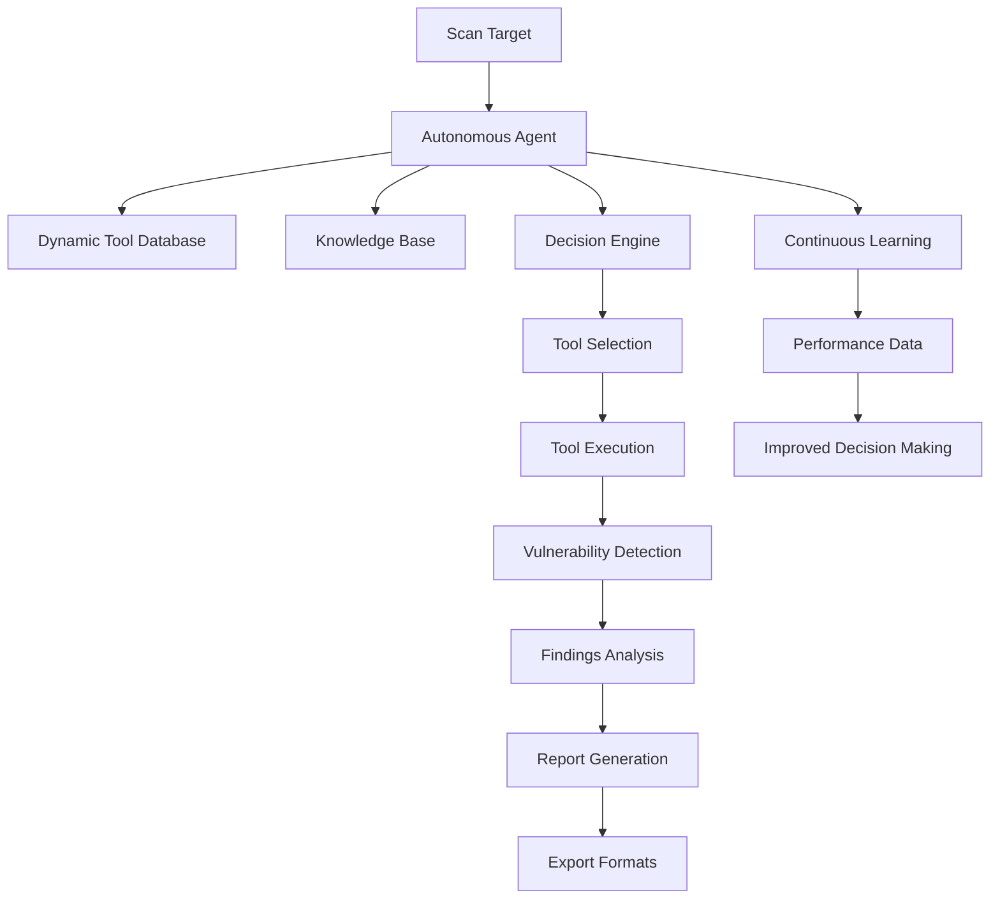

# Optimus AI Agent Architecture

## Overview

The Optimus AI Agent is an autonomous penetration testing system that intelligently selects and executes security tools based on context and learned knowledge. Unlike traditional scanners with fixed tool lists, the AI agent dynamically adapts its approach based on findings and environmental factors.

## Core Components

### 1. Autonomous Pentest Agent

The main orchestrator that drives the penetration testing process:

- **Decision Making**: Uses AI to determine next steps based on current scan state
- **Tool Selection**: Dynamically chooses appropriate tools for each situation
- **Learning**: Records execution results to improve future decisions
- **Adaptation**: Adjusts approach based on findings and environmental feedback

### 2. Dynamic Tool Database

Central repository of all penetration testing tools with metadata:

- **Tool Metadata**: Category, capabilities, platform compatibility, prerequisites
- **Detection Signatures**: What vulnerabilities each tool can identify
- **Execution Requirements**: Environmental and dependency requirements
- **Success Tracking**: Historical performance data for learning

### 3. Knowledge Base

Persistent storage of security knowledge:

- **Vulnerability Patterns**: Known attack vectors and exploitation techniques
- **Reproduction Templates**: Step-by-step guides for each vulnerability type
- **Remediation Knowledge**: Fix recommendations and secure coding practices
- **CVE/CWE Mapping**: Links to standardized vulnerability databases

### 4. Decision Engine

AI-powered component that makes strategic choices:

- **Situation Analysis**: Evaluates current scan state and findings
- **Action Selection**: Chooses next tool, parameter, or target
- **Phase Transitions**: Determines when to move between reconnaissance, scanning, and exploitation
- **Risk Assessment**: Evaluates potential impact of different approaches

### 5. Continuous Learning Module

Records and analyzes execution results:

- **Execution History**: Tracks tool performance and outcomes
- **Effectiveness Metrics**: Measures success rates and efficiency
- **Pattern Recognition**: Identifies trends in successful approaches
- **Knowledge Updates**: Refines tool selection algorithms

## Data Flow



## Tool Database Structure

The tool database contains comprehensive metadata for each security tool:

### Metadata Fields

- **Category**: web_scanner, sql_exploitation, xss_scanner, etc.
- **Capabilities**: web_vuln_detection, database_extraction, etc.
- **Detects**: xss, sql_injection, path_traversal, etc.
- **Platform**: any, linux, windows, etc.
- **Speed**: fast, medium, slow, very_fast
- **Stealth**: high, medium, low
- **Prerequisites**: http_service, database_backend, etc.
- **Output Parser**: Associated parser for tool output

### Example Entry

```json
{
  "sqlmap": {
    "category": "sql_exploitation",
    "capabilities": ["sql_injection_detection", "database_extraction", "os_command_execution"],
    "detects": ["sql_injection", "database_errors"],
    "platform": "any",
    "speed": "slow",
    "stealth": "low",
    "prerequisites": ["http_service", "database_backend"],
    "output_parser": "sqlmap"
  }
}
```

## Report Generation Pipeline

The reporting system transforms raw scan data into actionable security reports:

### Data Flow

1. **Raw Findings**: Direct output from security tools
2. **Analysis**: Contextual interpretation and severity assessment
3. **Enrichment**: Addition of reproduction steps and remediation guidance
4. **Formatting**: Conversion to various output formats
5. **Export**: Delivery in PDF, HTML, JSON, or other formats

### Template System

Reports are generated using templates that ensure consistent presentation:

- **Executive Summary**: High-level overview for management
- **Technical Details**: In-depth analysis for security teams
- **Reproduction Steps**: Detailed instructions for verification
- **Remediation Guidance**: Specific fixes and best practices

## Knowledge Base Integration

The knowledge base enhances report quality and accuracy:

### Vulnerability Knowledge

- **Attack Patterns**: Detailed exploitation techniques
- **Variants**: Different forms of the same vulnerability
- **Detection Methods**: How to identify each vulnerability type
- **False Positives**: Common misidentifications to avoid

### Reproduction Templates

- **Generic Guides**: Standard steps for each vulnerability class
- **Tool-Specific Instructions**: Commands for popular security tools
- **Language Variants**: Approach differences for various technologies
- **Framework Awareness**: Context-specific exploitation methods

## Adding New Tools

To extend the agent's capabilities with new tools:

1. **Add Tool Entry**: Create metadata entry in DynamicToolDatabase
2. **Define Capabilities**: Specify what the tool can detect
3. **Set Prerequisites**: Define when the tool should be used
4. **Create Parser**: Develop output parser for the tool
5. **Test Integration**: Verify the tool works with the agent

## Future Enhancements

### Machine Learning Integration

- **Natural Language Processing**: Better understanding of tool output
- **Pattern Recognition**: Identification of novel vulnerability patterns
- **Predictive Analysis**: Anticipation of likely vulnerabilities
- **Automated Research**: Investigation of unknown security issues

### Advanced Decision Making

- **Multi-Armed Bandit Algorithms**: Optimal tool selection strategies
- **Reinforcement Learning**: Adaptive approach refinement
- **Game Theory**: Strategic interaction with defensive systems
- **Risk Modeling**: Quantitative assessment of attack paths

## Conclusion

The Optimus AI Agent represents a significant advancement in automated penetration testing. By combining dynamic tool selection with intelligent decision making and comprehensive reporting, it provides a more effective and adaptive approach to security testing than traditional scanners.